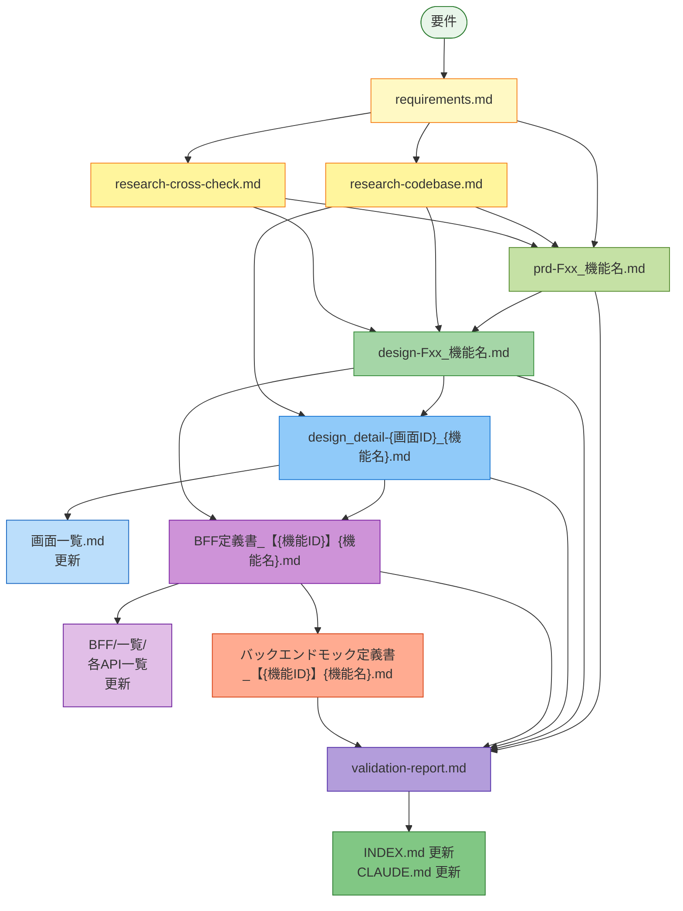

# /design コマンドフロー図（入出力付き）

## 全体フロー（色付き・入出力明示版）

```mermaid
flowchart TD
    Start(["/design {domain}/Fxx_機能名"]) --> Step1

    %% ステップ1: 要件ヒアリング
    Step1["<b>ステップ1: 要件ヒアリング</b><br/>[メインエージェント: 判断]<br/><br/>📥 入力:<br/>• ユーザーからの要件<br/><br/>📤 出力:<br/>• requirements.md（.steering内）"]
    Step1 --> GateScope{"[Gate: SCOPE]<br/>スコープ確認"}
    GateScope -->|承認| Step2
    GateScope -->|修正| Step1

    %% ステップ2: 調査（並列）
    Step2["<b>ステップ2: 調査（並列）</b><br/>[サブエージェント: 調査]"]
    Step2 --> Agent2A["<b>codebase-researcher</b><br/><br/>📥 入力:<br/>• requirements.md<br/>• src/ (既存コード)<br/><br/>📤 出力:<br/>• research-codebase.md"]
    Step2 --> Agent2B["<b>spec-cross-checker</b><br/><br/>📥 入力:<br/>• requirements.md<br/>• docs/01_アプリ/ (既存仕様)<br/>• docs/01_アプリ/INDEX.md<br/><br/>📤 出力:<br/>• research-cross-check.md"]
    Agent2A --> Step3
    Agent2B --> Step3

    %% ステップ3: 方針決定
    Step3["<b>ステップ3: 方針決定</b><br/>[メインエージェント: 判断]<br/><br/>📥 入力:<br/>• research-codebase.md<br/>• research-cross-check.md<br/>• requirements.md<br/><br/>📤 出力:<br/>• INDEX.md に行追加<br/>• CLAUDE.md 更新<br/>• 設計考慮メモ"]
    Step3 --> GateApproach{"[Gate: APPROACH]<br/>方針選択"}
    GateApproach -->|承認| GateConfirm1{"[Gate: CONFIRM]<br/>設計考慮の確認"}
    GateApproach -->|再検討| Step3
    GateConfirm1 -->|承認| Step4
    GateConfirm1 -->|修正| Step3

    %% ステップ4: PRD作成
    Step4["<b>ステップ4: PRD作成</b><br/>[サブエージェント: 作成]"]
    Step4 --> Agent4["<b>prd-drafter</b><br/><br/>📥 入力:<br/>• requirements.md<br/>• research-codebase.md<br/>• research-cross-check.md<br/>• 設計考慮メモ<br/>• docs/templates/prd.md<br/><br/>📤 出力:<br/>• prd-Fxx_機能名.md"]
    Agent4 --> Step5

    %% ステップ5: PRDレビュー
    Step5["<b>ステップ5: PRDレビュー</b><br/>[メインエージェント: 判断]<br/><br/>📥 入力:<br/>• prd-Fxx_機能名.md<br/><br/>📤 出力:<br/>• レビューコメント"]
    Step5 --> GateResolve1{"[Gate: RESOLVE]<br/>[要確認]解決"}
    GateResolve1 -->|解決| GateConfirm2{"[Gate: CONFIRM]<br/>PRD承認"}
    GateResolve1 -->|未解決| Step5
    GateConfirm2 -->|承認| Step6
    GateConfirm2 -->|修正| Step4
    GateConfirm2 -->|やり直し| Step1

    %% ステップ6: 設計書作成
    Step6["<b>ステップ6: 設計書作成</b><br/>[サブエージェント: 作成]"]
    Step6 --> Agent6["<b>design-drafter</b><br/><br/>📥 入力:<br/>• prd-Fxx_機能名.md<br/>• research-codebase.md<br/>• research-cross-check.md<br/>• 設計考慮メモ<br/>• docs/02_アプリ基盤/ (全体設計)<br/>• docs/templates/design.md<br/><br/>📤 出力:<br/>• design-Fxx_機能名.md"]
    Agent6 --> GateConfirm3{"[Gate: CONFIRM]<br/>機能設計書承認"}
    GateConfirm3 -->|承認| Branch{"詳細設計書<br/>作成必要？"}
    GateConfirm3 -->|修正| Step6
    GateConfirm3 -->|PRD見直し| Step5

    Branch -->|FE必要| Step6FE
    Branch -->|BFF必要| Step6BFF
    Branch -->|不要| Step7

    %% ステップ6-FE
    Step6FE["<b>ステップ6-FE</b><br/>FE詳細設計書作成"]
    Step6FE --> Agent6FE["<b>detail-design-drafter(FE)</b><br/><br/>📥 入力:<br/>• design-Fxx_機能名.md<br/>• research-codebase.md<br/>• Figma Make（任意）<br/>• 補足指示<br/>• docs/02_アプリ基盤/01_フロントエンド・BFF/<br/>• docs/templates/design-detail-frontend.md<br/><br/>📤 出力:<br/>• design_detail-{画面ID}_{機能名}.md"]
    Agent6FE --> GateConfirm4{"[Gate: CONFIRM]<br/>FE詳細設計書承認"}
    GateConfirm4 -->|承認| Agent6FEPost["<b>spec-registry-updater</b><br/><br/>📥 入力:<br/>• design_detail-{画面ID}_{機能名}.md<br/>• docs/01_アプリ/フロントエンド/一覧/画面一覧.md<br/><br/>📤 出力:<br/>• 画面一覧.md（更新）"]
    GateConfirm4 -->|修正| Step6FE
    Agent6FEPost --> BranchBFF{"BFF設計書<br/>必要？"}
    BranchBFF -->|必要| Step6BFF
    BranchBFF -->|不要| Step7

    %% ステップ6-BFF
    Step6BFF["<b>ステップ6-BFF</b><br/>BFF設計書作成"]
    Step6BFF --> Agent6BFF1["<b>6-BFF-1: spec-registry-checker</b><br/><br/>📥 入力:<br/>• design_detail-{画面ID}_{機能名}.md<br/>• docs/01_アプリ/BFF/一覧/ (全API一覧)<br/><br/>📤 出力:<br/>• 未登録API確認結果"]
    Agent6BFF1 --> GateConfirm5{"[Gate: CONFIRM]<br/>未登録API確認"}
    GateConfirm5 -->|進む| Agent6BFF2["<b>6-BFF-2: detail-design-drafter(BFF)</b><br/><br/>📥 入力:<br/>• design_detail-{画面ID}_{機能名}.md（必須）<br/>• design-Fxx_機能名.md<br/>• 補足指示<br/>• docs/02_アプリ基盤/01_フロントエンド・BFF/<br/>• docs/templates/design-detail-bff.md<br/><br/>📤 出力:<br/>• BFF定義書_【{機能ID}】{機能名}.md"]
    GateConfirm5 -->|整合性確認| Agent6BFF1
    Agent6BFF2 --> GateConfirm6{"[Gate: CONFIRM]<br/>BFF設計書承認"}
    GateConfirm6 -->|承認| Agent6BFF3["<b>6-BFF-3: spec-registry-updater</b><br/><br/>📥 入力:<br/>• BFF定義書_【{機能ID}】{機能名}.md<br/>• docs/01_アプリ/BFF/一覧/ (各一覧ファイル)<br/><br/>📤 出力:<br/>• BFF/一覧/ 各ファイル更新"]
    GateConfirm6 -->|修正| Step6BFF
    Agent6BFF3 --> CheckBE{"BEモック定義書<br/>必要？"}
    CheckBE -->|必要| Agent6BFF4["<b>6-BFF-4: detail-design-drafter(BEモック)</b><br/><br/>📥 入力:<br/>• BFF定義書_【{機能ID}】{機能名}.md（必須）<br/>• docs/templates/design-detail-backend-mock.md<br/><br/>📤 出力:<br/>• バックエンドモック定義書_【{機能ID}】{機能名}.md"]
    CheckBE -->|不要| Step7
    Agent6BFF4 --> GateConfirm7{"[Gate: CONFIRM]<br/>BEモック定義書承認"}
    GateConfirm7 -->|承認| Step7
    GateConfirm7 -->|修正| Agent6BFF4

    %% ステップ7: 設計書レビュー
    Step7["<b>ステップ7: 設計書レビュー</b><br/>[メインエージェント: 判断]<br/><br/>📥 入力:<br/>• design-Fxx_機能名.md<br/>• design_detail-*.md（全て）<br/>• BFF定義書（あれば）<br/>• BEモック定義書（あれば）<br/><br/>📤 出力:<br/>• レビューコメント<br/>• 技術選択メモ"]
    Step7 --> GateResolve2{"[Gate: RESOLVE]<br/>[要確認]解決"}
    GateResolve2 -->|解決| GateApproach2{"[Gate: APPROACH]<br/>技術選択"}
    GateResolve2 -->|未解決| Step7
    GateApproach2 -->|選択| GateConfirm8{"[Gate: CONFIRM]<br/>設計承認"}
    GateApproach2 -->|再検討| Step7
    GateConfirm8 -->|承認| Step8
    GateConfirm8 -->|修正（FE/BFF/BE）| Branch
    GateConfirm8 -->|PRD見直し| Step5

    %% ステップ8: 設計検証
    Step8["<b>ステップ8: 設計検証</b><br/>[サブエージェント: 検証]"]
    Step8 --> Agent8["<b>design-validator</b><br/><br/>📥 入力:<br/>• prd-Fxx_機能名.md<br/>• design-Fxx_機能名.md<br/>• design_detail-*.md（全て）<br/>• docs/02_アプリ基盤/ (全体設計)<br/><br/>📤 出力:<br/>• validation-report.md"]
    Agent8 --> Step9

    %% ステップ9: 最終判断
    Step9["<b>ステップ9: 最終判断</b><br/>[メインエージェント: 判断]<br/><br/>📥 入力:<br/>• validation-report.md<br/>• 全設計書<br/><br/>📤 出力:<br/>• 最終判断メモ<br/>• INDEX.md 更新（design完了）"]
    Step9 --> GatePhase{"[Gate: PHASE]<br/>次のステップ"}
    GatePhase -->|/review に進む| Review(["/review"])
    GatePhase -->|修正| Step7
    GatePhase -->|保留| End([保留])

    %% スタイル定義（色付き）
    classDef mainAgent fill:#4fc3f7,stroke:#0277bd,stroke-width:3px,color:#000
    classDef subAgentRead fill:#fff59d,stroke:#f57f17,stroke-width:2px,color:#000
    classDef subAgentWrite fill:#ffcc80,stroke:#e65100,stroke-width:2px,color:#000
    classDef subAgentValidate fill:#ce93d8,stroke:#6a1b9a,stroke-width:2px,color:#000
    classDef gate fill:#f48fb1,stroke:#c2185b,stroke-width:2px,color:#000
    classDef endpoint fill:#81c784,stroke:#2e7d32,stroke-width:4px,color:#000

    class Step1,Step3,Step5,Step7,Step9 mainAgent
    class Agent2A,Agent2B,Agent6BFF1 subAgentRead
    class Agent4,Agent6,Agent6FE,Agent6FEPost,Agent6BFF2,Agent6BFF3,Agent6BFF4 subAgentWrite
    class Agent8 subAgentValidate
    class GateScope,GateApproach,GateConfirm1,GateResolve1,GateConfirm2,GateConfirm3,GateConfirm4,GateConfirm5,GateConfirm6,GateConfirm7,GateResolve2,GateApproach2,GateConfirm8,GatePhase,Branch,BranchBFF,CheckBE gate
    class Start,Review,End endpoint
```



## 凡例

| 色 | 役割 |
|---|---|
| 🔵 **青** | メインエージェント（判断のみ） |
| 🟡 **黄** | サブエージェント（調査・読み取り専用） |
| 🟠 **橙** | サブエージェント（作成・ファイル書き出し） |
| 🟣 **紫** | サブエージェント（検証・読み取り専用） |
| 🔴 **ピンク** | Gate（ユーザー判断委譲） |
| 🟢 **緑** | エンドポイント（開始・終了） |

## 入出力ファイル一覧表

### 調査フェーズ（ステップ2）

| エージェント | 入力ファイル | 出力ファイル |
|---|---|---|
| **codebase-researcher** | • requirements.md<br/>• src/ (既存コード全体) | • `.steering/YYYYMMDD-機能名/research-codebase.md` |
| **spec-cross-checker** | • requirements.md<br/>• docs/01_アプリ/ (既存仕様)<br/>• docs/01_アプリ/INDEX.md | • `.steering/YYYYMMDD-機能名/research-cross-check.md` |

### PRD作成フェーズ（ステップ4）

| エージェント | 入力ファイル | 出力ファイル |
|---|---|---|
| **prd-drafter** | • requirements.md<br/>• research-codebase.md<br/>• research-cross-check.md<br/>• 設計考慮メモ<br/>• docs/templates/prd.md | • `docs/01_アプリ/{domain}/{機能グループ}/prd-Fxx_機能名.md` |

### 機能設計書作成フェーズ（ステップ6）

| エージェント | 入力ファイル | 出力ファイル |
|---|---|---|
| **design-drafter** | • prd-Fxx_機能名.md<br/>• research-codebase.md<br/>• research-cross-check.md<br/>• 設計考慮メモ<br/>• docs/02_アプリ基盤/ (全体設計)<br/>• docs/templates/design.md | • `docs/01_アプリ/{domain}/{機能グループ}/design-Fxx_機能名.md` |

### FE詳細設計書作成フェーズ（ステップ6-FE）

| エージェント | 入力ファイル | 出力ファイル |
|---|---|---|
| **detail-design-drafter(FE)** | • design-Fxx_機能名.md<br/>• research-codebase.md<br/>• Figma Make（任意）<br/>• 補足指示<br/>• docs/02_アプリ基盤/01_フロントエンド・BFF/<br/>• docs/templates/design-detail-frontend.md | • `docs/01_アプリ/{domain}/{機能グループ}/design_detail-{画面ID}_{機能名}.md` |
| **spec-registry-updater** | • design_detail-{画面ID}_{機能名}.md<br/>• docs/01_アプリ/フロントエンド/一覧/画面一覧.md | • `docs/01_アプリ/フロントエンド/一覧/画面一覧.md`（更新） |

### BFF設計書作成フェーズ（ステップ6-BFF）

| エージェント | 入力ファイル | 出力ファイル |
|---|---|---|
| **spec-registry-checker** | • design_detail-{画面ID}_{機能名}.md<br/>• docs/01_アプリ/BFF/一覧/ (全API一覧) | • 未登録API確認結果（レポート） |
| **detail-design-drafter(BFF)** | • design_detail-{画面ID}_{機能名}.md（必須）<br/>• design-Fxx_機能名.md<br/>• 補足指示<br/>• docs/02_アプリ基盤/01_フロントエンド・BFF/<br/>• docs/templates/design-detail-bff.md | • `docs/01_アプリ/BFF/{bff-service-name}/{機能グループ}/BFF定義書_【{機能ID}】{機能名}.md` |
| **spec-registry-updater** | • BFF定義書_【{機能ID}】{機能名}.md<br/>• docs/01_アプリ/BFF/一覧/ (各一覧ファイル) | • `docs/01_アプリ/BFF/一覧/`配下の各ファイル（更新） |

### BEモック定義書作成フェーズ（ステップ6-BFF-4）

| エージェント | 入力ファイル | 出力ファイル |
|---|---|---|
| **detail-design-drafter(BEモック)** | • BFF定義書_【{機能ID}】{機能名}.md（必須）<br/>• docs/templates/design-detail-backend-mock.md | • `docs/01_アプリ/バックエンド/{backend-domain}/{機能グループ}/バックエンドモック定義書_【{機能ID}】{機能名}.md` |

### 検証フェーズ（ステップ8）

| エージェント | 入力ファイル | 出力ファイル |
|---|---|---|
| **design-validator** | • prd-Fxx_機能名.md<br/>• design-Fxx_機能名.md<br/>• design_detail-*.md（全て）<br/>• docs/02_アプリ基盤/ (全体設計) | • `.steering/YYYYMMDD-機能名/validation-report.md` |

## ファイル依存関係図



## ディレクトリ構造（出力先）

```
.steering/
  └── YYYYMMDD-機能名/
      ├── requirements.md                      # ステップ1
      ├── research-codebase.md                # ステップ2
      ├── research-cross-check.md             # ステップ2
      └── validation-report.md                # ステップ8

docs/
  ├── 01_アプリ/
  │   ├── INDEX.md                            # ステップ3, ステップ9更新
  │   ├── {domain}/
  │   │   └── {機能グループ}/
  │   │       ├── prd-Fxx_機能名.md           # ステップ4
  │   │       ├── design-Fxx_機能名.md        # ステップ6
  │   │       └── design_detail-{画面ID}_{機能名}.md  # ステップ6-FE
  │   ├── フロントエンド/
  │   │   └── 一覧/
  │   │       └── 画面一覧.md                 # ステップ6-FE更新
  │   ├── BFF/
  │   │   ├── {bff-service-name}/
  │   │   │   └── {機能グループ}/
  │   │   │       └── BFF定義書_【{機能ID}】{機能名}.md  # ステップ6-BFF
  │   │   └── 一覧/                           # ステップ6-BFF更新
  │   │       ├── BFF-API一覧.md
  │   │       ├── エラーコード一覧.md
  │   │       └── ...
  │   └── バックエンド/
  │       └── {backend-domain}/
  │           └── {機能グループ}/
  │               └── バックエンドモック定義書_【{機能ID}】{機能名}.md  # ステップ6-BFF-4
  └── 02_アプリ基盤/                          # 入力として参照される

CLAUDE.md                                      # ステップ3, ステップ9更新
```

## レンダリング方法

### オンライン
- [Mermaid Live Editor](https://mermaid.live) にコピペ → PNG/SVG でエクスポート

### VS Code
- Mermaid Preview 拡張機能を使用

### CLI（高解像度）
```bash
npm install -g @mermaid-js/mermaid-cli
mmdc -i design-command-flow-with-io.md -o design-command-flow-with-io.png -w 5120 -H 4096 -b transparent --scale 2
```

### 2つ目の図（依存関係図）のみレンダリング
```bash
# design-command-flow-with-io.md の2つ目のmermaidブロックを抽出して別ファイルに
# その後、個別にレンダリング
```
