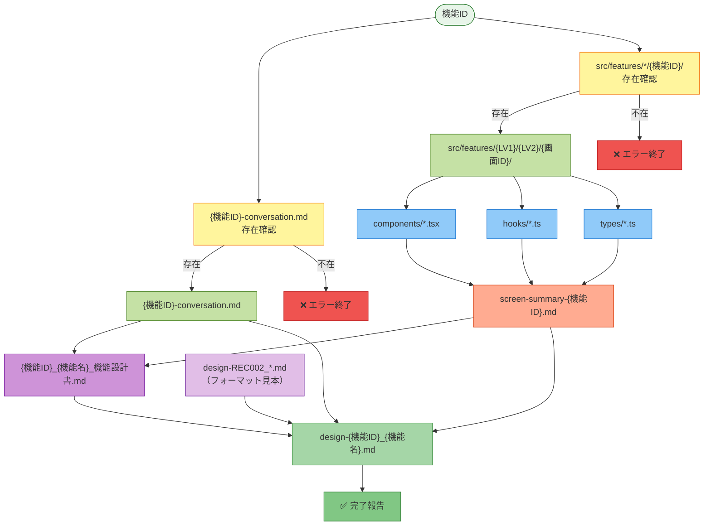

# /figmamake コマンドフロー図（入出力付き）

## 全体フロー（色付き・入出力明示版）

```mermaid
flowchart TD
    Start(["/figmamake {機能ID}"]) --> Step0

    %% ステップ0: 応答ログファイル存在確認
    Step0["<b>ステップ0: 応答ログファイル存在確認</b><br/>[メインエージェント: 確認]<br/><br/>📥 入力:<br/>• {機能ID}<br/><br/>📤 出力:<br/>• エラーメッセージ or パス記録"]
    Step0 --> CheckLog{"応答ログファイル<br/>存在？"}
    CheckLog -->|なし| ErrorLog["❌ エラー終了<br/><br/>メッセージ:<br/>• 応答ログファイルが見つかりません<br/>• 配置パス例を表示<br/>• 対処方法を表示"]
    CheckLog -->|あり| Step1

    %% ステップ1: パス解決
    Step1["<b>ステップ1: パス解決</b><br/>[メインエージェント: 確認]<br/><br/>📥 入力:<br/>• {機能ID}<br/><br/>📤 出力:<br/>• ソースコードパス<br/>• 出力先パス"]
    Step1 --> CheckSrc{"ソースコード<br/>ディレクトリ存在？"}
    CheckSrc -->|なし| ErrorSrc["❌ エラー終了<br/><br/>メッセージ:<br/>• ソースコードが見つかりません<br/>• 対処方法を表示"]
    CheckSrc -->|あり| Step2

    %% ステップ2: スキル起動
    Step2["<b>ステップ2: スキル起動</b><br/>[メインエージェント: 制御]<br/><br/>📥 入力:<br/>• {機能ID}<br/>• ソースコードパス<br/>• 出力先パス<br/><br/>📤 出力:<br/>• ワークフロー指示"]
    Step2 --> Skill["<b>app-figma-design-workflow</b><br/><br/>Skill('app-figma-design-workflow', args: '{機能ID}')"]
    Skill --> Step3

    %% ステップ3: 画面構造サマリー生成
    Step3["<b>ステップ3: 画面構造サマリー生成</b><br/>[サブエージェント: 作成]"]
    Step3 --> Agent3["<b>app-figma-screen-extractor</b><br/><br/>📥 入力:<br/>• ソースフォルダ（TSXファイル群）<br/>• {src_path}/components/<br/>• {src_path}/hooks/<br/>• {src_path}/types/<br/><br/>📤 出力:<br/>• {docs_path}/screen-summary-{機能ID}.md"]
    Agent3 --> Step4

    %% ステップ4: 機能設計書生成
    Step4["<b>ステップ4: 機能設計書生成</b><br/>[サブエージェント: 作成]"]
    Step4 --> Agent4["<b>app-design-from-figma-drafter</b><br/><br/>📥 入力:<br/>• {docs_path}/{機能ID}-conversation.md<br/>• {docs_path}/screen-summary-{機能ID}.md<br/><br/>📤 出力:<br/>• {docs_path}/{機能ID}_{機能名}_機能設計書.md"]
    Agent4 --> Step5

    %% ステップ5: 正式設計書生成
    Step5["<b>ステップ5: 正式設計書生成</b><br/>[サブエージェント: 作成]"]
    Step5 --> Agent5["<b>設計書統合エージェント</b><br/><br/>📥 入力:<br/>• design-REC002_*.md（フォーマット見本）<br/>• {機能ID}_{機能名}_機能設計書.md<br/>• screen-summary-{機能ID}.md<br/>• {機能ID}-conversation.md<br/><br/>📤 出力:<br/>• design-{機能ID}_{機能名}.md"]
    Agent5 --> Complete

    %% 完了報告
    Complete["<b>完了報告</b><br/>[メインエージェント: 報告]<br/><br/>📤 出力:<br/>• 生成ファイル一覧<br/>• 次のステップ案内"]
    Complete --> End([完了])

    %% エラー終了
    ErrorLog --> EndError([エラー終了])
    ErrorSrc --> EndError

    %% スタイル定義（色付き）
    classDef mainAgent fill:#4fc3f7,stroke:#0277bd,stroke-width:3px,color:#000
    classDef skill fill:#fff59d,stroke:#f57f17,stroke-width:2px,color:#000
    classDef subAgentWrite fill:#ffcc80,stroke:#e65100,stroke-width:2px,color:#000
    classDef check fill:#f48fb1,stroke:#c2185b,stroke-width:2px,color:#000
    classDef error fill:#ef5350,stroke:#c62828,stroke-width:3px,color:#fff
    classDef endpoint fill:#81c784,stroke:#2e7d32,stroke-width:4px,color:#000

    class Step0,Step1,Step2,Complete mainAgent
    class Skill skill
    class Agent3,Agent4,Agent5 subAgentWrite
    class CheckLog,CheckSrc check
    class ErrorLog,ErrorSrc error
    class Start,End,EndError endpoint
```



## 凡例

| 色 | 役割 |
|---|---|
| 🔵 **青** | メインエージェント（確認・制御・報告） |
| 🟡 **黄** | スキル（ワークフロー定義） |
| 🟠 **橙** | サブエージェント（作成・ファイル書き出し） |
| 🔴 **ピンク** | 条件分岐（存在確認） |
| 🔴 **赤** | エラー処理（終了） |
| 🟢 **緑** | エンドポイント（開始・終了） |

## 入出力ファイル一覧表

### ステップ0: 応答ログファイル存在確認

| 処理 | 入力ファイル | 出力ファイル |
|---|---|---|
| **応答ログ検索** | • {機能ID} | • エラーメッセージ or パス記録 |
| **必須ファイル** | • `docs/01_アプリ/フロントエンド/{LV1}/{LV2}/{機能ID}-conversation.md` | — |

### ステップ1: パス解決

| 処理 | 入力ファイル | 出力ファイル |
|---|---|---|
| **ソースコード検索** | • {機能ID} | • ソースコードパス<br/>• 出力先パス |
| **必須ディレクトリ** | • `product/frontend/src/features/{LV1}/{LV2}/{画面ID}/` | — |

### ステップ2: スキル起動

| スキル | 入力ファイル | 出力ファイル |
|---|---|---|
| **app-figma-design-workflow** | • {機能ID}<br/>• ソースコードパス<br/>• 出力先パス | • ワークフロー指示 |

### ステップ3: 画面構造サマリー生成

| エージェント | 入力ファイル | 出力ファイル |
|---|---|---|
| **app-figma-screen-extractor** | • `{src_path}/components/` (TSXファイル群)<br/>• `{src_path}/hooks/` (状態管理フック)<br/>• `{src_path}/types/` (型定義) | • `{docs_path}/screen-summary-{機能ID}.md` |

**除外されるコンポーネント:**
- LeftPanel / CenterPanel / RightPanel（汎用オーダー入力UI）
- PatientInfoPanel（患者情報サイドバー）
- ChartLeftPanel / ChartPanel（カルテ記録入力）
- GlobalMenu / LeftMenu（ナビゲーション）

**読むべきコンポーネント:**
- 対象機能のメインパネル・ダイアログ
- 対象機能が呼び出す子コンポーネント
- 対象機能の起動トリガーを含む親コンポーネント

### ステップ4: 機能設計書生成

| エージェント | 入力ファイル | 出力ファイル |
|---|---|---|
| **app-design-from-figma-drafter** | • `{docs_path}/{機能ID}-conversation.md`<br/>• `{docs_path}/screen-summary-{機能ID}.md` | • `{docs_path}/{機能ID}_{機能名}_機能設計書.md` |

### ステップ5: 正式設計書生成（REC002フォーマット準拠）

| エージェント | 入力ファイル | 出力ファイル |
|---|---|---|
| **設計書統合エージェント** | • `docs/01_アプリ/フロントエンド/01_diagnosis/01_record-creation/design-REC002_シェーマ作成.md`（フォーマット見本）<br/>• `{機能ID}_{機能名}_機能設計書.md`<br/>• `screen-summary-{機能ID}.md`<br/>• `{機能ID}-conversation.md` | • `{docs_path}/design-{機能ID}_{機能名}.md` |

## ファイル依存関係図



## ディレクトリ構造（入出力）

```
【入力】
docs/
  └── 01_アプリ/
      └── フロントエンド/
          ├── 01_diagnosis/
          │   └── 01_record-creation/
          │       └── design-REC002_シェーマ作成.md   # フォーマット見本
          └── {LV1}/
              └── {LV2}/
                  └── {機能ID}-conversation.md         # 必須（Figma Make応答ログ）

product/
  └── frontend/
      └── src/
          └── features/
              └── {LV1}/
                  └── {LV2}/
                      └── {画面ID}/                    # 必須（Figma Make生成コード）
                          ├── components/*.tsx
                          ├── hooks/*.ts
                          └── types/*.ts

【出力】
docs/
  └── 01_アプリ/
      └── フロントエンド/
          └── {LV1}/
              └── {LV2}/
                  ├── screen-summary-{機能ID}.md                      # ステップ3
                  ├── {機能ID}_{機能名}_機能設計書.md                 # ステップ4
                  └── design-{機能ID}_{機能名}.md                     # ステップ5
```

## エラーハンドリング

### 1. 応答ログファイル不足（ステップ0で終了）

```
❌ エラー: 応答ログファイルが見つかりません

必要なファイル: {機能ID}-conversation.md
検索パス: docs/01_アプリ/フロントエンド/

対処方法:
1. Figma Make の画面で会話履歴をコピー
2. 以下のパスに保存:
   docs/01_アプリ/フロントエンド/{LV1}/{LV2}/{機能ID}-conversation.md

例: REC005 の場合
   docs/01_アプリ/フロントエンド/01_diagnosis/02_medical-info-reference/REC005-conversation.md

ファイル保存後、再度 /figmamake {機能ID} を実行してください。
```

### 2. ソースコードディレクトリ不足（ステップ1で終了）

```
❌ エラー: ソースコードディレクトリが見つかりません

必要なディレクトリ: product/frontend/src/features/*/{機能ID}/

対処方法:
1. Figma Make で生成したコードを配置
2. ディレクトリ構造を確認

準備完了後、再度 /figmamake {機能ID} を実行してください。
```

## 関連スキル・エージェント

| スキル/エージェント | 定義ファイル | 役割 |
|---|---|---|
| **app-figma-design-workflow** | `.claude/skills/app-figma-design-workflow/SKILL.md` | ワークフロー定義（エージェント起動順序・完了条件） |
| **app-figma-screen-extractor** | `.claude/agents/app-figma-screen-extractor.md` | TSXコード → 画面構造サマリー生成 |
| **app-design-from-figma-drafter** | `.claude/agents/app-design-from-figma-drafter.md` | 応答ログ + サマリー → 機能設計書生成 |
| **設計書統合エージェント** | プロンプトで代用（`.claude/commands/figmamake.md` 内） | 機能設計書 + REC002フォーマット → 正式設計書生成 |

## 実行例

```bash
# 前提: 以下が準備済み
# 1. docs/01_アプリ/フロントエンド/01_diagnosis/02_medical-info-reference/REC005-conversation.md
# 2. product/frontend/src/features/01_diagnosis/02_medical-info-reference/01_medical-info-view/

/figmamake REC005
```

**出力結果:**

```
✅ 完了: /figmamake REC005

以下のファイルを生成しました:

1. 画面構造サマリー:
   docs/01_アプリ/フロントエンド/01_diagnosis/02_medical-info-reference/screen-summary-REC005.md

2. 機能設計書:
   docs/01_アプリ/フロントエンド/01_diagnosis/02_medical-info-reference/REC005_診療記録情報参照_機能設計書.md

3. 正式設計書（REC002フォーマット準拠）:
   docs/01_アプリ/フロントエンド/01_diagnosis/02_medical-info-reference/design-REC005_診療記録情報参照.md

次のステップ:
- 設計書をレビューする: /review docs/01_アプリ/フロントエンド/01_diagnosis/02_medical-info-reference/design-REC005_診療記録情報参照.md
```

## 注意事項

1. **応答ログファイルの命名規則**: `{機能ID}-conversation.md` で統一すること
2. **ソースコードの配置**: Figma Make 生成コードは `product/frontend/src/features/{LV1}/{LV2}/{画面ID}/` 配下に配置
3. **300行制限**: 生成される設計書が300行を超える場合があるが、REC002準拠のため許容される
4. **手動調整が必要な場合**: 生成後に `/review` で品質を確認し、必要に応じて手動調整する
5. **スキル未実装の場合**: `app-figma-design-workflow` スキルが未実装の場合、メインエージェントが直接ステップ3〜5を制御する

## レンダリング方法

### オンライン
- [Mermaid Live Editor](https://mermaid.live) にコピペ → PNG/SVG でエクスポート

### VS Code
- Mermaid Preview 拡張機能を使用

### CLI（高解像度）
```bash
npm install -g @mermaid-js/mermaid-cli
mmdc -i figmamake-command-flow.md -o figmamake-command-flow.png -w 5120 -H 4096 -b transparent --scale 2
```
