# /implement コマンド実行フロー

## Phase 0 〜 Phase 10 の全体フロー

```mermaid
flowchart TD
    Start([/implement 開始]) --> Step1[ステップ1: テスト計画<br/>test-planner]
    Step1 --> Step2[ステップ2: タスク分解<br/>メイン判断]
    
    Step2 --> Phase0[Phase 0: スコープ確定<br/>T0-1〜T0-6<br/>shared振り分け洗い出し]
    Phase0 --> Test0{Phase 0<br/>完了確認}
    Test0 -->|NG| Phase0
    Test0 -->|OK| Phase1
    
    Phase1[Phase 1: 基盤整備<br/>T1-1〜T1-3<br/>ディレクトリ・型定義] --> Test1{Phase 1<br/>ディレクトリ構造検証}
    Test1 -->|NG| Phase1
    Test1 -->|OK| Phase2
    
    Phase2[Phase 2: API・Repository層<br/>T2-1〜T2-2<br/>データ取得実装] --> Test2{Phase 2<br/>APIカバレッジ・型整合性}
    Test2 -->|NG| Phase2
    Test2 -->|OK| Phase3
    
    Phase3[Phase 3: 状態管理<br/>T3-1<br/>Zustandストア] --> Test3{Phase 3<br/>ストアカバレッジ・型整合性}
    Test3 -->|NG| Phase3
    Test3 -->|OK| Phase4
    
    Phase4[Phase 4: Hook層<br/>T4-1<br/>カスタムフック] --> Test4{Phase 4<br/>操作イベントカバレッジ}
    Test4 -->|NG| Phase4
    Test4 -->|OK| Phase5
    
    Phase5[Phase 5: コンポーネント層<br/>T5-1〜T5-3<br/>UI実装] --> Test5{Phase 5<br/>RSC/RCC境界・Props検証}
    Test5 -->|NG| Phase5
    Test5 -->|OK| Phase6
    
    Phase6[Phase 6: 機能実装<br/>T6-1〜T6-3<br/>楽観的更新・確定キャンセル] --> Test6{Phase 6<br/>操作フロー検証}
    Test6 -->|NG| Phase6
    Test6 -->|OK| Phase7
    
    Phase7[Phase 7: バリデーション<br/>エラーハンドリング] --> Test7{Phase 7<br/>バリデーションカバレッジ}
    Test7 -->|NG| Phase7
    Test7 -->|OK| Phase8
    
    Phase8[Phase 8: Storybook<br/>T8-1〜T8-4<br/>セットアップ・story・CI] --> Test8{Phase 8<br/>設定・story検証}
    Test8 -->|NG| Phase8
    Test8 -->|OK| Phase9
    
    Phase9[Phase 9: Storybookテスト<br/>T9-1〜T9-4<br/>MSW・Vitest] --> Test9{Phase 9<br/>MSW・テスト検証}
    Test9 -->|NG| Phase9
    Test9 -->|OK| Phase10
    
    Phase10[Phase 10: E2E + ドキュメント<br/>T10-1〜T10-7<br/>テスト・README] --> Test10{Phase 10<br/>E2E・ドキュメント検証}
    Test10 -->|NG| Phase10
    Test10 -->|OK| Final
    
    Final[完了時: 整合性チェック<br/>consistency-checker] --> Review[review 実装レビュー]
    Review -->|PASS| Done([実装完了])
    Review -->|FAIL| Phase0

    style Start fill:#e1f5ff
    style Done fill:#d4edda
    style Test0 fill:#fff3cd
    style Test1 fill:#fff3cd
    style Test2 fill:#fff3cd
    style Test3 fill:#fff3cd
    style Test4 fill:#fff3cd
    style Test5 fill:#fff3cd
    style Test6 fill:#fff3cd
    style Test7 fill:#fff3cd
    style Test8 fill:#fff3cd
    style Test9 fill:#fff3cd
    style Test10 fill:#fff3cd
```

## 各Phase詳細

### Phase 0: スコープ確定
- **タスク**: T0-1〜T0-6
- **内容**: shared 振り分け洗い出し、タグ付与
- **検証**: タグ実在確認

### Phase 1: 基盤整備
- **タスク**: T1-1〜T1-3
- **内容**: ディレクトリ整理、BFF共有型、ViewModel型定義
- **検証**: ディレクトリ構造検証

### Phase 2: API・Repository層
- **タスク**: T2-1〜T2-2
- **内容**: API関数、Repository実装
- **検証**: APIカバレッジ、型整合性

### Phase 3: 状態管理
- **タスク**: T3-1
- **内容**: Zustandストア実装
- **検証**: ストアカバレッジ、storeRegistry、型整合性

### Phase 4: Hook層
- **タスク**: T4-1
- **内容**: カスタムフック実装
- **検証**: 操作イベントカバレッジ、'use client'、依存関係、型整合性

### Phase 5: コンポーネント層
- **タスク**: T5-1〜T5-3
- **内容**: Atom、Molecule、Organism実装
- **検証**: コンポーネントカバレッジ、RSC/RCC境界、非シリアライズProps、型整合性

### Phase 6: 機能実装
- **タスク**: T6-1〜T6-3
- **内容**: 楽観的更新、確定キャンセルフロー
- **検証**: 操作イベントカバレッジ、フロー検証、型整合性

### Phase 7: バリデーション
- **検証**: バリデーションカバレッジ、APIエラー統一性、redirect禁止パターン、型整合性

### Phase 8: Storybook
- **タスク**: T8-1〜T8-4
- **内容**: セットアップ、story作成、CI設定
- **検証**: 設定、story、CI検証

### Phase 9: Storybookテスト
- **タスク**: T9-1〜T9-4
- **内容**: MSW、Vitest統合
- **検証**: MSW設定、storyテスト、Vitest検証

### Phase 10: E2E + ドキュメント
- **タスク**: T10-1〜T10-7
- **内容**: E2Eテスト、README作成
- **検証**: ルートパス、server-test.sh、{CODE}-test.js、Vitest、E2E、Storybook、README検証
