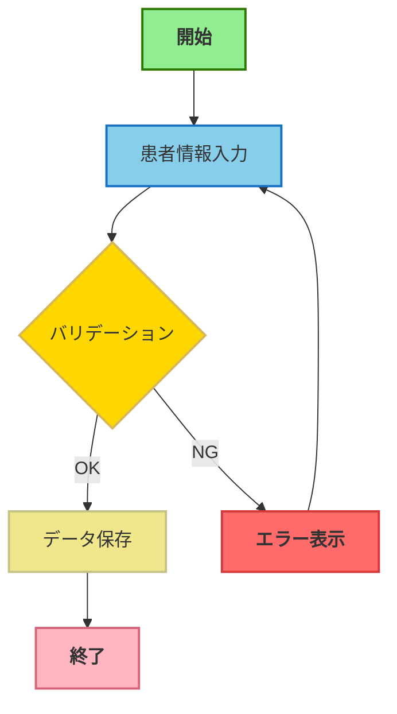

# Color Palette for Business Flow Diagrams

業務フロー図で使用するカラーパレット定義。draw.io XMLとマーメイド構文の両方に対応。

## Standard Colors

| 要素タイプ | fillColor | strokeColor | 用途 | 図形 |
|---|---|---|---|---|
| 開始 | #90EE90 | #2d7600 | フロー開始点 | 角丸四角 |
| 処理 | #87CEEB | #1971c2 | 標準処理ノード | 四角 |
| 判断 | #FFD700 | #d6b656 | 条件分岐 | ひし形 |
| 終了 | #FFB6C1 | #d6657b | フロー終了点 | 角丸四角 |
| エラー | #FF6B6B | #d63939 | 例外処理 | 四角 |
| データ | #F0E68C | #c6c189 | DB/API呼び出し | 平行四辺形 |

## Draw.io XML Style

### 開始ノード

```xml
style="rounded=1;fillColor=#90EE90;strokeColor=#2d7600;fontStyle=1;fontSize=12;html=1;"
```

### 処理ノード

```xml
style="rounded=0;fillColor=#87CEEB;strokeColor=#1971c2;fontStyle=0;fontSize=11;html=1;"
```

### 判断ノード

```xml
style="rhombus;fillColor=#FFD700;strokeColor=#d6b656;fontStyle=0;fontSize=11;html=1;"
```

### 終了ノード

```xml
style="rounded=1;fillColor=#FFB6C1;strokeColor=#d6657b;fontStyle=1;fontSize=12;html=1;"
```

### エラーノード

```xml
style="rounded=0;fillColor=#FF6B6B;strokeColor=#d63939;fontStyle=1;fontSize=11;html=1;"
```

### データノード

```xml
style="shape=parallelogram;fillColor=#F0E68C;strokeColor=#c6c189;fontStyle=0;fontSize=11;html=1;perimeter=parallelogramPerimeter;"
```

## Mermaid classDef

```mermaid
classDef startStyle fill:#90EE90,stroke:#2d7600,stroke-width:2px,font-weight:bold
classDef processStyle fill:#87CEEB,stroke:#1971c2,stroke-width:2px
classDef decisionStyle fill:#FFD700,stroke:#d6b656,stroke-width:2px
classDef endStyle fill:#FFB6C1,stroke:#d6657b,stroke-width:2px,font-weight:bold
classDef errorStyle fill:#FF6B6B,stroke:#d63939,stroke-width:2px,font-weight:bold
classDef dataStyle fill:#F0E68C,stroke:#c6c189,stroke-width:2px
```

## Usage Example (Mermaid)



## Color Palette Rationale

| 色 | 心理的効果 | 業務フローでの意味 |
|---|---|---|
| ライトグリーン | 安心感、開始 | フローの開始点を明確に |
| スカイブルー | 冷静、標準 | 通常処理を示す基本色 |
| ゴールド | 注意、判断 | 重要な分岐点を強調 |
| ライトピンク | 完了、終了 | フローの終了点を明示 |
| ライトレッド | 警告、エラー | 異常系処理を視覚的に区別 |
| カーキ | 中立、データ | 外部システムとの境界を示す |

## Accessibility Considerations

- 色のみに依存せず、図形の違いでも識別可能にする（四角/ひし形/角丸）
- フォントスタイル（太字）で重要ノード（開始/終了/エラー）を強調
- 十分なコントラスト比を確保（WCAG AA準拠）
