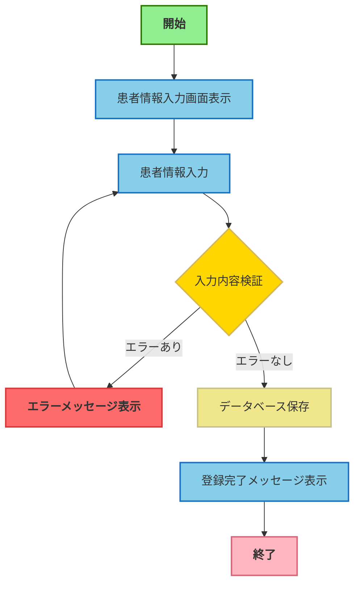

# 業務フローチャートサンプル

患者情報登録フローの変換例

## 元のPDF内容（テキスト抽出結果）

```

患者情報登録フロー

開始
  ↓
患者情報入力画面表示
  ↓
患者情報入力
  ↓
入力内容検証
  ├─→ エラーあり → エラーメッセージ表示 → 患者情報入力
  └─→ エラーなし → データベース保存
                       ↓
                     登録完了メッセージ表示
                       ↓
                     終了
```

## 変換後：draw.io XML

```xml
<mxfile host="Claude" modified="2026-06-12T00:00:00.000Z" agent="Claude Code" version="1.0">
  <diagram id="diagram-1" name="患者情報登録フロー">
    <mxGraphModel dx="1200" dy="800" grid="1" gridSize="10" guides="1" tooltips="1"
                  connect="1" arrows="1" fold="1" page="1" pageScale="1"
                  pageWidth="800" pageHeight="900" math="0" shadow="0">
      <root>
        <mxCell id="0"/>
        <mxCell id="1" parent="0"/>
        
        <!-- 開始 -->
        <mxCell id="start" value="開始" 
          style="rounded=1;fillColor=#90EE90;strokeColor=#2d7600;fontStyle=1;fontSize=12;html=1;" 
          vertex="1" parent="1">
          <mxGeometry x="340" y="50" width="120" height="40" as="geometry"/>
        </mxCell>
        
        <!-- 患者情報入力画面表示 -->
        <mxCell id="process1" value="患者情報入力画面表示" 
          style="rounded=0;fillColor=#87CEEB;strokeColor=#1971c2;fontStyle=0;fontSize=11;html=1;" 
          vertex="1" parent="1">
          <mxGeometry x="320" y="130" width="160" height="60" as="geometry"/>
        </mxCell>
        
        <!-- 患者情報入力 -->
        <mxCell id="process2" value="患者情報入力" 
          style="rounded=0;fillColor=#87CEEB;strokeColor=#1971c2;fontStyle=0;fontSize=11;html=1;" 
          vertex="1" parent="1">
          <mxGeometry x="320" y="230" width="160" height="60" as="geometry"/>
        </mxCell>
        
        <!-- 入力内容検証 -->
        <mxCell id="decision1" value="入力内容検証" 
          style="rhombus;fillColor=#FFD700;strokeColor=#d6b656;fontStyle=0;fontSize=11;html=1;" 
          vertex="1" parent="1">
          <mxGeometry x="330" y="330" width="140" height="80" as="geometry"/>
        </mxCell>
        
        <!-- エラーメッセージ表示 -->
        <mxCell id="error1" value="エラーメッセージ表示" 
          style="rounded=0;fillColor=#FF6B6B;strokeColor=#d63939;fontStyle=1;fontSize=11;html=1;" 
          vertex="1" parent="1">
          <mxGeometry x="80" y="345" width="160" height="50" as="geometry"/>
        </mxCell>
        
        <!-- データベース保存 -->
        <mxCell id="data1" value="データベース保存" 
          style="shape=parallelogram;fillColor=#F0E68C;strokeColor=#c6c189;fontStyle=0;fontSize=11;html=1;perimeter=parallelogramPerimeter;" 
          vertex="1" parent="1">
          <mxGeometry x="320" y="450" width="160" height="60" as="geometry"/>
        </mxCell>
        
        <!-- 登録完了メッセージ表示 -->
        <mxCell id="process3" value="登録完了メッセージ表示" 
          style="rounded=0;fillColor=#87CEEB;strokeColor=#1971c2;fontStyle=0;fontSize=11;html=1;" 
          vertex="1" parent="1">
          <mxGeometry x="320" y="550" width="160" height="60" as="geometry"/>
        </mxCell>
        
        <!-- 終了 -->
        <mxCell id="end" value="終了" 
          style="rounded=1;fillColor=#FFB6C1;strokeColor=#d6657b;fontStyle=1;fontSize=12;html=1;" 
          vertex="1" parent="1">
          <mxGeometry x="340" y="650" width="120" height="40" as="geometry"/>
        </mxCell>
        
        <!-- エッジ -->
        <mxCell id="edge-0" style="endArrow=classic;strokeColor=#1971c2;strokeWidth=2;html=1;exitX=0.5;exitY=1;entryX=0.5;entryY=0;" 
          edge="1" parent="1" source="start" target="process1">
          <mxGeometry relative="1" as="geometry"/>
        </mxCell>
        
        <mxCell id="edge-1" style="endArrow=classic;strokeColor=#1971c2;strokeWidth=2;html=1;exitX=0.5;exitY=1;entryX=0.5;entryY=0;" 
          edge="1" parent="1" source="process1" target="process2">
          <mxGeometry relative="1" as="geometry"/>
        </mxCell>
        
        <mxCell id="edge-2" style="endArrow=classic;strokeColor=#1971c2;strokeWidth=2;html=1;exitX=0.5;exitY=1;entryX=0.5;entryY=0;" 
          edge="1" parent="1" source="process2" target="decision1">
          <mxGeometry relative="1" as="geometry"/>
        </mxCell>
        
        <mxCell id="edge-3" value="エラーあり" 
          style="endArrow=classic;strokeColor=#d63939;strokeWidth=2;html=1;labelBackgroundColor=#ffffff;fontSize=10;exitX=0;exitY=0.5;entryX=1;entryY=0.5;" 
          edge="1" parent="1" source="decision1" target="error1">
          <mxGeometry relative="1" as="geometry"/>
        </mxCell>
        
        <mxCell id="edge-4" style="endArrow=classic;strokeColor=#d63939;strokeWidth=2;html=1;exitX=0.5;exitY=0;entryX=0;entryY=0.5;" 
          edge="1" parent="1" source="error1" target="process2">
          <mxGeometry relative="1" as="geometry">
            <Array as="points">
              <mxPoint x="160" y="260"/>
            </Array>
          </mxGeometry>
        </mxCell>
        
        <mxCell id="edge-5" value="エラーなし" 
          style="endArrow=classic;strokeColor=#1971c2;strokeWidth=2;html=1;labelBackgroundColor=#ffffff;fontSize=10;exitX=0.5;exitY=1;entryX=0.5;entryY=0;" 
          edge="1" parent="1" source="decision1" target="data1">
          <mxGeometry relative="1" as="geometry"/>
        </mxCell>
        
        <mxCell id="edge-6" style="endArrow=classic;strokeColor=#1971c2;strokeWidth=2;html=1;exitX=0.5;exitY=1;entryX=0.5;entryY=0;" 
          edge="1" parent="1" source="data1" target="process3">
          <mxGeometry relative="1" as="geometry"/>
        </mxCell>
        
        <mxCell id="edge-7" style="endArrow=classic;strokeColor=#1971c2;strokeWidth=2;html=1;exitX=0.5;exitY=1;entryX=0.5;entryY=0;" 
          edge="1" parent="1" source="process3" target="end">
          <mxGeometry relative="1" as="geometry"/>
        </mxCell>
        
      </root>
    </mxGraphModel>
  </diagram>
</mxfile>
```

## 変換後：マーメイド



## 変換のポイント

1. **カラーコーディング**: 各要素タイプに応じた色を適用
   - 開始: ライトグリーン
   - 処理: スカイブルー
   - 判断: ゴールド
   - エラー: ライトレッド
   - データ: カーキ
   - 終了: ライトピンク

2. **エラーフローの可視化**: エラー処理を赤色で強調し、フローが戻ることを明示

3. **構文の正確性**: マーメイドでは `{}` を使わず `""` で文字列を囲む
