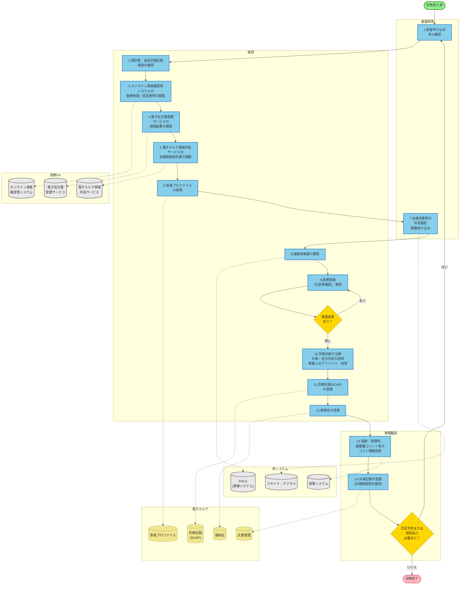

# 診察（共通）業務フロー - マーメイド図

## 凡例

### ノードの種類
- **楕円（緑）**: 開始/終了ノード
- **四角（青）**: 処理ステップ
- **ひし形（黄）**: 判断分岐
- **円柱（黄）**: データストア/データベース
- **円柱（灰）**: 外部システム

### 線の種類
- **実線（→）**: メインフロー
- **点線（-.->）**: データ参照・システム連携

## 主要フロー

1. **患者受付・情報参照**
   - 診察室入室 → 本人確認 → 過去診療記録参照
   - 医療DXサービスからの情報取得（オンライン資格確認、電子処方箋、診療情報提供書）

2. **診察・検査**
   - 患者プロファイル参照 → 画像撮影・閲覧 → 医療面接
   - 検査結果がある場合は再度検査結果確認

3. **記録・登録**
   - 診断内容説明 → SOAP記録登録 → 傷病名登録
   - コスト情報登録 → 外来記録登録

4. **診察完了**
   - 次回予約または他院紹介が必要な場合は再受付へ
   - 不要な場合は診察終了

## システム連携

### 医療DX基盤
- オンライン資格確認等システム
- 電子処方箋管理サービス
- 電子カルテ情報共有サービス

### 院内システム
- PACS（画像システム）
- 医事システム
- スキャナ・デジカメ

### データベース
- 患者プロファイル
- 診療記録（SOAP）
- 傷病名
- 文書管理
