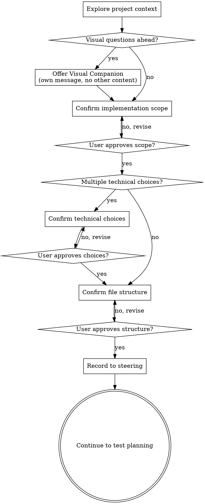

# 実装前設計確認（Brainstorming Lite）

実装開始前にスコープ・技術選択・ファイル構造を対話的に確認し、実装方針のズレを防ぐ。

**前提:** PRD・設計書が作成済みであること。設計書がない場合は先に `/design` を実行する。

**Announce at start:** "I'm using the super-brainstorming-lite skill to confirm implementation scope and approach before starting Phase 0."

## Checklist

You MUST create a task for each of these items and complete them in order:

1. **Explore project context** — check design docs, existing code, recent commits
2. **Offer visual companion** (if UI/UX feature) — this is its own message, not combined with questions
3. **Confirm implementation scope** — what to build, what's out of scope
4. **Confirm technical choices** (if multiple options exist) — which libraries, patterns to use
5. **Confirm file structure** — which files to create/modify
6. **Record to steering** — save implementation approach to `.steering/*/design.md`

## Process Flow



**The terminal state is continuing to test planning.** Do NOT start Phase 0 implementation. The ONLY next step is writing-plans subagent invocation.

## The Process

### 1. Explore project context

Check out the current project state first (design docs, files, recent commits).

**What to check:**
- Design documents: PRD, design doc, detail design if exists
- Existing codebase structure: `product/frontend/src/features/`
- Related regulation files: `docs/02_アプリ基盤/01_フロントエンド/02_詳細設計書/`
- Recent commits: `git log --oneline -10`

**Output:**
- Brief summary of the feature (1-2 sentences)
- List of related existing components/files

---

### 2. Offer visual companion (if UI/UX feature)

When you anticipate that upcoming questions will involve visual content (mockups, layouts, component placement), offer it once for consent:

> "実装前にモックアップやレイアウトをブラウザで確認できます。ビジュアルコンパニオン機能を使用すると、選択肢を視覚的に比較できます。（注意: トークンを大量に消費します）使用しますか？ (ローカル URL を開く必要があります)"

**This offer MUST be its own message.** Do not combine it with scope questions, context summaries, or any other content. The message should contain ONLY the offer above and nothing else. Wait for the user's response before continuing. If they decline, proceed with text-only confirmation.

**Per-question decision:** Even after the user accepts, decide FOR EACH QUESTION whether to use the browser or the terminal. The test: **would the user understand this better by seeing it than reading it?**

- **Use the browser** for content that IS visual — mockups, wireframes, layout comparisons, component placement
- **Use the terminal** for content that is text — scope decisions, technical choices, file lists

If they agree to the companion, read the detailed guide before proceeding:
`.claude/skills/super-brainstorming-lite/visual-companion_ja.md`

---

### 3. Confirm implementation scope

Extract implementation scope from design docs and confirm with user.

**What to confirm:**
- What to build (features in scope)
- What's out of scope (features deferred)
- Which layers to implement (FE only / FE + BFF / FE + BFF + BE)
- Phase range (Phase 0-10 / Phase 0-7 / etc.)

**Present scope conversationally:**

```markdown
Based on the design doc, here's what I understand we're building:

**In scope:**
- User login with email/password
- Logout functionality
- Session persistence

**Out of scope (for this iteration):**
- Social login (Google, GitHub)
- Password reset flow
- Two-factor authentication

**Implementation layers:**
- Frontend (Phase 0-10)
- BFF (if needed)

Does this scope look right?
```

**User response:**
- If approved → continue to step 4
- If adjustment needed → revise scope and confirm again

---

### 4. Confirm technical choices (if multiple options exist)

If the design doc mentions multiple technical options, confirm which to use.

**Common choices:**
- State management: Zustand / React Query / Context
- Form handling: React Hook Form / Formik / manual
- UI library: Tailwind / CSS Modules / styled-components
- Data fetching: SWR / React Query / fetch

**Present options conversationally:**

```markdown
The design mentions form handling. Which library should we use?

**Option A: React Hook Form (recommended)**
- Pros: Less boilerplate, built-in validation
- Cons: Learning curve for custom controls

**Option B: Manual state management**
- Pros: Full control, no dependencies
- Cons: More boilerplate, need to write validation

I recommend Option A because it handles validation and error display cleanly. What do you think?
```

**User response:**
- If approved → continue to step 5
- If different option → use that option and continue
- If adjustment needed → revise and confirm again

**If no choices exist:**
- Skip this step
- Use the approach specified in the design doc

---

### 5. Confirm file structure

List files to create/modify and get approval.

**What to list:**
- Files to create (with full paths)
- Files to modify (with what will change)
- Files to delete (if refactoring)

**Organize by Phase:**

```markdown
Here's the file structure for this implementation:

**Phase 1: Type definitions**
- Create: `product/frontend/src/features/auth/types/auth.type.ts`
- Create: `product/frontend/front_bff_shared/auth/auth.shared.ts`

**Phase 2: API & Repository**
- Create: `product/frontend/src/features/auth/api/login.api.ts`
- Create: `product/frontend/src/features/auth/repository/auth.repository.ts`

**Phase 3: State management**
- Create: `product/frontend/src/features/auth/stores/auth.store.ts`

**Phase 4: Hooks**
- Create: `product/frontend/src/features/auth/hooks/useLogin.ts`
- Create: `product/frontend/src/features/auth/hooks/useLogout.ts`

**Phase 5: Components**
- Create: `product/frontend/src/features/auth/components/molecules/LoginForm.tsx`
- Create: `product/frontend/src/features/auth/components/organisms/LoginPage.tsx`

**Modified files:**
- Modify: `product/frontend/src/app/layout.tsx` (add auth provider)

Does this structure look right?
```

**User response:**
- If approved → continue to step 6
- If adjustment needed → revise structure and confirm again

---

### 6. Record to steering

Save the confirmed implementation approach to `.steering/YYYYMMDD-機能名/design.md`.

**What to record:**

```markdown
# 実装方針

## 実装スコープ

【実装する】
- {feature A}
- {feature B}

【スコープ外】
- {feature C} (後続イテレーションで実装)

## 技術選択

- 状態管理: Zustand
- フォーム管理: React Hook Form
- UI ライブラリ: Tailwind

## ファイル構造

（Step 5 の出力をコピー）

## 実装順序

Phase 0 → Phase 1 → Phase 2 → ... → Phase 10

## 次のステップ

- test-planner サブエージェントでテスト計画作成
- tasklist.md にタスク一覧を展開
- Phase 0 から実装開始
```

**No need to update tasklist.md yet.** The test-planner subagent and task decomposition step will handle that.

---

## Key Principles

- **One question at a time** - Don't overwhelm with multiple questions
- **Multiple choice preferred** - Easier to answer than open-ended when possible
- **Follow existing patterns** - Explore the current structure before proposing changes
- **Incremental validation** - Present scope/choices/structure, get approval before moving on
- **Be flexible** - Go back and clarify when something doesn't make sense
- **Context conservation** - Don't copy full design docs, summarize key points

---

## Visual Companion

ビジュアルコンパニオンは **ポート 49152〜65535 のランダムポート** で起動される HTTP + WebSocket サーバー。

**ポートの役割:**
- **HTTP サーバー**: HTML/CSS/JS を配信（モックアップ・図を表示）
- **WebSocket**: ユーザーのクリック操作をリアルタイム送信

**なぜポートを立ち上げる？**
- ブラウザでモックアップ・レイアウト・図を表示するため
- AI が HTML を書き込むと、ブラウザが自動リロードして表示
- ユーザーがオプションをクリックすると、選択内容が AI に送信される

**起動方法:**

```bash
.claude/skills/super-brainstorming-lite/scripts/start-server.sh --project-dir /home/ke-watanabe/harz2
```

**返ってくる情報:**

```json
{
  "type": "server-started",
  "port": 52341,
  "url": "http://localhost:52341",
  "screen_dir": "/home/ke-watanabe/harz2/.superpowers/brainstorm/12345-1706000000/content",
  "state_dir": "/home/ke-watanabe/harz2/.superpowers/brainstorm/12345-1706000000/state"
}
```

**使い方:**
1. AI が `screen_dir` に HTML ファイルを書き込む（Write ツール使用）
2. サーバーが自動的に最新の HTML をブラウザに配信
3. ユーザーがブラウザで選択肢をクリック
4. 選択内容が `state_dir/events` に JSON で記録される
5. AI が次のターンで `events` を読み取る

詳細: `.claude/skills/super-brainstorming-lite/visual-companion_ja.md`

---

## After Confirmation

**Do NOT start implementation.**

The next step is test planning (test-planner subagent), then task decomposition, then Phase 0 implementation.

**Announce:**

> "Implementation approach confirmed and saved to `.steering/YYYYMMDD-機能名/design.md`. Next: test-planner subagent will generate test plan from PRD acceptance criteria."

---

## When to Use

**必須:**
- フロントエンド機能の実装（UI/UX が関わる）
- 複数の技術選択肢がある機能
- ファイル構造が複雑な機能

**スキップ:**
- API のみの機能
- バグ修正（既存仕様の範囲内）
- 設計書が存在しない場合（先に `/design` を実行）

---

## Integration with /implement

`.claude/commands/implement.md` のステップ0 と ステップ1 の間に以下を追加:

```markdown
#### ステップ0.5: 実装前設計確認 [Skill: super-brainstorming-lite]

**トリガー条件:**
- 設計書が存在する（`docs/01_アプリ/{domain}/{機能グループ}/design-*.md`）
- フロントエンド実装を含む機能

**スキップ条件:**
- API のみの機能
- バグ修正（`/fix` コマンド）
- 設計書が存在しない（先に `/design` を実行）

**実行:**

\`\`\`
Skill('super-brainstorming-lite')
\`\`\`

完了後: ステップ1（テスト計画）へ進む
```

---

## Red Flags

These thoughts mean STOP — don't rationalize:

| Thought | Reality |
|---------|---------|
| "Design doc says it, no need to confirm" | Confirmation prevents misalignment between design and implementation |
| "Simple feature, can skip" | Simple features suffer most from unexamined assumptions |
| "Takes time, confirm later" | Fixing after implementation takes more time |
| "Same as before, can skip" | Every feature needs confirmation |

---

## Reference

- 元のスキル: `super/tmp/superpowers/skills/brainstorming/SKILL.md`
- ビジュアルコンパニオン: `.claude/skills/super-brainstorming-lite/visual-companion_ja.md`
- 統合プラン: `docs/meta/brainstorming-migration-plan.md`
