## クライアント開発環境構築手順書

### 目的
本手順書は、ローカル開発環境において  
VSCode, Git, WSL2（Ubuntu）, Docker を用いた開発環境を構築するための手順を示す。  
本手順により、開発者間の環境差異を最小化するとともに、  
本番／検証環境に近い形での開発・動作確認を可能とすることで、  
環境構築にかかる手間および初期セットアップ工数の削減を目的とする。


### 1. WSL2 (Ubuntu) の導入
Windows上で軽量なLinux環境（Ubuntu）を構築します。これにより、Windowsの利便性を維持しつつ、本番環境に近いLinuxベースのDocker開発環境を実現します。  
**参考サイト（公式）：**[WSL を使用して Windows に Linux をインストールする方法](https://www.docker.com/products/docker-desktop/)  
**参考サイト：**[Windows端末にWSL2＋Dockerをインストールする](https://qiita.com/n-okutomi/items/c90a5e8a5413ea50b8ff)  
**参考サイト：**[WSL2、Visual Studio Code、DockerでグッとよくなるWindows開発環境 ](https://tech-lab.sios.jp/archives/21675)


### 1-1. Windowsの機能の有効化

最近のWindowsではコマンド一発でインストール可能ですが、エラーを防ぐため以下の機能が有効であることを確認・設定します。

1. タスクバーで「Windowsの機能の有効化または無効化」を検索して開きます。
2. 以下の項目にチェックを入れ、「OK」を押してPCを再起動します。
- Linux用Windowsサブシステム
- 仮想マシンプラットフォーム
- Hyper-V（ある場合のみチェック入れる）

  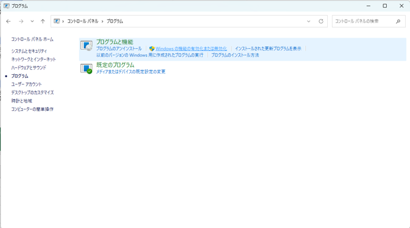

  ↓

  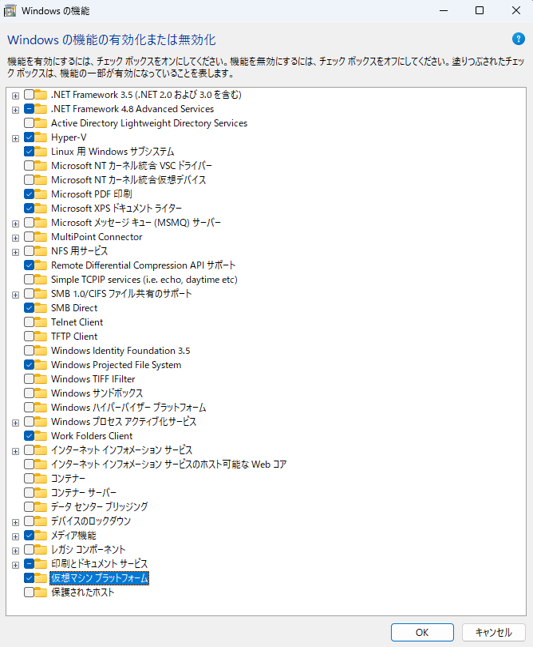

3. **PCを再起動**します。

### 1-2. WSL2 インストールと Ubuntu のセットアップ

1. **管理者権限の PowerShell** で以下のコマンドを実行します。
    ```powershell
    # WSLのインストールとUbuntuのダウンロード
    wsl --install -d Ubuntu-24.04

    ```
    > ※補足：Ubuntuバージョンについて
    > 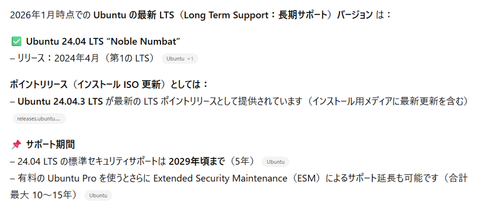

    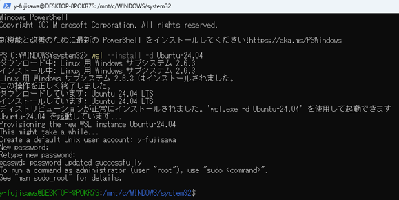

2. インストール完了後、Ubuntuのターミナルが立ち上がり、「ユーザー名」と「パスワード」を設定するよう求められるので、画面に従い入力する。
(Ubuntu専用の **Username** と **Password**となるので任意のものを入力)
3. Ubuntuが正しくインストールされたかと、バージョンを確認する。
    ```powershell
    # Ubuntuのバージョン確認
    wsl -l -v

    ```

### 1-3. WSL のバージョンを 2 に固定する (Ubuntuバージョンが1の時のみ)

既存の環境やデフォルト設定が WSL1 になっているのを防ぐため、WSL2 を標準に設定します。

1. PowerShell で以下のコマンドを実行します。
    ```powershell
    # バージョン1から2に変換する
    wsl --set-version Ubuntu-24.04 2

    # Ubuntuのバージョンが2で動いているか確認
    wsl -l -v

    ```
    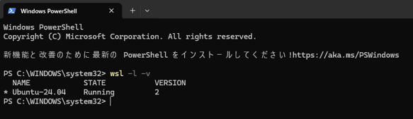

* `VERSION` の項目が `2` になっていれば成功です。


---


## 2. Docker Engine のインストールと設定（Ubuntu）

WSL2 (Ubuntu) のターミナル内で、直接 Docker Engine を動作させるためのセットアップ手順です。  
※Linux環境では右クリックでペーストが可能
**参考サイト（公式）：**[UbuntuにDockerエンジンをインストールする](https://docs.docker.com/engine/install/ubuntu/)  
**参考サイト：**[【入門】Dockerの環境構築を解説｜Ubuntuにインストール](https://www.kagoya.jp/howto/cloud/container/dockerubuntu/)

### 2-1. WSL2 (Ubuntu) のターミナル起動方法

Windowsの検索欄にてWSLを起動

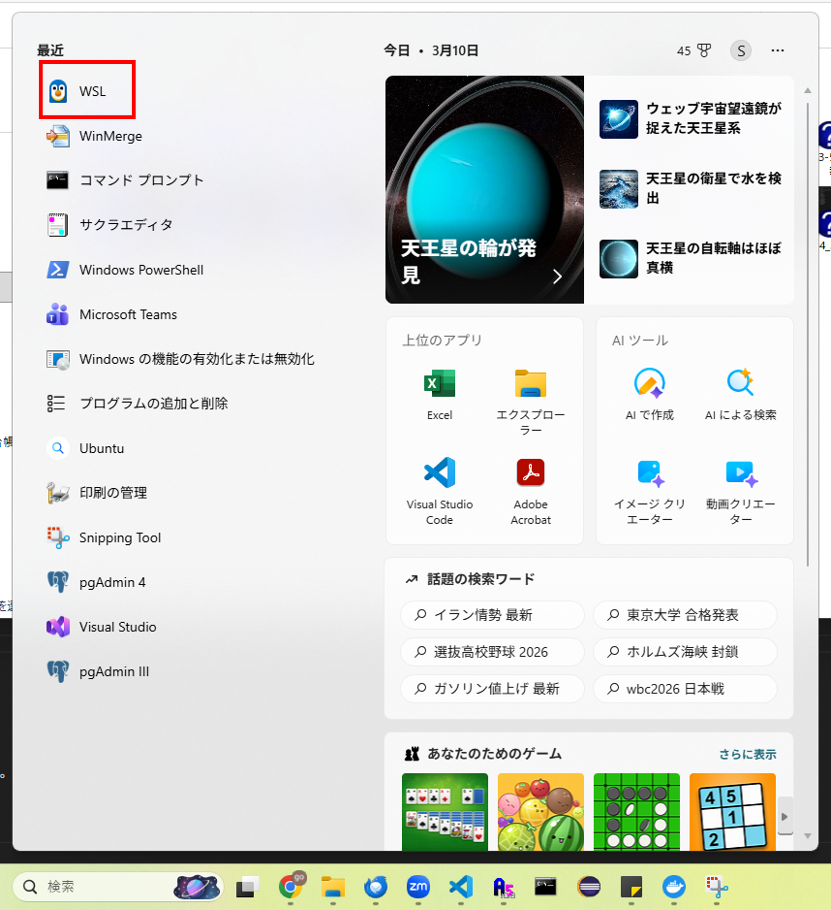

ターミナルが立ち上がる

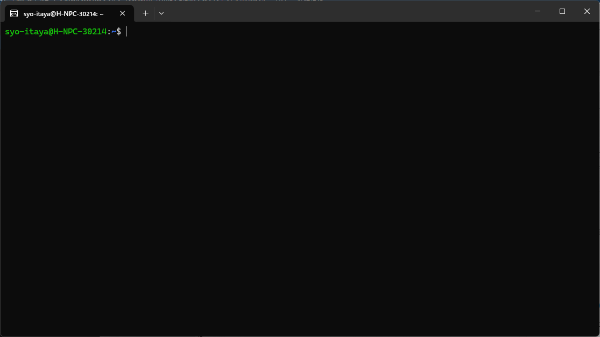

### 2-2. 必要な共通パッケージのインストール

リポジトリを安全に追加するためのツールを導入します。

```bash
sudo apt install -y ca-certificates curl gnupg lsb-release

```

### 2-3. Docker 公式 GPG キーの追加

Docker 公式のリポジトリであることを証明するための鍵をシステムに登録します。  

（1行ずつ入力）
```bash
sudo install -m 0755 -d /etc/apt/keyrings

curl -fsSL https://download.docker.com/linux/ubuntu/gpg | sudo gpg --dearmor -o /etc/apt/keyrings/docker.gpg

sudo chmod a+r /etc/apt/keyrings/docker.gpg

```
> **補足: WSL2(Ubuntu) Docker導入時の証明書エラー対処マニュアル**
> Docker公式サイトから「GPG鍵」の取得や「リポジトリの更新（apt update）」のコマンド実行時、以下のSSLエラーが発生し、接続が遮断されるとき
> →UbuntuOS側に証明書を登録することで解決
> > **SSLエラー**
> > `curl: (60) SSL certificate problem: self-signed certificate in certificate chain Certificate verification failed: The certificate is NOT trusted.`
>
> 1.Windows で社内ルート証明書を取得
>  社内 CA 証明書（例：CORE-HC-CA.cer）をWindows上の任意の場所に持ってくる。
> ```bash
> # 証明書を Ubuntu の信頼ストアへコピー（拡張子を .crt に変更） ※もしくはwindowsエクスプローラーで直接移動でも可
> sudo cp "/mnt/c/Users/（ユーザー名）/Desktop/CORE-HC-CA.cer" /usr/local/share/ca-certificates/CORE-HC-CA.crt
> 
> # 証明書ストアを更新
> sudo update-ca-certificates
> ```
> > `1 added, 0 removed; done.`
> 
> と表示されれば完了。


### 2-4. Docker リポジトリをAPTのソースに追加

パッケージ管理システム（apt）の参照先に Docker の配布元を追加します。  

（2回に分けて入力）
```bash
echo \
  ""deb [arch=$(dpkg --print-architecture) signed-by=/etc/apt/keyrings/docker.gpg] https://download.docker.com/linux/ubuntu \
  $(. /etc/os-release && echo ""$VERSION_CODENAME"") stable"" | \
  sudo tee /etc/apt/sources.list.d/docker.list > /dev/null

sudo apt update

```

### 2-5. Docker Engine のインストール

準備が整ったので、Docker 本体と Docker Compose V2 をインストールします。

```bash
sudo apt install -y docker-ce docker-ce-cli containerd.io docker-buildx-plugin docker-compose-plugin

```

### 2-6. ユーザー権限の設定

`sudo` なしで `docker` コマンドを使えるように、現在のユーザーを `docker` グループに追加します。

```bash
# 現在のユーザーをグループに追加
sudo usermod -aG docker $USER

```

> **重要:** 設定を反映させるため、一度 Ubuntu ターミナルを完全に閉じ、**新しく開き直して**ください。

### 2-7. サービスの起動と動作確認

Docker サービスを起動し、`docker run hello-world` を実行して正常に動くかテストします。
  > Docker Hubから公式テスト用イメージを取得・実行し、Docker Engineが正常に稼働していることを確認するためのコマンド
  > 初回実行時には、ローカル環境にイメージが存在しないため、公式のリポジトリ（Docker Hub）から自動的にイメージがダウンロード（Pull）される。2回目以降はローカルのキャッシュが使用されるため、ダウンロード工程はスキップされる。

```bash
# Dockerサービスの起動（サービスの起動そのものは常に sudo が必要）
sudo service docker start

# 動作テスト（Hello from Docker! と表示されれば成功）
docker run hello-world

```
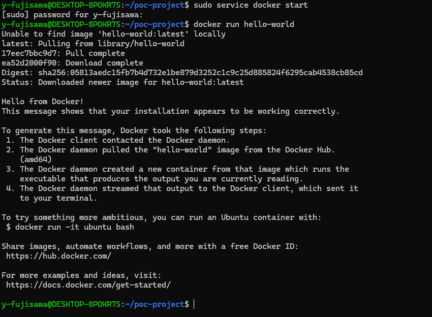

---


## 3. GitLabからソースコードを取得するための設定（SSH接続）

中部カンパニーのGitLabからプロジェクトフォルダ一式を取得する方法です。
パスワード入力を省力化するため、SSHでの接続とします。

### 3-1. Windows上で、公開鍵・秘密鍵のペアを発行

GitLabへSSH接続するための公開鍵・秘密鍵のペアを発行します。

1. PowerShell で以下のコマンドを実行します。  
   このタイミングで３回入力を求められるが、いずれも空のままEnterを押下します。
    ```powershell
    # SSHキーを発行
    ssh-keygen -t rsa -b 4096 -C “<メールアドレス>“
    ```

2. `C:\Users\<ユーザー名>\.ssh` に `id_rsa.pub` と `id_rsa` ファイルが生成されていることを確認します。

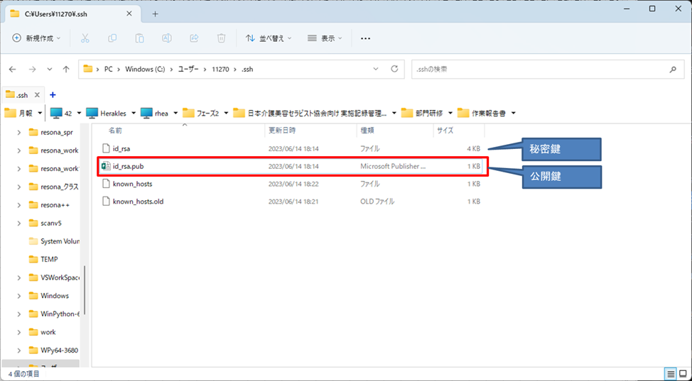

### 3-2. 公開鍵をGitLabに登録

作成した公開鍵をGitLabに登録します。

1. GitLabブラウザにログインします。

2. 右上の `設定` を押下します。

3. 左メニューの `SSHキー` を押下します。

4. `新しいキーを追加`を押下します。

5. ~/.ssh/id_rsa.pub の中身をキーに入力します。

6. `キーを追加`を押下します。

### 3-3. Windows上で、環境変数HOMEの設定

Windows11のOpenSSH for Windowsを使用している場合、HOME環境変数が正しく設定されていないと秘密SSHキーが見つからずエラーとなるため、以下の手順を実行します。  

1. PowerShell で以下のコマンドを実行します。  
    ```powershell
    # HOME環境変数が設定されていることを確認する。
    $env:HOME
    ```

2. 1.の手順で何も表示されない場合は、以下のコマンドを実行します。
    ```powershell
    # HOME環境変数をセットする
    [Environment]::SetEnvironmentVariable("HOME", $env:USERPROFILE, "User")
    ```

3. 一度パワーシェルを終了し、再度パワーシェルを起動します。

4. PowerShell で以下のコマンドを実行し、HOME環境変数が設定されていることを確認します。
    ```powershell
    # HOME環境変数が設定されていることを確認する。
    $env:HOME
    ```

参考：https://docs.gitlab.com/ja-jp/user/ssh_advanced/#use-ssh-on-microsoft-windows
Windowsネイティブ環境でのGit操作は非推奨とするが、本手順を適用することで、SSH認証によるリモートリポジトリ操作を有効化できます。

### 3-4. Ubuntu環境にWindowsの秘密鍵・公開鍵をコピーする
Ubuntu上でGit操作を実施するため、Windows環境で作成した秘密鍵・公開鍵をUbuntu環境にコピーします。

1. Ubuntuターミナルで以下のコマンドを実行します。  
    ```bash
    # .sshフォルダを作成する(すでに存在する場合はそのまま)
    mkdir -p ~/.ssh

    # Windowsと同じ鍵をWSL側にもコピー
    cp /mnt/c/Users/<ユーザー名>/.ssh/id_rsa* ~/.ssh/

    # 公開鍵・秘密鍵に権限付与
    chmod 600 ~/.ssh/id_rsa
    chmod 644 ~/.ssh/id_rsa.pub
    ```

### 3-5. Ubuntu上のにSSHでGitリポジトリをクローンする
Harzプロジェクトのファイル一式をGitリポジトリにダウンロードします。

1. Ubuntu ターミナルで以下のコマンドを実行します。
    ```bash
    cd ~
    git clone git@ccgitlab:harz/harz.git
    ```

    ※ 中部カンパニー以外のメンバーは、DNSが効かないため以下のコマンドを実行する。
    ```bash
    cd ~
    git clone git@10.80.1.253:harz/harz.git
    ```

2. `Are you sure you want to continue connecting (yes/no/[fingerprint])?`と聞かれるためyesと入力する
※「git@ccgitlab's password:」と聞かれる場合、SSH設定が失敗しているためSSH設定を再度確認してください。

3. Ubuntuターミナルで以下のコマンドを実行します。  
    ```bash
    # Gitのコミット情報を登録
    git config --global user.name "ユーザー名"
    git config --global user.email "メールアドレス"

    # Gitのコミット情報が登録されていることを確認
    git config --global --list
    ```
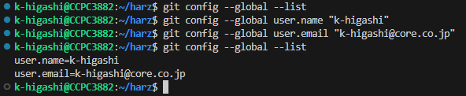

4. 構成要素の確認（Docker実行に必須のファイル）

    Dockerで環境を構築するために必要なファイルは以下の通りです。これらが欠けていると `docker compose` コマンドが失敗します。

    | 配置場所 | ファイル名 | 役割 |
    | --- | --- | --- |
    | **ルート** | **`docker-compose.yml`** | **最重要。** frontendとbffを連携・管理するための設計図です。 |
    | **サービスごと** | **`Dockerfile`** | コンテナのOSやNode.js環境、実行コマンドを定義します。 |
    | **サービスごと** | **`.dockerignore`** | ビルドを高速化し、不要なゴミをコンテナに入れないためのフィルターです。 |

    > **補足：逆に「なくて良い」もの**
    > * **`node_modules` フォルダ**: 起動時にDockerがコンテナ内で自動生成するため、ホスト（Ubuntu/Windows）側になくても問題ありません。
    > * **`.next` フォルダ**: Next.jsのビルドキャッシュです。これも起動時に自動生成されます。

---


## 4. Claude Code 拡張機能のインストール

WSL上のVSCode に Claude Code 拡張機能をインストールします。

1. **VSCodeを起動**します。
2. **WSLへの接続**: 左下の `><` (リモートインジケーター) をクリックし、`WSL: Connect to WSL`（または `WSL: New Window using Distro...`）を選択し、**Ubuntu** を選択します。
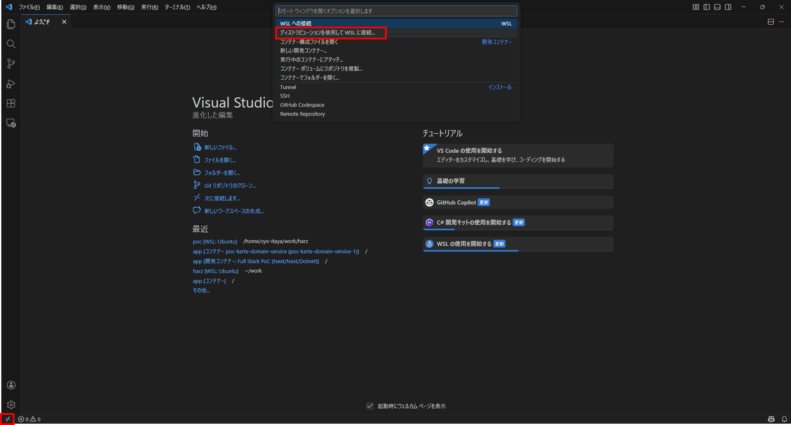  
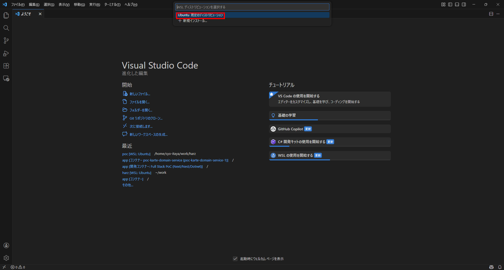  
3. 左サイドバーの **拡張機能アイコン**（または `Ctrl + Shift + X`）を開きます。
4. 検索欄に `Claude Code` と入力します。
5. 提供元が **Anthropic** の **「Claude Code」** を選択し、「インストール」を押下します。

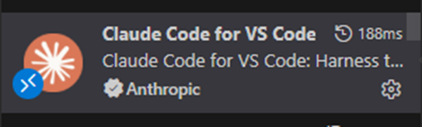

6. インストール完了後、左サイドバーの **Claude Code アイコン** を押下します。

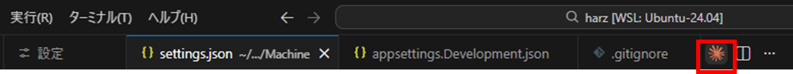

7. 認証方式として **「Bedrock, Foundry, or Vertex」** を選択します。

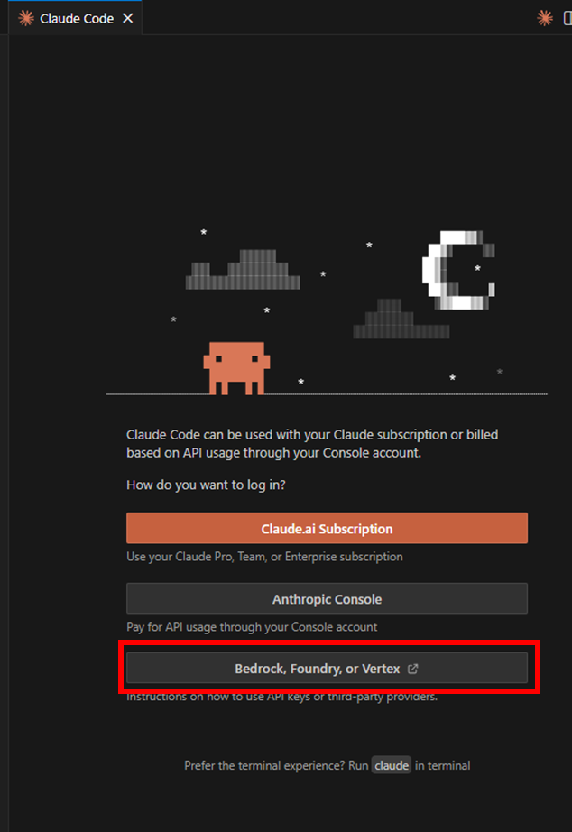


8. 「**外部サイトを開く**」を選択します。

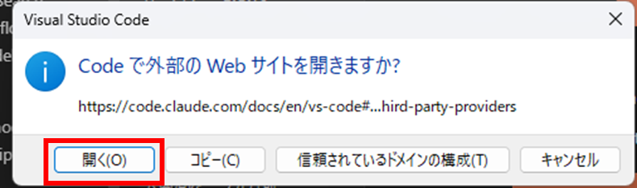


9. ブラウザで「ログインプロンプト設定を無効にする」を押下します。
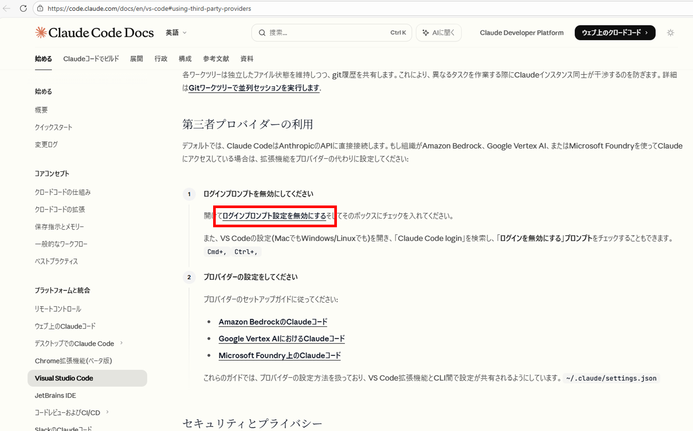

10. ブラウザに「このサイトは Visual Studio Code を開こうとしています」というダイアログが表示されるので、「**開く**」を押下します。

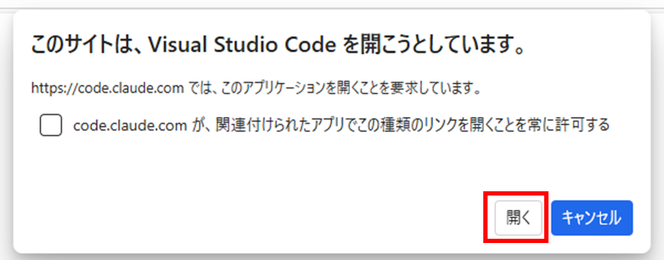

11. VSCodeの「Disable Login Prompt」にチェックを入れます。
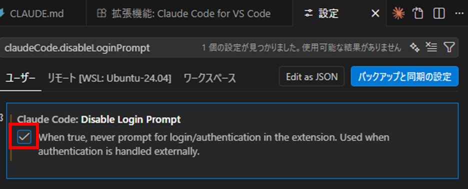


12. **WSL上のターミナルの起動**: `ターミナル`>`新しいターミナル`よりターミナルを起動します。

13. **ClaudeCode用の環境変数を追加**：`~/.bashrc` の末尾に以下を追記します。  
    ```
    # HarzのClaudeCode用環境変数
    export AWS_ACCESS_KEY_ID=自分のアクセスキー
    export AWS_SECRET_ACCESS_KEY=自分のシークレットアクセスキー
    export ANTHROPIC_MODEL=自分の推論プロファイルARN
    export AWS_REGION=ap-northeast-1
    export CLAUDE_CODE_USE_BEDROCK=true
    ```
    ※アクセスキー・シークレットアクセスキー情報
    `\\10.20.21.198\Harz_共有\@Harz2025_project-docs\93_手順書\AWS\アクセスキー`
    ※推論プロファイルARN情報
    `\\10.20.21.198\Harz_共有\@Harz2025_project-docs\93_手順書\AWS\推論プロファイルARN`

14. **WSL上に環境変数を適用**：`source ~/.bashrc` コマンドを実行します。

15. **環境変数適用の確認**:`env`コマンドを実行し、12で設定した環境変数が設定されていることを確認します。

16. VSCode を閉じて再起動し、WSLへ接続します。
17. ClaudeCodeチャット欄に `test` と入力し、応答が返ってくることを確認します。  
    応答が返ってこない場合は認証設定を再確認してください。


---


## 5. DevContainer 操作マニュアル

### 1. DevContainer の起動手順

プロジェクトの環境構築を行うための基本手順です。

1. **VSCodeの起動**: VSCodeを起動します。
2. **WSLへの接続**: 左下の `><` (リモートインジケーター) をクリックし、`WSL: Connect to WSL`（または `WSL: New Window using Distro...`）を選択し、**Ubuntu** を選択します。
  
  

3. **プロジェクトを開く**: 左メニューの「エクスプローラー」を開き、「フォルダーを開く」を選択します。
4. **フォルダ選択**: `harz/poc`フォルダを選択し、OKを押下します。
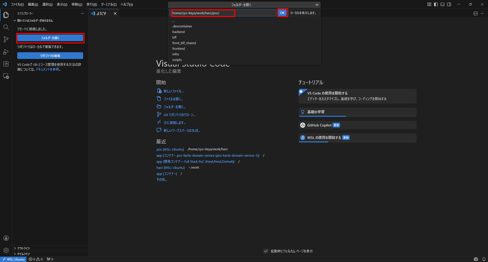  

5. **Dev Containersのインストール**: ローカルorWSLにDev Containersをインストール
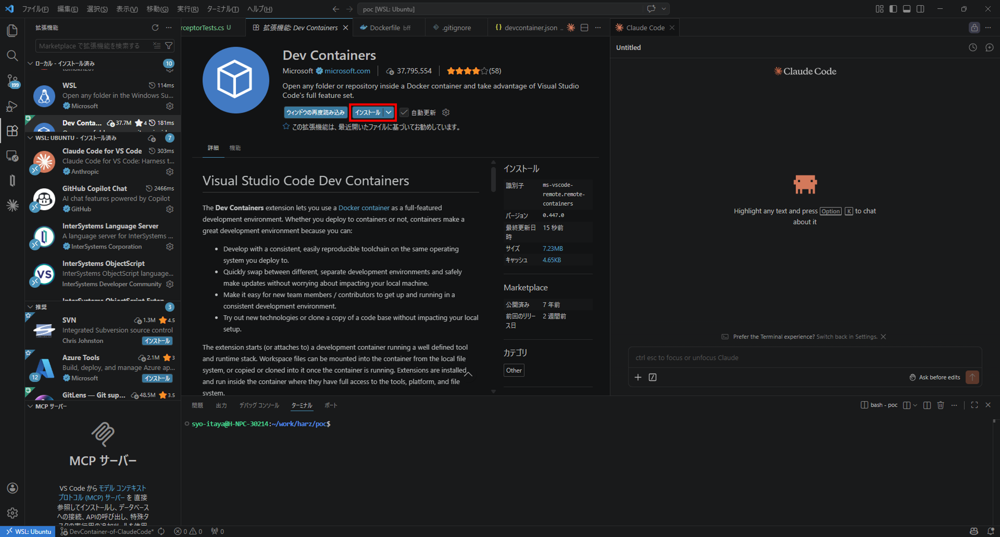 

6. **コンテナのリオープン**: `Ctrl + Shift + P` を押し、コマンドパレットから **「Dev Containers: Reopen in Container」** を選択します。
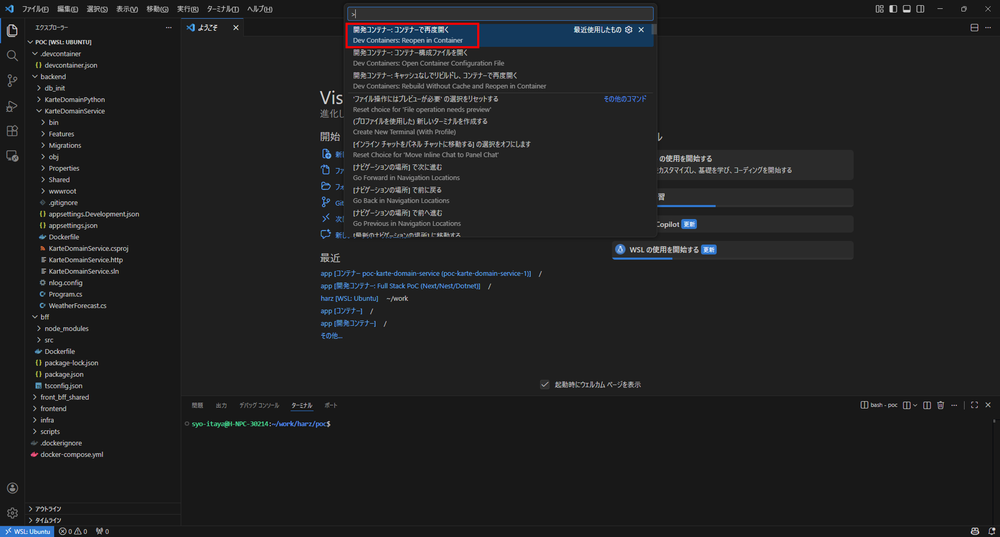  

7. **構成の選択**: 
`.devcontainer/` 配下に定義されたリストが表示されるので、`Frontend Poc`を選択します。
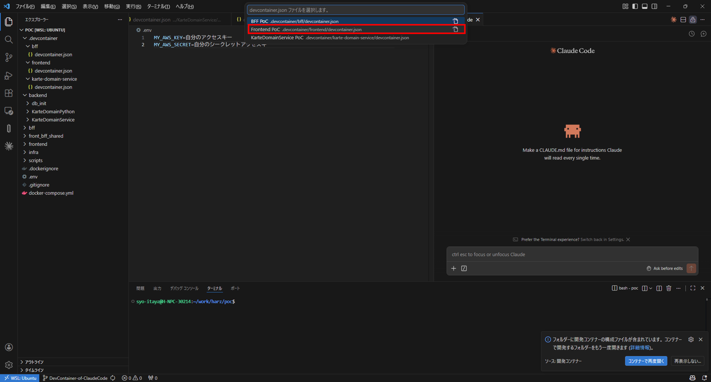  

8. **待機**: 右下の「開発コンテナーへの接続（ログを表示）」をダブルクリックし、ターミナルでビルド状況を確認します（完了まで時間がかかります）。
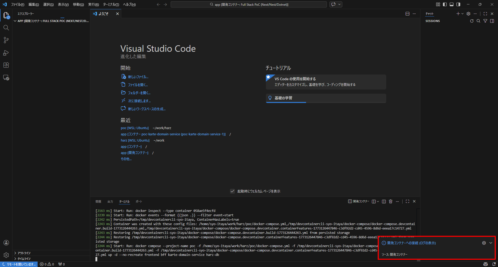  

9. **完了確認**: コンソールが停止し、エクスプローラーにフロントエンドのフォルダが表示されたら構築完了です。
10. **動作確認**: ブラウザで `http://localhost:3000/patient/1` にアクセスし、患者情報が表示されることを確認してください。
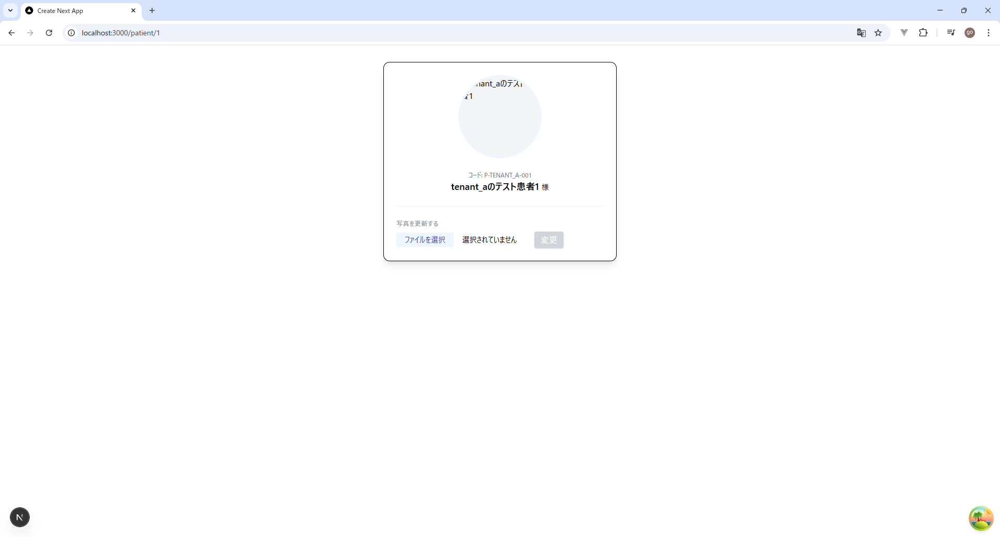  


---

### 2. 再試行手順（環境のクリーンアップ）

環境の不整合が発生した場合などに使用します。

1. **WSL接続の更新**: 右下の `><` をクリックし、「WSLでフォルダーをもう一度開く」を選択します。
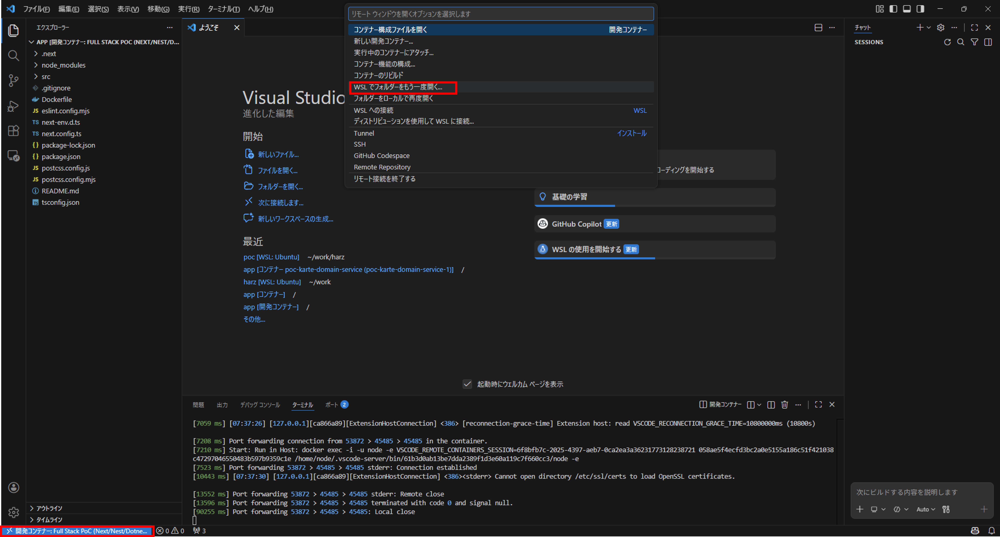  

2. **コンテナの停止**: ターミナルで以下を実行し、起動中のコンテナを停止します。
```bash
docker compose down

```


3. **ボリュームの削除**: 永続化コンテナを含め、全ボリュームを削除します。
```bash
docker volume rm $(docker volume ls -q)

```

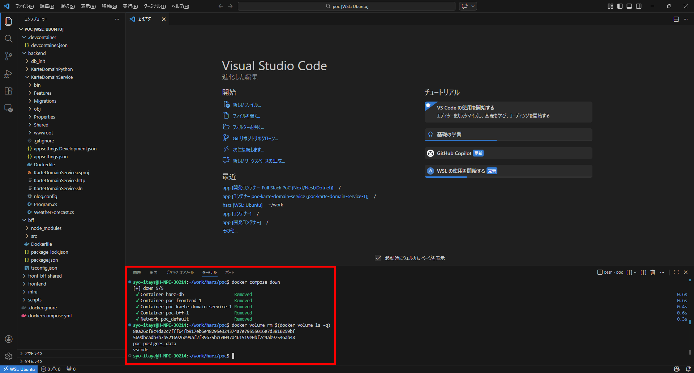  


4. **再構築**: 「DevContainerの起動」手順のステップ5からやり直してください。

---

### 3. コンテナの切り替え方法（複数サービス開発）

本プロジェクトはモノレポ構成のため、Frontend、BFF、DomainServiceなど、操作したいサービスごとに最適な開発環境（拡張機能やツール）を切り替えて使用します。「実行中のコンテナにアタッチ」ではなく、以下の手順で**対象サービス専用の設定**でウィンドウを開いてください。

#### 手順：
1. **新しいウィンドウを開く**: 
   すでに1つのコンテナ（例：frontend）で作業中の場合、`Ctrl + Shift + N` で新しいVSCodeウィンドウを立ち上げます。

2. **WSLに接続**: 
   新しいウィンドウの左下 `><` をクリックし、`WSL: Connect to WSL` から **Ubuntu** を選択してプロジェクトフォルダ（`poc`）を開きます。

3. **対象の定義を選択してリオープン**: 
   `Ctrl + Shift + P` を押し、コマンドパレットから **「Dev Containers: Reopen in Container」** を選択します。
   
4. **構成の選択**: 
   `.devcontainer/` 配下に定義されたリストが表示されるので、作業したいサービスを選択します。
   - `Frontend Poc`
   - `BFF Poc`
   - `KarteDomainService Poc`

5. **自動セットアップの完了**: 
   選択したサービス専用のウィンドウが立ち上がります。この方法で開くことで、以下の設定が自動的に適用されます。
   - **専用拡張機能**: BFFならC#、FrontendならNode.js用のツールが自動有効化。
   - **ワークスペース**: 自動的に対象サービスのソースコード階層（`/app` や `/workspaces/...`）がエクスプローラーに展開されます。
   - **認証情報**: `Claude Code` のAWS認証設定などが引き継がれた状態で開始できます。

> **Tips: フォルダが見えない場合**
> 上記手順（Reopen）で開けば、自動的に各サービスのルートフォルダが開かれます。もし手動で場所を変えたい場合は、エクスプローラーの「フォルダーを開く」から、コンテナ内の適切なパス（例：`/workspaces/harz/bff`）を指定してください。

---

### 4. コンテナ内のフォルダ閲覧方法

コンテナ切り替え後、フォルダが表示されない場合の対処法です。

1. VSCode左側のエクスプローラーから「フォルダーを開く」を選択します。
2. パス入力欄に `/root/` と表示されるため、`root` を消去し、代わりに `/app` を入力（または選択）してOKを押下します。
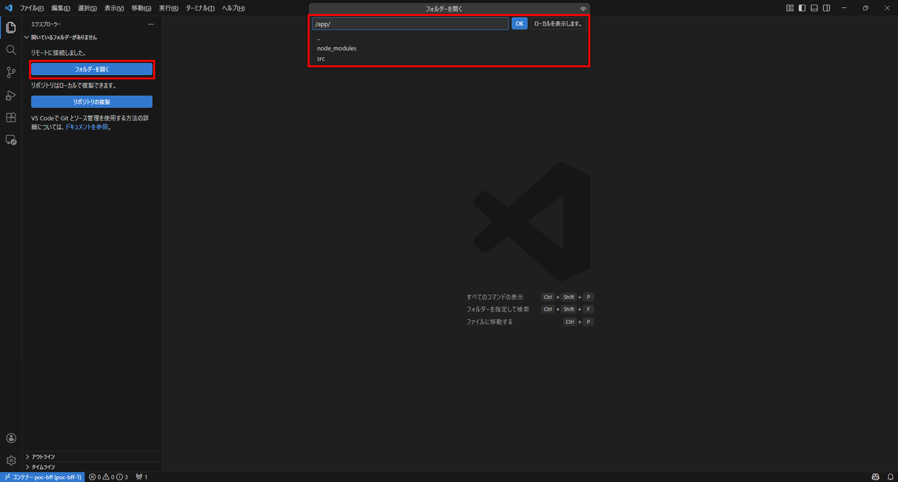  

3. フォルダ内のソースコードがエクスプローラーに展開されます。
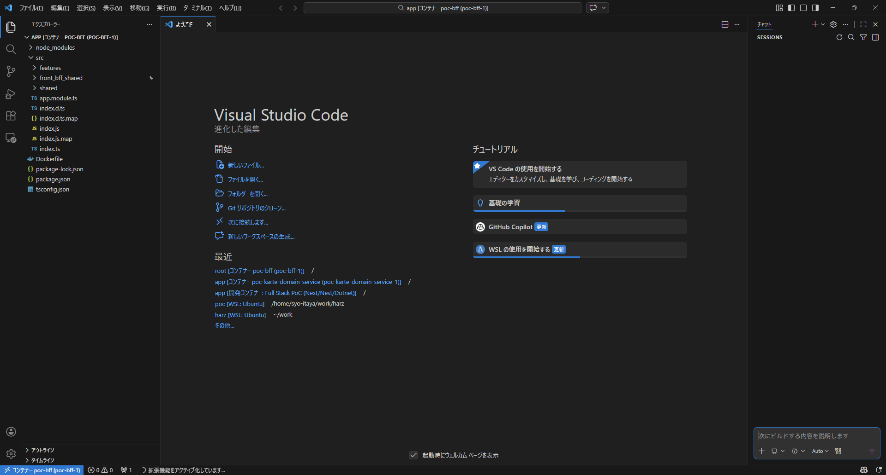  


---

### 5. DB接続情報（Windowsローカルからの接続用）

外部ツール等から接続する際のパラメータです。

| 項目 | 設定値 |
| --- | --- |
| **Host** | `localhost` |
| **Port** | `5430` |
| **Database** | `harz_db` |
| **Username** | `harz_user` |
| **Password** | `password` |

---

## GitLab運用手順書  
リポジトリ操作、ブランチ運用、およびコミット規約の詳細は以下を参照してください。  
[GitLab運用手順書](./02_GitLab運用手順書.md)  

---

## Excel-Markdown変換手順書  
設計書等のExcel資産をMarkdownへ変換する手順は以下を参照してください。  
[Excel-Markdown変換手順書.md](./03_Excel-Markdown変換手順書.md)  

---

## Figma ClaudeCodeプラグイン利用手順書
FigmaのClaudeCodeプラグインの利用手順は以下を参照してください。
[FigmaClaudeCodeプラグイン利用手順書.md](./04_FigmaClaudeCodeプラグイン利用手順書.md) 