## GitLab運用手順書

### 目的
複数人での並行開発を安全かつ迅速に進めるため、本プロジェクトでは**GitLab**を利用したバージョン管理を行う。  
本手順書では、GitLabの標準的な運用フローを定義する。  

--- 

### 1. プロジェクトで使うGit用語
| 用語 | 説明 |
| :--- | :--- |
| **リポジトリ** | プロジェクトの全ファイルと変更履歴が保管されている場所。 |
| **ブランチ** | 履歴の流れを分岐させて記録する機能。作業ごとに作成します。 |
| **ローカル / リモート** | 自分のPC（ローカル）とGitLabサーバー（リモート）。 |
| **クローン** | リモートにあるリポジトリを、自分のPCへまるごと複製（ダウンロード）すること。 |
| **ステージ** | 変更をコミットする前の準備場所。 |
| **コミット** | ファイルの追加や変更を、メッセージと共に履歴として自分のローカルに保存すること。 |
| **プッシュ** | ローカルで記録したコミットを、リモートに反映させること。 |
| **プル** | リモートの更新内容をローカルのソースファイルに反映させる。 |
| **フェッチ** | リモートと通信を行い、更新された内容をローカルリポジトリに取り込む。(ローカルのソースファイル自体はまだ更新されない) |
| **マージ** | 派生したブランチの変更内容を、ベースとなるブランチへ統合すること。 MRの承認を経て実行される。 |
| **マージリクエスト(MR)** | 自分のブランチを共通ブランチへ合流させるための承認依頼。 |

--- 

### 2. ブランチ方針

### 2-1. ブランチルール
| ブランチ名 | 運用方針 | 補足 |
|-----|-----|-----|
| main(production) | 本番環境へのリリースコードを保持するブランチ。本ブランチの内容を本番環境へデプロイする。 | 直接コミット厳禁。マージ時レビュー必須。 |
| staging | 本番リリース前の結合テスト・検証用ブランチ。本ブランチの内容を検証環境へデプロイする。 | 直接コミット厳禁。マージ時レビュー必須。 |
| develop | 開発用ブランチ。 | 直接コミット厳禁。マージ時レビュー必須。 |
|  |  |  |
| feature/* | 機能単位で独立した開発用ブランチ。`develop`から機能毎にブランチを切る。 |  |

●例  
データベースPoC検証用ブランチ：`feature/PoC-database`  
検査結果入力画面の詳細設計書作成ブランチ：`feature/詳細設計-検査結果入力画面`  
ログイン機能開発用ブランチ：`feature/製造-login`  

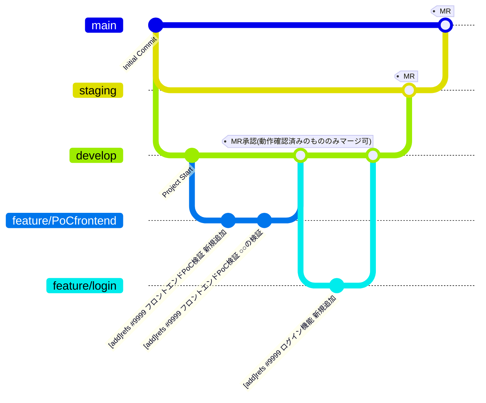

### 2-2. ブランチ作成手順

1. VSCode左下のブランチアイコンを押下します。  
  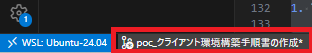  

2. `新しいブランチを以下から作成`を押下します。  
  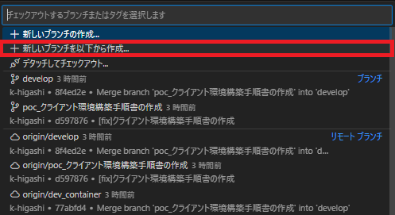  

3. ブランチの作成元で`develop`を選択します。  
  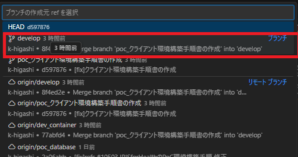  

4. 作成したいブランチ名を入力し、Enterを押下します。  

--- 

### 3. コミット方針

### 3-1.コミットコメントルール
`[操作]refs #チケット番号 概要`  

操作凡例：  
　fix：バグ修正/レビュー指摘対応  
　add：新規（ファイル）機能追加  
　update：機能修正（バグではない）  
　remove：削除（ファイル） 

●例  
[fix]refs #110 削除フラグが更新されない不具合の修正  

### 3-2.コミットの手順は、[4.開発フロー](#4開発フロー)を参照してください。

--- 

### 4. 開発フロー

### 4-1.全メンバー

### 毎朝/MR前の流れ

1. 作業ブランチに切り替え  
  VSCode左下のブランチアイコンを確認します。  
    

2. リモートの全ブランチの情報を取得(フェッチ)  
  リモートサーバー上の全ブランチの最新状況（どのブランチに新しいコミットがあるか）をローカルに通知します。  
  これを最初に行うことで、この後のプルやマージが常に最新の状態で行えるようになります。    
  左メニューでソース管理アイコンを押下します。  
  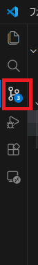  
  左下のフェッチアイコンを押下します。  
  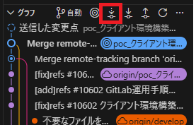    

3. 作業ブランチをプルし、リモートの最新のソースを反映  
  作業中のブランチにおいて、他のメンバーが更新した最新内容を手元のローカル環境に反映します。  
  自身の修正と他者の修正が同じ箇所に及んでいる場合、開発の早い段階で検知し、安全にマージを行うため、こまめに(最低でも日次で)同期することを推奨します。  
  左メニューでソース管理アイコンを押下します。  
    
  左下のプルアイコンを押下します。  
  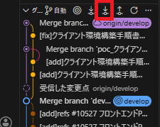  

4. developブランチをマージ  
  共通ブランチである`developブランチ`の最新状態を、自分の作業ブランチへ取り込みます。  
  自身の修正と他者の修正が同じ箇所に及んでいる場合、開発の早い段階で検知し、安全にマージを行うため、こまめに(最低でも日次で)同期することを推奨します。
  `Ctrl+Shif+P`でコマンドパレットを開き、`Git:merge`と入力しマージを押下します。  
  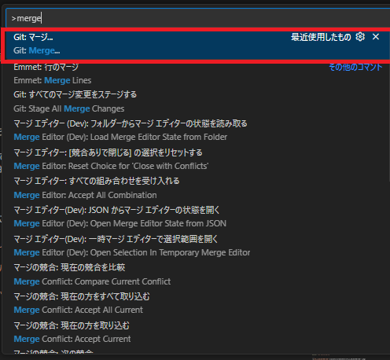  
  マージしたいブランチ`origin/develop`を選択します。  
  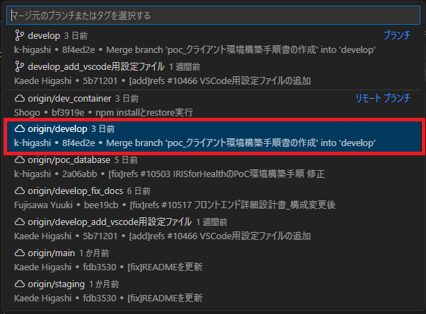  
  ※`develop`はローカルブランチで、`origin/develop`はリモートブランチです。  
  

### 作業の切りが良いタイミングで

1. コミット準備  
  ソースファイルの場合は、エラーが発生しない(ビルドが通る)ことを確認します。  
  現在のブランチが「自分の作業ブランチ」であることを確認します。  

2. コミット対象ファイルをステージングする  
  `ソース管理`タブで、コミットしたいファイルを選択し、`変更をステージ`を選択します。  
  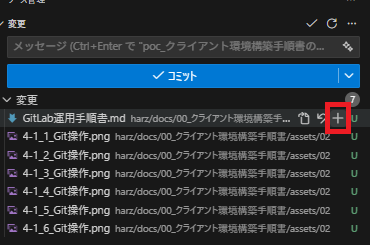  
  まとめてステージしたい場合は、  
  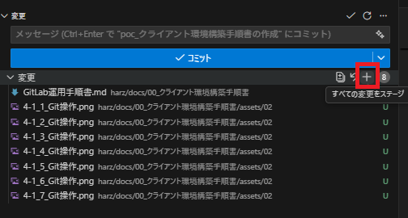  
  
3. コミットコメントを入力し、コミットする　
　コミットコメントは、[コミットコメントルール](#2-2コミットコメントルール)を参照してください。  
  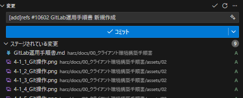  
　
4. リモートへプッシュする  
　上記作業はローカルで実施され、リモート(サーバー側)リポジトリには反映されない。  
　マージリクエスト時やPC故障などのリスクに備え、定期的にリモートへプッシュしてください。  
　※プッシュしたコミットは取り消すことが難しいため注意すること。  
  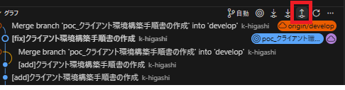  

### タスク完了時

1. ファイルのコミット・プッシュが完了した状態で、GitLabからマージリクエスト(MR)を発行します。  
  左メニューの`マージリクエスト`>`新しいマージリクエスト`を選択します。  
  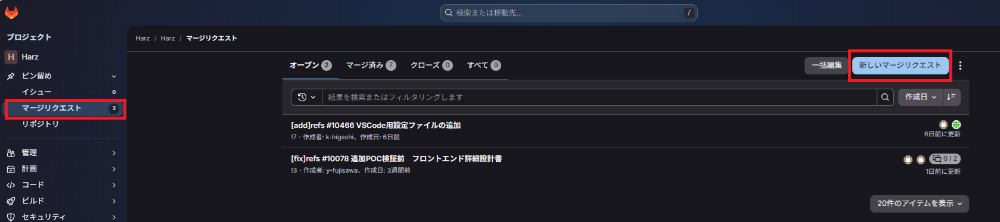  
  ソースブランチとターゲットブランチを選択し、`ブランチを比較して続行する`を選択します。  
  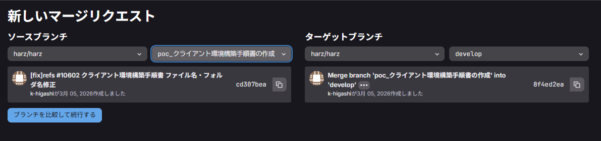  
  タイトル や 説明 をレビュアーにわかりやすいように修正し、担当者、レビュアーを設定し`マージリクエストを作成`を押下します。  
  原則チームリーダーがレビュアーとなりレビューします。  
  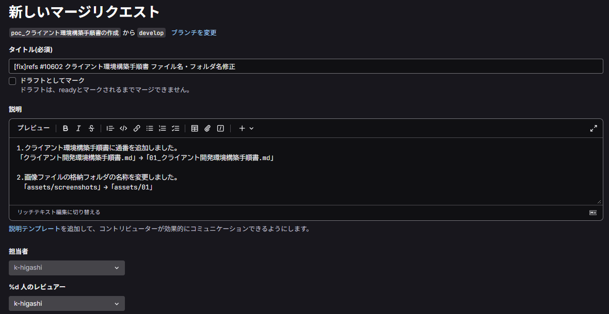  

2. ZOOMでレビュアーへ通知  

3. 修正対応  
　MRで否認(修正依頼)された場合は、内容を修正し再度コミット・プッシュを実施してください。  
　MRは自動的に更新されます。  

### 4-2.レビュアー

- マージリクエスト承認(レビュー)時の流れ  
ブラウザ版GitLabでも、VSCodeでもマージリクエストを確認することができます。  

#### 1. ブラウザ版GitLabでのMR承認時の流れ
http://ccgitlab/harz/harz  
**※ソースコードのマージ時は、必ずビルドエラーが発生しないことを確認してください。**  
1. ブラウザ版GitLabの左メニューから`マージリクエスト`を選択します。  
　　マージリクエストの一覧が確認できます。  

2. 該当のマージリクエストを選択します。  
　　`コミット`タブでコミット履歴が、`変更`タブでソースコードの差分が確認できるので確認します。  

3. `変更`タブを選択し、フィードバックを実施します。  
　　行番号を押下することでコメント(レビュー指摘)を追加できます。  
  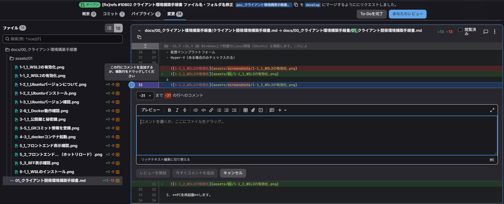  

4. 指摘がなければ「承認」と「マージ」を実行します。  
  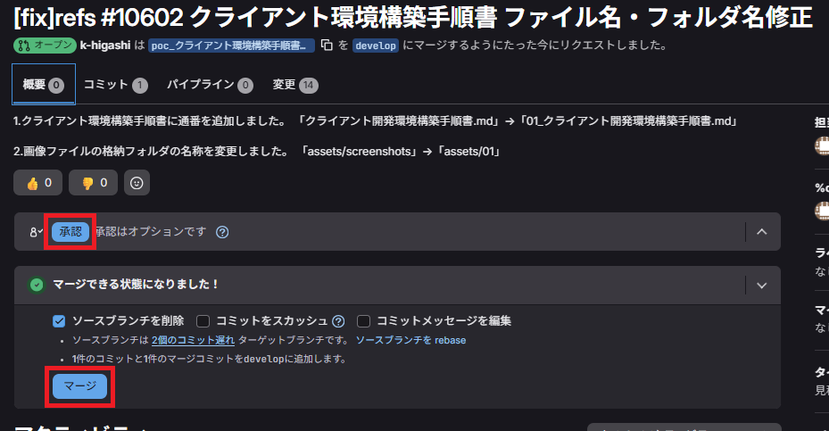  
  試行錯誤のコミット履歴を1つに統合したい(隠したい)場合は、スカッシュコミットを利用してもよいです。  
  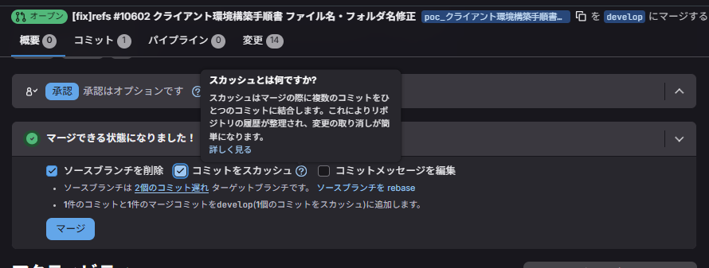  

5. 指摘がある場合は、「マージ」は実施せずにZOOMでレビューイに通知します。  

#### 2. VSCodeでのMR承認時の流れ
1. 事前にVSCodeにGitLab拡張機能をインストールしてください。  
  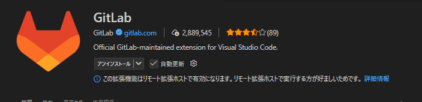  

2. VSCodeGitLabのGitLabアイコン(タヌキ)より、自分宛のマージリクエストが確認できます。  
  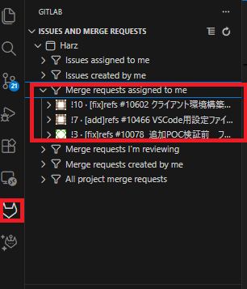  
  ファイルを押下すると差分も確認できます。  
  行番号のあたりを押下すると、コメント(レビュー指摘)を追加できます。  
  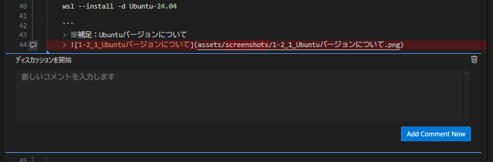  

3. ローカルでの動作確認  
  ソースのMRの場合は、対象の作業ブランチをローカルにチェックアウトしてビルド・実行を行い、ビルドエラーが出ないことを確認してください。  
  対象のMRを右クリック>`Check out Merge Request Branch`でチェックアウトができます。  
  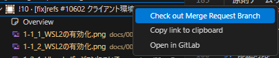  

4. MRの承認は、ブラウザ版GitLabから実施してください。  

--- 

### 5. トラブルシューティング

その他のGit操作を実施したい場合は、基本的には`変更`の横の三点リーダーから実施が可能です。  
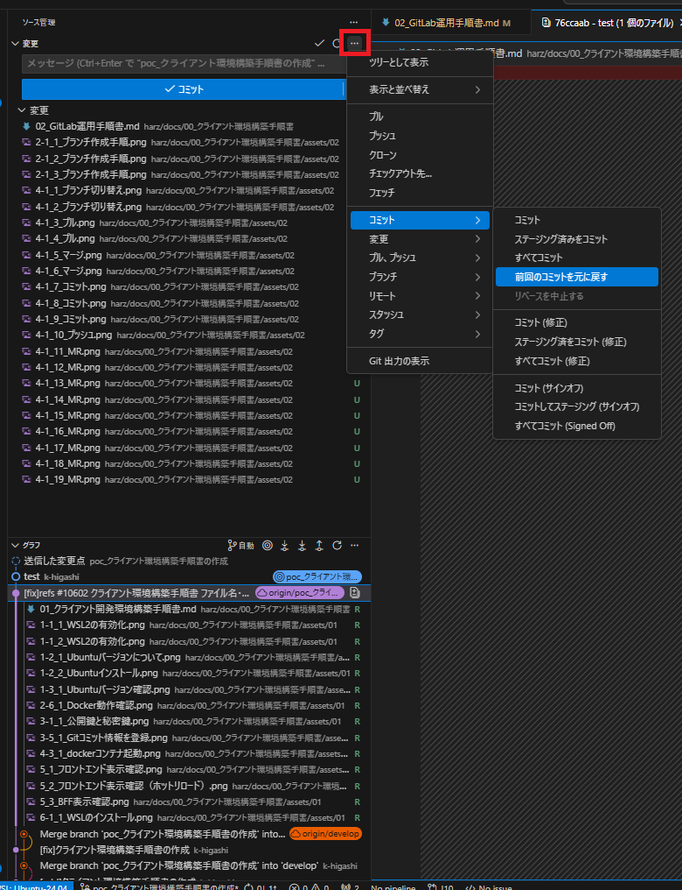  

VSCode用GitLab拡張機能の使い方は、以下の公式ドキュメントを参考にしてください。  
https://docs.gitlab.com/ja-jp/editor_extensions/visual_studio_code/  

### 5-1. コミットの取り消し
誤ったローカルコミットは取り消しが可能ですが、リモートにプッシュ済みのコミットは取り消しができません。  
リモートにプッシュ済みのコミットを修正したい場合は、打ち消しコミット(リバート)を実施してください。  

#### 1.ローカルコミットの取り消し
1. `変更`の横の三点リーダーから、`前回のコミットを元に戻す`を選択します。  

