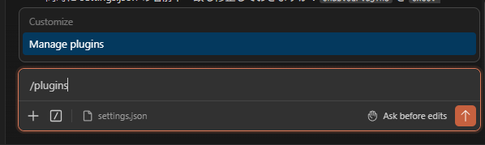
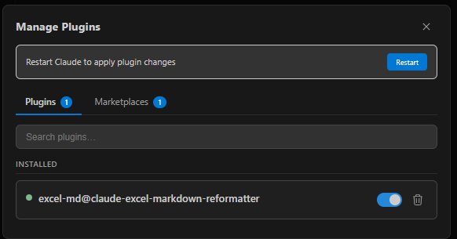
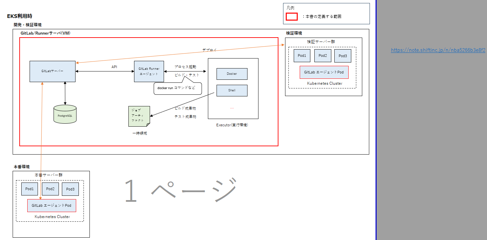
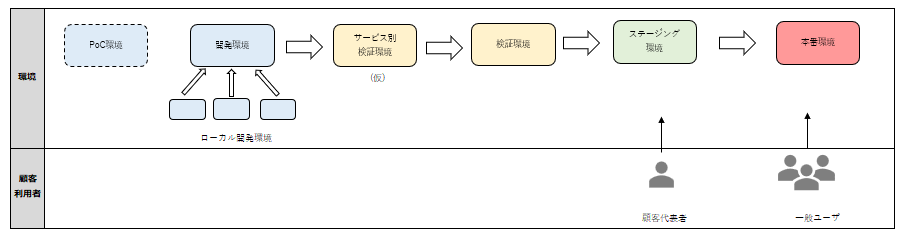
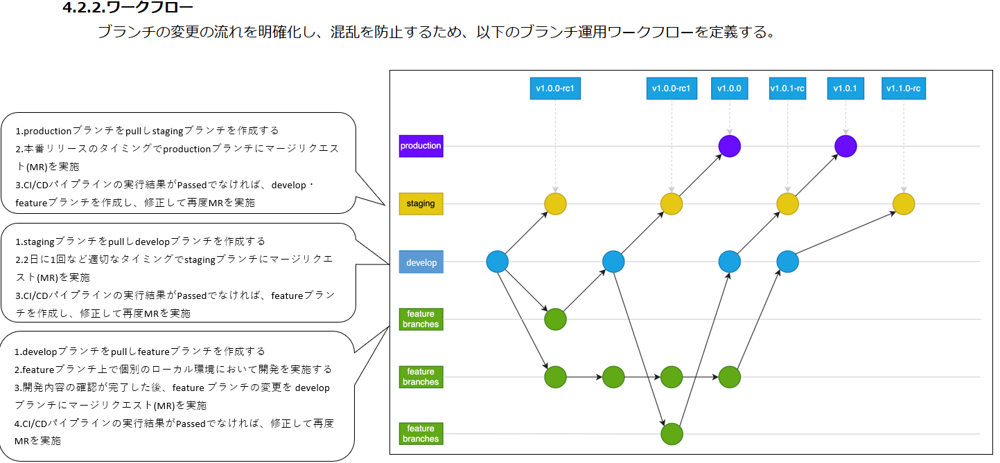

# Excel-Markdown変換手順書  

## 目的  

Excelファイルを Markdown に変換する Claude Code プラグインです。  

Micosoftの提供するpythonの`markitdown`ライブラリで xlsx を Markdown に変換後、  
Claude Code が不要なセル・結合・NaN を整形し、シート単位で出力します。  

**参考リンク**
- [解説記事](https://dev.classmethod.jp/articles/markditdown-claude-code-excel-reformat/)  
- [プラグイン リポジトリ](https://github.com/nyankotaro/claude-excel-markdown-reformatter/tree/main/plugins/excel-md)  

---

## 1. 使えるコマンド  

| コマンド | 内容 |
|---|---|
| `/excel-md:prepare ファイル名.md` | シート構造解析・変換戦略の決定 |
| `/excel-md:transform` | シートごとの Markdown 整形 |
| `/excel-md:merge ファイル名` | 整形済みシートを1ファイルに統合 |
| `/excel-md:convert ファイル名.xlsx` | xlsx → Markdown の全工程を自動実行 ※DevContainer上ではuv環境未構築なため利用不可 |
---

---

## 2. セットアップ  


### 2-1. プラグインのインストール（初回のみ）  

`settings.json` に以下が設定済みです（リポジトリ共通）:  

```json
"extraKnownMarketplaces": {
  "excel-reformatter": {
    "source": {
      "source": "github",
      "repo": "nyankotaro/claude-excel-markdown-reformatter"
    }
  }
},
"enabledPlugins": {
  "excel-md@excel-reformatter": true
}
```

Claude Code で `/plugins` を実行し `excel-md` をインストールしてください。  

  
  
  
  

### 2-2. DevContainer の起動  

`poc/.devcontainer/python` に Python 実行環境を用意しています。  
`markitdown` は起動時に自動インストールされます。  

VSCode で「Reopen in Container」→「**Python**」を選択してください。  

詳細は以下の手順を参考にしてください。  
``` 
01_クライアント開発環境構築手順書.md
## 4 DevContainer 操作マニュアル
```

---

## 3. 実行手順  

1. ターミナルで xlsx → Markdown に変換する  
   ```bash
   markitdown "ファイル名.xlsx" > "ファイル名.md"
   ```

2. Claude Code で整形・統合を実行する  
   ```
   /excel-md:prepare ファイル名.md
   /excel-md:transform
   /excel-md:merge ファイル名
   ```

--- 

## 4. 考慮事項  

Excel上の図形内の文字はマークダウンファイルには反映されないため注意が必要。

例1  
- Excelのとき  
  

- Markdownのとき  
  

例2  
- Exclelのとき  
  

- Mardownのとき  
  

例3  
- Exclelのとき  


- Mardownのとき  
  

