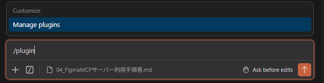
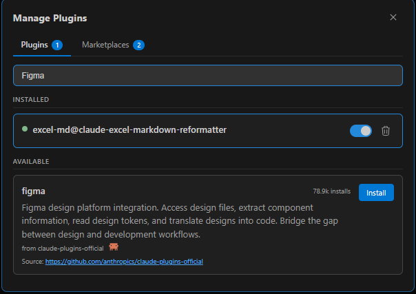
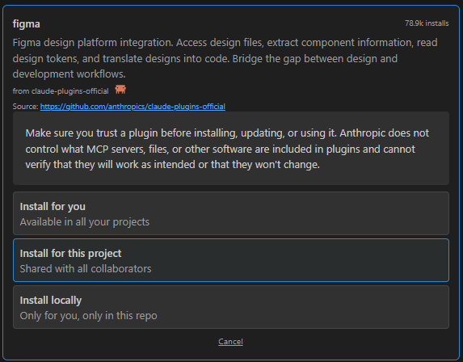
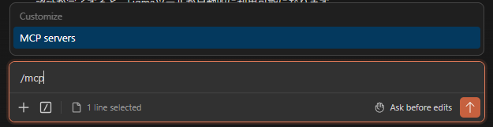
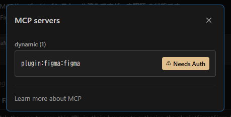
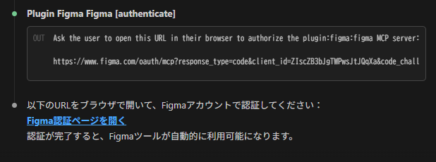
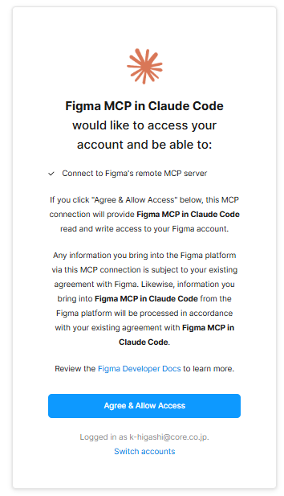
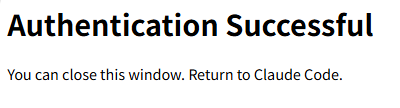
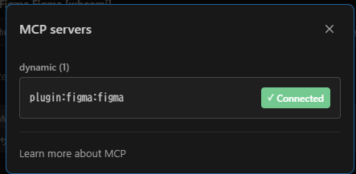

# Figma ClaudeCodeプラグイン利用手順書  

## 目的  

Figma公式のClaude Codeプラグイン（MCP/スキル）を設定し、デザインの意図を高速にコード化する基盤を整えます。  
UI開発における「実装スピードの向上」と「デザイン品質の担保」の両立が目的です。  

---
## 1. スキル  

| スキル | 用途 |
| --- | --- |
| figma:figma-use | 必須前提スキル — use_figma ツール呼び出し前に必ずロード |
| figma:figma-implement-design | Figmaデザインをコードへ変換（UI実装）|
| figma:figma-generate-design | アプリ画面/ページをFigmaデザインへ変換 |
| figma:figma-code-connect | FigmaコンポーネントとコードをCode Connectで紐付け |
| figma:figma-generate-library | コードベースからFigmaにデザインシステムを構築 |
| figma:figma-create-design-system-rules | プロジェクト用デザインシステムルールを生成 |

スキルの詳細・利用方法は、[Figma MCPサーバー 開発者ドキュメント](https://developers.figma.com/docs/figma-mcp-server/) を参照してください。  

---

## 2. セットアップ  

### 2-1. Figmaプラグインのインストール（初回のみ）  

`.calude/settings.json` に以下が設定されていることを確認してください。    

```json
{
  "enabledPlugins": {
    "figma@claude-plugins-official": true
  }
}
```

Claude Code で `/plugins` を実行し `figma` をインストールしてください。  

  
  
  

## 2-2. ClaudeCodeセッションの再起動  

## 2-3. Figma MCPサーバーの認識確認  
Claude Code で `/mcp` を実行し `MCP Servers` を選択してください。  
  

`plugin:figma:figma`が表示されていればFigmaMCPサーバーがClaudeCodeから認識できています。  
※未認証の場合は、`Needs Auth`と表示されています。  
  

## 2-4. Figma MCPサーバーの認証  
1. Claude Codeで`Figma MCPサーバーの認証設定をしたい` と送信  
  

2. `Figma認証ページを開く`のリンクを開いてください。  
   

3. Figma認証ページの下部に表示されているメールアドレスを確認し、問題なければ`Agree & Allow Access`を選択してください。  

4. 認証に成功すれば、以下のような画面が表示されます。  
   

---

## 3. 動作確認  

### 3-1. Figma MCPサーバーへの接続確認  
Claude Code で `/mcp` を実行し `MCP Servers` を選択してください。  
  

`plugin:figma:figma`が`Connected`と表示されていれば接続できています。   
  

※トークン消費を減らすためにも、FigmaMCPサーバー利用時以外は`Disconnected`にしておいてください。  

---

## 関連情報  
### [Figma MCPカタログ | Figma](https://www.figma.com/ja-jp/mcp-catalog/)  
Figma公式のMCPカタログです。Figma用のMCPサーバーが公開されており、VS Codeの拡張機能（Claude Dev / Cline等）からの利用も可能なようです。  

### [Figma MCPサーバーとは？ ゆめみが語る仕組みと活用メリット](https://webdesigning.book.mynavi.jp/article/27907/)   
ゆめみ社による解説記事です。関連書籍の情報もあります。  
Figma MakeのリソースからFigma MCPを介してAIで実装することもできます。  

### [Figma MCPサーバー 開発者ドキュメント](https://developers.figma.com/docs/figma-mcp-server/)  
サーバーを有効にしていれば、以下のことができます:  
Makeリソースの取得:Makeファイルからコードリソースを集め、それをLLMにコンテキストとして提供します。これはプロトタイプから本番アプリケーションへの移行に役立ちます。  

### [Figma MCPサーバー 開発者ドキュメント Make→MCP](https://developers.figma.com/docs/figma-mcp-server/bringing-make-context-to-your-agent/)  
Make + MCPの統合により、プロトタイプを設計から生産まで進めるのが容易になります。MakeプロジェクトをMCPを通じて直接エージェントに接続することで、リソースを抽出してコードベース内で再利用できます。これにより、試作品を実際の応用に拡張する際の摩擦が減少し、設計意図が実装に忠実に反映されることを保証します。  

### [Figma MCPサーバー GitLab](https://github.com/figma/mcp-server-guide?tab=readme-ov-file#bringing-make-context-to-your-agent)  
Claude CodeでFigma MCPサーバーを設定する推奨方法は、Figmaプラグインをインストールすることです。これにはMCPサーバー設定や一般的なワークフロー向けのエージェントスキルが含まれています。  
