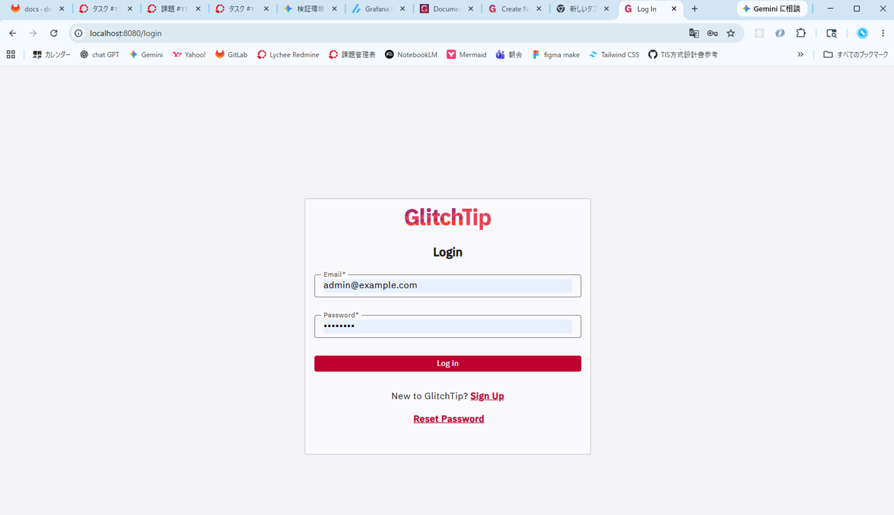
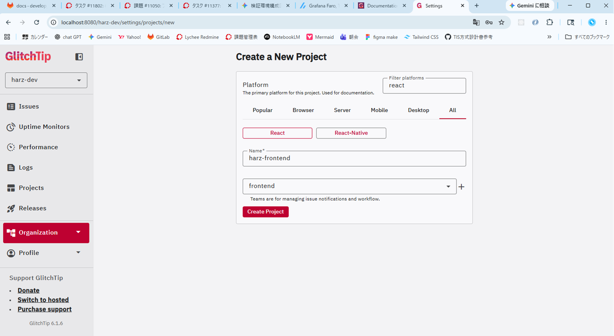
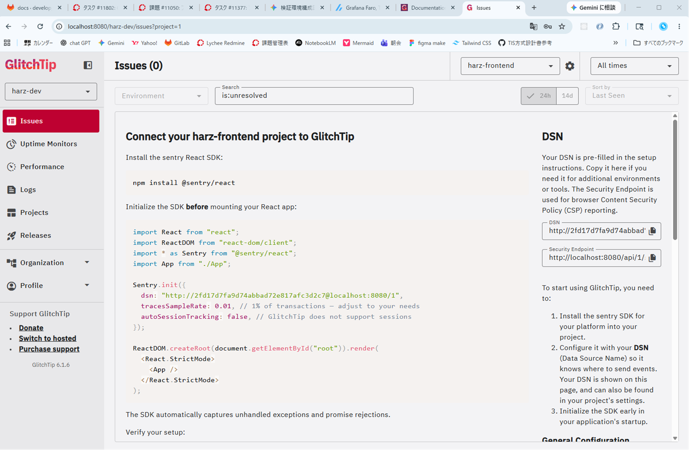
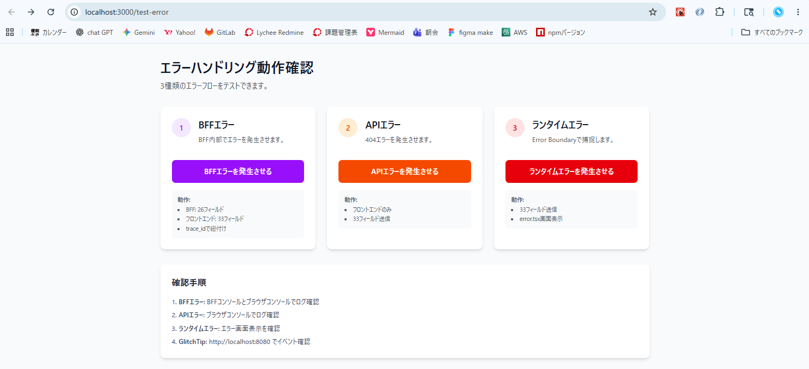
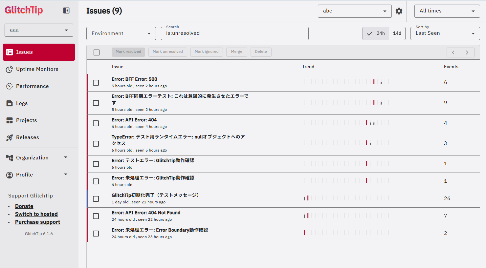
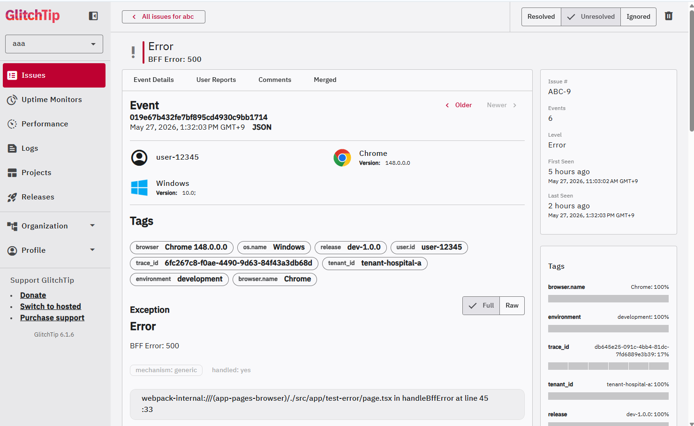

# GlitchTip（エラー監視ツール） セットアップ手順書

## 概要

本書は、フロントエンド（Next.js）とBFF（NestJS）のエラーをGlitchTip（Sentry互換OSS）で監視するためのセットアップ手順を記載します。

---

## 初回セットアップ手順

### ステップ0: 環境変数ファイル（フロントエンド、BFF）を配置（既に存在する場合は不要）
docker compose up 時に環境設定ファイルを参照するため、最初に配置しておく必要がある
中身については、後述の手順で記載する

フロントエンド：`product/frontend/.env.local`
BFF：`product/bff/.env.local`

### ステップ1: コンテナ起動

```bash
// productディレクトリ上
docker compose up -d
```
※必要なデータベースの情報が整っていないためエラーが吐き出される
→ステップ2で解消する

GlitchTipで使用するサービス：
- `glitchtip-db`（PostgreSQL 16）
- `glitchtip-redis`（Redis 7）
- `glitchtip`（GlitchTip Web）
- `glitchtip-worker`（非同期処理）

---

### ステップ2: データベースマイグレーション（初回のみ）
データベースのテーブル構造を作成するために必要
→必要な100以上のテーブルが作成される

```bash
docker compose exec glitchtip ./manage.py migrate
```

**期待結果**: 100以上のマイグレーションが実行され、すべて成功する

---

### ステップ3: スーパーユーザー作成（初回のみ）

GlitchTip管理画面ログイン用のユーザーを作成

```bash
docker compose exec glitchtip ./manage.py shell -c "from apps.users.models import User; user = User.objects.create_superuser('admin@example.com', 'admin123'); print('Superuser created:', user.email)"
```

**出力例**:
```
Superuser created: admin@example.com
```

---

### ステップ4: GlitchTip管理画面にログイン

1. ブラウザで http://localhost:8080 を開く
2. 「ステップ3」で作成した、以下の情報でログイン：
   - **メールアドレス**: `admin@example.com`
   - **パスワード**: `admin123`

      

---

### ステップ5: プロジェクト作成とDSN取得

現時点ではローカル環境に作成するプロジェクトのためプロジェクト名称などは任意で問題ない
今後エラー監視ツールを共有サーバー上に配置する場合にはチームで決めて決まったメンバーが揃える必要がある

1. ログイン後、画面右上の「Create Organization」をクリックし、Organization名を入力（例: `harz-dev`）
2. 「Create Project」をクリックし、プロジェクト作成時に必要な情報を入力（Platformは`react`、teamは任意で新規作成、プロジェクト名は任意）
3. **「Create Project」** をクリック
4. プロジェクト設定画面に表示される **DSN** をコピーしメモしておく
   - 例: `http://268f007e41f54acd91cbbf80b7e38b31@localhost:8080/1`

        
↓  
      

---

### ステップ6: 環境変数の設定

#### 6-1. フロントエンド用環境変数（`product/frontend/.env.local`）

```bash
# GlitchTip Configuration（フロントエンド）

# フロントエンド用DSN（ブラウザから送信）
NEXT_PUBLIC_SENTRY_DSN=http://268f007e41f54acd91cbbf80b7e38b31@localhost:8080/1
NEXT_PUBLIC_ENVIRONMENT=development
```

**⚠️ 重要**: 
- `YOUR_PROJECT_KEY` と `YOUR_PROJECT_ID` を手順5で取得したDSNの値に置き換えてください
- `NEXT_PUBLIC_` プレフィックスが必要です（ブラウザからアクセスするため）

#### 6-2. BFF用環境変数（`product/bff/.env.local`）

```bash
# GlitchTip Configuration（BFF）

# BFF用DSN（Dockerコンテナ間通信）
# 注意: localhost ではなく glitchtip サービス名を使用
SENTRY_DSN=http://268f007e41f54acd91cbbf80b7e38b31@glitchtip:8000/1
NODE_ENV=development
```

**⚠️ 重要**: 
- BFFはDockerコンテナ内から送信するため、`localhost:8080` ではなく `glitchtip:8000` を使用
- ポート番号も `8080` → `8000` に変更（コンテナ内部ポート）

---

### ステップ7: コンテナの再起動

環境変数を反映させるため、フロントエンドとBFFを再起動します：

```bash
docker compose restart frontend bff
```

---

## 動作確認

### エラーテスト画面を開く

1. ブラウザで http://localhost:3000/test-error を開く
2. 3種類のエラーフローをテストできる画面が表示される

### テスト可能なエラー種別

画面上で以下の3種類のエラーをテストできます：

1. **BFFエラー**（紫色のカード）
   - BFF内部でエラーを発生させる
   - BFF: 24フィールド、フロントエンド: 34フィールド送信
   - trace_idでフロントエンド・BFFのエラーを紐付け

2. **APIエラー**（オレンジ色のカード）
   - 存在しないエンドポイントへのリクエストで404エラー
   - フロントエンドのみ: 34フィールド送信

3. **ランタイムエラー**（赤色のカード）
   - Error Boundaryで捕捉されるランタイムエラー
   - 34フィールド送信、error.tsx画面表示

      
↓  
      
↓  
      


### 確認手順

各ボタンをクリック後、以下を確認：

1. **ブラウザコンソール**: 送信フィールドの詳細ログが出力される
2. **BFFターミナル**: BFFエラーの場合、送信フィールドの詳細ログが出力される
3. **GlitchTip管理画面**（http://localhost:8080）: 
   - Issues タブでエラーイベントを確認
   - エラー詳細画面で監査情報（tenant_id、user_id、trace_id）を確認


---

## マルチテナント運用

### テナントIDの設定方法

#### フロントエンド
`SentryInitializer.tsx`内で`Sentry.setTag('tenant_id', tenantId)`を実行：

```typescript
useEffect(() => {
  const tenantId = 'tenant-hospital-a'; // 実際はログイン情報から取得
  Sentry.setTag('tenant_id', tenantId);
}, []);
```

#### BFF
`index.ts`でリクエストヘッダー`x-tenant-id`からテナントIDを取得し、自動でタグ設定：

```typescript
app.use((req: any, res: any, next: any) => {
  const tenantId = req.headers['x-tenant-id'];
  if (tenantId) {
    Sentry.setTag('tenant_id', tenantId as string);
  }
  next();
});
```

### GlitchTip管理画面でのフィルタリング

1. 「Issues」タブを開く
2. 検索ボックスに `tenant_id:tenant-hospital-a` と入力
3. 特定テナントのエラーのみが表示される

---

## 参考資料

- **GlitchTip公式ドキュメント**: https://glitchtip.com/documentation
- **Sentry SDK (JavaScript)**: https://docs.sentry.io/platforms/javascript/
- **Sentry SDK (Node.js)**: https://docs.sentry.io/platforms/node/
- **詳細設計書**: `docs/02_アプリ基盤/01_フロントエンド/02_詳細設計書/09.監視・エラーハンドリング.md`
- **詳細設計書**: `docs/02_アプリ基盤/05_システム監視・通知サービス/02_詳細設計書/01_エラー監視ツール_GlitchTip設計.md`