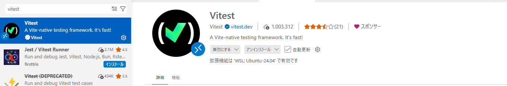

# テスト環境セットアップ（WSL）

> 最終更新: 2026-05-11

---

## 1. GitLab Runner セットアップ（WSL）

### 1.1 前提条件

- WSL2（Ubuntu 22.04 推奨）が起動していること
- Docker Desktop for Windows がインストールされていること（WSL2 バックエンド有効）
- GitLab プロジェクトへの Maintainer 権限があること

### 1.2 GitLab Runner のインストール

```bash
# GPG キーを追加
curl -L "https://packages.gitlab.com/install/repositories/runner/gitlab-runner/script.deb.sh" | sudo bash

# インストール
sudo apt-get install gitlab-runner

# バージョン確認
gitlab-runner --version
```

### 1.3 Runner の登録

GitLab プロジェクトの `Settings > CI/CD > Runners` に登録されているprojectrunnerをローカルランナーと紐づけます。
(assets/gitlab-runner.png)

WSLを開発者権限で開き以下のコマンドを入力し実行します。
```
sudo gitlab-runner register \
  --url "http://ccgitlab" \
  --token "glrt-uWQiARhWEbotraN09kDGP286MQpwOnMKdDozCnU6MnIQ.01.180fo1l9p" \
  --executor "docker" \
  --description "harzプロジェクトのCI/CDランナー" \
  --docker-image "node:20" \
  --tag-list "harz"
```

プロンプトに従って以下を入力します。

| 項目 | 値 |
|---|---|
| GitLab instance URL | `http://ccgitlab` |

`/etc/gitlab-runner/config.toml` が作成されれば完了です。

sudo cat /etc/gitlab-runner/config.toml
 
を実行すると登録情報が確認できます。


### 1.4 Runner の起動・確認

```bash
# サービスとして起動
sudo gitlab-runner start

# 状態確認
sudo gitlab-runner status

# ログ確認
sudo gitlab-runner --debug run
```

### 1.5 WSL 固有の注意事項

- WSL2 再起動時に Runner が停止することがあります。再起動後は `sudo gitlab-runner start` を実行してください。
- `config.toml` は `/etc/gitlab-runner/config.toml` に生成されます。
- Windows 側のファイルパスを Runner に渡す場合は `/mnt/c/...` 形式で指定します。

---

## 2. VS Code 拡張機能 Vitest のインストール

### 2.1 拡張機能のインストール

1. VS Code を開く
2. 左サイドバーの **Extensions**（`Ctrl+Shift+X`）をクリック
3. 検索バーに `Vitest` と入力
4. **Vitest** (発行者: `vitest.explorer`) を選択してインストール



### 2.2 プロジェクトへの適用

本プロジェクトのフロントエンドは `product/frontend/vitest.config.ts` で設定済みです。
拡張機能インストール後、VS Code のテストエクスプローラーに自動的にテストケースが表示されます。

### 2.3 テストの実行方法

**コマンドラインから実行**

```bash
cd product/frontend

# 全テスト実行
pnpm test

# UI モードで実行（ブラウザで結果確認）
pnpm test:ui

# ウォッチモード（ファイル変更を検知して自動実行）
pnpm test:watch
```

**テストエクスプローラーから実行**

1. VS Code 左サイドバーの **Testing** アイコン（フラスコ型）をクリック
2. テストツリーからファイル・テストケースを選択
3. 再生ボタン（▷）または右クリック → **Run Test** を選択


### 2.4 カバレッジの確認

```bash
cd product/frontend

# カバレッジレポートを生成
pnpm test --coverage

# HTML レポートを開く（WSL の場合）
explorer.exe coverage/index.html
```

カバレッジ閾値（`vitest.config.ts` で設定）:

| 指標 | 閾値 |
|---|---|
| Statements (C0) | 80% |
| Branches (C1) | 70% |
| Functions (C2) | 80% |
| Lines | 80% |

---

## 3. 関連ドキュメント

- `product/frontend/vitest.config.ts` — Vitest 設定
- `docs/02_アプリ基盤/04_開発・テスト基盤/` — テスト基盤設計書
