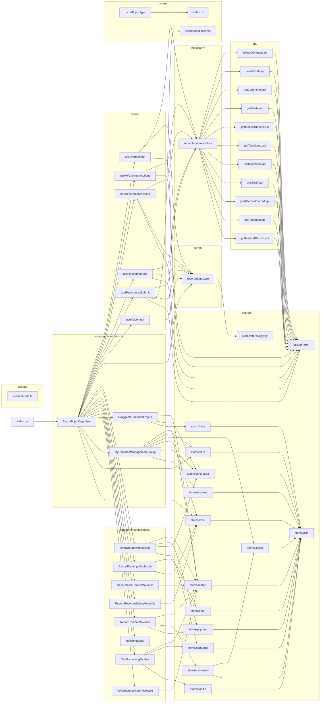

# REC001 ファイル依存グラフ（Mermaid）

> 元ファイル: `REC001-graph.dot` / `REC001-graphM.png`

```mermaid
graph LR
  subgraph api["api/"]
    deleteComment["deleteComment.api"]
    deleteDraft["deleteDraft.api"]
    getComments["getComments.api"]
    getDrafts["getDrafts.api"]
    getMedicalRecord["getMedicalRecord.api"]
    getTemplates["getTemplates.api"]
    postComment["postComment.api"]
    postDraft["postDraft.api"]
    postMedicalRecord["postMedicalRecord.api"]
    putComment["putComment.api"]
    putMedicalRecord["putMedicalRecord.api"]
  end

  subgraph assets["assets/"]
    medicalData["medical-data.ts"]
  end

  subgraph molecules["components/molecules/"]
    DraftDropdown["DraftDropdownMolecule"]
    RecordDateInput["RecordDateInputMolecule"]
    RecordInputHeader["RecordInputHeaderMolecule"]
    RecordRecorderSelect["RecordRecorderSelectMolecule"]
    RecordToolbar["RecordToolbarMolecule"]
    RichTextEditor["RichTextEditor"]
    TextFormattingToolbar["TextFormattingToolbar"]
    VoiceInputIndicator["VoiceInputIndicatorMolecule"]
  end

  subgraph organisms["components/organisms/"]
    DraggableCommentPopup["DraggableCommentPopup"]
    MyCommentManagementDialog["MyCommentManagementDialog"]
    RecordInputOrganism["RecordInputOrganism"]
  end

  subgraph hooks["hooks/"]
    useDraftActions["useDraftActions"]
    useMyCommentActions["useMyCommentActions"]
    useRecordInputActions["useRecordInputActions"]
    useRecordInputInit["useRecordInputInit"]
    useRecordInputSubmit["useRecordInputSubmit"]
    useVoiceInput["useVoiceInput"]
  end

  subgraph types["types/"]
    typesIndex["index.ts"]
    recordInputSchema["recordInput.schema"]
    recordInputType["recordInput.type"]
  end

  subgraph stores["stores/"]
    recordInputStore["recordInput.store"]
  end

  subgraph repository["repository/"]
    repo["recordInput.repository"]
  end

  subgraph shared["shared/"]
    button["atoms/button"]
    card["atoms/card"]
    command["atoms/command"]
    dialog["atoms/dialog"]
    input["atoms/input"]
    label["atoms/label"]
    popover["atoms/popover"]
    scrollArea["atoms/scroll-area"]
    separator["atoms/separator"]
    tabs["atoms/tabs"]
    textarea["atoms/textarea"]
    tooltip["atoms/tooltip"]
    utils["atoms/utils"]
    storeRegistry["stores/storeRegistry"]
    bffError["utils/bff-error"]
  end

  index["index.tsx"]

  %% エントリポイント
  index --> RecordInputOrganism

  %% Organism
  RecordInputOrganism --> useDraftActions
  RecordInputOrganism --> useMyCommentActions
  RecordInputOrganism --> useRecordInputActions
  RecordInputOrganism --> useRecordInputInit
  RecordInputOrganism --> useRecordInputSubmit
  RecordInputOrganism --> useVoiceInput
  RecordInputOrganism --> recordInputStore
  RecordInputOrganism --> DraftDropdown
  RecordInputOrganism --> RecordDateInput
  RecordInputOrganism --> RecordInputHeader
  RecordInputOrganism --> RecordRecorderSelect
  RecordInputOrganism --> RecordToolbar
  RecordInputOrganism --> RichTextEditor
  RecordInputOrganism --> TextFormattingToolbar
  RecordInputOrganism --> VoiceInputIndicator
  RecordInputOrganism --> DraggableCommentPopup
  RecordInputOrganism --> MyCommentManagementDialog
  RecordInputOrganism --> card
  RecordInputOrganism --> label

  %% Molecules
  DraftDropdown --> button
  DraftDropdown --> popover
  DraftDropdown --> scrollArea
  DraftDropdown --> separator
  RecordDateInput --> input
  RecordDateInput --> label
  RecordInputHeader --> button
  RecordRecorderSelect --> label
  RecordToolbar --> button
  RecordToolbar --> command
  RecordToolbar --> popover
  TextFormattingToolbar --> button
  TextFormattingToolbar --> separator
  TextFormattingToolbar --> tooltip
  VoiceInputIndicator --> button

  %% Organisms (sub)
  DraggableCommentPopup --> button
  DraggableCommentPopup --> scrollArea
  DraggableCommentPopup --> tabs
  MyCommentManagementDialog --> button
  MyCommentManagementDialog --> card
  MyCommentManagementDialog --> dialog
  MyCommentManagementDialog --> label
  MyCommentManagementDialog --> scrollArea
  MyCommentManagementDialog --> textarea

  %% Hooks
  useDraftActions --> repo
  useDraftActions --> recordInputStore
  useDraftActions --> bffError
  useMyCommentActions --> repo
  useMyCommentActions --> bffError
  useRecordInputActions --> repo
  useRecordInputActions --> recordInputStore
  useRecordInputActions --> bffError
  useRecordInputInit --> repo
  useRecordInputInit --> recordInputStore
  useRecordInputInit --> bffError
  useRecordInputSubmit --> repo
  useRecordInputSubmit --> recordInputStore
  useRecordInputSubmit --> recordInputSchema
  useRecordInputSubmit --> bffError
  useVoiceInput --> recordInputStore

  %% Store
  recordInputStore --> storeRegistry

  %% Repository
  repo --> deleteComment
  repo --> deleteDraft
  repo --> getComments
  repo --> getDrafts
  repo --> getMedicalRecord
  repo --> getTemplates
  repo --> postComment
  repo --> postDraft
  repo --> postMedicalRecord
  repo --> putComment
  repo --> putMedicalRecord

  %% API → bff-error
  deleteComment --> bffError
  deleteDraft --> bffError
  getComments --> bffError
  getDrafts --> bffError
  getMedicalRecord --> bffError
  getTemplates --> bffError
  postComment --> bffError
  postDraft --> bffError
  postMedicalRecord --> bffError
  putComment --> bffError
  putMedicalRecord --> bffError

  %% Types
  recordInputType --> typesIndex

  %% Shared atoms → utils
  button --> utils
  card --> utils
  command --> dialog
  command --> utils
  dialog --> utils
  input --> utils
  label --> utils
  popover --> utils
  scrollArea --> utils
  separator --> utils
  tabs --> utils
  textarea --> utils
  tooltip --> utils
```
