# REC001 画面遷移図

URL: `/01/01/01/REC001`
機能: 診察記録入力（カルテ画面）

---

## 画面遷移図

```mermaid
flowchart TD
    HOME["/ ホーム（Harz Menu）"] -->|"Link: /01/01/01/REC001"| REC001

    subgraph REC001["REC001: 診察記録入力画面"]
        direction TB

        subgraph LAYOUT["レイアウト構成"]
            LEFT["LeftSideMenu\n左サイドメニュー"]
            MAIN["メインコンテンツ\n（view別切り替え）"]
            RIGHT["RightSideMenu\n右サイドメニュー"]
        end

        subgraph CHART_VIEW["カルテView（currentView = 'chart'）"]
            GLOBAL_HEADER["GlobalHeader\n- ユーザー情報・時刻\n- 通知ベル\n- 設定パネル\n- 自動ログアウト制御"]
            PATIENT_HEADER["PatientHeader\n- 患者情報\n- 処方箋ステータスバッジ\n- 医療情報共有バッジ"]
            TABS["MainContentTabs（3タブ）"]
        end

        subgraph ORDER_VIEW["オーダーView（currentView ≠ 'chart'）"]
            ORD001_WRAPPER["ORD001Wrapper\n- ORD001埋め込み（dynamic import）\n- ETC004埋め込み（dynamic import）"]
        end
    end

    subgraph DIALOGS["ダイアログ（REC001上にオーバーレイ）"]
        DLG_EXT["ExternalMedicalRecordsDialog\n他院診療情報"]
        DLG_HEALTH["HealthCheckupDialog\n健診情報"]
        DLG_SET["SetManagementDashboard\nセット管理"]
        DLG_MED["DraggableMedicationDialog\n薬歴（ドラッグ可能）"]
        DLG_PATIENT_LIST["PatientListOverlay\n患者一覧"]
        DLG_PATIENT_DETAIL["PatientDetailDialog\n患者詳細"]
        DLG_DIAGNOSIS["DiagnosisRegistrationDialog\n病名登録"]
        DLG_MED_HIST["MedicationHistoryDialog\n薬歴"]
        DLG_IMAGE["ImageViewerDialog\n画像ビューワ"]
        DLG_TEST["TestResultsDialog\n検査結果"]
        DLG_PATIENT_SEARCH["PatientSearchDialog\n患者検索"]
        DLG_PRESC_SETTINGS["PrescriptionSettingsDialog\n処方箋設定"]
        DLG_MED_INFO["MedicalInfoSharingDialog\n医療情報共有設定"]
    end

    subgraph EMBEDDED["埋め込み遷移（ORD001Wrapper経由）"]
        ORD001["ORD001\n処方オーダー画面\n（/05/01/01/ORD001）"]
        ETC004["ETC004\nカルテ画面左サイドメニュー\n（/17/01/01/ETC004）"]
    end

    %% 左メニューによるView切り替え（ページ遷移なし・state変更）
    LEFT -->|"カルテ"| CHART_VIEW
    LEFT -->|"オーダー/処方/注射/検体/処置/etc."| ORDER_VIEW
    LEFT -->|"検査結果"| ORDER_VIEW
    LEFT -->|"他院情報/他科依頼/患者情報/文書/予約"| ORDER_VIEW

    %% ORD001Wrapperの埋め込み切り替え
    ORD001_WRAPPER -->|"isOrderView=true"| ETC004
    ORD001_WRAPPER -->|"isOrderView=false"| ORD001

    %% PatientHeaderからのダイアログ起動
    PATIENT_HEADER -->|"病名登録"| DLG_DIAGNOSIS
    PATIENT_HEADER -->|"薬歴"| DLG_MED_HIST
    PATIENT_HEADER -->|"検査結果"| DLG_TEST
    PATIENT_HEADER -->|"患者検索"| DLG_PATIENT_SEARCH
    PATIENT_HEADER -->|"患者詳細"| DLG_PATIENT_DETAIL
    PATIENT_HEADER -->|"処方箋設定"| DLG_PRESC_SETTINGS
    PATIENT_HEADER -->|"医療情報共有"| DLG_MED_INFO

    %% MainContentTabsからのダイアログ起動
    TABS -->|"他院情報参照"| DLG_EXT
    TABS -->|"健診情報参照"| DLG_HEALTH
    TABS -->|"セット管理"| DLG_SET
    TABS -->|"薬歴参照"| DLG_MED

    %% 右メニューからの患者一覧
    RIGHT -->|"患者一覧"| DLG_PATIENT_LIST

    %% 自動ログアウト
    GLOBAL_HEADER -->|"ログアウト（自動/手動）\nwindow.location.reload()"| REC001_RELOAD["REC001（リロード）"]
```

---

## ビュー切り替え一覧（左メニュー）

左サイドメニューの選択で `currentView` state が変化し、**ページ遷移なし**でコンテンツが切り替わる。

| currentView | 表示コンポーネント | 説明 |
|---|---|---|
| `chart` | GlobalHeader + PatientHeader + MainContentTabs | カルテ入力メイン画面 |
| `prescription` | ORD001Wrapper → ETC004 | 処方オーダー |
| `injection` | ORD001Wrapper → ETC004 | 注射オーダー |
| `lab` | ORD001Wrapper → ETC004 | 検体オーダー |
| `treatment` | ORD001Wrapper → ETC004 | 処置オーダー |
| `guidance` | ORD001Wrapper → ETC004 | 指導オーダー |
| `physiology` | ORD001Wrapper → ETC004 | 生理検査オーダー |
| `endoscopy` | ORD001Wrapper → ETC004 | 内視鏡検査オーダー |
| `imaging` | ORD001Wrapper → ETC004 | 画像検査オーダー |
| `pathology` | ORD001Wrapper → ETC004 | 病理検査オーダー |
| `bacteriology` | ORD001Wrapper → ETC004 | 細菌検査オーダー |
| `general` | ORD001Wrapper → ETC004 | 汎用オーダー |
| `composite` | ORD001Wrapper → ETC004 | 複合オーダー |
| `meal` | ORD001Wrapper → ETC004 | 食事オーダー |
| `rehabilitation` | ORD001Wrapper → ETC004 | リハビリオーダー |
| `transfusion` | ORD001Wrapper → ETC004 | 輸血オーダー |
| `surgery` | ORD001Wrapper → ETC004 | 手術オーダー |
| `dialysis` | ORD001Wrapper → ETC004 | 透析オーダー |
| `admission` | ORD001Wrapper → ETC004 | 入院オーダー |
| `discharge` | ORD001Wrapper → ETC004 | 退院オーダー |
| `transfer` | ORD001Wrapper → ETC004 | 転棟転科転室オーダー |
| `nursingCare` | ORD001Wrapper → ETC004 | 看護ケアオーダー |
| `results` | ORD001Wrapper → ORD001 | 検査結果（ORD001のGlobalMenuで切替） |
| `external-info` | ORD001Wrapper → ORD001 | 他院情報（同上） |
| `consultation` | ORD001Wrapper → ORD001 | 他科依頼（同上） |
| `patient` | ORD001Wrapper → ORD001 | 患者情報（同上） |
| `document` | ORD001Wrapper → ORD001 | 文書管理（同上） |
| `appointment` | ORD001Wrapper → ORD001 | 予約管理（同上） |

---

## MainContentTabsの3タブ構成

| タブID | タブ名 | 主なコンポーネント |
|---|---|---|
| `records` | 診療記録 | MedicalRecordInput（記録入力）、過去記録一覧（実装予定）、カレンダー（実装予定）、記録詳細パネル（実装予定）、オーダー入力枠（実装予定） |
| `overview` | 診察オーバービュー | OverviewMatrix |
| `stats` | バイタル・検査グラフ | StatsDashboard |

---

## 依存する外部コンポーネント（埋め込み・dynamic import）

| コンポーネント | パス | 依存方法 |
|---|---|---|
| ORD001 | `features/05_ordering/01_prescription-order/01_order-setting/ORD001/ORD001.tsx` | dynamic import（SSR無効） |
| ETC004 | `features/16_menu-header/01_menu-header/01_left-sidemenu/ETC004` | dynamic import（SSR無効） |

---

## 依存するダイアログコンポーネント（REC001内）

| コンポーネント | 起動元 | トリガー |
|---|---|---|
| ExternalMedicalRecordsDialog | MainContentTabs / PatientHeader | 他院診療情報参照ボタン |
| HealthCheckupDialog | MainContentTabs / PatientHeader | 健診情報参照ボタン |
| SetManagementDashboard | PatientHeader / MainContentTabs | セット管理ボタン |
| DraggableMedicationDialog | PatientHeader / MainContentTabs | 薬歴参照ボタン |
| PatientListOverlay | RightSideMenu | 患者一覧ボタン |
| PatientDetailDialog | PatientHeader | 患者詳細リンク |
| DiagnosisRegistrationDialog | PatientHeader | 病名登録ボタン |
| MedicationHistoryDialog | PatientHeader | 薬歴ボタン |
| ImageViewerDialog | PatientHeader | 画像参照ボタン |
| TestResultsDialog | PatientHeader | 検査結果ボタン |
| PatientSearchDialog | PatientHeader | 患者検索ボタン |
| PrescriptionSettingsDialog | PatientHeader | 処方箋ステータスバッジ |
| MedicalInfoSharingDialog | PatientHeader | 医療情報共有バッジ |

---

## 備考

- **ページ遷移は基本なし**: REC001は SPA 構成で、左メニューの切り替えはすべて `currentView` state の変更によるコンポーネント差し替え。URLは変わらない。
- **ORD001埋め込み**: オーダー系ビューでは ORD001 または ETC004 を dynamic import で埋め込み、GlobalMenu・SystemMenu を CSS で非表示にして統合。
- **ログアウト**: 自動/手動ログアウト時は `window.location.reload()` でページをリロード（認証基盤未実装のため仮実装）。
- **患者切り替え**: PatientHeader の患者検索ダイアログから患者IDを指定して `changePatient()` を呼び出す。ページ遷移なし。
