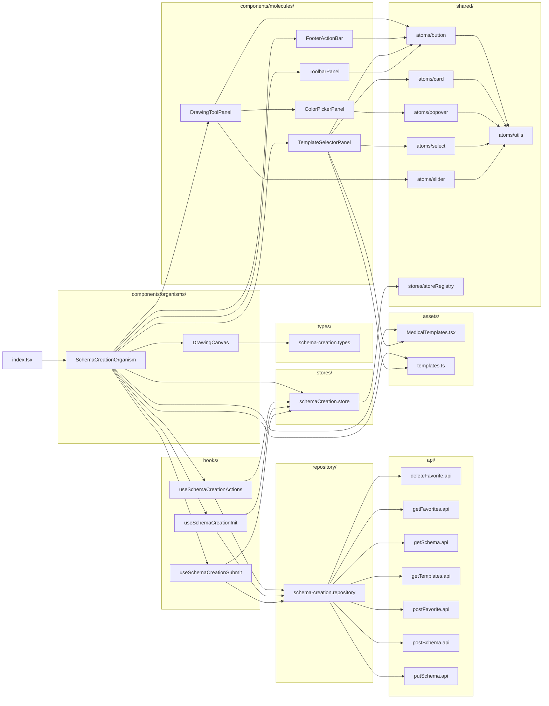

# REC002 ファイル依存グラフ（Mermaid）

> 元ファイル: `REC002-graph.dot` / `REC002-graph.png`

```mermaid
graph LR
  subgraph api["api/"]
    deleteFavorite["deleteFavorite.api"]
    getFavorites["getFavorites.api"]
    getSchema["getSchema.api"]
    getTemplates["getTemplates.api"]
    postFavorite["postFavorite.api"]
    postSchema["postSchema.api"]
    putSchema["putSchema.api"]
  end

  subgraph assets["assets/"]
    MedicalTemplates["MedicalTemplates.tsx"]
    templates["templates.ts"]
  end

  subgraph molecules["components/molecules/"]
    ColorPickerPanel["ColorPickerPanel"]
    DrawingToolPanel["DrawingToolPanel"]
    FooterActionBar["FooterActionBar"]
    TemplateSelectorPanel["TemplateSelectorPanel"]
    ToolbarPanel["ToolbarPanel"]
  end

  subgraph organisms["components/organisms/"]
    DrawingCanvas["DrawingCanvas"]
    SchemaCreationOrganism["SchemaCreationOrganism"]
  end

  subgraph hooks["hooks/"]
    useSchemaCreationActions["useSchemaCreationActions"]
    useSchemaCreationInit["useSchemaCreationInit"]
    useSchemaCreationSubmit["useSchemaCreationSubmit"]
  end

  subgraph types["types/"]
    schemaTypes["schema-creation.types"]
  end

  subgraph stores["stores/"]
    schemaStore["schemaCreation.store"]
  end

  subgraph repository["repository/"]
    repo["schema-creation.repository"]
  end

  subgraph shared["shared/"]
    button["atoms/button"]
    card["atoms/card"]
    popover["atoms/popover"]
    select["atoms/select"]
    slider["atoms/slider"]
    utils["atoms/utils"]
    storeRegistry["stores/storeRegistry"]
  end

  index["index.tsx"]

  %% エントリポイント
  index --> SchemaCreationOrganism

  %% Organism
  SchemaCreationOrganism --> DrawingCanvas
  SchemaCreationOrganism --> DrawingToolPanel
  SchemaCreationOrganism --> FooterActionBar
  SchemaCreationOrganism --> TemplateSelectorPanel
  SchemaCreationOrganism --> ToolbarPanel
  SchemaCreationOrganism --> useSchemaCreationActions
  SchemaCreationOrganism --> useSchemaCreationInit
  SchemaCreationOrganism --> useSchemaCreationSubmit
  SchemaCreationOrganism --> schemaStore
  SchemaCreationOrganism --> MedicalTemplates
  SchemaCreationOrganism --> templates

  %% DrawingCanvas
  DrawingCanvas --> schemaTypes

  %% Molecules
  DrawingToolPanel --> ColorPickerPanel
  DrawingToolPanel --> button
  DrawingToolPanel --> slider
  ColorPickerPanel --> popover
  FooterActionBar --> button
  TemplateSelectorPanel --> MedicalTemplates
  TemplateSelectorPanel --> templates
  TemplateSelectorPanel --> button
  TemplateSelectorPanel --> card
  TemplateSelectorPanel --> select
  ToolbarPanel --> button

  %% Hooks
  useSchemaCreationActions --> repo
  useSchemaCreationActions --> schemaStore
  useSchemaCreationInit --> repo
  useSchemaCreationInit --> schemaStore
  useSchemaCreationSubmit --> repo
  useSchemaCreationSubmit --> schemaStore

  %% Store
  schemaStore --> storeRegistry

  %% Repository
  repo --> deleteFavorite
  repo --> getFavorites
  repo --> getSchema
  repo --> getTemplates
  repo --> postFavorite
  repo --> postSchema
  repo --> putSchema

  %% Shared atoms
  button --> utils
  card --> utils
  popover --> utils
  select --> utils
  slider --> utils
```
