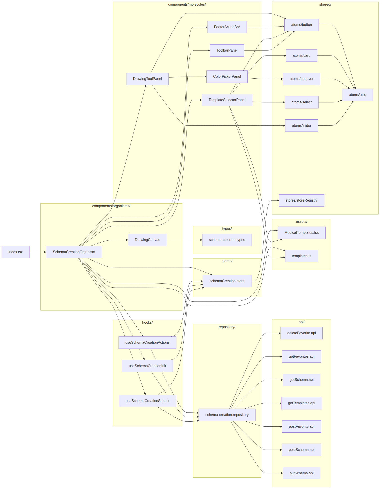
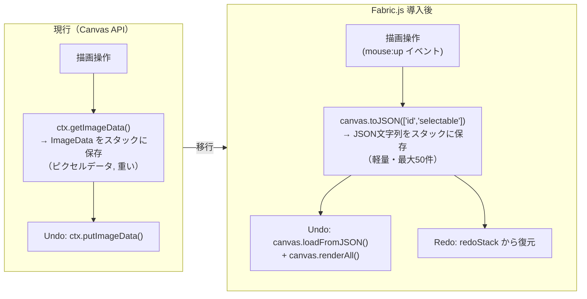

# REC002 Fabric.js 導入計画

作成日: 2026-05-14  
対象機能: REC002 シェーマ作成機能  
ステータス: 計画中（コード変更なし）

---

## データフロー図（Fabric.js 導入後）

### ファイル依存グラフ



### 全体データフロー

```mermaid
flowchart TD
    subgraph UI["UI層（React コンポーネント）"]
        Page["SchemaCreationPage\n(Next.js Page)"]
        Organism["SchemaCreationOrganism"]
        Canvas["DrawingCanvas\n(Fabric.js Canvas)"]
        ToolPanel["DrawingToolPanel\n(ツール選択・色・サイズ)"]
        TemplatePanel["TemplateSelectorPanel\n(5部位テンプレート)"]
        ToolbarPanel["ToolbarPanel\n(Undo/Redo/反転/クリア)"]
        FooterBar["FooterActionBar\n(確定・キャンセル)"]
    end

    subgraph FabricEngine["Fabric.js エンジン"]
        FabricCanvas["fabric.Canvas\n(canvasEl をラップ)"]
        PencilBrush["fabric.PencilBrush\n(ペン)"]
        SprayBrush["fabric.SprayBrush\n(スプレー)"]
        EraserBrush["fabric.EraserBrush\n(消しゴム)"]
        FabricRect["fabric.Rect\n(四角)"]
        FabricCircle["fabric.Circle\n(円)"]
        FabricIText["fabric.IText\n(テキスト)"]
        FabricImage["fabric.Image\n(テンプレート背景・画像import)"]
        ToDataURL["canvas.toDataURL()\n→ Base64 PNG"]
        ToJSON["canvas.toJSON()\n→ JSON snapshot"]
        FromJSON["canvas.loadFromJSON()\n← JSON snapshot"]
    end

    subgraph Store["状態管理（Zustand）"]
        SchemaStore["schemaCreation.store\n・selectedTool\n・color / strokeWidth\n・undoStack: string[]\n・redoStack: string[]\n・isSubmitting"]
        StoreRegistry["storeRegistry\n(共有ストア登録)"]
    end

    subgraph Hooks["Hook層"]
        Init["useSchemaCreationInit\n(テンプレート・お気に入り初期化)"]
        Actions["useSchemaCreationActions\n(Undo/Redo/ツール変更)"]
        Submit["useSchemaCreationSubmit\n(確定送信)"]
    end

    subgraph Repo["Repository層"]
        Repository["schema-creation.repository\n(API呼び出しの集約)"]
    end

    subgraph API["API層（BFF fetch）"]
        GetTemplates["getTemplates.api\nGET /templates"]
        GetFavorites["getFavorites.api\nGET /favorites"]
        PostFavorite["postFavorite.api\nPOST /favorites"]
        DeleteFavorite["deleteFavorite.api\nDELETE /favorites/:id"]
        PostSchema["postSchema.api\nPOST /schema\nbody: { imageData: Base64PNG }"]
        PutSchema["putSchema.api\nPUT /schema/:id\nbody: { imageData: Base64PNG }"]
        GetSchema["getSchema.api\nGET /schema/:id"]
    end

    subgraph BFF["BFF (Next.js API Route)"]
        BFFRoute["BFF API Route\n(認証・バリデーション)"]
    end

    subgraph BE["BE (C# / ASP.NET Core)"]
        BEController["Controller\n(LoginRequest/Response)"]
    end

    %% UI → Fabric.js
    Canvas -->|"useEffect: new fabric.Canvas(ref)"| FabricCanvas
    FabricCanvas --> PencilBrush
    FabricCanvas --> SprayBrush
    FabricCanvas --> EraserBrush
    FabricCanvas --> FabricRect
    FabricCanvas --> FabricCircle
    FabricCanvas --> FabricIText
    FabricCanvas --> FabricImage

    %% ツール選択 → Store → Canvas
    ToolPanel -->|"ツール・色・サイズ変更"| SchemaStore
    SchemaStore -->|"selectedTool 読み取り"| Canvas

    %% テンプレート → Fabric.js
    TemplatePanel -->|"テンプレート選択\nfabric.Image.fromURL(svgDataUrl)"| FabricImage
    FabricImage -->|"canvas.backgroundImage"| FabricCanvas

    %% Undo/Redo フロー
    FabricCanvas -->|"操作後\ncanvas.toJSON()"| ToJSON
    ToJSON -->|"JSON snapshot push"| SchemaStore
    ToolbarPanel -->|"Undo/Redo"| Actions
    Actions -->|"undoStack/redoStack 操作"| SchemaStore
    SchemaStore -->|"snapshot 取得"| FromJSON
    FromJSON -->|"canvas.loadFromJSON()"| FabricCanvas

    %% 確定送信フロー
    FooterBar -->|"確定ボタン"| Submit
    FabricCanvas -->|"canvas.toDataURL('image/png')"| ToDataURL
    ToDataURL -->|"Base64 PNG"| Submit
    Submit -->|"{ imageData: Base64PNG }"| Repository
    Repository --> PostSchema
    Repository --> PutSchema
    PostSchema --> BFFRoute
    PutSchema --> BFFRoute
    BFFRoute --> BEController
    BEController -->|"{ schemaUuid, savedAt }"| BFFRoute
    BFFRoute -->|"レスポンス"| Submit
    Submit -->|"onConfirm(schemaUuid)"| Page

    %% 初期化フロー
    Organism --> Init
    Init --> Repository
    Repository --> GetTemplates
    Repository --> GetFavorites
    Repository --> GetSchema

    %% Organism の子コンポーネント接続
    Organism --> Canvas
    Organism --> ToolPanel
    Organism --> TemplatePanel
    Organism --> ToolbarPanel
    Organism --> FooterBar

    %% Store → StoreRegistry
    SchemaStore --> StoreRegistry
```



### Undo/Redo 詳細フロー（現行 vs Fabric.js 導入後）



### 確定送信データフロー

```mermaid
sequenceDiagram
    actor User as 医師
    participant Canvas as DrawingCanvas<br/>(Fabric.js)
    participant Hook as useSchemaCreationSubmit
    participant Repo as schema-creation.repository
    participant BFF as BFF API Route
    participant BE as BE Controller

    User->>Canvas: 確定ボタン押下
    Canvas->>Canvas: canvas.toDataURL('image/png')
    Note over Canvas: Base64 PNG 文字列生成
    Canvas->>Hook: imageData: string (Base64)
    Hook->>Repo: postSchema({ imageData })
    Repo->>BFF: POST /api/schema<br/>body: { imageData: "data:image/png;base64,..." }
    BFF->>BE: HTTP POST /schema<br/>body: { imageData: string }
    BE-->>BFF: 200 { schemaUuid, savedAt }
    BFF-->>Repo: { schemaUuid, savedAt }
    Repo-->>Hook: SchemaResponse
    Hook-->>User: onConfirm(schemaUuid)
```

---

## 背景・目的

### REC001 文字起こしAPI情報（参考）

REC001で使用している音声認識は**ブラウザ標準のWeb Speech API**（外部サービスなし）。

| 項目 | 内容 |
|---|---|
| APIサービス名 | Web Speech API（ブラウザ組み込み） |
| APIキー | 不要 |
| エンドポイント | 不要（ブラウザネイティブ） |
| 言語設定 | `ja-JP`（固定） |
| 設定ファイル | なし |
| 環境変数 | なし |
| 実装ファイル | `product/frontend/src/features/01_diagnosis/01_record-creation/01_examination-input/hooks/useVoiceInput.ts` |

---

## REC002 現状分析

### 現在の実装方式

- **描画エンジン**: HTML5 Canvas API 2D Context（直接操作）
- **主要ファイル**: `DrawingCanvas.tsx`（600×600px キャンバス）
- **状態管理**: Zustand（`schemaCreation.store.ts`）
- **Undo/Redo**: ImageData 保存・復元方式（最大50件）
- **出力形式**: Base64 PNG（`canvas.toDataURL('image/png')`）
- **キャンバス関連依存ライブラリ**: **なし**（現在は素のCanvas API）

### 現在の問題点・Fabric.js 導入の動機

1. 図形オブジェクトの個別選択・移動が困難（ImageData保存では不可）
2. Undo/Redo がピクセルレベル保存のため重い（複雑な操作でメモリ消費大）
3. 図形の後から編集（サイズ変更・移動・削除）が実装困難
4. テキスト要素の編集対応が複雑

---

## Fabric.js 導入計画

### Fabric.js とは

Fabric.js は HTML5 Canvas をラップするJavaScriptライブラリ。オブジェクト指向でキャンバス要素を管理し、選択・変形・イベント処理を提供する。

- バージョン: v6.x（2024年最新）
- ライセンス: MIT
- バンドルサイズ: 約 450KB（minified）、gzip後 約 120KB

### 設計方針

**アプローチ**: 段階的移行（DrawingCanvas.tsx を Fabric.js ベースに置き換え）

1. API層（BFF通信）は変更なし（Base64 PNG出力を維持）
2. Zustandストアの型を Fabric.js オブジェクトモデルに対応
3. フック層（useSchemaCreation*）の I/F は可能な限り維持
4. テスト・Storybook は DrawingCanvas 置き換え後に更新

---

## 実装フェーズ計画

### Phase 0: 事前準備（スコープ確定）

**タスク**:
- [ ] T0-1: Fabric.js v6 の最新APIドキュメント確認（Context7経由）
- [ ] T0-2: 現在の DrawingCanvas.tsx の全機能をリスト化・Fabric.js対応可否マッピング
- [ ] T0-3: 設計書（`フロントエンド個別詳細設計書_【REC002】シェーマ作成機能.md`）との整合確認
- [ ] T0-4: `AI実装制約.md` の制約事項をFabric.js導入に照らして確認
- [ ] T0-5: shared/ への型・ユーティリティ振り分け洗い出し

**完了条件**: 機能マッピング表が完成し、Fabric.jsで実装可能な全機能が確認済み

---

### Phase 1: 依存追加・型定義（基盤整備）

**タスク**:
- [ ] T1-1: `package.json` に `fabric` を追加（`npm install fabric`）
- [ ] T1-2: TypeScript型定義の確認（fabric v6は型定義を同梱）
- [ ] T1-3: `schema-creation.types.ts` のFabric.js対応型定義追加
  - `FabricCanvasRef` 型
  - `FabricObjectJson` 型（JSON export用）
  - Undo/Redoスタック型の更新

**完了条件**: `import { Canvas } from 'fabric'` がエラーなく動作する

---

### Phase 2: DrawingCanvas.tsx の置き換え

**対象ファイル**: `components/organisms/DrawingCanvas.tsx`

**現在の実装 → Fabric.js 対応マッピング**:

| 現在の実装 | Fabric.js 対応 | 変更箇所（行） |
|---|---|---|
| `new HTMLCanvasElement` + `getContext('2d')` | `new fabric.Canvas(canvasEl)` | 行 20-30 |
| ペン描画（beginPath/lineTo/stroke） | `fabric.PencilBrush` | 行 192-214 |
| 四角描画（strokeRect） | `new fabric.Rect(...)` | 行 231-237 |
| 円描画（arc/stroke） | `new fabric.Circle(...)` | 行 238-244 |
| テキスト（fillText） | `new fabric.IText(...)` | 行 265-267 |
| スプレー（random fillRect） | `fabric.SprayBrush` | 行 251-259 |
| 消しゴム（destination-out） | `fabric.EraserBrush`（v6） | 行 196-200 |
| 反転（scale(-1,1)） | `canvas.viewportTransform` または `object.flipX` | 行 108-126 |
| Base64出力（toDataURL） | `canvas.toDataURL({ format: 'png' })` | 行 128-132 |
| Undo/Redo（ImageData保存） | `canvas.toJSON()` / `canvas.loadFromJSON()` | 行 44-81 |
| マウスイベント（mousedown/move/up） | Fabric.js 組み込みイベント（`canvas.on('mouse:down', ...)` ） | 行 145-180 |

**タスク**:
- [ ] T2-1: Fabric.js Canvas 初期化（`useEffect` 内で `new fabric.Canvas(ref.current)`）
- [ ] T2-2: ペンツール実装（`fabric.PencilBrush`）
- [ ] T2-3: 図形ツール実装（Rect, Circle, IText）
- [ ] T2-4: スプレーツール実装（`fabric.SprayBrush`）
- [ ] T2-5: 消しゴムツール実装（`fabric.EraserBrush` または `destination-out` フォールバック）
- [ ] T2-6: 反転機能実装
- [ ] T2-7: テンプレート背景適用（`fabric.Image.fromURL` + `canvas.backgroundImage`）
- [ ] T2-8: 画像インポート対応（`fabric.Image.fromURL`）
- [ ] T2-9: Base64エクスポート（`canvas.toDataURL`）
- [ ] T2-10: Clipboard貼り付け対応（Ctrl+V → `fabric.Image.fromURL(dataUrl)`）

**完了条件**: 6ツールすべてが動作し、Base64 PNG として確定送信できる

---

### Phase 3: Undo/Redo の Fabric.js 対応

**現在の課題**: ImageData方式 → JSON snapshot方式に変更

**設計**:
```typescript
// Zustand store の undoStack 型変更
type UndoStack = string[]  // JSON文字列のスタック（canvas.toJSON()の出力）

// 操作時
const snapshot = JSON.stringify(canvas.toJSON(['id', 'selectable']));
pushToUndoStack(snapshot);

// Undo時
const prev = undoStack[undoStack.length - 2];
canvas.loadFromJSON(JSON.parse(prev), canvas.renderAll.bind(canvas));
```

**タスク**:
- [ ] T3-1: `schemaCreation.store.ts` の undoStack 型更新
- [ ] T3-2: DrawingCanvas.tsx のUndo/Redoロジック置き換え
- [ ] T3-3: `useSchemaCreationActions.ts` の handleUndo/handleRedo 更新

**完了条件**: Undo 50件・Redo が正常動作する

---

### Phase 4: テンプレート・お気に入り対応

**タスク**:
- [ ] T4-1: `TemplateSelectorPanel.tsx` のテンプレート適用処理更新
  - SVG テンプレート → `fabric.loadSVGFromString()` または PNG 変換 → `fabric.Image`
- [ ] T4-2: `assets/MedicalTemplates.tsx` の SVG 出力形式確認・調整
- [ ] T4-3: テンプレート変更時のキャンバスリセット処理

**完了条件**: 5部位テンプレートが Fabric.js キャンバスに正しく表示される

---

### Phase 5: テスト・Storybook 更新

**タスク**:
- [ ] T5-1: `DrawingCanvas.test.tsx` の Fabric.js モック対応
  - `jest.mock('fabric', ...)` でFabric.Canvasをモック化
- [ ] T5-2: `SchemaCreationOrganism.test.tsx` 更新
- [ ] T5-3: Storybook story の動作確認・更新
- [ ] T5-4: `REC002-test.js`（E2E）の動作確認

**完了条件**: 既存テストが全パス、E2Eテストが golden path 通過

---

## 影響ファイル一覧（実装時参照）

### 直接変更が必要なファイル

| ファイル | 変更内容 | 優先度 |
|---|---|---|
| `package.json` | fabricパッケージ追加 | 高 |
| `DrawingCanvas.tsx` | Canvas API → Fabric.js 全面移行 | 高 |
| `schemaCreation.store.ts` | undoStack型変更 | 高 |
| `useSchemaCreationActions.ts` | Undo/Redo処理更新 | 中 |
| `schema-creation.types.ts` | Fabric.js型定義追加 | 中 |
| `TemplateSelectorPanel.tsx` | テンプレート適用ロジック更新 | 中 |
| `DrawingCanvas.test.tsx` | Fabricモック対応 | 中 |
| `SchemaCreationOrganism.test.tsx` | 更新 | 低 |

### 変更不要なファイル（互換性確認のみ）

| ファイル | 理由 |
|---|---|
| `api/*.api.ts` | BFF通信形式（Base64 PNG）に変更なし |
| `repository/schema-creation.repository.ts` | API層は変更なし |
| `useSchemaCreationInit.ts` | 初期化データ型の確認のみ |
| `useSchemaCreationSubmit.ts` | Base64出力形式の確認のみ |
| `ColorPickerPanel.tsx` | 色選択UIは変更なし |
| `DrawingToolPanel.tsx` | ツール選択UIは変更なし（イベント確認のみ） |
| `FooterActionBar.tsx` | 確定・キャンセルUIは変更なし |

---

## リスクと対策

| リスク | 影響度 | 対策 |
|---|---|---|
| Fabric.js の EraserBrush が v6 で alpha | 中 | v5 の `destination-out` フォールバックを実装 |
| SVGテンプレートのFabric.js読み込み方式変更 | 中 | `loadSVGFromString` → `fabric.Image` 変換フローを事前確認 |
| バンドルサイズ増加（+120KB gzip） | 低 | dynamic import で遅延ロード（`import('fabric')`） |
| Undo/Redo の JSON snapshot サイズ増大 | 低 | 最大50件上限を維持。必要なら JSON差分方式に変更 |
| Fabric.js のテスト環境（jsdom）での動作 | 中 | `jest.mock('fabric')` でCanvas全体をモック化 |
| DrawingCanvas の ref 型変更による型エラー | 低 | `FabricCanvasRef` 型を定義し段階的に更新 |

---

## 受け入れ条件（Acceptance Criteria）

- [ ] AC-1: 6種ツール（ペン・四角・円・テキスト・スプレー・消しゴム）が正常動作する
- [ ] AC-2: Undo/Redo が50件以内で正常動作する
- [ ] AC-3: 5部位テンプレートがキャンバスに正しく表示される
- [ ] AC-4: Base64 PNG として確定送信でき、親画面に返却できる
- [ ] AC-5: 画像インポート・クリップボード貼り付けが動作する
- [ ] AC-6: キャンバス反転が動作する
- [ ] AC-7: お気に入り機能が動作する（API変更なし）
- [ ] AC-8: `DrawingCanvas.test.tsx` がすべてパスする
- [ ] AC-9: `REC002-test.js`（E2E）の golden path が通過する

---

## 検証ステップ

1. `npm run build` が通ること（TypeScriptエラーなし）
2. `npm run test` で DrawingCanvas・SchemaCreationOrganism テストがパス
3. Storybookでキャンバスが表示・操作できること
4. E2Eテスト（`REC002-test.js`）が通ること
5. 確定時のBase64 PNG出力がBEで正しくデコードできること

---

## 参考ファイル

- 設計書: `docs/01_アプリ/フロントエンド/01_diagnosis/01_record-creation/フロントエンド個別詳細設計書_【REC002】シェーマ作成機能.md`
- AI実装制約: `docs/01_アプリ/フロントエンド/01_diagnosis/01_record-creation/フロントエンド個別詳細設計書_【REC002】シェーマ作成機能_AI実装制約.md`
- 現在の実装: `product/frontend/src/features/01_diagnosis/01_record-creation/01_schema-creation/`
- Fabric.js 公式: https://fabricjs.com/
- Fabric.js v6 docs（Context7経由で取得推奨）
