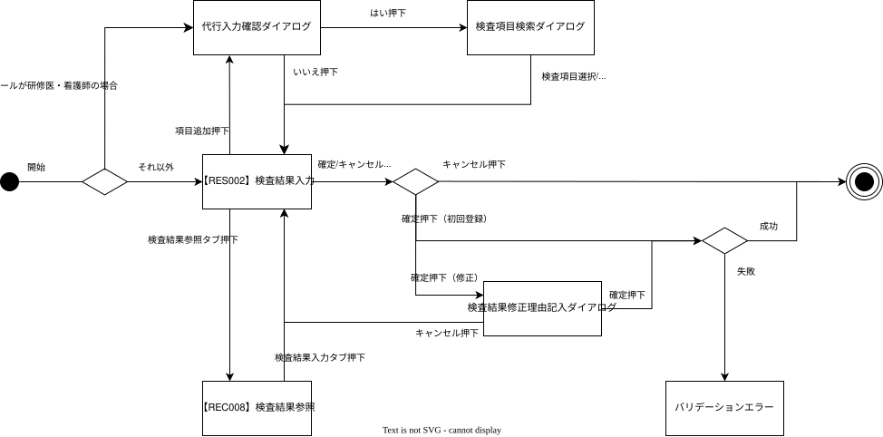

# フロントエンド個別詳細設計書_【RES002】結果入力

## 目次

- [実装前提ルール（AI実装制約）](#実装前提ルールai実装制約)
- [実装対象範囲](#実装対象範囲)
- [文書概要](#文書概要)
- [画面設計（詳細）](#画面設計詳細)
- [画面遷移／状態管理](#画面遷移状態管理)
- [操作イベント定義](#操作イベント定義)
- [排他制御における操作状態の定義](#排他制御における操作状態の定義)
- [エラー表示設計](#エラー表示設計)
- [呼び出しAPI一覧](#呼び出しapi一覧)
- [監査ログ対象操作（UI起点・一覧）](#監査ログ対象操作ui起点一覧)
- [AI実装制約](#ai実装制約)
- [状態管理ルール（画面固有）](#状態管理ルール画面固有)

---

## 実装前提ルール（AI実装制約）

- 本設計書は Claude Code による自動実装を前提とする
- 記載のない業務ロジックは実装しない
- 記載のない例外処理・最適化・省略実装は禁止
- 命名規則・構造は本設計書に従う

## 実装対象範囲

- 本設計書は以下のコードのみを生成対象とする
  - UI / 状態表示 / 操作イベント
- 他層（BFF・バックエンド）のコードは生成しない
- 業務ルール判定・状態遷移・データ永続化は実装しない

## 文書概要

- **目的**: 手動で検査結果を追加・入力できる機能
- **対象システム／サブシステム**: 【RES002】結果入力/【RES003】結果通知
- **対象範囲**
  - 本書は「【RES002】結果入力画面」の詳細設計を示す。
- **用語定義**

| 用語     | 説明                                         |
| -------- | -------------------------------------------- |
| 検査結果 | 本画面で入力・管理する患者に紐づく検査データ |
| 確定     | 入力内容を確定                              |
| 編集     | 入力中状態                                   |
| 修正     | 登録済みの検査結果を再登録する行為           |

<!-- ※ 共通用語は「システム共通用語集」を参照 -->

- **参照資料**
  - 個別機能設計書_結果入力
    ※ 本設計は上記機能設計書に基づき作成する。

---

## 画面設計（詳細）

- **画面一覧**
  - 画面ID：　RES002
  - 画面名：　結果入力
- **画面詳細（画面ごと）**
  - **画面構成**
    [結果入力画面]

    ■ 固定表示エリア
    - 【ETC006】ユーザーヘッダ
      - 画面構成に関しては[【ETC006】ユーザーヘッダ設計書]()を参照
    - 【ETC003】患者情報ヘッダ
      - 画面構成に関しては[【ETC003】患者情報ヘッダ設計書]()を参照

    ■ タブエリア
    - 結果入力タブ
      - 検査項目一覧（可変）
      - 確定ボタン
      - キャンセルボタン
      - 項目追加ボタン
      - 項目削除ボタン
    - 検査結果参照タブ
      - 画面構成に関しては[【REC008】検査結果参照設計書]()を参照

    ■ ダイアログ
    - 【PRI001】代行入力確認ダイアログ
      - 画面構成に関しては[【PRI001】代行入力確認ダイアログ設計書]()を参照
    - 検査項目検索ダイアログ
      - 項目ボタン
      - キャンセルボタン
    - 検査結果修正理由ダイアログ
      - ドロップダウン
      - テキストエリア（ドロップダウンでその他選択時）
      - 確定ボタン
      - キャンセルボタン
    - エラーダイアログ

  - **表示項目（固定項目 / 可変項目）**

[【RES002】結果入力画面]

| UI項目ID                    | 区分 | 表示名         | 利用データ                                | 表示条件                 | 備考                                     |
| --------------------------- | ---- | -------------- | ----------------------------------------- | ------------------------ | ---------------------------------------- |
| HDR_USER                    | 固定 | ユーザーヘッダ | —                                         | 常に表示                 | 別設計書参照 ※1                          |
| HDR_PATIENT                 | 固定 | 患者情報ヘッダ | —                                         | 常に表示                 | 別設計書参照 ※2                          |
| TAB_EDIT                    | 固定 | 検査結果入力   | —                                         | 常に表示                 | 初期表示                                 |
| TAB_REF                     | 固定 | 検査結果参照   | —                                         | 常に表示                 | 別設計書参照 ※3                          |
| BDG_EDIT                    | 可変 | 編集中         | —                                         | isEditable=true          |                                          |
| BDG_REF                     | 可変 | 参照中         | —                                         | isEditable=false         |                                          |
| BTN_ITEM_REFERENCE          | 固定 | 項目追加       | —                                         | 常に表示                 | [操作イベント](#操作イベント定義)参照 |
| BTN_ITEM_DELETE             | 可変 | 削除           | —                                         | 常に表示                 | [操作イベント](#操作イベント定義)参照 |
| TBL_TEST_RESULTS            | 可変 | 検査結果一覧   | testResults[]                             | 常に表示                 |                                          |
| COL_TEST_CODE               | 可変 | 検査コード     | itemCode                                  | 常に表示                 |                                          |
| COL_TEST_ITEM               | 可変 | 検査項目名     | itemName                                  | 常に表示                 |                                          |
| COL_RESULT                  | 可変 | 結果値         | resultValue                               | 常に表示                 | 参照モード時は読み取り専用               |
| COL_UNIT                    | 可変 | 単位           | unit                                      | 常に表示                 | 参照モード時は読み取り専用               |
| COL_REFERENCE_VALUE_DISPLAY | 可変 | 基準値         | referenceValueDisplay                     | 常に表示                 | NULLの場合は入力可                       |
| COL_JUDGMENT                | 可変 | 判定           | resultValue, criticalLower, criticalUpper | resultValue != NULL      | 詳細の表示条件は ※4                      |
| COL_PREV_RESULT             | 可変 | 前回値         | previousResultValue                       | hasPreviousResult=true   |                                          |
| COL_TEST_DATE               | 可変 | 検体採取日     | testDate                                  | hasTestDate=true         |                                          |
| ICON_CALENDAR_TEST_DATE     | 固定 | カレンダー     | —                                         | 常に表示                 | 日付ピッカー起動                         |
| LBL_SELECTED_COUNT          | 可変 | 選択件数       | selectedCount, totalCount                 | 常に表示                 | 「選択: X/X件」形式。チェック変更のたびに更新 |
| BTN_CANCEL                  | 固定 | キャンセル     | —                                         | 常に表示                 | [操作イベント](#操作イベント定義)参照 |
| BTN_CONFIRM                 | 固定 | 確定           | —                                         | 常に表示                 | [操作イベント](#操作イベント定義)参照 |

[検査項目検索ダイアログ]

| UI項目ID       | 区分 | 表示名                  | 利用データ                     | 表示条件 | 備考                         |
| -------------- | ---- | ----------------------- | ------------------------------ | -------- | ---------------------------- |
| SRCH_TEST_ITEM | 固定 | 検査項目検索欄          | -                              | 常に表示 | 入力可                       |
| SRCH_TEST_CODE | 固定 | 検査コード検索欄        | -                              | 常に表示 | 入力可                       |
| BTN_SEARCH     | 固定 | 検索                    | SRCH_TEST_ITEM, SRCH_TEST_CODE | 常に表示 | 入力された値で一覧を絞り込む |
| BTN_ITEM       | 固定 | {検査コード}:{検査項目} | itemCode, itemName             | 常に表示 | 選択で一覧に項目追加         |
| BTN_CANCEL_DIALOG | 固定 | キャンセル           | -                              | 常に表示 | 押下でダイアログを閉じる     |

[検査結果修正理由ダイアログ]

| UI項目ID                | 区分 | 表示名           | 利用データ         | 表示条件            | 備考                                     |
| ----------------------- | ---- | ---------------- | ------------------ | ------------------- | ---------------------------------------- |
| RDO_EDIT_REASON         | 固定 | 修正理由選択     | modificationReason | 常に表示（ダイアログ表示中） | ラジオボタンで選択可                     |
| TXT_EDIT_REASON         | 固定 | 修正理由記入欄   | -                  | 常に表示（ダイアログ表示中） | ドロップダウンでその他選択で入力可       |
| BTN_CANCEL_DIALOG       | 固定 | キャンセル       | —                  | 常に表示（ダイアログ表示中） | 押下でダイアログを閉じる                 |
| BTN_EDIT_REASON_CONFIRM | 固定 | 確定             | —                  | 常に表示（ダイアログ表示中） | [操作イベント](#操作イベント定義)参照 |

- ※1 表示項目に関しては[【ETC006】ユーザーヘッダ設計書]()を参照
- ※2 表示項目に関しては[【ETC003】患者情報ヘッダ設計書]()を参照
- ※3 表示項目に関しては[【REC008】検査結果参照設計書]()を参照
- ※4 判定条件
  if(resultValue < criticalLower){
  COL_JUDGMENT = "L";
  }elif(criticalUpper < resultValue){
  COL_JUDGMENT = "H";
  }else{
  COL_JUDGMENT = "N";
  }
    ※criticalLower,criticalUpperがNULLの場合はcriticalLower=lowerLimit,criticalUpper=upperLimitで判定
  - **入力制御（必須、文字種、桁数、ロケール対応）**
  - 以下の形式的入力制御のみを実施する
    - 必須チェック
    - 桁数制限
    - 文字種制限
  - 業務的な妥当性チェックは実装しない
  - APIレスポンスを正とし、独自判定は禁止

**◇`結果入力画面`◇**

| No  | 表示名                                | データ型 | 桁数/容量 | 表示フォーマット | 活性/非活性 | 表示/非表示 | 初期状態・振る舞い例                     | 入力必須 | 入力制御条件 | 入力検証ルール | エラーメッセージID | 説明・備考                           | 権限 |
| --- | ------------------------------------- | -------- | --------- | ---------------- | ----------- | ----------- | ---------------------------------------- | -------- | ------------ | -------------- | ------------------ | ------------------------------------ | ---- |
| 1   | 検査結果入力/検査結果参照切り替えタブ | 文字列   | 10        | タブ             | 活性        | 表示        |                                          | -        | -            | -              | -                  |                                      |      |
| 2   | 編集中/参照バッチ                     | 文字列   | 5         | 文字列           | 非活性      | 表示        |                                          | -        | -            | -              | -                  |                                      |      |
| 3   | 項目追加ボタン                        | ボタン   | -         | -                | 活性        | 表示        | 行追加ダイアログを開く                   | -        | -            | -              | -                  | 新規検査項目を追加                   |      |
| 4   | 選択行削除                            | ボタン   | -         | -                | 非活性      | 表示        | リスト項目を選択した場合活性化           | -        | -            | -              | -                  | 追加した項目のみ削除可能             |      |
| 5   | 確定ボタン                            | ボタン   | -         | -                | 活性        | 表示        |                                          | -        | -            | -              | -                  | 入力値を保存・登録                   |      |
| 6   | キャンセルボタン                      | ボタン   | -         | -                | 活性        | 表示        |                                          | -        | -            | -              | -                  | 入力した内容を取り消して画面を閉じる |      |
| 7   | 選択件数                              | 文字列   | 50        | 選択: X/X件      | 非活性      | 表示        | 一覧のチェック状態が変わるたび更新される | -        | -            | -              | -                  | リストのチェックされている行数       |

**◇`結果入力画面＞リスト`◇**

| No  | 表示名         | データ型   | 桁数/容量 | 表示フォーマット   | 活性/非活性 | 表示/非表示 | 初期状態・振る舞い例 | 入力必須 | 入力制御条件       | 入力検証ルール       | エラーメッセージID | 説明・備考                                | 権限 |
| --- | -------------- | ---------- | --------- | ------------------ | ----------- | ----------- | -------------------- | -------- | ------------------ | -------------------- | ------------------ | ----------------------------------------- | ---- |
| 1   | 行選択チェック | 論理値     | -         | チェックON/OFF     | 非活性      | 表示        | 削除対象指定         | -        | -                  | -                    | -                  | 一括削除用                                |      |
| 2   | 項目コード     | 文字列     | 10        | 英数字             | 非活性      | 表示        |                      | -        | -                  | -                    | -                  | 検査項目を一意に識別するコード（例：GLU） |      |
| 3   | 項目名         | 文字列     | 50        | テキスト           | 非活性      | 表示        |                      | -        | -                  | -                    | -                  | 検査項目の正式名称（例：血糖）            |      |
| 4   | 結果値         | 数値(実数) | 10        | 0～99,999.999形式  | 活性        | 表示        | 編集可能             | 必須     | 数値以外は入力不可 | 数値以外入力時エラー | E001               | 測定結果の実測値                          |      |
| 5   | 単位           | 文字列     | 10        | 固定リスト         | 活性        | 表示        | 編集可能             | 必須     |                    |                      |                    | 単位はマスタ連携（例：mg/dL, %など）      |      |
| 6   | 基準値         | 文字列     | 21        | "下限–上限"形式    | 非活性      | 表示        |                      | -        | -                  | -                    | -                  | 検査項目マスタから自動取得                |      |
| 7   | 判定           | 文字列     | 2         | H/L/N              | 非活性      | 表示        |                      | -        | -                  | -                    | -                  | H=高値, L=低値, N=正常                    |      |
| 8   | 前回値         | 数値(実数) | 10        | 0～99,999.999形式  | 非活性      | 表示        |                      | -        | -                  | -                    | -                  | 測定結果の実測値                          |      |
| 9   | 採取日         | 日付       | 10        | YYYY/MM/DD         | 非活性      | 表示        |                      | -        | -                  | -                    | -                  | 基本は他検査と同日を自動設定              |      |
| 10  | カレンダー     | ボタン     | -         | カレンダーアイコン | 活性        | 表示        | カレンダーで選択可能 | -        | -                  | -                    | -                  |                                           |      |

**=EVT_UI_01の場合=**

| No  | 表示名 | データ型   | 桁数/容量 | 表示フォーマット | 活性/非活性 | 表示/非表示 | 初期状態・振る舞い例 | 入力必須 | 入力制御条件 | 入力検証ルール       | エラーメッセージID | 説明・備考       | 権限 |
| --- | ------ | ---------- | --------- | ---------------- | ----------- | ----------- | -------------------- | -------- | ------------ | -------------------- | ------------------ | ---------------- | ---- |
| 1   | 結果値 | 数値(実数) | -         | テキスト         | 活性        | 表示        |                      | 必須     | 数値以外禁止 | 数値以外入力時エラー | E001               | 測定結果の実測値 |      |

**=COL_REFERENCE_VALUE_DISPLAY= nullの場合**

| No  | 表示名 | データ型   | 桁数/容量 | 表示フォーマット  | 活性/非活性 | 表示/非表示 | 初期状態・振る舞い例                                   | 入力必須 | 入力制御条件            | 入力検証ルール                           | エラーメッセージID | 説明・備考 | 権限 |
| --- | ------ | ---------- | --------- | ----------------- | ----------- | ----------- | ------------------------------------------------------ | -------- | ----------------------- | ---------------------------------------- | ------------------ | ---------- | ---- |
| 1   | 下限   | 数値(実数) | 10        | 0～99,999.999形式 | 活性        | 表示        | 検査項目選択で自動入力。マスタに登録がない場合は手入力 | 必須     | 下限≤上限、いずれも数値 | ①形式不正 ②数値でない ③下限>上限 | E001、E002         |            |      |
| 2   | 上限   | 数値(実数) | 10        | 0～99,999.999形式 | 活性        | 表示        | 検査項目選択で自動入力。マスタに登録がない場合は手入力 | 必須     | 下限≤上限、いずれも数値 | ①形式不正 ②数値でない ③下限>上限 | E001、E002         |

**◇`検査項目検索ダイアログ`◇**

| No  | 表示名           | データ型     | 桁数/容量 | 表示フォーマット | 活性/非活性 | 表示/非表示 | 初期状態・振る舞い例                 | 入力必須 | 入力制御条件 | 入力検証ルール | エラーメッセージID | 説明・備考                                      | 権限 |
| --- | ---------------- | ------------ | --------- | ---------------- | ----------- | ----------- | ------------------------------------ | -------- | ------------ | -------------- | ------------------ | ----------------------------------------------- | ---- |
| 1   | 検査項目検索欄   | 文字列       | 50        | テキスト         | 活性        | 表示        |                                      | 必須     |              |                |                    | 追加したい項目名で検索（コードとAND検索も可能） |      |
| 2   | 検査コード検索欄 | 数値（実数） | 10        | 0～9999999999    | 活性        | 表示        |                                      | 必須     |              |                |                    | 追加したいコードで検索（項目名とAND検索も可能） |      |
| 3   | 検索ボタン       | ボタン       | -         | 検索             | 活性        | 表示        |                                      | -        | -            | -              | -                  |                                                 |      |
| 4   | 検査項目一覧     | オブジェクト | -         | ｛検査項目一覧｝ | 活性        | 表示        |                                      | -        | -            | -              | -                  | 一覧から選択して、リストに項目を追加可能        |      |
| 5   | キャンセル       | ボタン       | -         | -                | 活性        | 表示        | クリックでダイアログを閉じる（破棄） | -        | -            | -              | -                  | 変更は保存されない                              |

**◇`検査結果修正理由ダイアログ`◇**

| No  | 表示名         | データ型 | 桁数/容量 | 表示フォーマット | 活性/非活性 | 表示/非表示 | 初期状態・振る舞い例                                     | 入力必須                 | 入力制御条件 | 入力検証ルール | エラーメッセージID | 説明・備考                           | 権限 |
| --- | -------------- | -------- | --------- | ---------------- | ----------- | ----------- | -------------------------------------------------------- | ------------------------ | ------------ | -------------- | ------------------ | ------------------------------------ | ---- |
| 1   | 修正理由選択   | 文字列   | 30        | ラジオボタン     | 活性        | 表示        |                                                          | 必須                     | -            | -              | -                  | 修正理由をドロップダウンから選択可能 |      |
| 2   | 修正理由記入欄 | 文字列   | 300       | テキスト         | 非活性      | 表示        | 修正理由選択でその他を選択した場合にテキストエリアを表示 | その他を選択し場合は必須 | -            | -              | -                  | 修正理由を記入可能                   |      |
| 3   | キャンセル     | ボタン   | -         | -                | 活性        | 表示        | クリックでダイアログを閉じる（破棄）                     | -                        | -            | -              | -                  | 変更は保存されない                   |      |
| 4   | 確定           | ボタン   | -         | -                | 活性        | 表示        | クリックでダイアログを閉じる（登録）                     | -                        | -            | -              | -                  | 修正した差分だけ履歴に保存する       |

- **UI制御**
  - 検査結果修正理由ダイアログ
    - 理由選択ダイアログ表示時、理由詳細テキストエリアは非表示
    - 理由「その他」選択時にテキストエリアを表示する
  - 表示モード制御
    - 結果入力タブ：編集モード(isEditable=true)
    - isEditable=false の場合は参照モード（BFF から 409 が返った場合に設定）
    - 基準値（ReferenceValueDisplay　!= NULL）, 前回値：参照のみ
    - 確定ボタン押下後
      - 確定ボタン：非活性
    - COL_JUDGMENT != "N" の場合
      - 行全体を強調表示する
  - 参照モード制御
    - 参照中バッチを表示する
    - 結果入力画面の編集項目は読み取り専用で編集不可とする
    - BTN_CONFIRM（確定）: 非活性
    - BTN_ITEM_REFERENCE（項目追加）: 非活性
    - BTN_ITEM_DELETE（削除）: 非活性
    - 行選択チェック: 非活性

---

## 画面遷移／状態管理

- 遷移元／遷移先：【DEP002】臨床検査科指示受け
- **画面遷移図**
  
- **状態管理**
  - 確定ボタン押下時に非活性にする（`confirmButtonDisabled = true`）
  - フロントバリデーション失敗時: `confirmButtonDisabled = false` に戻す（処理を中断するため再押下可能にする）
  - 確定API失敗時: `confirmButtonDisabled = false` に戻す
  - 修正理由ダイアログのキャンセル時: `confirmButtonDisabled = false` に戻す（ダイアログを閉じて再確定可能にする）
- **多重送信対策**
  - 保存／確定ボタン押下後は再操作不可とし、APIの多重呼び出しを防止する
  - 確定押下時に2重登録チェック実施

---

## 操作イベント定義

- 操作イベントの厳密な定義は「[8.1 操作イベント定義](#操作イベント定義-1)」に集約する
- 本章では個別定義を行わない
  - **ボタン/アクションID**

| UI要素                  | ボタン表示名 | アクションID            | 業務意味                     | 監査対象 |
| ----------------------- | ------------ | ----------------------- | ---------------------------- | -------- |
| BTN_CONFIRM             | 確定         | ACT_CONFIRM_RESULT      | 検査結果を確定する           | ○        |
| BTN_RESULT_REFERENCE    | 結果入力     | ACT_RESULT_REFERENCE    | 検査結果を参照する           | ○        |
| BTN_ITEM_REFERENCE      | 項目追加     | ACT_ITEM_REFERENCE      | 検査項目を参照する           | ×        |
| BTN_ITEM_DELETE         | 項目削除     | ACT_ITEM_DELETE         | 検査項目を削除する           | ×        |
| BTN_ITEM_REGISTRATION   | 登録         | ACT_ITEM_REGISTRATION   | 検査項目を追加する           | ×        |
| BTN_EDIT_REASON_CONFIRM | 編集理由確定 | ACT_EDIT_REASON_CONFIRM | 検査結果の修正理由を確定する | ×        |
| BTN_CANCEL              | キャンセル   | ACT_CANCEL              | 結果入力画面の入力破棄       | ×        |
| BTN_CANCEL_DIALOG       | キャンセル   | ACT_CANCEL_DIALOG       | ダイアログを閉じる（破棄）   | ×        |

- **遷移 or API 呼び出し**
  - 【DEP002】臨床検査科指示受けの[結果入力]ボタン押下/[検査結果入力]タブ押下
    - ロールが研修医・看護師の場合
      - [【PRI001】代行入力確認ダイアログの読出し](BFF定義書_【RES002】結果入力.md#bffapi--pri001代行入力確認ダイアログを参照)を実行する
        - 成功
          - 【PRI001】代行入力確認ダイアログを表示する
        - 失敗
          - 共通エラーダイアログを表示する
    - ロールが医師・臨床検査技師の場合、または研修医・看護師が代行入力確認ダイアログで「はい」を押下した場合
      - [ユーザーヘッダの読出し](BFF定義書_【RES002】結果入力.md#bffapi-etc006ユーザーヘッダの読出しを参照)を実行する
      - [患者情報ヘッダの読出し](BFF定義書_【RES002】結果入力.md#bffapi--患者情報ヘッダの読出しを参照)を実行する
      - [`POST /bff/orders/{orderUuid}/test-results`](BFF定義書_【RES002】結果入力.md#bffapi-post-bffordersorderuuidtest-results)を実行する
        - 成功
          - 【RES002】結果入力画面を表示する
        - 失敗
          - CONFLICT（E007）: 同時編集エラーを表示する
          - UNAUTHORIZED（E004）: 認証エラーを表示する
          - FORBIDDEN（E005）: 権限エラーを表示する
          - NOT_FOUND（E006）: データ取得失敗を表示する
          - TIMEOUT（E997）: エラーダイアログを表示する
          - SYSTEM_ERROR（E999）: 共通エラーダイアログを表示する
          - その他: 共通エラーダイアログを表示する
  - [検査結果参照]タブ押下
    - [【REC008】検査結果参照の読出し](BFF定義書_【RES002】結果入力.md#bffapi-rec008検査結果参照の読出しを参照)を実行する
    - 成功
      - 【REC008】検査結果参照画面を表示する
    - 失敗
      - 共通エラーダイアログを表示する
  - [項目追加]ボタン押下
    - ロールが研修医・看護師の場合
      - [【PRI001】代行入力確認ダイアログの読出し](BFF定義書_【RES002】結果入力.md#bffapi--pri001代行入力確認ダイアログを参照)を実行する
        - 成功
          - 【PRI001】代行入力確認ダイアログを表示する
        - 失敗
          - 共通エラーダイアログを表示する
    - ロールが医師・臨床検査技師の場合
      - [`GET /bff/test-items`](BFF定義書_【RES002】結果入力.md#bffapi-get-bfftest-items)を実行する
        - 成功
          - 検査項目検索ダイアログを表示する
        - 失敗
          - UNAUTHORIZED（E004）: 認証エラーを表示する
          - FORBIDDEN（E005）: 権限エラーを表示する
          - TIMEOUT（E997）: エラーダイアログを表示する
          - BAD_GATEWAY（E998）: 共通エラーダイアログを表示する
          - SYSTEM_ERROR（E999）: 共通エラーダイアログを表示する
          - その他: 共通エラーダイアログを表示する
  - 【PRI001】代行入力確認ダイアログの[はい]ボタン押下
    - [`GET /bff/test-items`](BFF定義書_【RES002】結果入力.md#bffapi-get-bfftest-items)を実行する
      - 成功
        - 検査項目検索ダイアログを表示する
      - 失敗
        - UNAUTHORIZED（E004）: 認証エラーを表示する
        - FORBIDDEN（E005）: 権限エラーを表示する
        - TIMEOUT（E997）: エラーダイアログを表示する
        - BAD_GATEWAY（E998）: 共通エラーダイアログを表示する
        - SYSTEM_ERROR（E999）: 共通エラーダイアログを表示する
        - その他: 共通エラーダイアログを表示する
  - [確定]ボタン押下
    - フロントエンドバリデーションを実行する
      - 結果値に数値以外が含まれる場合（E001）: エラーラベルを表示し処理を中断する
      - 基準値の下限が上限を超える場合（E002）: エラーラベルを表示し処理を中断する
    - 確定ボタンを非活性化する
    - 初回登録時
      - 確定APIを実行する
    - 確定済み検査結果を再登録する(reasonRequired=true)場合
      - [`GET /bff/modification-reason`](BFF定義書_【RES002】結果入力.md#bffapi-get-bffmodification-reason)を実行する
        - 成功
          - 検査結果修正理由ダイアログを表示する
            - [編集理由確定]ボタン押下（BTN_EDIT_REASON_CONFIRM）
              - 確定APIを実行する
            - [キャンセル]ボタン押下（BTN_CANCEL_DIALOG）
              - 修正理由ダイアログを閉じる
        - 失敗
          - UNAUTHORIZED（E004）: 認証エラーを表示する
          - FORBIDDEN（E005）: 権限エラーを表示する
          - NOT_FOUND（E006）: データ取得失敗を表示する
          - TIMEOUT（E997）: エラーダイアログを表示する
          - SYSTEM_ERROR（E999）: 共通エラーダイアログを表示する
          - その他: 共通エラーダイアログを表示する
  - 確定APIを実行
    - [`POST /bff/orders/{orderUuid}/test-results/save`](BFF定義書_【RES002】結果入力.md#bffapi-post-bffordersorderuuidtest-resultssave)を実行する
      - 成功
        - 画面を閉じる
      - 失敗
        - VALIDATION_FORMAT（E008）: エラーダイアログを表示する
        - VALIDATION_DELETE（E003）: エラーダイアログを表示する
        - UNAUTHORIZED（E004）: エラーダイアログを表示する
        - FORBIDDEN（E005）: エラーダイアログを表示する
        - NOT_FOUND（E006）: エラーダイアログを表示する
        - CONFLICT（E007）: エラーダイアログを表示する
        - TIMEOUT（E997）: エラーダイアログを表示する
        - SYSTEM_ERROR（E999）: 共通エラーダイアログを表示する
        - その他: 共通エラーダイアログを表示する

- **前提条件（ロール・ステータス）**
  - ロール：　[医師]、[研修医]、[臨床検査技師]、[看護師]
  - ステータス：　部門指示受けのステータスが[実施済]であること

## 排他制御における操作状態の定義

※本仕様は本画面における排他制御の暫定定義である。
排他制御は横断機能であるため、将来的に共通設計書へ集約する想定とする。

本画面では、編集ロックの延長判定に使用するため、
ユーザーの操作状態を以下の通り定義する。

### 操作状態（操作あり）

以下のいずれかが検知された場合、「操作あり」と判定する。

- マウス操作（クリック、ダブルクリック）
- キーボード入力（keydown、input 等）
- フォーカス変更
- スクロール操作
- ボタン押下、選択変更などの明示的なUI操作
- API通信を伴う画面操作

※検知対象イベントの詳細および実装方式はフロント実装に委ねる。

### 無操作状態

以下の条件を満たす場合、「無操作状態」と判定する。

- 一定時間、操作状態が検知されない状態

※一定時間の閾値は排他制御仕様に従う。

### ロック延長トリガ

- 操作状態が検知された場合、ロック延長処理を実施する。
- 無操作状態が継続した場合、ロック延長処理は行わない。
- ロック有効期限を超過した場合は、排他制御仕様に従いロックを無効とする。

---

## エラー表示設計

|   No | パターン                                     | 対象項目             | エラー種別             | HTTP | エラーコード      | 表示メッセージ例                                       | 表示タイミング                                     | 表示形式             |
| ---: | -------------------------------------------- | -------------------- | ---------------------- | :--: | ----------------- | ------------------------------------------------------ | -------------------------------------------------- | -------------------- |
| E001 | 数値以外が入力された                         | 数値結果             | 形式エラー             |  -   | -                 | 数値で入力してください                                 | 入力時（入力値変更時）                             | ラベル               |
| E002 | 下限値が上限値より大きい                     | 基準値（下限／上限） | 相関チェックエラー     |  -   | -                 | 下限値は上限値以下で入力してください                   | 確定ボタン押下時（フロント検証）                   | ラベル               |
| E003 | 削除不可状態で削除                           | 検査結果             | サーバーバリデーション | 400  | VALIDATION_DELETE | 自動連携された結果項目が含まれているため削除できません | 確定ボタン押下後                                   | ダイアログ           |
| E004 | 認証に失敗した場合                           | -                    | 認証エラー             | 401  | UNAUTHORIZED      | 認証に失敗しました                                     | 確定ボタン押下後                                   | ダイアログ           |
| E005 | 権限が不足している場合                       | -                    | 権限エラー             | 403  | FORBIDDEN         | 権限がありません                                       | 確定ボタン押下後                                   | ダイアログ           |
| E006 | データが存在しない                           | -                    | リソース不存在         | 404  | NOT_FOUND         | データが存在しません                                   | データを取得時                                     | ダイアログ           |
| E007 | 編集ロック競合または期限切れ                 | -                    | 排他競合               | 409  | CONFLICT          | 別ユーザーが編集しています                             | 他ユーザーによるロック競合、または無操作状態が15分以上続いた場合 | ダイアログ           |
| E008 | リクエスト形式が不正（型・必須欠落）         | -                    | バリデーションエラー   | 400  | VALIDATION_FORMAT | 入力内容に不正な値が含まれています                     | 確定ボタン押下後                                   | ダイアログ           |
| E999 | システムエラーが発生した場合                 | -                    | サーバー内部エラー     | 500  | SYSTEM_ERROR      | システムエラーが発生しました                           | システムエラーが発生した場合                       | 共通エラーダイアログ |
| E998 | 検査項目一覧の取得に失敗                     | -                    | 上流エラー             | 502  | BAD_GATEWAY       | システムエラーが発生しました                           | 項目追加ボタン押下後                               | 共通エラーダイアログ |
| E997 | 処理に時間が設定されている時間を超過した場合 | -                    | タイムアウト           | 504  | TIMEOUT           | 処理がタイムアウトしました                             | 処理がタイムアウトに設定している時間を超過した場合 | ダイアログ           |

## 呼び出しAPI一覧

| 表示画面名                       | BFF名                                      | API名                                          | 用途     |
| -------------------------------- | ------------------------------------------ | ---------------------------------------------- | -------- |
| 【RES002】結果入力               | execution-bff                              | [POST /bff/orders/{orderUuid}/test-results](BFF定義書_【RES002】結果入力.md#bffapi-post-bffordersorderuuidtest-results)       | 初期表示 |
| 【REC008】検査結果参照画面       | [【REC008】検査結果参照の読出し]()を参照   | [【REC008】検査結果参照の読出し]()を参照       | 参照     |
| 【PRI001】代行入力確認ダイアログ | [【PRI001】代行入力確認ダイアログ]()を参照 | [【PRI001】代行入力確認ダイアログ]()を参照     | 参照     |
| 検査項目検索ダイアログ           | execution-bff                              | [GET /bff/test-items](BFF定義書_【RES002】結果入力.md#bffapi-get-bfftest-items)                            | 参照     |
| 検査結果修正理由ダイアログ       | execution-bff                              | [GET /bff/modification-reason](BFF定義書_【RES002】結果入力.md#bffapi-get-bffmodification-reason)                   | 参照     |
| 【RES002】結果入力               | execution-bff                              | [POST /bff/orders/{orderUuid}/test-results/save](BFF定義書_【RES002】結果入力.md#bffapi-post-bffordersorderuuidtest-resultssave) | 確定     |

※ APIのリクエスト／レスポンス仕様、
ステータスコード、DTO定義は  
 「BFF定義書*execution-bff > 3. API仕様,　5. 外部連携定義」を参照する
[ステータスコード](BFF定義書_【RES002】結果入力.md#3-api仕様apiごと)
[DTO定義](BFF定義書_【RES002】結果入力.md#5-外部連携定義)

## 監査ログ対象操作（UI起点・一覧）

- 本画面における監査ログ対象操作は、
  [8.1 操作イベント定義](#操作イベント定義-1)に集約して定義する
- 表示用にはイベントIDと操作種別、ログ対象のみ簡易一覧化可能
- 本章では個別の操作定義・一覧表は記載しない

## AI実装制約

### 操作イベント定義

**8.1.1 操作イベント詳細定義（業務的）**

| イベントID              | 操作種別   | 呼び出しAPI                                   | 冪等性 | 監査ログ対象 | 備考                                                                                                |
| ----------------------- | ---------- | --------------------------------------------- | ------ | ------------ | --------------------------------------------------------------------------------------------------- |
| EVT_INIT01              | 初期表示   | BFF_ORDERS_{ORDERUUID}_TEST-RESULTS      | 不要   | 非対象       | 画面ロード時にフロントで correlation_id を発番し、HTTP ヘッダ `X-Correlation-ID` にセットして送信。参照操作のため監査ログ対象外。 |
| EVT_EDIT_REASON_CONFIRM | 確定       | BFF_ORDERS_{ORDERUUID}_TEST-RESULTS_SAVE | 必須   | 非対象       | 検査結果項目の編集理由を確定する                                                                    |
| EVT_CANCEL_INPUT        | キャンセル | なし                                          | 不要   | 非対象       | 編集内容を破棄して画面を閉じる。確認ダイアログは表示しない（一時保存機能なし）。                    |
| EVT_TEST_RESULT_CONFIRM | 確定       | BFF_ORDERS_{ORDERUUID}_TEST-RESULTS_SAVE | 必須   | 対象         | 編集中の検査結果を確定しDB保存。確定スコープ: 全行                                                  |

- イベントIDは監査ログおよびBFF連携で使用する
- 設計書に存在しないイベントは実装禁止

**8.1.2 操作イベント詳細定義（UI操作）**

| イベントID        | 操作内容               | API呼び出し | 監査ログ |
| ----------------- | ---------------------- | ----------- | -------- |
| EVT_UI_01         | 検査項目を一覧に追加   | なし        | ×        |
| EVT_ROW_DELETE    | 検査項目を一覧から削除 | なし        | ×        |
| EVT_CANCEL_DIALOG | キャンセル             | なし        | ×        |

- 本イベントは画面内状態のみを変更する
- API呼び出しは禁止
- BFF連携は禁止
- 業務状態への影響は禁止
- EVT_UI_01で追加した項目のみEVT_ROW_DELETEで削除可能

---

## 状態管理ルール（画面固有）

- 本画面では「編集中」状態を
  UI制御（活性／非活性）にのみ使用する
- 業務状態としては保持しない
