## 1. 勤務開始・情報確認

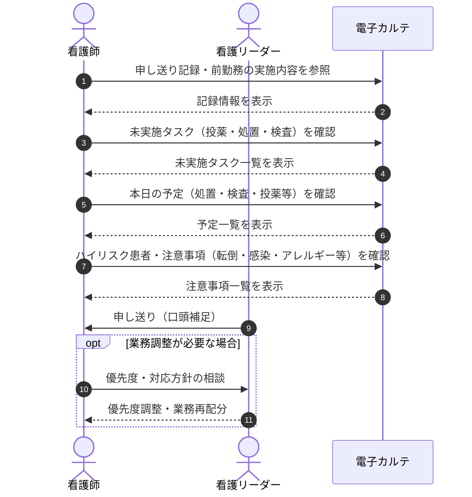

## 2. 巡視・定時看護

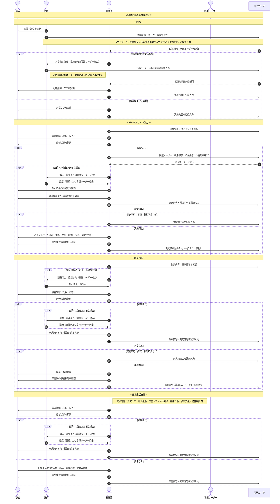

## 3. ナースコール対応

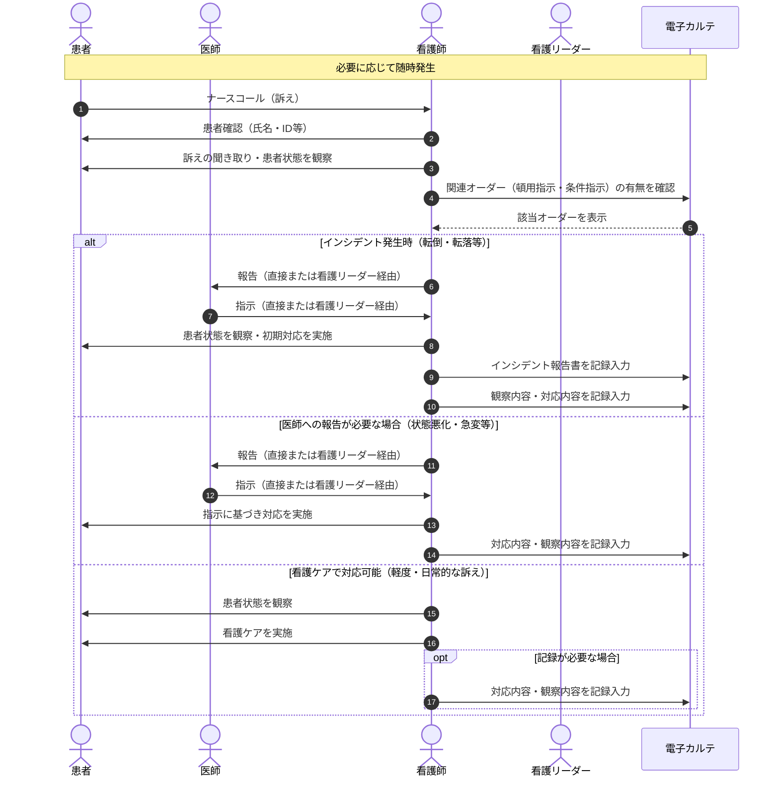

## 4. 緊急入院対応（割り込みイベント）

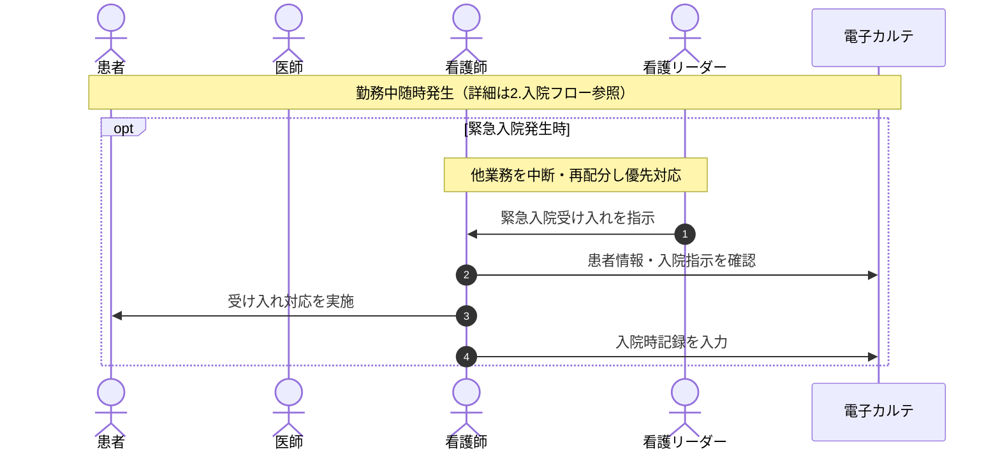

## 5. 処置

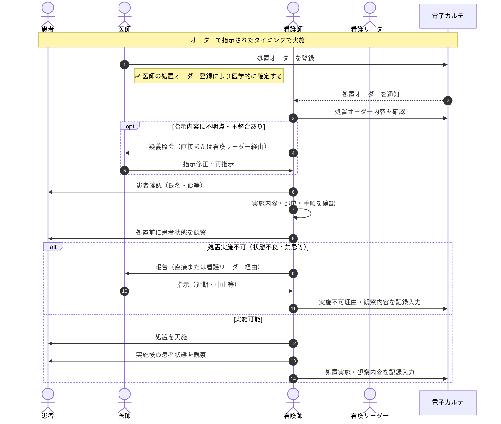

## 6. リハビリ・レクリエーション支援

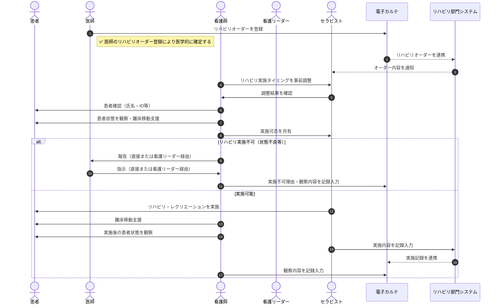

## 7. カンファレンス・看護計画見直し

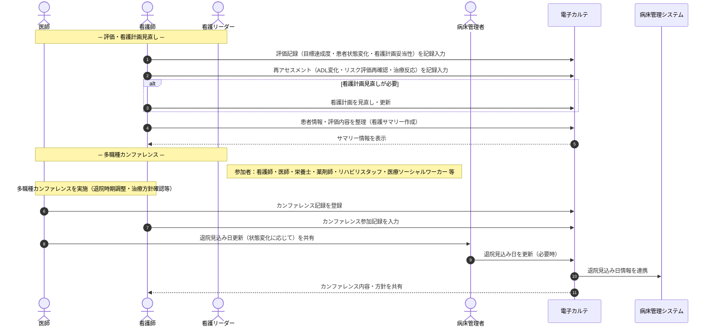

## 8. 勤務終了・申し送り

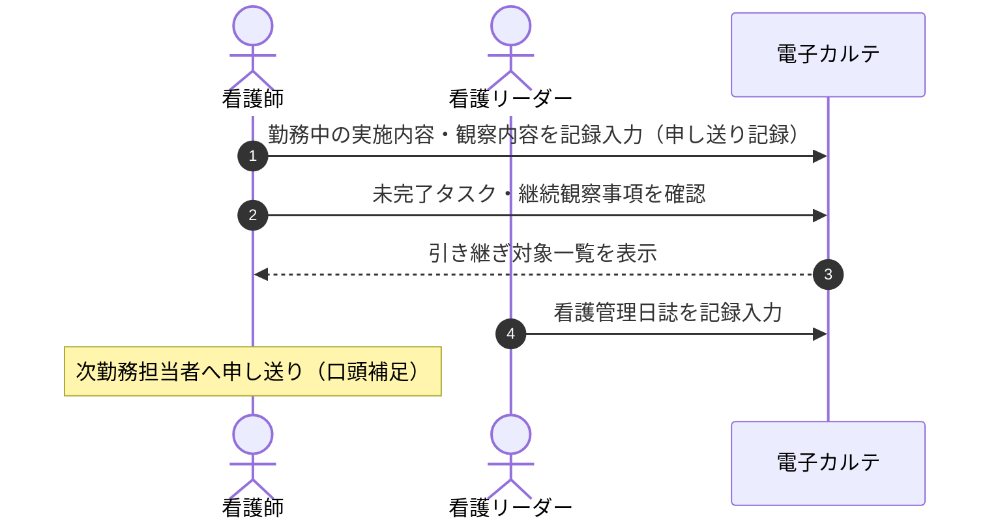

## 9. 病棟管理

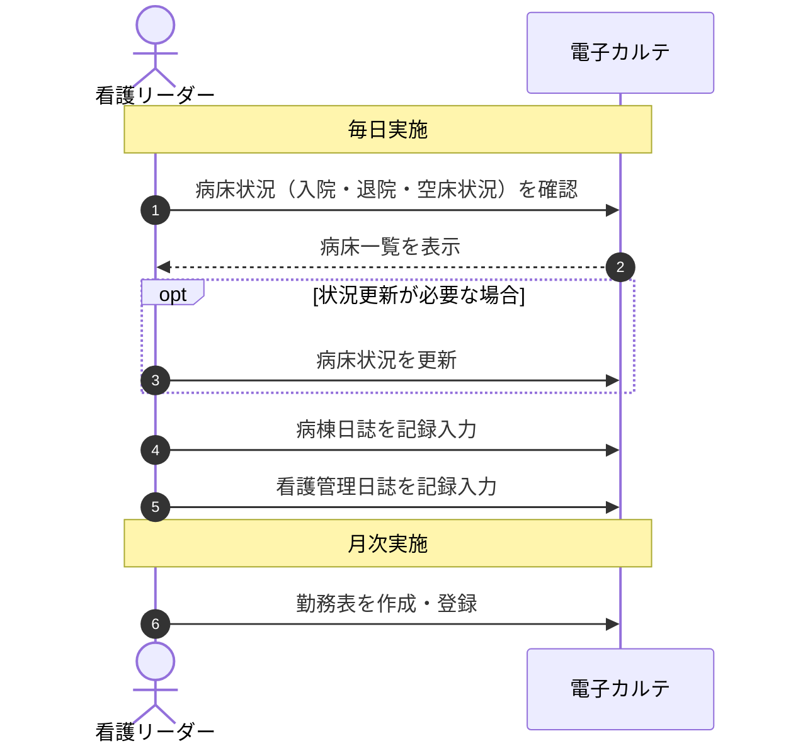

## 10. 急変・患者死亡時対応（割り込みイベント）

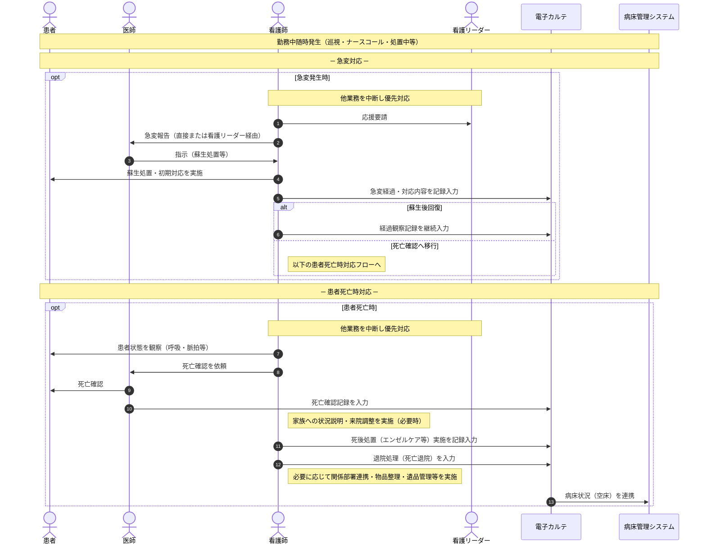

## 11. 無断離院・離棟対応（割り込みイベント）

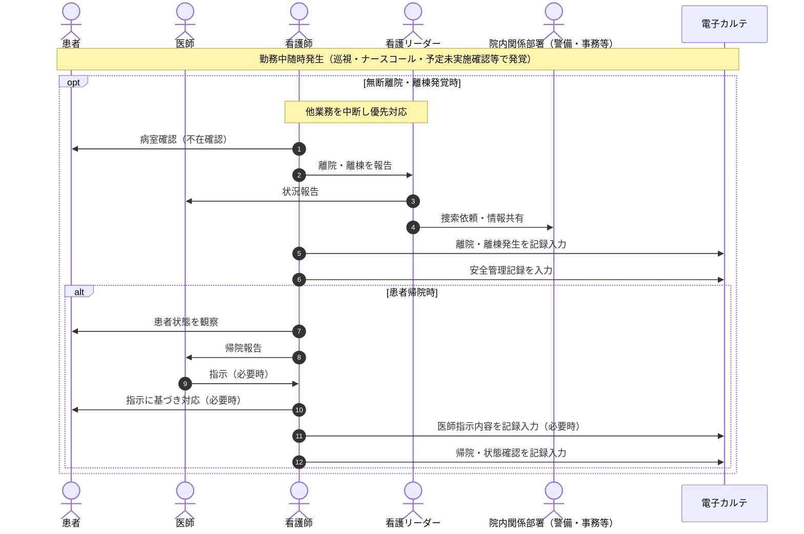
