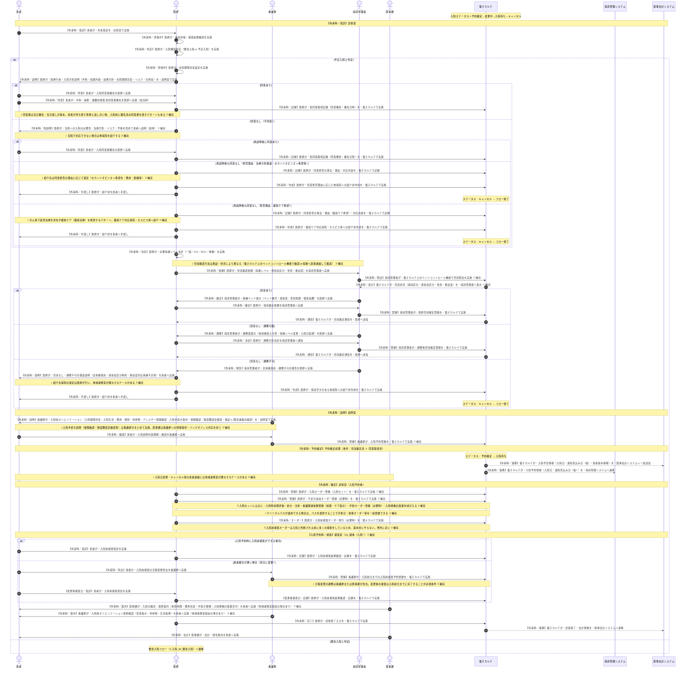

```mermaid
sequenceDiagram
    autonumber
    actor 患者
    actor 医師
    actor 看護師
    actor 病床管理者
    actor 医事課
    participant 電子カルテ
    participant 病床管理システム
    participant 医事会計システム

    Note over 電子カルテ: 入院ステータス＝予約確定→変更中→入院待ち→キャンセル
    Note over 患者,医事会計システム: 【外来時／受診】診察室

    患者->>医師: 【外来時／受診】患者が・外来受診を・診察室で実施
    医師->>医師: 【外来時／評価中】医師が・病状評価・検査結果確認を実施
    医師->>医師: 【外来時／判定】医師が・入院種別判定（緊急入院 or 予定入院）を実施
    alt 予定入院と判定
    医師->>医師: 【外来時／評価中】医師が・在院期間目安設定を実施

    医師->>患者: 【外来時／説明】医師が・医療行為・入院方針説明（手術・処置内容・加療方針・在院期間目安・リスク・合併症）を・説明室で実施

        alt 同意あり
            患者->>医師: 【外来時／同意】患者が・入院同意書署名を医師へ実施
            患者->>医師: 【外来時／同意】患者が・手術・麻酔・侵襲的検査 各同意書署名を医師へ実施（該当時）
            医師->>電子カルテ: 【外来時／記録】医師が・各同意取得記録（同意種別・署名日時）を・電子カルテで実施
            Note over 患者,医師: ℹ️ 同意書は当日署名・当日渡しが基本。患者が持ち帰り家族と話し合い後、入院前に署名済み同意書を渡すパターンもある ※補完
        else 同意なし（不同意）
            医師->>患者: 【外来時／再説明】医師が・当院への入院の必要性・治療方針・リスク・予後を改めて患者へ説明（説得） ※補完
            Note over 医師,患者: ℹ️ 当院で対応できない場合は他病院を紹介する ※補完
            alt 再説明後に同意あり
                患者->>医師: 【外来時／同意】患者が・入院同意書署名を医師へ実施
                医師->>電子カルテ: 【外来時／記録】医師が・各同意取得記録（同意種別・署名日時）を・電子カルテで実施
            else 再説明後も同意なし（拒否理由：治療方針相違・セカンドオピニオン希望等）
                医師->>電子カルテ: 【外来時／記録】医師が・同意拒否の事実・理由・対応内容を・電子カルテで記録
                Note over 医師,患者: ℹ️ 紹介先は同意拒否の理由に応じて選定（セカンドオピニオン希望先・費用・距離等） ※補完
                医師->>電子カルテ: 【外来時／作成】医師が・同意拒否理由に応じた他病院への紹介状作成を・電子カルテで実施
                医師->>患者: 【外来時／手渡し】医師が・紹介状を患者へ手渡し
                Note over 電子カルテ: ステータス：キャンセル → フロー終了
            else 再説明後も同意なし（拒否理由：緩和ケア希望）
                医師->>電子カルテ: 【外来時／記録】医師が・同意拒否の事実・理由（緩和ケア希望）・対応内容を・電子カルテで記録
                Note over 医師,患者: ℹ️ がん等で延命治療を求めず緩和ケア（緩和治療）を希望するパターン。緩和ケア対応病院・ホスピス等へ紹介 ※補完
                医師->>電子カルテ: 【外来時／作成】医師が・緩和ケア対応病院・ホスピス等への紹介状作成を・電子カルテで実施
                医師->>患者: 【外来時／手渡し】医師が・紹介状を患者へ手渡し
                Note over 電子カルテ: ステータス：キャンセル → フロー終了
            end
        end

        医師->>医師: 【外来時／決定】医師が・必要病棟レベル決定（一般／ICU／HCU／療養）を実施
        Note over 医師,病床管理者: ℹ️ 空床確認方法は施設・状況により異なる（電子カルテ上のベッドコントロール機能で確認 or 病棟へ直接連絡して確認） ※補完
        医師->>病床管理者: 【外来時／依頼】医師が・空床確認依頼（病棟レベル・感染症区分・性別・重症度）を病床管理者へ実施
        病床管理者->>電子カルテ: 【外来時／照会】病床管理者が・電子カルテ上のベッドコントロール機能で空床照会を実施 ※補完
        電子カルテ-->>病床管理者: 【外来時／表示】電子カルテが・空床状況（病床区分・感染症区分・性別・重症度）を・病床管理者へ表示 ※補完

        alt 空床あり
            病床管理者->>医師: 【外来時／確定】病床管理者が・候補ベッド提示（ベッド番号・感染室・性別配置・個室差額）を医師へ実施
            医師->>病床管理者: 【外来時／確定】医師が・病床確定依頼を病床管理者へ実施
            病床管理者->>電子カルテ: 【外来時／登録】病床管理者が・最終空床確定登録を・電子カルテで実施
            電子カルテ-->>医師: 【外来時／通知】電子カルテが・空床確定通知を・医師へ送信
        else 空床なし・調整可能
            病床管理者->>医師: 【外来時／調整】病床管理者が・調整案提示（他病棟受入可否・病棟レベル変更・入院日延期）を医師へ実施
            医師->>病床管理者: 【外来時／決定】医師が・調整方針決定を病床管理者へ通知
            病床管理者->>電子カルテ: 【外来時／登録】病床管理者が・調整後空床確定登録を・電子カルテで実施
            電子カルテ-->>医師: 【外来時／通知】電子カルテが・空床確定通知を・医師へ送信
        else 空床なし・調整不可
            病床管理者->>医師: 【外来時／報告】病床管理者が・全病棟満床・調整不可の報告を医師へ実施
            医師->>患者: 【外来時／説明】医師が・空床なし・調整不可の理由説明（全病棟満床・感染症区分制約・重症度対応病棟不足等）を患者へ実施
            Note over 医師,患者: ℹ️ 紹介先病院の選定は医師が行い、地域連携室が関与するケースがある ※補完
            医師->>電子カルテ: 【外来時／作成】医師が・病床空きのある他病院への紹介状作成を・電子カルテで実施
            医師->>患者: 【外来時／手渡し】医師が・紹介状を患者へ手渡し
            Note over 電子カルテ: ステータス：キャンセル → フロー終了
        end

        Note over 患者,医事会計システム: 【外来時／説明】説明室

        看護師->>患者: 【外来時／説明】看護師が・入院前オリエンテーション（入院期間目安・入院生活・費用・規則・持参物・アレルギー情報確認・入院手続き案内・保険確認・限度額認定確認・保証人/緊急連絡先確認）を・説明室で実施
        Note over 看護師,患者: ℹ️ 入院手続き説明（保険確認・限度額認定確認等）は看護師がまとめて実施。医事課は看護師への情報提供・バックオフィス対応を担う ※補完
        患者->>看護師: 【外来時／確認】患者が・入院説明内容理解・確認を看護師へ実施
        看護師->>電子カルテ: 【外来時／登録】看護師が・入院予約登録を・電子カルテで実施 ※補完
        Note over 患者,医事会計システム: 【外来時／予約確定】予約確定処理（条件：空床確定済 ＋ 同意取得済）
        Note over 電子カルテ: ステータス：予約確定 → 入院待ち
        電子カルテ-->>医事会計システム: 【外来時／連携】電子カルテが・入院予定情報（入院日・退院見込み日（仮）・患者基本情報）を・医事会計システムへ一括送信
        電子カルテ-->>病床管理システム: 【外来時／連携】電子カルテが・入院予約情報（入院日・退院見込み日（仮））を・病床管理システムへ連携
        Note over 医事課,患者: ℹ️ 入院日変更・キャンセル等の患者連絡には地域連携室が関与するケースがある ※補完

        Note over 患者,医事会計システム: 【外来時／確定】診察室（入院予約後）

        医師->>電子カルテ: 【外来時／登録】医師が・入院オーダー登録（入院セット）を・電子カルテで実施 ※補完
        医師->>電子カルテ: 【外来時／登録】医師が・不足分追加オーダー登録（必要時）を・電子カルテで実施 ※補完
        Note over 医師,電子カルテ: ※入院セットには主に・入院時初期評価・処方・注射・看護関連依頼登録（処置・ケア指示）・手術オーダー登録（必要時）・入院療養計画書作成が入る ※補完
        Note over 医師,電子カルテ: ℹ️ クリニカルパスが適用できる場合は、パスを選択することで手術日・食事オーダー等を一括登録できる ※補完
        医師->>電子カルテ: 【外来時／オーダー】医師が・入院前検査オーダー発行（必要時）を・電子カルテで実施
        Note over 医師,電子カルテ: ※入院前検査オーダーは入院と判断される前に多くの検査をしているため、基本的にやらない。例外に近い ※補完

        Note over 患者,医事会計システム: 【入院予約時／検査】検査室（10_検体（入院））※補完

        alt 入院予約時に入院前検査ができる場合
            患者->>医師: 【外来時／受診】患者が・入院前検査受診を実施
            医師->>電子カルテ: 【外来時／記録】医師が・入院前検査結果確認・記録を・電子カルテで実施
        else 患者都合が悪い場合（別日に変更）
            患者->>看護師: 【外来時／申出】患者が・入院前検査の日程変更申出を看護師へ実施
            看護師->>電子カルテ: 【外来時／登録】看護師が・入院前日までの入院前検査予約登録を・電子カルテで実施
            Note over 看護師,電子カルテ: ℹ️ 日程変更の調整は看護師または医事課が担当。変更後の検査は入院前日までに完了することが必須条件 ※補完
            患者->>医師: 【変更後検査日／受診】患者が・入院前検査受診を実施
            医師->>電子カルテ: 【変更後検査日／記録】医師が・入院前検査結果確認・記録を・電子カルテで実施
        end

        医事課->>患者: 【外来時／案内】医事課が・入院日確定・最終案内（来院時間・費用目安・手続き書類・入院療養計画書交付）を患者へ実施（地域連携室経由の場合あり） ※補完
        看護師->>患者: 【外来時／案内】看護師が・入院前オリエンテーション最終確認（禁食指示・持参物・生活指導）を患者へ実施（地域連携室経由の場合あり） ※補完

        医師->>電子カルテ: 【外来時／完了】医師が・診察終了入力を・電子カルテで実施
        電子カルテ-->>医事会計システム: 【外来時／連携】電子カルテが・診察終了・会計情報を・医事会計システムへ連携
        医事課->>患者: 【外来時／会計】医事課が・会計・帰宅案内を患者へ実施
    else 緊急入院と判定
        Note over 医師: 緊急入院フロー（2.入院_02_緊急入院）へ遷移
    end
```