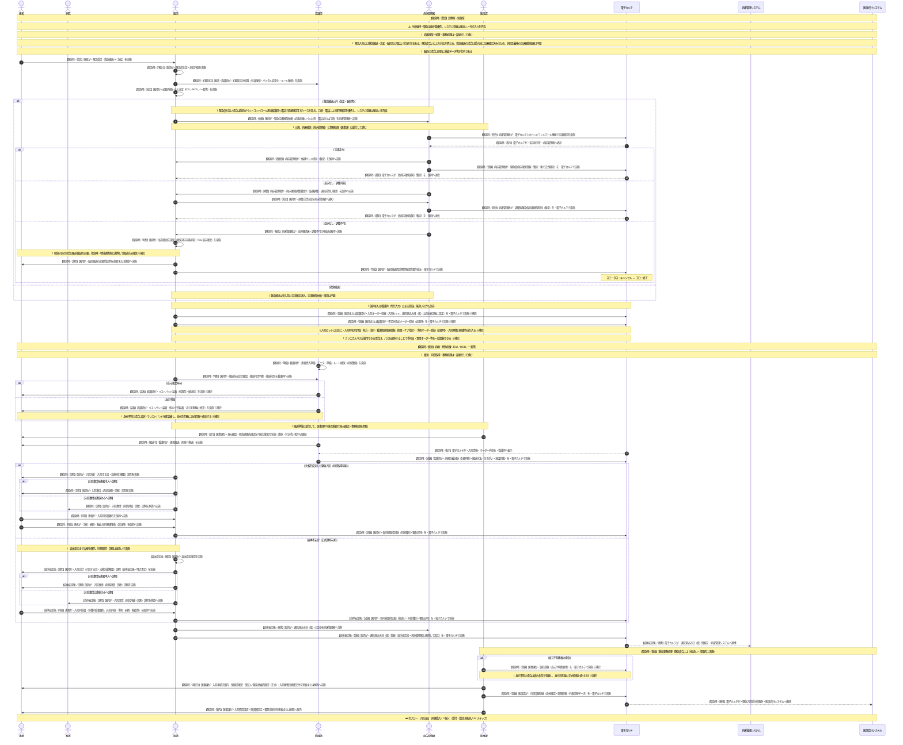

```mermaid
sequenceDiagram
    autonumber
    actor 患者
    actor 家族
    actor 医師
    actor 看護師
    actor 病床管理者
    actor 医事課
    participant 電子カルテ
    participant 病床管理システム
    participant 医事会計システム

    Note over 患者,医事会計システム: 【緊急時／受診】診察室・処置室
    Note over 患者,医事会計システム: ⚠️ 生命維持・緊急治療が最優先。システム登録は後追い・代行入力を許容
    Note over 患者,医事会計システム: ℹ️ 病床確保・処置・事務処理は一部並行して進む
    Note over 患者,医事会計システム: ℹ️ 緊急入院には救急搬送・急変・転院など幅広い状況が含まれる。緊急度合いにより対応が異なる。救急搬送の場合は受入前に空床確定済みのため、病院到着後の空床確保依頼は不要
    Note over 患者,医事会計システム: ℹ️ 転院の場合は病院に検査データ等が共有される
    患者->>医師: 【緊急時／受診】患者が・緊急受診（救急搬送 or 急変）を実施
    医師->>医師: 【緊急時／評価中】医師が・緊急度判定・病状評価を実施
    医師->>看護師: 【緊急時／初期対応】医師・看護師が・初期安定化処置（気道確保・バイタル安定化・ルート確保）を実施
    医師->>医師: 【緊急時／決定】医師が・必要病棟レベル決定（ICU／HCU／一般等）を実施

    alt 救急搬送以外（急変・転院等）
        Note over 医師,病床管理者: ℹ️ 緊急度が高い場合は医師がベッドコントロール担当看護師へ電話で直接確認するケースがある。口頭・電話による即時確認を優先し、システム登録は後追いを許容
        医師->>病床管理者: 【緊急時／依頼】医師が・緊急空床確保依頼（必要病棟レベル共有・電話または口頭）を病床管理者へ実施
        Note over 医師,医事課: ℹ️ 以降、病床確保（病床管理者）と事務処理（医事課）は並行して進む
        病床管理者->>電子カルテ: 【緊急時／照会】病床管理者が・電子カルテ上のベッドコントロール機能で空床確認を実施
        電子カルテ-->>病床管理者: 【緊急時／表示】電子カルテが・空床状況を・病床管理者へ表示

        alt 空床あり
            病床管理者->>医師: 【緊急時／仮確保】病床管理者が・候補ベッド提示（暫定）を医師へ実施
            病床管理者->>電子カルテ: 【緊急時／登録】病床管理者が・緊急仮病床確保登録（暫定・後で正式確定）を・電子カルテで実施
            電子カルテ-->>医師: 【緊急時／通知】電子カルテが・仮病床確保通知（暫定）を・医師へ送信
        else 空床なし・調整可能
            病床管理者->>医師: 【緊急時／調整】病床管理者が・病床確保調整案提示（転棟調整・退院前倒し検討）を医師へ実施
            医師->>病床管理者: 【緊急時／決定】医師が・調整方針決定を病床管理者へ通知
            病床管理者->>電子カルテ: 【緊急時／登録】病床管理者が・調整後緊急仮病床確保登録（暫定）を・電子カルテで実施
            電子カルテ-->>医師: 【緊急時／通知】電子カルテが・仮病床確保通知（暫定）を・医師へ送信
        else 空床なし・調整不可
            病床管理者->>医師: 【緊急時／報告】病床管理者が・全病棟満床・調整不可の報告を医師へ実施
            医師->>医師: 【緊急時／判断】医師が・転院搬送先選定（救急対応可能病院・ICU空床確認）を実施
            Note over 医師,患者: ℹ️ 緊急入院の場合は転院搬送が必要。救急隊・地域連携室と連携して搬送先を確保 ※補完
            医師->>患者: 【緊急時／説明】医師が・転院搬送の必要性説明を患者または家族へ実施
            医師->>電子カルテ: 【緊急時／作成】医師が・転院搬送用診療情報提供書作成を・電子カルテで実施
            Note over 電子カルテ: ステータス：キャンセル → フロー終了
        end
    else 救急搬送
        Note over 医師,病床管理者: ℹ️ 救急搬送は受入前に空床確定済み。空床確保依頼・確認は不要
    end

    Note over 医師,電子カルテ: ℹ️ 医師または看護師（代行入力）による登録。後追い入力も許容
    医師->>電子カルテ: 【緊急時／登録】医師または看護師が・入院オーダー登録（入院セット、退院見込み日（仮）は容体安定後に設定）を・電子カルテで実施 ※補完
    医師->>電子カルテ: 【緊急時／登録】医師または看護師が・不足分追加オーダー登録（必要時）を・電子カルテで実施 ※補完
    Note over 医師,電子カルテ: ※入院セットには主に・入院時初期評価・処方・注射・看護関連依頼登録（処置・ケア指示）・手術オーダー登録（必要時）・入院療養計画書作成が入る ※補完
    Note over 医師,電子カルテ: ℹ️ クリニカルパスが適用できる場合は、パスを選択することで手術日・食事オーダー等を一括登録できる ※補完

    Note over 患者,医事会計システム: 【緊急時／搬送】病棟・特殊病棟（ICU／HCU／一般等）
    Note over 患者,医事会計システム: ℹ️ 搬送・同意取得・事務処理は一部並行して進む

    看護師->>看護師: 【緊急時／準備】看護師が・患者受入準備（モニター準備・ルート確保・病室整備）を実施
    医師->>看護師: 【緊急時／判断】医師が・搬送前安定化確認・搬送可否判断・搬送指示を看護師へ実施

    alt 身元確認済み
        看護師->>患者: 【緊急時／装着】看護師が・リストバンド装着（処置前・搬送前）を実施 ※補完
    else 身元不明
        看護師->>患者: 【緊急時／装着】看護師が・リストバンド装着（仮IDで即装着・身元判明後に修正）を実施 ※補完
        Note over 看護師,患者: ℹ️ 身元不明の場合は仮IDでリストバンドを即装着し、身元判明後に正式情報へ修正する ※補完
    end

    Note over 医師,医事課: ℹ️ 搬送準備と並行して、医事課が可能な範囲で身元確認・事務処理を開始
    医事課->>患者: 【緊急時／並行】医事課が・身元確認・緊急連絡先確認を可能な範囲で実施（家族・付き添い者から聴取）
    看護師->>患者: 【緊急時／搬送中】看護師が・患者搬送（病室へ移送）を実施
    電子カルテ-->>看護師: 【緊急時／表示】電子カルテが・入院情報・オーダー内容を・看護師へ表示
    看護師->>電子カルテ: 【緊急時／記録】看護師が・病棟到着記録（到着時刻・搬送方法・付き添い・意識状態）を・電子カルテで実施

    alt 比較的安定した緊急入院（同意取得可能）
        医師->>患者: 【緊急時／説明】医師が・入院方針（入院する旨・治療方針概要）説明を実施
        alt 入院事情を患者本人へ説明
            医師->>患者: 【緊急時／説明】医師が・入院事情（病状詳細・診断）説明を実施
        else 入院事情は家族のみへ説明
            医師->>家族: 【緊急時／説明】医師が・入院事情（病状詳細・診断）説明を家族へ実施
        end
        患者->>医師: 【緊急時／同意】患者が・入院同意書署名を医師へ実施
        患者->>医師: 【緊急時／同意】患者が・手術・麻酔・輸血 各同意書署名（該当時）を医師へ実施
        医師->>電子カルテ: 【緊急時／記録】医師が・各同意取得記録（同意種別・署名日時）を・電子カルテで実施
    else 容体不安定（正式説明未済）
        Note over 患者,医師: ℹ️ 容体安定まで治療を優先。同意取得・説明は後追いで実施
        医師->>医師: 【容体安定後／確認】医師が・容体安定確認を実施
        医師->>患者: 【容体安定後／説明】医師が・入院方針（入院する旨・治療方針概要）説明（容体安定後・時点不定）を実施
        alt 入院事情を患者本人へ説明
            医師->>患者: 【容体安定後／説明】医師が・入院事情（病状詳細・診断）説明を実施
        else 入院事情は家族のみへ説明
            医師->>家族: 【容体安定後／説明】医師が・入院事情（病状詳細・診断）説明を家族へ実施
        end
        患者->>医師: 【容体安定後／同意】患者が・入院同意書・各種同意書署名（入院同意・手術・麻酔・輸血等）を医師へ実施
        医師->>電子カルテ: 【容体安定後／記録】医師が・各同意取得記録（後追い・同意種別・署名日時）を・電子カルテで実施
    end

    医師->>病床管理者: 【容体安定後／連携】医師が・退院見込み日（仮）の目安を病床管理者へ共有
    医師->>電子カルテ: 【容体安定後／登録】医師が・退院見込み日（仮）登録（容体安定後・病床管理者と連携して設定）を・電子カルテで実施
    電子カルテ-->>病床管理システム: 【容体安定後／連携】電子カルテが・退院見込み日（仮）情報を・病床管理システムへ連携

    Note over 医事課,医事会計システム: 【緊急時／事後】事後事務処理（緊急度合により後追い・段階的に実施）

    alt 身元不明患者の場合
        医事課->>電子カルテ: 【緊急時／登録】医事課が・仮名登録（身元不明患者用）を・電子カルテで実施 ※補完
        Note over 医事課,電子カルテ: ℹ️ 身元不明の場合は仮の名前で登録し、身元判明後に正式情報と紐づける ※補完
    end
    医事課->>患者: 【緊急時／手続き】医事課が・入院手続き案内・保険証確認・保証人/緊急連絡先確認（正式）・入院療養計画書交付を患者または家族へ実施
    医事課->>電子カルテ: 【緊急時／登録】医事課が・入院情報登録（身元確認・保険情報・外来診療データ）を・電子カルテで実施
    電子カルテ-->>医事会計システム: 【緊急時／連携】電子カルテが・緊急入院受付情報を・医事会計システムへ連携
    医事課->>患者: 【緊急時／案内】医事課が・入院費用目安・限度額認定・書類手続きを患者または家族へ案内
    Note over 患者,医事会計システム: ➡️ 次フロー：入院当日（病棟受入）へ続く（受付・受診は後追い or スキップ）
```
