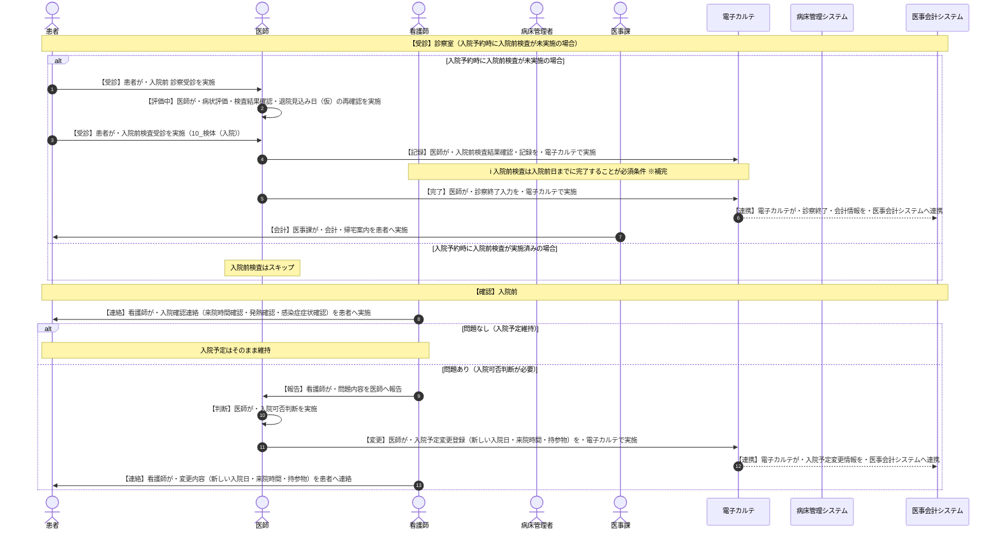

```mermaid
sequenceDiagram
    autonumber
    actor 患者
    actor 医師
    actor 看護師
    actor 病床管理者
    actor 医事課
    participant 電子カルテ
    participant 病床管理システム
    participant 医事会計システム

    Note over 患者,医事会計システム: 【受診】診察室（入院予約時に入院前検査が未実施の場合）
    alt 入院予約時に入院前検査が未実施の場合
    患者->>医師: 【受診】患者が・入院前 診察受診を実施
    医師->>医師: 【評価中】医師が・病状評価・検査結果確認・退院見込み日（仮）の再確認を実施
        患者->>医師: 【受診】患者が・入院前検査受診を実施（10_検体（入院））
        医師->>電子カルテ: 【記録】医師が・入院前検査結果確認・記録を・電子カルテで実施
        Note over 看護師,電子カルテ: ℹ️ 入院前検査は入院前日までに完了することが必須条件 ※補完
    医師->>電子カルテ: 【完了】医師が・診察終了入力を・電子カルテで実施
    電子カルテ-->>医事会計システム: 【連携】電子カルテが・診察終了・会計情報を・医事会計システムへ連携
    医事課->>患者: 【会計】医事課が・会計・帰宅案内を患者へ実施
    else 入院予約時に入院前検査が実施済みの場合
        Note over 医師: 入院前検査はスキップ
    end

    Note over 患者,医事会計システム: 【確認】入院前
    看護師->>患者: 【連絡】看護師が・入院確認連絡（来院時間確認・発熱確認・感染症症状確認）を患者へ実施

    alt 問題なし（入院予定維持）
        Note over 看護師,患者: 入院予定はそのまま維持
    else 問題あり（入院可否判断が必要）
        看護師->>医師: 【報告】看護師が・問題内容を医師へ報告
        医師->>医師: 【判断】医師が・入院可否判断を実施
        医師->>電子カルテ: 【変更】医師が・入院予定変更登録（新しい入院日・来院時間・持参物）を・電子カルテで実施
        電子カルテ-->>医事会計システム: 【連携】電子カルテが・入院予定変更情報を・医事会計システムへ連携
        看護師->>患者: 【連絡】看護師が・変更内容（新しい入院日・来院時間・持参物）を患者へ連絡
    end

```
