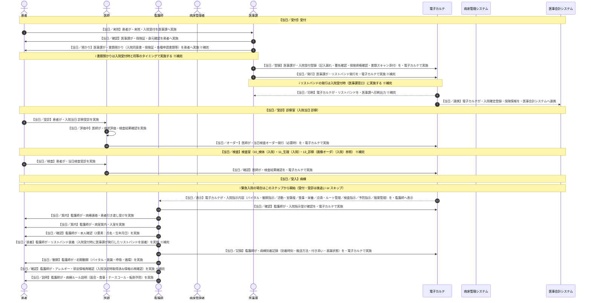

```mermaid
sequenceDiagram
    autonumber
    actor 患者
    actor 医師
    actor 看護師
    actor 病床管理者
    actor 医事課
    participant 電子カルテ
    participant 病床管理システム
    participant 医事会計システム

    Note over 患者,医事会計システム: 【当日／受付】受付

    患者->>医事課: 【当日／来院】患者が・来院・入院受付を医事課へ実施
    医事課->>患者: 【当日／確認】医事課が・保険証・身元確認を患者へ実施
    医事課->>患者: 【当日／預かり】医事課が・書類預かり（入院同意書・保険証・各種申請書類等）を患者へ実施 ※補完
    Note over 患者,医事課: ℹ️ 書類預かりは入院受付時と同等のタイミングで実施する ※補完
    医事課->>電子カルテ: 【当日／登録】医事課が・入院受付登録（記入漏れ・署名確認・保険資格確認・書類スキャン添付）を・電子カルテで実施
    医事課->>電子カルテ: 【当日／発行】医事課が・リストバンド発行を・電子カルテで実施 ※補完
    Note over 医事課,電子カルテ: ℹ️ リストバンドの発行は入院受付時（医事課窓口）に実施する ※補完
    電子カルテ-->>医事課: 【当日／印刷】電子カルテが・リストバンドを・医事課へ印刷出力 ※補完
    電子カルテ-->>医事会計システム: 【当日／連携】電子カルテが・入院確定登録・保険情報を・医事会計システムへ連携

    Note over 患者,医事会計システム: 【当日／受診】診察室（入院当日 診察）

    患者->>医師: 【当日／受診】患者が・入院当日 診察受診を実施
    医師->>医師: 【当日／評価中】医師が・病状評価・検査結果確認を実施
    医師->>電子カルテ: 【当日／オーダー】医師が・当日検査オーダー発行（必要時）を・電子カルテで実施
    Note over 患者,医事会計システム: 【当日／検査】検査室（10_検体（入院）・11_生理（入院）・13_診察（画像オーダ）（入院）参照） ※補完
    患者->>医師: 【当日／検査】患者が・当日検査受診を実施
    医師->>電子カルテ: 【当日／確認】医師が・検査結果確認を・電子カルテで実施

    Note over 患者,医事会計システム: 【当日／受入】病棟
    Note over 患者,医事会計システム: ℹ️ 緊急入院の場合はこのステップから開始（受付・受診は後追い or スキップ）

    電子カルテ-->>看護師: 【当日／表示】電子カルテが・入院指示内容（バイタル・観察指示／活動・安静度／食事・栄養／点滴・ルート管理／検査指示／予防指示／服薬管理）を・看護師へ表示
    看護師->>電子カルテ: 【当日／確認】看護師が・入院指示受け確認を・電子カルテで実施

    看護師->>患者: 【当日／案内】看護師が・病棟連絡・患者引き渡し受けを実施
    看護師->>患者: 【当日／案内】看護師が・病室案内・入室を実施
    看護師->>患者: 【当日／確認】看護師が・本人確認（2要素：氏名・生年月日）を実施
    看護師->>患者: 【当日／装着】看護師が・リストバンド装着（入院受付時に医事課が発行したリストバンドを装着）を実施 ※補完
    看護師->>電子カルテ: 【当日／記録】看護師が・病棟到着記録（到着時刻・搬送方法・付き添い・意識状態）を・電子カルテで実施
    看護師->>患者: 【当日／観察】看護師が・初期観察（バイタル・意識・呼吸・循環）を実施
    看護師->>患者: 【当日／確認】看護師が・アレルギー・禁忌情報再確認（入院決定時取得済み情報の再確認）を実施 ※補完
    看護師->>患者: 【当日／説明】看護師が・病棟ルール説明（面会・食事・ナースコール・転倒予防）を実施
```