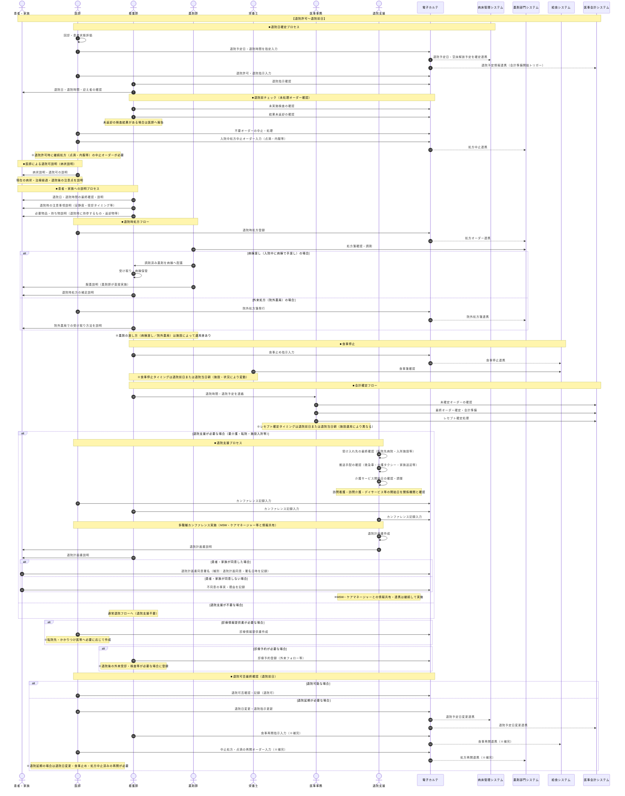

```mermaid
sequenceDiagram
    autonumber
    actor 患者家族 as 患者・家族
    actor 医師
    actor 看護師
    actor 薬剤師
    actor 栄養士
    actor 医事事務
    actor 退院支援
    participant 電子カルテ
    participant 病床管理システム
    participant 薬剤部門システム
    participant 給食システム
    participant 医事会計システム

    Note over 患者家族,医事会計システム: 【退院許可～退院前日】

    %% ─────────────────────────────────────────
    %% 1. 退院日の確定プロセス
    %% ─────────────────────────────────────────
    Note over 医師,病床管理システム: ■ 退院日確定プロセス

    医師->>医師: 回診・患者状態評価
    医師->>電子カルテ: 退院予定日・退院時間を指定入力
    電子カルテ-->>病床管理システム: 退院予定日・空床解放予定を確定連携
    電子カルテ-->>医事会計システム: 退院予定情報連携（会計準備開始トリガー）

    医師->>電子カルテ: 退院許可・退院指示入力
    看護師->>電子カルテ: 退院指示確認

    看護師->>患者家族: 退院日・退院時間・迎え者の確認

    %% ─────────────────────────────────────────
    %% 2. 未処理オーダー確認（退院前チェック）
    %% ─────────────────────────────────────────
    Note over 看護師,電子カルテ: ■ 退院前チェック（未処理オーダー確認）

    看護師->>電子カルテ: 未実施検査の確認
    看護師->>電子カルテ: 結果未返却の確認
    Note over 看護師: 未返却の検査結果がある場合は医師へ報告
    医師->>電子カルテ: 不要オーダーの中止・処理
    医師->>電子カルテ: 入院中処方中止オーダー入力（点滴・内服等）
    電子カルテ-->>薬剤部門システム: 処方中止連携
    Note over 医師: ※退院許可時に継続処方（点滴・内服等）の中止オーダーが必要

    %% ─────────────────────────────────────────
    %% 3. 医師による病状説明・退院可説明
    %% ─────────────────────────────────────────
    Note over 医師,患者家族: ■ 医師による退院可説明（病状説明）

    医師->>患者家族: 病状説明・退院可の説明
    Note over 医師,患者家族: 現在の病状・治療経過・退院後の注意点を説明

    %% ─────────────────────────────────────────
    %% 4. 患者・家族への説明プロセス（看護師）
    %% ─────────────────────────────────────────
    Note over 看護師,患者家族: ■ 患者・家族への説明プロセス

    看護師->>患者家族: 退院日・退院時間の最終確認・説明
    看護師->>患者家族: 退院時の注意事項説明（安静度・受診タイミング等）
    看護師->>患者家族: 必要物品・持ち物説明（退院時に持参するもの・返却物等）

    %% ─────────────────────────────────────────
    %% 5. 退院時処方フロー（分岐あり）
    %% ─────────────────────────────────────────
    Note over 医師,薬剤師: ■ 退院時処方フロー

    医師->>電子カルテ: 退院時処方登録
    電子カルテ-->>薬剤部門システム: 処方オーダー連携
    薬剤師->>薬剤部門システム: 処方箋確認・調剤

    alt 病棟渡し（入院中に病棟で手渡し）の場合
        薬剤師->>看護師: 調剤済み薬剤を病棟へ配薬
        看護師->>看護師: 受け取り・病棟保管
        薬剤師->>患者家族: 服薬説明（薬剤師が直接実施）
        看護師->>患者家族: 退院時処方の補足説明
    else 外来処方（院外薬局）の場合
        医師->>電子カルテ: 院外処方箋発行
        電子カルテ-->>薬剤部門システム: 院外処方箋連携
        看護師->>患者家族: 院外薬局での受け取り方法を説明
    end
    Note over 薬剤師,看護師: ※薬剤の渡し方（病棟渡し／院外薬局）は施設によって運用差あり

    %% ─────────────────────────────────────────
    %% 6. 食事停止
    %% ─────────────────────────────────────────
    Note over 看護師,給食システム: ■ 食事停止

    看護師->>電子カルテ: 食事止め指示入力
    電子カルテ-->>給食システム: 食事停止連携
    栄養士->>給食システム: 食事箋確認
    Note over 看護師,栄養士: ※食事停止タイミングは退院前日または退院当日朝（施設・状況により変動）

    %% ─────────────────────────────────────────
    %% 7. 会計確定フロー
    %% ─────────────────────────────────────────
    Note over 看護師,医事会計システム: ■ 会計確定フロー

    看護師->>医事事務: 退院時間・退院予定を連絡
    医事事務->>医事会計システム: 未確定オーダーの確認
    医事事務->>医事会計システム: 最終オーダー確定・会計準備
    医事事務->>医事会計システム: レセプト確定処理
    Note over 医事事務: ※レセプト確定タイミングは退院前日または退院当日朝（施設運用により異なる）

    %% ─────────────────────────────────────────
    %% 8. 退院支援（必要な場合）
    %% ─────────────────────────────────────────
    alt 退院支援が必要な場合（要介護・転院・施設入所等）
        Note over 医師,退院支援: ■ 退院支援プロセス

        退院支援->>退院支援: 受け入れ先の最終確認（転院先病院・入所施設等）
        退院支援->>退院支援: 搬送手配の確認（救急車・介護タクシー・家族送迎等）
        退院支援->>退院支援: 介護サービス開始日の確認・調整
        Note over 退院支援: 訪問看護・訪問介護・デイサービス等の開始日を関係機関と確認

        医師->>電子カルテ: カンファレンス記録入力
        看護師->>電子カルテ: カンファレンス記録入力
        退院支援->>電子カルテ: カンファレンス記録入力
        Note over 医師,退院支援: 多職種カンファレンス実施（MSW・ケアマネージャー等と情報共有）

        退院支援->>退院支援: 退院計画書作成
        退院支援->>患者家族: 退院計画書説明
        看護師->>患者家族: 退院計画書説明

        alt 患者・家族が同意した場合
            患者家族->>電子カルテ: 退院計画書同意署名（種別：退院計画同意・署名日時を記録）
        else 患者・家族が同意しない場合
            患者家族->>電子カルテ: 不同意の事実・理由を記録
        end

        Note over 退院支援: ※MSW・ケアマネージャーとの情報共有・連携は継続して実施
    else 退院支援が不要な場合
        Note over 看護師: 通常退院フローへ（退院支援不要）
    end

    %% ─────────────────────────────────────────
    %% 9. 診療情報提供書・診療予約（必要な場合）
    %% ─────────────────────────────────────────
    alt 診療情報提供書が必要な場合
        医師->>電子カルテ: 診療情報提供書作成
        Note over 医師: ※転院先・かかりつけ医等へ必要に応じて作成
    end

    alt 診療予約が必要な場合
        看護師->>電子カルテ: 診療予約登録（外来フォロー等）
        Note over 看護師: ※退院後の外来受診・検査等が必要な場合に登録
    end

    %% ─────────────────────────────────────────
    %% 10. 退院可否最終確認（退院前日）
    %% ─────────────────────────────────────────
    Note over 医師,電子カルテ: ■ 退院可否最終確認（退院前日）

    alt 退院可能な場合
        医師->>電子カルテ: 退院可否確認・記録（退院可）
    else 退院延期が必要な場合
        医師->>電子カルテ: 退院日変更・退院指示更新
        電子カルテ-->>病床管理システム: 退院予定日変更連携
        電子カルテ-->>医事会計システム: 退院予定日変更連携
        看護師->>電子カルテ: 食事再開指示入力（※補完）
        電子カルテ-->>給食システム: 食事再開連携（※補完）
        医師->>電子カルテ: 中止処方・点滴の再開オーダー入力（※補完）
        電子カルテ-->>薬剤部門システム: 処方再開連携（※補完）
        Note over 医師: ※退院延期の場合は退院日変更・食事止め・処方中止済みの再開が必要
    end
```
