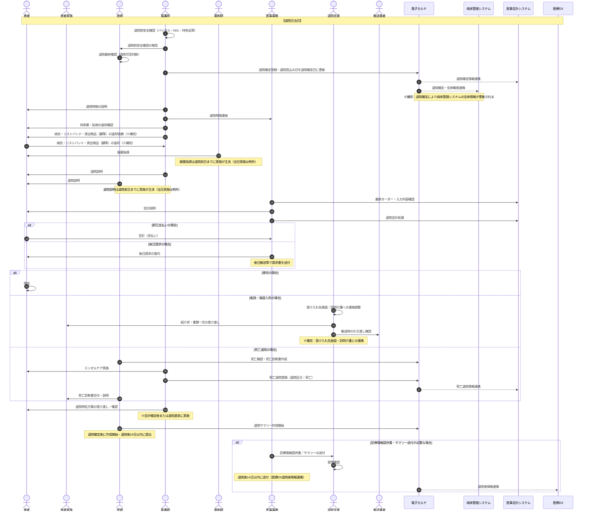

```mermaid
sequenceDiagram
    autonumber
    actor 患者
    actor 患者家族
    actor 医師
    actor 看護師
    actor 薬剤師
    actor 医事事務
    actor 退院支援
    actor 搬送業者
    participant 電子カルテ
    participant 病床管理システム
    participant 医事会計システム
    participant 医療DX

    Note over 患者,医療DX: 【退院日当日】

    看護師->>看護師: 退院前安全確認（バイタル・ADL・持参品等）
    看護師->>医師: 退院前安全確認の報告
    医師->>医師: 退院最終確認（退院可否判断）
    看護師->>電子カルテ: 退院確定登録・退院見込み日を退院確定日に更新
    電子カルテ-->>医事会計システム: 退院確定情報連携
    電子カルテ-->>病床管理システム: 退院確定・空床解放連携
    Note over 電子カルテ,病床管理システム: ※補完：退院確定により病床管理システムの空床情報が更新される

    看護師->>患者: 退院時間の説明
    看護師->>医事事務: 退院時間連絡

    看護師->>患者: 持参薬・私物の返却確認
    看護師->>患者: 病衣・リストバンド・貸出物品（鍵等）の返却依頼（※補完）
    患者->>看護師: 病衣・リストバンド・貸出物品（鍵等）の返却（※補完）

    薬剤師->>患者: 服薬指導
    Note over 薬剤師: 服薬指導は退院前日までに実施が主流（当日実施は例外）

    看護師->>患者: 退院説明
    医師->>患者: 退院説明
    Note over 看護師,医師: 退院説明は退院前日までに実施が主流（当日実施は例外）

    医事事務->>医事会計システム: 最終オーダー・入力内容確認
    医事事務->>患者: 会計説明
    医事事務->>医事会計システム: 退院会計処理
    alt 即日支払いの場合
        患者->>医事事務: 会計（支払い）
    else 後日請求の場合
        医事事務->>患者: 後日請求の案内
        Note over 医事事務: 後日郵送等で請求書を送付
    end

    alt 帰宅の場合
        患者->>患者: 帰宅
    else 転院・施設入所の場合
        退院支援->>退院支援: 受け入れ先施設／訪問介護への連絡調整
        退院支援->>患者家族: 紹介状・書類一式の受け渡し
        退院支援->>搬送業者: 搬送時の引き渡し確認
        Note over 退院支援: ※補完：受け入れ先施設・訪問介護との連携
    else 死亡退院の場合
        医師->>電子カルテ: 死亡確認・死亡診断書作成
        看護師->>患者: エンゼルケア実施
        看護師->>電子カルテ: 死亡退院登録（退院区分：死亡）
        電子カルテ-->>医事会計システム: 死亡退院情報連携
        医師->>患者家族: 死亡診断書交付・説明
    end

    看護師->>患者: 退院時処方薬の受け渡し・確認
    Note over 看護師: ※会計確定後または退院直前に実施

    医師->>電子カルテ: 退院サマリー作成開始
    Note over 医師: 退院確定後に作成開始・退院後14日以内に提出

    alt 診療情報提供書・サマリー送付が必要な場合
        医事事務->>退院支援: 診療情報提供書／サマリーの送付
        退院支援->>退院支援: 受領確認
        Note over 医事事務: 退院後14日以内に送付（医療DX退院後情報連携）
        電子カルテ-->>医療DX: 退院後情報連携
    end
```
