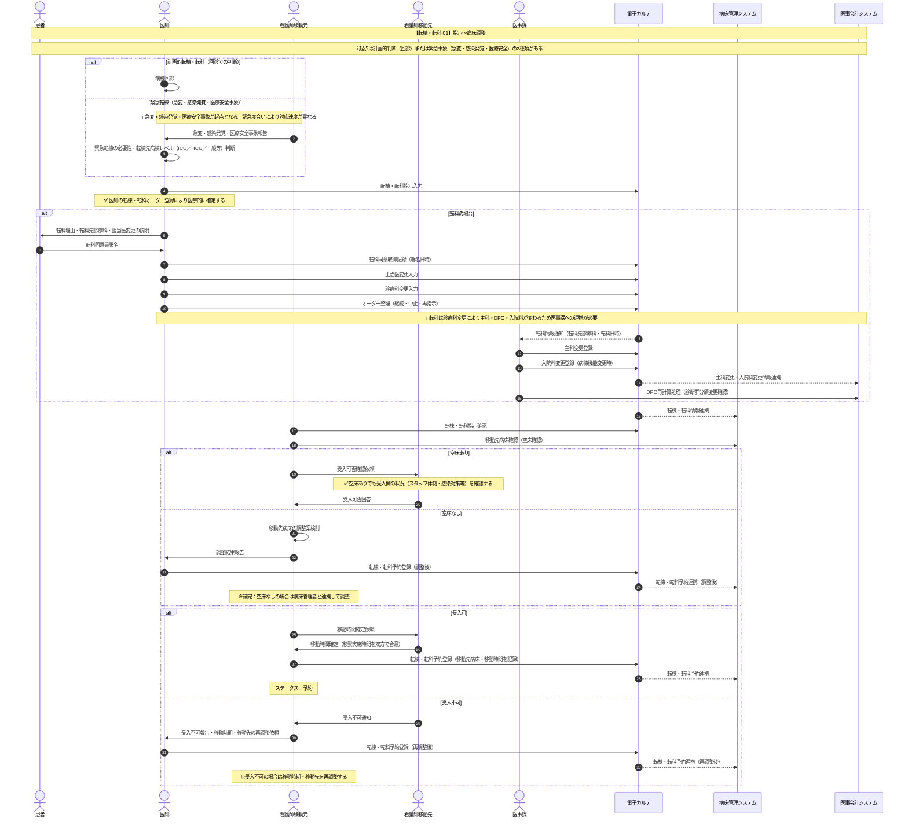

```mermaid
sequenceDiagram
    autonumber
    actor 患者
    actor 医師
    actor 看護師移動元
    actor 看護師移動先
    actor 医事課
    participant 電子カルテ
    participant 病床管理システム
    participant 医事会計システム

    Note over 患者,医事会計システム: 【転棟・転科 01】指示〜病床調整
    Note over 患者,医事会計システム: ℹ️ 起点は計画的判断（回診）または緊急事象（急変・感染発覚・医療安全）の2種類がある

    alt 計画的転棟・転科（回診での判断）
        医師->>医師: 病棟回診
    else 緊急転棟（急変・感染発覚・医療安全事象）
        Note over 医師,看護師移動元: ℹ️ 急変・感染発覚・医療安全事象が起点となる。緊急度合いにより対応速度が異なる
        看護師移動元->>医師: 急変・感染発覚・医療安全事象報告
        医師->>医師: 緊急転棟の必要性・転棟先病棟レベル（ICU／HCU／一般等）判断
    end

    医師->>電子カルテ: 転棟・転科指示入力
    Note over 医師: ✅ 医師の転棟・転科オーダー登録により医学的に確定する

    alt 転科の場合
        医師->>患者: 転科理由・転科先診療科・担当医変更の説明
        患者->>医師: 転科同意書署名
        医師->>電子カルテ: 転科同意取得記録（署名日時）
        医師->>電子カルテ: 主治医変更入力
        医師->>電子カルテ: 診療科変更入力
        医師->>電子カルテ: オーダー整理（継続・中止・再指示）
        Note over 医師,医事会計システム: ℹ️ 転科は診療科変更により主科・DPC・入院料が変わるため医事課への連携が必要
        電子カルテ-->>医事課: 転科情報通知（転科先診療科・転科日時）
        医事課->>電子カルテ: 主科変更登録
        医事課->>電子カルテ: 入院料変更登録（病棟機能変更時）
        電子カルテ-->>医事会計システム: 主科変更・入院料変更情報連携
        医事課->>医事会計システム: DPC再計算処理（診断群分類変更確認）
    end

    電子カルテ-->>病床管理システム: 転棟・転科情報連携

    看護師移動元->>電子カルテ: 転棟・転科指示確認

    看護師移動元->>病床管理システム: 移動先病床確認（空床確認）

    alt 空床あり
        看護師移動元->>看護師移動先: 受入可否確認依頼
        Note over 看護師移動先: ✅ 空床ありでも受入側の状況（スタッフ体制・感染対策等）を確認する
        看護師移動先->>看護師移動元: 受入可否回答
    else 空床なし
        看護師移動元->>看護師移動元: 移動先病床の調整案検討
        看護師移動元->>医師: 調整結果報告
        医師->>電子カルテ: 転棟・転科予約登録（調整後）
        電子カルテ-->>病床管理システム: 転棟・転科予約連携（調整後）
        Note over 看護師移動元: ※補完：空床なしの場合は病床管理者と連携して調整
    end

    alt 受入可
        看護師移動元->>看護師移動先: 移動時間確定依頼
        看護師移動先->>看護師移動元: 移動時間確定（移動実施時間を双方で合意）
        看護師移動元->>電子カルテ: 転棟・転科予約登録（移動先病床・移動時間を記録）
        電子カルテ-->>病床管理システム: 転棟・転科予約連携
        Note over 看護師移動元: ステータス：予約
    else 受入不可
        看護師移動先->>看護師移動元: 受入不可通知
        看護師移動元->>医師: 受入不可報告・移動時期・移動先の再調整依頼
        医師->>電子カルテ: 転棟・転科予約登録（再調整後）
        電子カルテ-->>病床管理システム: 転棟・転科予約連携（再調整後）
        Note over 看護師移動元: ※受入不可の場合は移動時期・移動先を再調整する
    end
```
