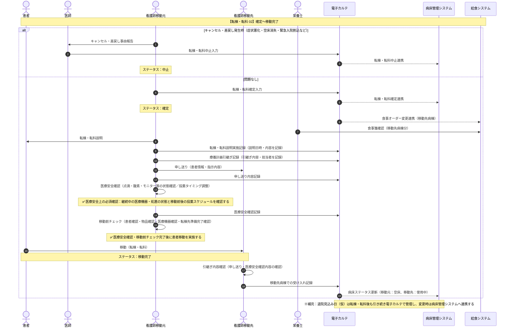

```mermaid
sequenceDiagram
    autonumber
    actor 患者
    actor 医師
    actor 看護師移動元
    actor 看護師移動先
    actor 栄養士
    participant 電子カルテ
    participant 病床管理システム
    participant 給食システム

    Note over 患者,給食システム: 【転棟・転科 02】確定〜移動完了

    alt キャンセル・差戻し発生時（症状悪化・空床消失・緊急入院割込など）
        看護師移動元->>医師: キャンセル・差戻し事由報告
        医師->>電子カルテ: 転棟・転科中止入力
        電子カルテ-->>病床管理システム: 転棟・転科中止連携
        Note over 看護師移動元: ステータス：中止
    else 問題なし
        看護師移動元->>電子カルテ: 転棟・転科確定入力
        電子カルテ-->>病床管理システム: 転棟・転科確定連携
        Note over 看護師移動元: ステータス：確定

        電子カルテ-->>給食システム: 食事オーダー変更連携（移動先病棟）
        栄養士->>給食システム: 食事箋確認（移動先病棟分）

        看護師移動元->>患者: 転棟・転科説明
        看護師移動元->>電子カルテ: 転棟・転科説明実施記録（説明日時・内容を記録）
        看護師移動元->>電子カルテ: 療養計画引継ぎ記録（引継ぎ内容・担当者を記録）
        看護師移動元->>看護師移動先: 申し送り（患者情報・指示内容）
        看護師移動元->>電子カルテ: 申し送り内容記録

        看護師移動元->>看護師移動元: 医療安全確認（点滴・酸素・モニター等の状態確認／投薬タイミング調整）
        Note over 看護師移動元: ✅ 医療安全上の必須確認：継続中の医療機器・処置の状態と移動前後の投薬スケジュールを確認する
        看護師移動元->>電子カルテ: 医療安全確認記録

        看護師移動元->>看護師移動元: 移動前チェック（患者確認・物品確認・医療機器確認・転棟先準備完了確認）
        Note over 看護師移動元: ✅ 医療安全確認・移動前チェック完了後に患者移動を実施する

        患者->>看護師移動先: 移動（転棟・転科）
        Note over 患者,看護師移動先: ステータス：移動完了

        看護師移動先->>看護師移動先: 引継ぎ内容確認（申し送り・医療安全確認内容の確認）
        看護師移動先->>電子カルテ: 移動先病棟での受け入れ記録
        電子カルテ-->>病床管理システム: 病床ステータス更新（移動元：空床、移動先：使用中）
    end

    Note over 電子カルテ,病床管理システム: ※補完：退院見込み日（仮）は転棟・転科後も引き続き電子カルテで管理し、変更時は病床管理システムへ連携する
```
