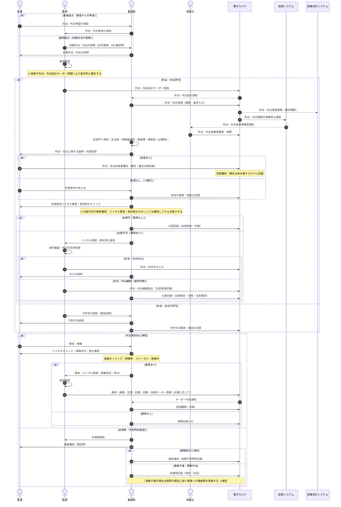

```mermaid
sequenceDiagram
    autonumber
    actor 患者
    actor 医師
    actor 看護師
    actor 栄養士
    participant 電子カルテ
    participant 給食システム
    participant 医事会計システム

    %% ─────────────────────────────────────
    %% 外泊・外出の起点
    %% ─────────────────────────────────────
    alt 患者起点（患者からの希望）
        患者->>看護師: 外泊・外出希望の相談
        看護師->>医師: 外泊・外出希望の相談
    else 医師起点（試験外泊の提案）
        医師->>看護師: 試験外泊・外出の提案（在宅復帰・ADL確認等）
        看護師->>患者: 試験外泊・外出の説明
    end

    %% ─────────────────────────────────────
    %% 外泊・外出指示・登録
    %% ─────────────────────────────────────
    医師->>医師: 病状確認
    Note over 医師: ✅ 医師の外泊・外出指示オーダー登録により医学的に確定する

    alt 外泊・外出許可
        医師->>電子カルテ: 外泊・外出指示オーダー登録
        電子カルテ-->>看護師: 外泊・外出指示通知
        看護師->>電子カルテ: 外泊・外出登録（期間・条件入力）
        電子カルテ-->>医事会計システム: 外泊・外出情報連携（請求調整）
        電子カルテ-->>給食システム: 外泊・外出期間の食事停止連携
        給食システム-->>栄養士: 外泊・外出食事箋確認通知
        栄養士->>電子カルテ: 外泊・外出食事箋確認・調整
        看護師->>看護師: 各部門へ周知（主治医・病棟看護師・医事課・薬剤部（必要時））
        看護師->>患者: 外泊・外出に関する説明・同意取得

        alt 同意あり
            患者->>電子カルテ: 外泊・外出同意書署名（種別・署名日時記録）
            Note over 電子カルテ: 同意種別・署名日時を電子カルテに記録
        else 同意なし（※補完）
            患者->>看護師: 同意拒否の申し出
            看護師->>電子カルテ: 拒否の事実・理由を記録
        end

        %% ─────────────────────────────────────
        %% 出発直前の最終可否確認・出発記録
        %% ─────────────────────────────────────
        看護師->>患者: 出発直前バイタル確認・病状変化チェック
        Note over 看護師: ✅ 出発可否の最終確認：バイタル異常・病状変化がないことを確認してから出発させる
        alt 出発可（異常なし）
            看護師->>電子カルテ: 出発記録（出発時刻・状態）
        else 出発不可（異常あり）
            看護師->>医師: バイタル異常・病状変化報告
            医師->>医師: 病状確認・外泊可否再判断
            alt 外泊・外出中止
                医師->>電子カルテ: 外泊・外出中止入力
                看護師->>患者: 中止の説明
            else 外泊・外出継続（医師判断）
                医師->>電子カルテ: 外泊・外出継続指示（注意事項記録）
                看護師->>電子カルテ: 出発記録（出発時刻・状態・注意事項）
            end
        end

    else 外泊・外出不許可
        医師->>看護師: 不許可の通知（理由説明）
        看護師->>患者: 不許可の説明
        看護師->>電子カルテ: 不許可の事実・理由を記録
    end

    %% ─────────────────────────────────────
    %% 帰院・未帰院
    %% ─────────────────────────────────────
    alt 予定時刻内に帰院
        患者->>看護師: 帰院・帰棟
        看護師->>患者: バイタルチェック・服薬状況・変化確認
        Note over 看護師: 実施タイミング：帰棟時　ステータス：実施中

        alt 異常あり
            看護師->>医師: 報告（バイタル異常・服薬状況・変化）
            医師->>医師: 病状確認
            医師->>電子カルテ: 検体・画像・生理・処置・投薬・治療オーダー登録（必要に応じて）
            電子カルテ-->>看護師: オーダー内容通知
            看護師->>電子カルテ: 経過観察・記録
        else 異常なし
            看護師->>電子カルテ: 帰棟記録入力
        end

    else 未帰院（予定時刻超過）
        看護師->>医師: 未帰院報告
        看護師->>患者: 連絡確認（電話等）
        alt 連絡取れた場合
            看護師->>電子カルテ: 遅延理由・到着予定時刻記録
        else 連絡不通・無断外泊
            看護師->>電子カルテ: 未帰院記録（時刻・状況）
            Note over 看護師,電子カルテ: ℹ️ 連絡不通の場合は病院の規定に従い家族への連絡等を実施する ※補完
        end
    end
```
