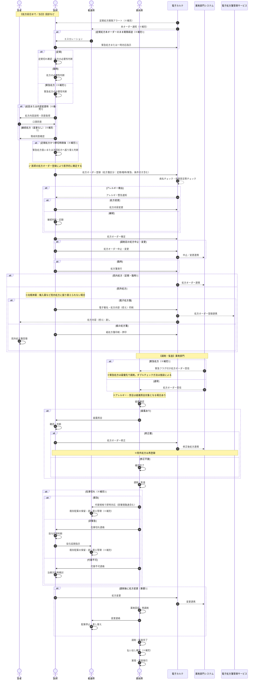
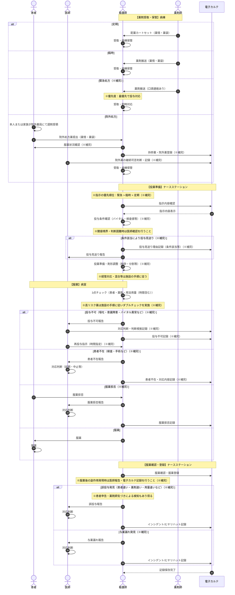

## 1. 処方オーダー入力〜薬剤準備

```mermaid
sequenceDiagram
    autonumber
    actor 患者
    actor 医師
    actor 看護師
    actor 薬剤師
    participant 電子カルテ
    participant 薬剤部門システム
    participant 電子処方箋管理サービス

    Note over 患者,医師: 【処方前日まで／当日】回診など
    電子カルテ -->> 医師: 定期処方期限アラート（※補完）
    電子カルテ -->> 看護師: 未オーダー通知（※補完）

    alt 定期処方未オーダーのまま期限超過（※補完）
        看護師 ->> 医師: エスカレーション
        医師 ->> 電子カルテ: 緊急処方または一時対応指示
    end

    alt 定期
        医師 ->> 医師: 定期切れ確認・処方の必要性判断
    else 臨時
        医師 ->> 医師: 処方の必要性判断
    else 緊急処方（※補完）
        医師 ->> 医師: 緊急処方の必要性判断
    end

    alt 初回または内容変更時（※補完）
        医師 ->> 患者: 処方内容説明・同意取得
        患者 ->> 医師: 口頭同意
    else 継続処方（変更なし）（※補完）
        医師 ->> 患者: 簡易同意確認
    end

    alt 定期処方かつ締切時限後（※補完）
        医師 ->> 医師: 緊急処方扱いまたは次回処方へ振り替え判断
    end

    Note over 医師: ✅ 医師の処方オーダー登録により医学的に確定する
    医師 ->> 電子カルテ: 処方オーダー登録（処方箋区分：定期/臨時/緊急、条件付き含む）

    電子カルテ -->> 電子カルテ: 病名チェック・併用禁忌等チェック
    alt アレルギー検出
        電子カルテ -->> 医師: アレルギー警告通知
        alt 処方変更
            医師 ->> 電子カルテ: 処方内容変更
        else 継続
            医師 ->> 医師: 継続判断・記録
        end
    end

    医師 ->> 電子カルテ: 処方オーダー確定

    alt 調剤前の処方中止・変更
        医師 ->> 電子カルテ: 処方オーダー中止・変更
        電子カルテ -->> 薬剤部門システム: 中止／変更連携
    end

    alt 臨時
        医師 ->> 電子カルテ: 処方箋発行
    end

    alt 院内処方（定期・臨時）
        電子カルテ -->> 薬剤部門システム: 処方オーダー連携
    else 院外処方
        Note over 医師: ※向精神薬・輸入薬など院内処方に振り替えられない場合
        alt 電子処方箋
            医師 ->> 電子カルテ: 電子署名・処方内容（控え）印刷
            電子カルテ -->> 電子処方箋管理サービス: 処方オーダー登録連携
            電子カルテ -->> 患者: 処方内容（控え）渡し
        else 紙の処方箋
            医師 ->> 電子カルテ: 紙処方箋印刷・押印
            患者 ->> 患者: 院外処方箋受領
        end
    end

    Note over 薬剤師,薬剤部門システム: 【調剤・監査】薬剤部門
    alt 緊急処方（※補完）
        薬剤部門システム -->> 薬剤師: 緊急フラグ付き処方オーダー受信
        Note over 薬剤師: ※緊急処方は最優先で調剤。ダブルチェック方法は施設による
    else 通常
        薬剤部門システム -->> 薬剤師: 処方オーダー受信
    end

    Note over 薬剤師: ※アレルギー・禁忌は疑義照会対象となる場合あり
    薬剤師 ->> 薬剤師: 疑義確認

    alt 疑義あり
        薬剤師 ->> 医師: 疑義照会
        医師 ->> 医師: 確認・判断
        alt 修正要
            医師 ->> 電子カルテ: 処方オーダー修正
            電子カルテ -->> 薬剤部門システム: 修正後処方連携
            Note over 医師,電子処方箋管理サービス: ※院外処方は再登録
        else 修正不要
            薬剤師 ->> 薬剤師: 確認完了
        end
    end

    薬剤師 ->> 薬剤師: 調剤・監査

    alt 在庫切れ（※補完）
        alt 緊急
            薬剤師 ->> 看護師: 代替規格で即時対応（部署間融通含む）
            看護師 ->> 看護師: 既存配薬の保留・差し替え管理（※補完）
        else 非緊急
            薬剤師 ->> 医師: 在庫切れ連絡
            医師 ->> 医師: 投与延期判断
            医師 ->> 看護師: 投与延期指示
            看護師 ->> 看護師: 既存配薬の保留・差し替え管理（※補完）
        else 代替不可
            薬剤師 ->> 医師: 代替不可連絡
            医師 ->> 医師: 治療方針再検討
        end
    end

    alt 調剤後に処方変更（重要）
        医師 ->> 電子カルテ: 処方変更
        電子カルテ -->> 薬剤部門システム: 変更連携
        薬剤師 ->> 薬剤師: 薬剤回収・再調剤
        薬剤師 ->> 看護師: 変更連絡
        看護師 ->> 看護師: 配薬停止・差し替え
    end

    薬剤師 ->> 薬剤師: 調剤・監査完了
    薬剤師 ->> 薬剤師: 払い出し確定（※補完）
    薬剤師 ->> 薬剤師: 薬情・薬袋発行
```

## 2. 薬剤受取〜服薬確認

```mermaid
sequenceDiagram
    autonumber
    actor 患者
    actor 医師
    actor 看護師
    actor 薬剤師
    participant 電子カルテ

    Note over 看護師,薬剤師: 【薬剤受取・保管】病棟
    alt 定期
        薬剤師 ->> 看護師: 配薬カートセット（薬情・薬袋）
        看護師 ->> 看護師: 受取・病棟保管
    else 臨時
        薬剤師 ->> 看護師: 薬剤搬送（薬情・薬袋）
        看護師 ->> 看護師: 受取・病棟保管
    else 緊急処方（※補完）
        薬剤師 ->> 看護師: 薬剤搬送（口頭連絡あり）
        Note over 看護師: ※優先度：最優先で投与対応
        看護師 ->> 看護師: 受取・即時対応
    else 院外処方
        患者 ->> 患者: 本人または家族が院外薬局にて調剤受領
        患者 ->> 看護師: 院外処方薬提出（薬情・薬袋）
        看護師 ->> 患者: 服薬状況確認（※補完）
        看護師 ->> 電子カルテ: 持参薬・院外薬登録（※補完）
        医師 ->> 電子カルテ: 院外薬の継続可否判断・記録（※補完）
        看護師 ->> 看護師: 受取・病棟保管
    end

    Note over 看護師,電子カルテ: 【投薬準備】ナースステーション
    Note over 看護師: ※指示の優先順位：緊急 > 臨時 > 定期（※補完）
    看護師 ->> 電子カルテ: 指示内容確認
    電子カルテ -->> 看護師: 指示内容表示
    看護師 ->> 看護師: 投与条件確認（バイタル・検査値等）（※補完）
    Note over 看護師: ※閾値境界・判断困難時は医師確認を行うこと
    alt 条件該当により投与見送り（※補完）
        看護師 ->> 電子カルテ: 投与見送り理由記録（条件該当等）（※補完）
        看護師 ->> 医師: 投与見送り報告
    end
    看護師 ->> 看護師: 投薬準備・剤形調整（粉砕・分割等）（※補完）
    Note over 看護師: ※経管対応・混合等は施設の手順に従う

    Note over 患者,看護師: 【服薬】病室
    看護師 ->> 看護師: 3点チェック（患者・薬剤・用法用量（時間含む））
    Note over 看護師: ※高リスク薬は施設の手順に従いダブルチェックを実施（※補完）
    alt 投与不可（嘔吐・意識障害・バイタル異常など）（※補完）
        看護師 ->> 医師: 投与不可報告
        医師 ->> 電子カルテ: 対応判断・判断根拠記録（※補完）
        看護師 ->> 電子カルテ: 投与不可記録（※補完）
        医師 ->> 看護師: 再投与指示（時間指定）（※補完）
    else 患者不在（検査・手術など）（※補完）
        看護師 ->> 医師: 患者不在報告
        医師 ->> 医師: 対応判断（延期・中止等）
        看護師 ->> 電子カルテ: 患者不在・対応内容記録（※補完）
    else 服薬拒否（※補完）
        患者 ->> 看護師: 服薬拒否
        看護師 ->> 医師: 服薬拒否報告
        医師 ->> 医師: 対応判断
        看護師 ->> 電子カルテ: 服薬拒否記録
    else 服薬
        看護師 ->> 患者: 服薬
        患者 ->> 患者: 服薬
    end

    Note over 看護師,電子カルテ: 【服薬確認・登録】ナースステーション
    看護師 ->> 電子カルテ: 服薬確認・服薬登録
    Note over 看護師: ※服薬後の副作用発現時は医師報告・電子カルテ記録を行うこと（※補完）
    alt 誤投与発見（患者違い・薬剤違い・用量違いなど）（※補完）
        Note over 看護師: ※患者申告・薬剤師気づきによる検知もあり得る
        看護師 ->> 医師: 誤投与報告
        医師 ->> 医師: 対応判断
        看護師 ->> 電子カルテ: インシデント/ヒヤリハット記録
    else 与薬漏れ発見（※補完）
        看護師 ->> 医師: 与薬漏れ報告
        医師 ->> 医師: 対応判断
        看護師 ->> 電子カルテ: インシデント/ヒヤリハット記録
    end
    電子カルテ -->> 看護師: 記録保存完了
```