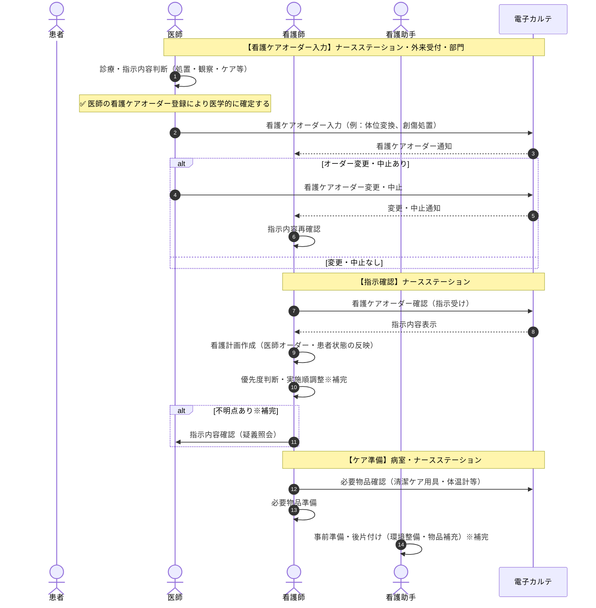
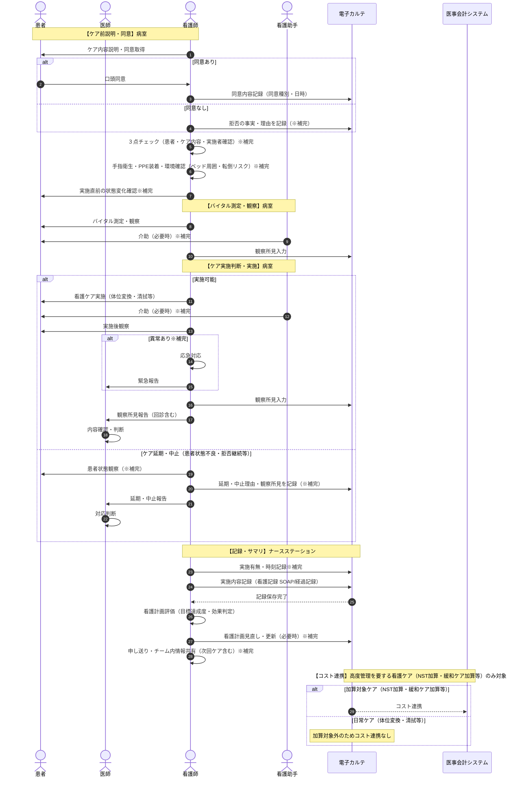

## 1. 看護ケアオーダー入力〜ケア準備

```mermaid
sequenceDiagram
    autonumber
    actor 患者
    actor 医師
    actor 看護師
    actor 看護助手
    participant 電子カルテ

    Note over 医師,電子カルテ: 【看護ケアオーダー入力】ナースステーション・外来受付・部門
    医師 ->> 医師: 診療・指示内容判断（処置・観察・ケア等）
    Note over 医師: ✅ 医師の看護ケアオーダー登録により医学的に確定する
    医師 ->> 電子カルテ: 看護ケアオーダー入力（例：体位変換、創傷処置）
    電子カルテ -->> 看護師: 看護ケアオーダー通知

    alt オーダー変更・中止あり
        医師 ->> 電子カルテ: 看護ケアオーダー変更・中止
        電子カルテ -->> 看護師: 変更・中止通知
        看護師 ->> 看護師: 指示内容再確認
    else 変更・中止なし
    end

    Note over 看護師,電子カルテ: 【指示確認】ナースステーション
    看護師 ->> 電子カルテ: 看護ケアオーダー確認（指示受け）
    電子カルテ -->> 看護師: 指示内容表示
    看護師 ->> 看護師: 看護計画作成（医師オーダー・患者状態の反映）
    看護師 ->> 看護師: 優先度判断・実施順調整※補完

    alt 不明点あり※補完
        看護師 ->> 医師: 指示内容確認（疑義照会）
    end

    Note over 看護師,電子カルテ: 【ケア準備】病室・ナースステーション
    看護師 ->> 電子カルテ: 必要物品確認（清潔ケア用具・体温計等）
    看護師 ->> 看護師: 必要物品準備
    看護助手 ->> 看護助手: 事前準備・後片付け（環境整備・物品補充）※補完
```

## 2. ケア実施〜記録・コスト連携

```mermaid
sequenceDiagram
    autonumber
    actor 患者
    actor 医師
    actor 看護師
    actor 看護助手
    participant 電子カルテ
    participant 医事会計システム

    Note over 看護師,患者: 【ケア前説明・同意】病室
    看護師 ->> 患者: ケア内容説明・同意取得
    alt 同意あり
        患者 ->> 看護師: 口頭同意
        看護師 ->> 電子カルテ: 同意内容記録（同意種別・日時）
    else 同意なし
        看護師 ->> 電子カルテ: 拒否の事実・理由を記録（※補完）
    end

    看護師 ->> 看護師: ３点チェック（患者・ケア内容・実施者確認）※補完
    看護師 ->> 看護師: 手指衛生・PPE装着・環境確認（ベッド周囲・転倒リスク）※補完
    看護師 ->> 患者: 実施直前の状態変化確認※補完

    Note over 看護師,看護助手: 【バイタル測定・観察】病室
    看護師 ->> 患者: バイタル測定・観察
    看護助手 ->> 患者: 介助（必要時）※補完
    看護師 ->> 電子カルテ: 観察所見入力

    Note over 看護師,看護助手: 【ケア実施判断・実施】病室
    alt 実施可能
        看護師 ->> 患者: 看護ケア実施（体位変換・清拭等）
        看護助手 ->> 患者: 介助（必要時）※補完
        看護師 ->> 患者: 実施後観察
        alt 異常あり※補完
            看護師 ->> 看護師: 応急対応
            看護師 ->> 医師: 緊急報告
        end
        看護師 ->> 電子カルテ: 観察所見入力
        看護師 ->> 医師: 観察所見報告（回診含む）
        医師 ->> 医師: 内容確認・判断
    else ケア延期・中止（患者状態不良・拒否継続等）
        看護師 ->> 患者: 患者状態観察（※補完）
        看護師 ->> 電子カルテ: 延期・中止理由・観察所見を記録（※補完）
        看護師 ->> 医師: 延期・中止報告
        医師 ->> 医師: 対応判断
    end

    Note over 看護師,電子カルテ: 【記録・サマリ】ナースステーション
    看護師 ->> 電子カルテ: 実施有無・時刻記録※補完
    看護師 ->> 電子カルテ: 実施内容記録（看護記録 SOAP/経過記録）
    電子カルテ -->> 看護師: 記録保存完了
    看護師 ->> 看護師: 看護計画評価（目標達成度・効果判定）
    看護師 ->> 電子カルテ: 看護計画見直し・更新（必要時）※補完
    看護師 ->> 看護師: 申し送り・チーム内情報共有（次回ケア含む）※補完

    Note over 電子カルテ,医事会計システム: 【コスト連携】高度管理を要する看護ケア（NST加算・緩和ケア加算等）のみ対象
    alt 加算対象ケア（NST加算・緩和ケア加算等）
        電子カルテ -->> 医事会計システム: コスト連携
    else 日常ケア（体位変換・清拭等）
        Note over 電子カルテ: 加算対象外のためコスト連携なし
    end
```
