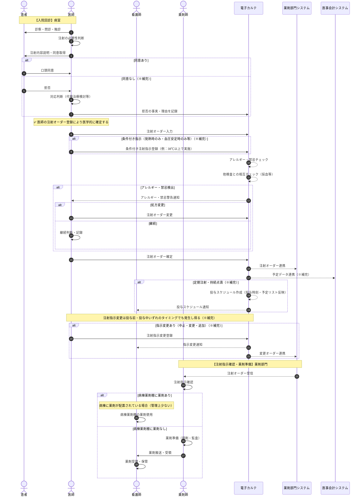
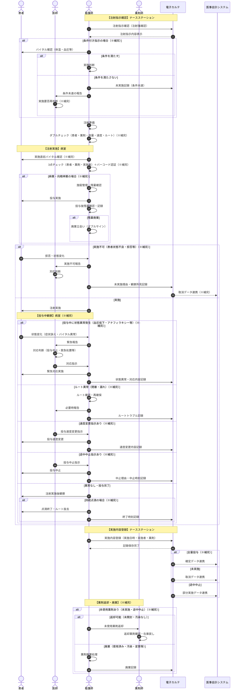
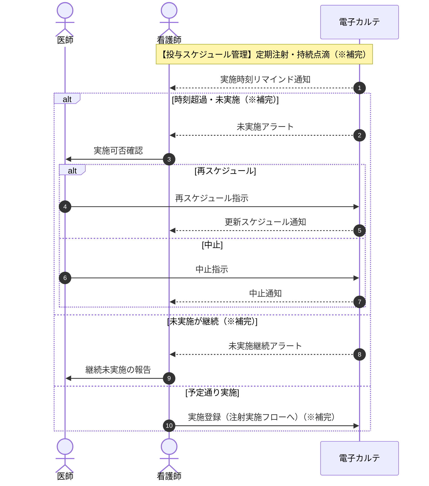

## 1. 注射オーダー入力〜薬剤準備

```mermaid
sequenceDiagram
    autonumber
    actor 患者
    actor 医師
    actor 看護師
    actor 薬剤師
    participant 電子カルテ
    participant 薬剤部門システム
    participant 医事会計システム

    Note over 医師,患者: 【入院回診】病室
    医師 ->> 患者: 診察・問診・触診
    医師 ->> 医師: 注射の必要性判断
    医師 ->> 患者: 注射内容説明・同意取得
    alt 同意あり
        患者 ->> 医師: 口頭同意
    else 同意なし（※補完）
        患者 ->> 医師: 拒否
        医師 ->> 医師: 対応判断（代替治療検討等）
        医師 ->> 電子カルテ: 拒否の事実・理由を記録
    end

    Note over 医師: ✅ 医師の注射オーダー登録により医学的に確定する
    医師 ->> 電子カルテ: 注射オーダー入力

    alt 条件付き指示（発熱時のみ・血圧安定時のみ等）（※補完）
        医師 ->> 電子カルテ: 条件付き注射指示登録（例：38℃以上で実施）
    end

    電子カルテ -->> 電子カルテ: アレルギー・禁忌チェック
    電子カルテ -->> 電子カルテ: 他検査との相互チェック（採血等）
    alt アレルギー・禁忌検出
        電子カルテ -->> 医師: アレルギー・禁忌警告通知
        alt 処方変更
            医師 ->> 電子カルテ: 注射オーダー変更
        else 継続
            医師 ->> 医師: 継続判断・記録
        end
    end

    医師 ->> 電子カルテ: 注射オーダー確定
    電子カルテ -->> 薬剤部門システム: 注射オーダー連携
    電子カルテ -->> 医事会計システム: 予定データ連携（※補完）

    alt 定期注射・持続点滴（※補完）
        電子カルテ -->> 電子カルテ: 投与スケジュール作成（投与時刻・予定リスト反映）
        電子カルテ -->> 看護師: 投与スケジュール通知
    end

    Note over 医師,電子カルテ: 注射指示変更は投与前・投与中いずれのタイミングでも発生し得る（※補完）
    alt 指示変更あり（中止・変更・追加）（※補完）
        医師 ->> 電子カルテ: 注射指示変更登録
        電子カルテ -->> 看護師: 指示変更通知
        電子カルテ -->> 薬剤部門システム: 変更オーダー連携
    end

    Note over 薬剤師,薬剤部門システム: 【注射指示確認・薬剤準備】薬剤部門
    薬剤部門システム -->> 薬剤師: 注射オーダー受信
    薬剤師 ->> 薬剤師: 注射指示確認

    alt 病棟薬剤棚に薬剤あり
        Note over 看護師: 病棟に薬剤が配置されている場合（管理上少ない）
        看護師 ->> 看護師: 病棟薬剤棚の薬剤使用
    else 病棟薬剤棚に薬剤なし
        薬剤師 ->> 薬剤師: 薬剤準備（調剤・監査）
        薬剤師 ->> 看護師: 薬剤搬送・受領
        看護師 ->> 看護師: 薬剤受領・保管
    end
```

## 2. 注射実施〜実施記録・薬剤返却廃棄

```mermaid
sequenceDiagram
    autonumber
    actor 患者
    actor 医師
    actor 看護師
    actor 薬剤師
    participant 電子カルテ
    participant 医事会計システム

    Note over 看護師,電子カルテ: 【注射指示確認】ナースステーション
    看護師 ->> 電子カルテ: 注射指示確認（注射箋確認）
    電子カルテ -->> 看護師: 注射指示内容表示

    alt 条件付き指示の場合（※補完）
        看護師 ->> 患者: バイタル確認（体温・血圧等）
        alt 条件を満たす
            看護師 ->> 看護師: 実施判断
        else 条件を満たさない
            看護師 ->> 電子カルテ: 未実施記録（条件未達）
            看護師 ->> 医師: 条件未達の報告
            医師 ->> 医師: 実施要否再判断（※補完）
        end
    end

    看護師 ->> 看護師: 注射準備
    看護師 ->> 看護師: ダブルチェック（患者・薬剤・用量・速度・ルート）（※補完）

    Note over 看護師,患者: 【注射実施】病室
    看護師 ->> 患者: 実施直前バイタル確認（※補完）
    看護師 ->> 看護師: 3点チェック（患者・薬剤・実施者）＋バーコード認証（※補完）

    alt 麻薬・向精神薬の場合（※補完）
        看護師 ->> 看護師: 施錠管理・残量確認
        看護師 ->> 患者: 投与実施
        看護師 ->> 看護師: 投与後残量確認・記録
        alt 残量廃棄
            看護師 ->> 看護師: 廃棄立会い（ダブルサイン）
        end
    end

    alt 実施不可（患者状態不良・拒否等）（※補完）
        患者 ->> 看護師: 拒否・状態変化
        看護師 ->> 医師: 実施不可報告
        医師 ->> 医師: 対応判断
        看護師 ->> 電子カルテ: 未実施理由・観察所見記録
        電子カルテ -->> 医事会計システム: 取消データ連携（※補完）
    else 実施
        看護師 ->> 患者: 注射実施

        Note over 看護師,患者: 【投与中観察】病室（※補完）
        alt 投与中に状態異常発生（血圧低下・アナフィラキシー等）（※補完）
            患者 ->> 看護師: 状態変化（症状訴え・バイタル異常）
            看護師 ->> 医師: 緊急報告
            医師 ->> 医師: 対応判断（投与中止・救急処置等）
            医師 ->> 看護師: 対応指示
            看護師 ->> 患者: 緊急対応実施
            看護師 ->> 電子カルテ: 状態異常・対応内容記録
        else ルート異常（閉塞・漏れ）（※補完）
            看護師 ->> 看護師: ルート確認・再確保
            看護師 ->> 医師: 必要時報告
            看護師 ->> 電子カルテ: ルートトラブル記録
        else 速度変更指示あり（※補完）
            医師 ->> 看護師: 投与速度変更指示
            看護師 ->> 患者: 投与速度変更
            看護師 ->> 電子カルテ: 速度変更内容記録
        else 途中中止指示あり（※補完）
            医師 ->> 看護師: 投与中止指示
            看護師 ->> 患者: 投与中止
            看護師 ->> 電子カルテ: 中止理由・中止時刻記録
        else 異常なし・投与完了
            看護師 ->> 患者: 注射実施後観察
            alt 持続点滴の場合（※補完）
                看護師 ->> 患者: 点滴終了・ルート抜去
                看護師 ->> 電子カルテ: 終了時刻記録
            end
        end
    end

    Note over 看護師,電子カルテ: 【実施内容登録】ナースステーション
    看護師 ->> 電子カルテ: 実施内容登録（実施日時・実施者・薬剤）
    電子カルテ -->> 看護師: 記録保存完了
    alt 全量投与（※補完）
        電子カルテ -->> 医事会計システム: 確定データ連携
    else 未実施
        電子カルテ -->> 医事会計システム: 取消データ連携
    else 途中中止
        電子カルテ -->> 医事会計システム: 部分実施データ連携
    end

    Note over 看護師,薬剤師: 【薬剤返却・廃棄】（※補完）
    alt 未使用薬剤あり（未実施・途中中止）（※補完）
        alt 返却可能（未開封・汚染なし）
            看護師 ->> 薬剤師: 未使用薬剤返却
            薬剤師 ->> 薬剤師: 返却薬剤確認・在庫戻し
        else 廃棄（使用済み・汚染・変質等）
            看護師 ->> 看護師: 薬剤廃棄処理
            看護師 ->> 電子カルテ: 廃棄記録
        end
    end
```

## 3. 投与スケジュール管理

```mermaid
sequenceDiagram
    autonumber
    actor 医師
    actor 看護師
    participant 電子カルテ

    Note over 看護師,電子カルテ: 【投与スケジュール管理】定期注射・持続点滴（※補完）
    電子カルテ -->> 看護師: 実施時刻リマインド通知
    alt 時刻超過・未実施（※補完）
        電子カルテ -->> 看護師: 未実施アラート
        看護師 ->> 医師: 実施可否確認
        alt 再スケジュール
            医師 ->> 電子カルテ: 再スケジュール指示
            電子カルテ -->> 看護師: 更新スケジュール通知
        else 中止
            医師 ->> 電子カルテ: 中止指示
            電子カルテ -->> 看護師: 中止通知
        end
    else 未実施が継続（※補完）
        電子カルテ -->> 看護師: 未実施継続アラート
        看護師 ->> 医師: 継続未実施の報告
    else 予定通り実施
        看護師 ->> 電子カルテ: 実施登録（注射実施フローへ）（※補完）
    end
```