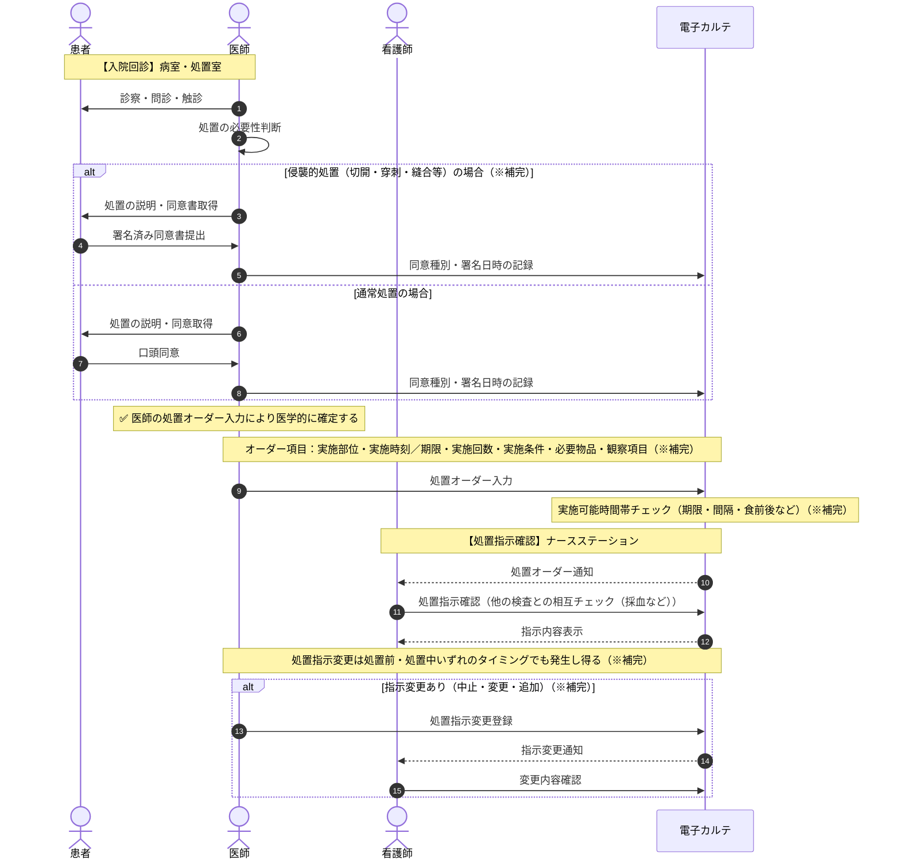
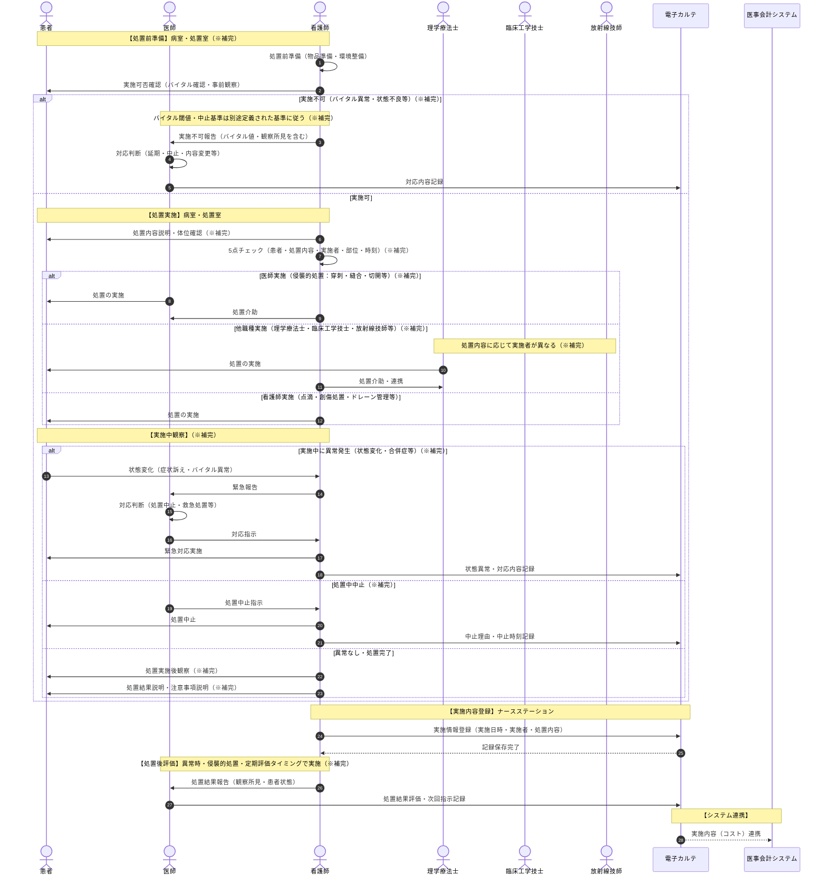
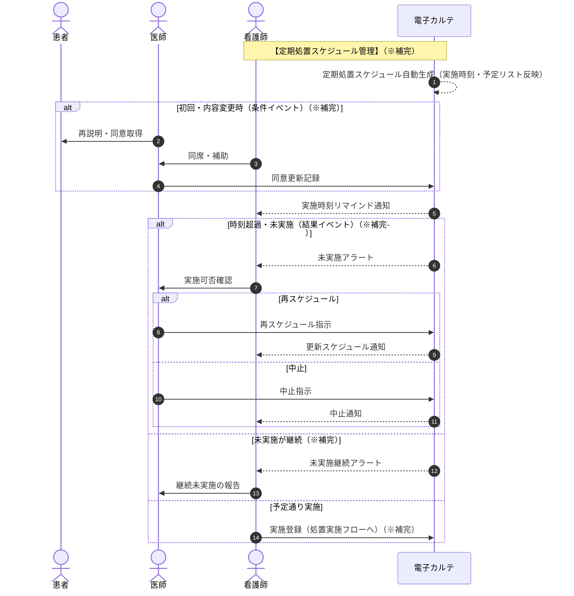

## 1. 処置オーダー入力〜処置指示確認

```mermaid
sequenceDiagram
    autonumber
    actor 患者
    actor 医師
    actor 看護師
    participant 電子カルテ

    Note over 医師,患者: 【入院回診】病室・処置室
    医師 ->> 患者: 診察・問診・触診
    医師 ->> 医師: 処置の必要性判断
    alt 侵襲的処置（切開・穿刺・縫合等）の場合（※補完）
        医師 ->> 患者: 処置の説明・同意書取得
        患者 ->> 医師: 署名済み同意書提出
        医師 ->> 電子カルテ: 同意種別・署名日時の記録
    else 通常処置の場合
        医師 ->> 患者: 処置の説明・同意取得
        患者 ->> 医師: 口頭同意
        医師 ->> 電子カルテ: 同意種別・署名日時の記録
    end
    Note over 医師: ✅ 医師の処置オーダー入力により医学的に確定する
    Note over 医師,電子カルテ: オーダー項目：実施部位・実施時刻／期限・実施回数・実施条件・必要物品・観察項目（※補完）
    医師 ->> 電子カルテ: 処置オーダー入力
    Note over 電子カルテ: 実施可能時間帯チェック（期限・間隔・食前後など）（※補完）

    Note over 看護師,電子カルテ: 【処置指示確認】ナースステーション
    電子カルテ -->> 看護師: 処置オーダー通知
    看護師 ->> 電子カルテ: 処置指示確認（他の検査との相互チェック（採血など））
    電子カルテ -->> 看護師: 指示内容表示

    Note over 医師,電子カルテ: 処置指示変更は処置前・処置中いずれのタイミングでも発生し得る（※補完）
    alt 指示変更あり（中止・変更・追加）（※補完）
        医師 ->> 電子カルテ: 処置指示変更登録
        電子カルテ -->> 看護師: 指示変更通知
        看護師 ->> 電子カルテ: 変更内容確認
    end
```

## 2. 処置前準備〜処置実施〜実施内容登録・システム連携

```mermaid
sequenceDiagram
    autonumber
    actor 患者
    actor 医師
    actor 看護師
    actor 理学療法士
    actor 臨床工学技士
    actor 放射線技師
    participant 電子カルテ
    participant 医事会計システム

    Note over 看護師,患者: 【処置前準備】病室・処置室（※補完）
    看護師 ->> 看護師: 処置前準備（物品準備・環境整備）
    看護師 ->> 患者: 実施可否確認（バイタル確認・事前観察）
    alt 実施不可（バイタル異常・状態不良等）（※補完）
        Note over 看護師,医師: バイタル閾値・中止基準は別途定義された基準に従う（※補完）
        看護師 ->> 医師: 実施不可報告（バイタル値・観察所見を含む）
        医師 ->> 医師: 対応判断（延期・中止・内容変更等）
        医師 ->> 電子カルテ: 対応内容記録
    else 実施可
        Note over 看護師,患者: 【処置実施】病室・処置室
        看護師 ->> 患者: 処置内容説明・体位確認（※補完）
        看護師 ->> 看護師: 5点チェック（患者・処置内容・実施者・部位・時刻）（※補完）
        alt 医師実施（侵襲的処置：穿刺・縫合・切開等）（※補完）
            医師 ->> 患者: 処置の実施
            看護師 ->> 医師: 処置介助
        else 他職種実施（理学療法士・臨床工学技士・放射線技師等）（※補完）
            Note over 理学療法士,放射線技師: 処置内容に応じて実施者が異なる（※補完）
            理学療法士 ->> 患者: 処置の実施
            看護師 ->> 理学療法士: 処置介助・連携
        else 看護師実施（点滴・創傷処置・ドレーン管理等）
            看護師 ->> 患者: 処置の実施
        end

        Note over 看護師,患者: 【実施中観察】（※補完）
        alt 実施中に異常発生（状態変化・合併症等）（※補完）
            患者 ->> 看護師: 状態変化（症状訴え・バイタル異常）
            看護師 ->> 医師: 緊急報告
            医師 ->> 医師: 対応判断（処置中止・救急処置等）
            医師 ->> 看護師: 対応指示
            看護師 ->> 患者: 緊急対応実施
            看護師 ->> 電子カルテ: 状態異常・対応内容記録
        else 処置中中止（※補完）
            医師 ->> 看護師: 処置中止指示
            看護師 ->> 患者: 処置中止
            看護師 ->> 電子カルテ: 中止理由・中止時刻記録
        else 異常なし・処置完了
            看護師 ->> 患者: 処置実施後観察（※補完）
            看護師 ->> 患者: 処置結果説明・注意事項説明（※補完）
        end
    end

    Note over 看護師,電子カルテ: 【実施内容登録】ナースステーション
    看護師 ->> 電子カルテ: 実施情報登録（実施日時・実施者・処置内容）
    電子カルテ -->> 看護師: 記録保存完了

    Note over 看護師,医師: 【処置後評価】異常時・侵襲的処置・定期評価タイミングで実施（※補完）
    看護師 ->> 医師: 処置結果報告（観察所見・患者状態）
    医師 ->> 電子カルテ: 処置結果評価・次回指示記録

    Note over 電子カルテ,医事会計システム: 【システム連携】
    電子カルテ -->> 医事会計システム: 実施内容（コスト）連携
```

## 3. 定期処置スケジュール管理

```mermaid
sequenceDiagram
    autonumber
    actor 患者
    actor 医師
    actor 看護師
    participant 電子カルテ

    Note over 看護師,電子カルテ: 【定期処置スケジュール管理】（※補完）
    電子カルテ -->> 電子カルテ: 定期処置スケジュール自動生成（実施時刻・予定リスト反映）
    alt 初回・内容変更時（条件イベント）（※補完）
        医師 ->> 患者: 再説明・同意取得
        看護師 ->> 医師: 同席・補助
        医師 ->> 電子カルテ: 同意更新記録
    end
    電子カルテ -->> 看護師: 実施時刻リマインド通知
    alt 時刻超過・未実施（結果イベント）（※補完）
        電子カルテ -->> 看護師: 未実施アラート
        看護師 ->> 医師: 実施可否確認
        alt 再スケジュール
            医師 ->> 電子カルテ: 再スケジュール指示
            電子カルテ -->> 看護師: 更新スケジュール通知
        else 中止
            医師 ->> 電子カルテ: 中止指示
            電子カルテ -->> 看護師: 中止通知
        end
    else 未実施が継続（※補完）
        電子カルテ -->> 看護師: 未実施継続アラート
        看護師 ->> 医師: 継続未実施の報告
    else 予定通り実施
        看護師 ->> 電子カルテ: 実施登録（処置実施フローへ）（※補完）
    end
```