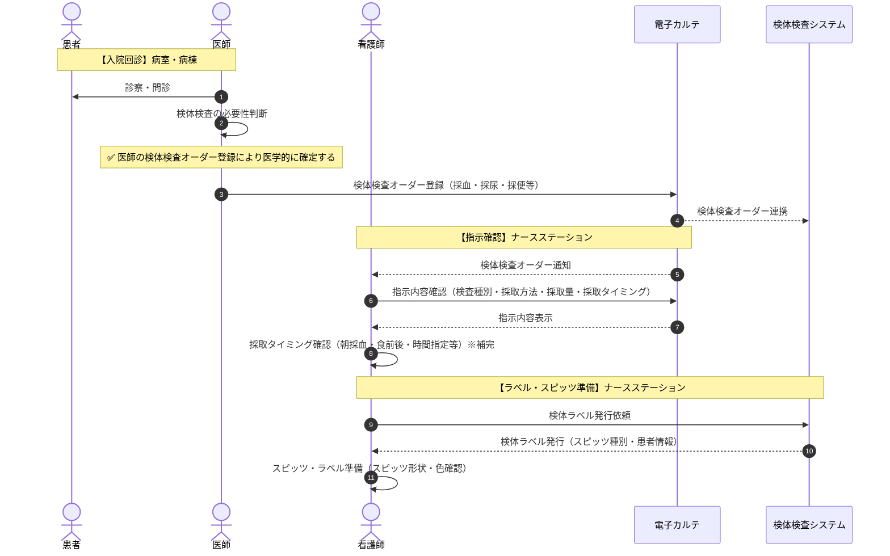
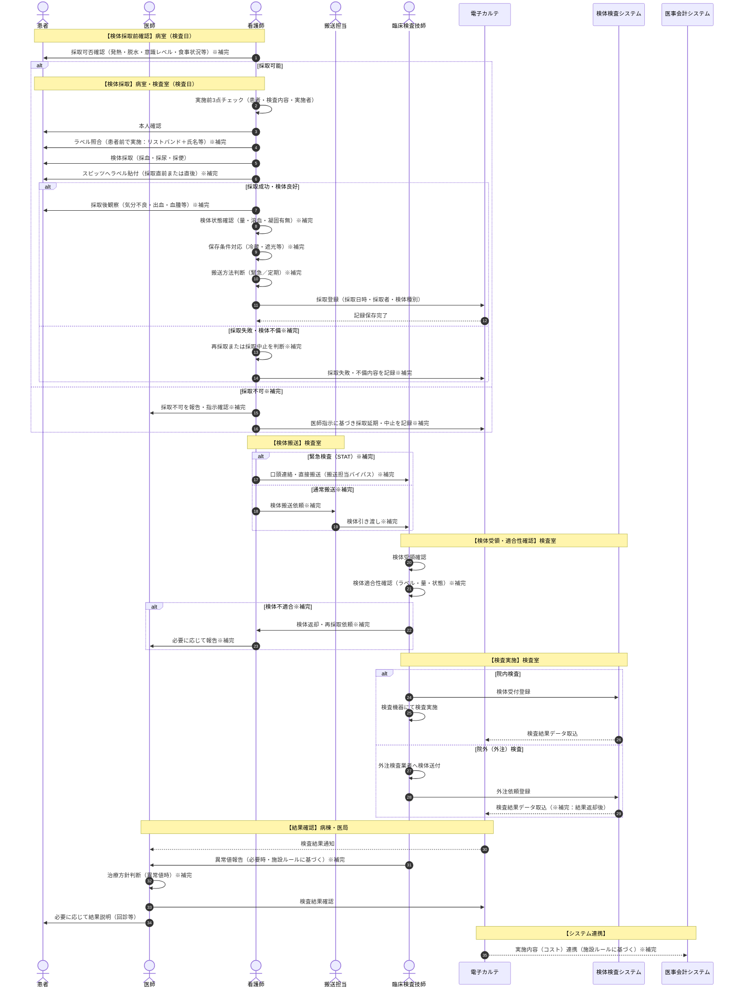

## 1. 検体検査オーダー登録〜ラベル・スピッツ準備

```mermaid
sequenceDiagram
    autonumber
    actor 患者
    actor 医師
    actor 看護師
    participant 電子カルテ
    participant 検体検査システム

    Note over 医師,患者: 【入院回診】病室・病棟
    医師 ->> 患者: 診察・問診
    医師 ->> 医師: 検体検査の必要性判断
    Note over 医師: ✅ 医師の検体検査オーダー登録により医学的に確定する
    医師 ->> 電子カルテ: 検体検査オーダー登録（採血・採尿・採便等）
    電子カルテ -->> 検体検査システム: 検体検査オーダー連携

    Note over 看護師,電子カルテ: 【指示確認】ナースステーション
    電子カルテ -->> 看護師: 検体検査オーダー通知
    看護師 ->> 電子カルテ: 指示内容確認（検査種別・採取方法・採取量・採取タイミング）
    電子カルテ -->> 看護師: 指示内容表示
    看護師 ->> 看護師: 採取タイミング確認（朝採血・食前後・時間指定等）※補完

    Note over 看護師,検体検査システム: 【ラベル・スピッツ準備】ナースステーション
    看護師 ->> 検体検査システム: 検体ラベル発行依頼
    検体検査システム -->> 看護師: 検体ラベル発行（スピッツ種別・患者情報）
    看護師 ->> 看護師: スピッツ・ラベル準備（スピッツ形状・色確認）
```

## 2. 検体採取〜検査実施・結果確認・システム連携

```mermaid
sequenceDiagram
    autonumber
    actor 患者
    actor 医師
    actor 看護師
    actor 搬送担当
    actor 臨床検査技師
    participant 電子カルテ
    participant 検体検査システム
    participant 医事会計システム

    Note over 看護師,患者: 【検体採取前確認】病室（検査日）
    看護師 ->> 患者: 採取可否確認（発熱・脱水・意識レベル・食事状況等）※補完
    alt 採取可能
        Note over 看護師,患者: 【検体採取】病室・検査室（検査日）
        看護師 ->> 看護師: 実施前3点チェック（患者・検査内容・実施者）
        看護師 ->> 患者: 本人確認
        看護師 ->> 患者: ラベル照合（患者前で実施：リストバンド＋氏名等）※補完
        看護師 ->> 患者: 検体採取（採血・採尿・採便）
        看護師 ->> 患者: スピッツへラベル貼付（採取直前または直後）※補完
        alt 採取成功・検体良好
            看護師 ->> 患者: 採取後観察（気分不良・出血・血腫等）※補完
            看護師 ->> 看護師: 検体状態確認（量・溶血・凝固有無）※補完
            看護師 ->> 看護師: 保存条件対応（冷蔵・遮光等）※補完
            看護師 ->> 看護師: 搬送方法判断（緊急／定期）※補完
            看護師 ->> 電子カルテ: 採取登録（採取日時・採取者・検体種別）
            電子カルテ -->> 看護師: 記録保存完了
        else 採取失敗・検体不備※補完
            看護師 ->> 看護師: 再採取または採取中止を判断※補完
            看護師 ->> 電子カルテ: 採取失敗・不備内容を記録※補完
        end
    else 採取不可※補完
        看護師 ->> 医師: 採取不可を報告・指示確認※補完
        看護師 ->> 電子カルテ: 医師指示に基づき採取延期・中止を記録※補完
    end

    Note over 看護師,搬送担当: 【検体搬送】検査室
    alt 緊急検査（STAT）※補完
        看護師 ->> 臨床検査技師: 口頭連絡・直接搬送（搬送担当バイパス）※補完
    else 通常搬送※補完
        看護師 ->> 搬送担当: 検体搬送依頼※補完
        搬送担当 ->> 臨床検査技師: 検体引き渡し※補完
    end

    Note over 臨床検査技師,検体検査システム: 【検体受領・適合性確認】検査室
    臨床検査技師 ->> 臨床検査技師: 検体受領確認
    臨床検査技師 ->> 臨床検査技師: 検体適合性確認（ラベル・量・状態）※補完
    alt 検体不適合※補完
        臨床検査技師 ->> 看護師: 検体返却・再採取依頼※補完
        看護師 ->> 医師: 必要に応じて報告※補完
    end

    Note over 臨床検査技師,検体検査システム: 【検査実施】検査室
    alt 院内検査
        臨床検査技師 ->> 検体検査システム: 検体受付登録
        臨床検査技師 ->> 臨床検査技師: 検査機器にて検査実施
        検体検査システム -->> 電子カルテ: 検査結果データ取込
    else 院外（外注）検査
        臨床検査技師 ->> 臨床検査技師: 外注検査業者へ検体送付
        臨床検査技師 ->> 検体検査システム: 外注依頼登録
        検体検査システム -->> 電子カルテ: 検査結果データ取込（※補完：結果返却後）
    end

    Note over 医師,電子カルテ: 【結果確認】病棟・医局
    電子カルテ -->> 医師: 検査結果通知
    臨床検査技師 ->> 医師: 異常値報告（必要時・施設ルールに基づく）※補完
    医師 ->> 医師: 治療方針判断（異常値時）※補完
    医師 ->> 電子カルテ: 検査結果確認
    医師 ->> 患者: 必要に応じて結果説明（回診等）

    Note over 電子カルテ,医事会計システム: 【システム連携】
    電子カルテ -->> 医事会計システム: 実施内容（コスト）連携（施設ルールに基づく）※補完
```