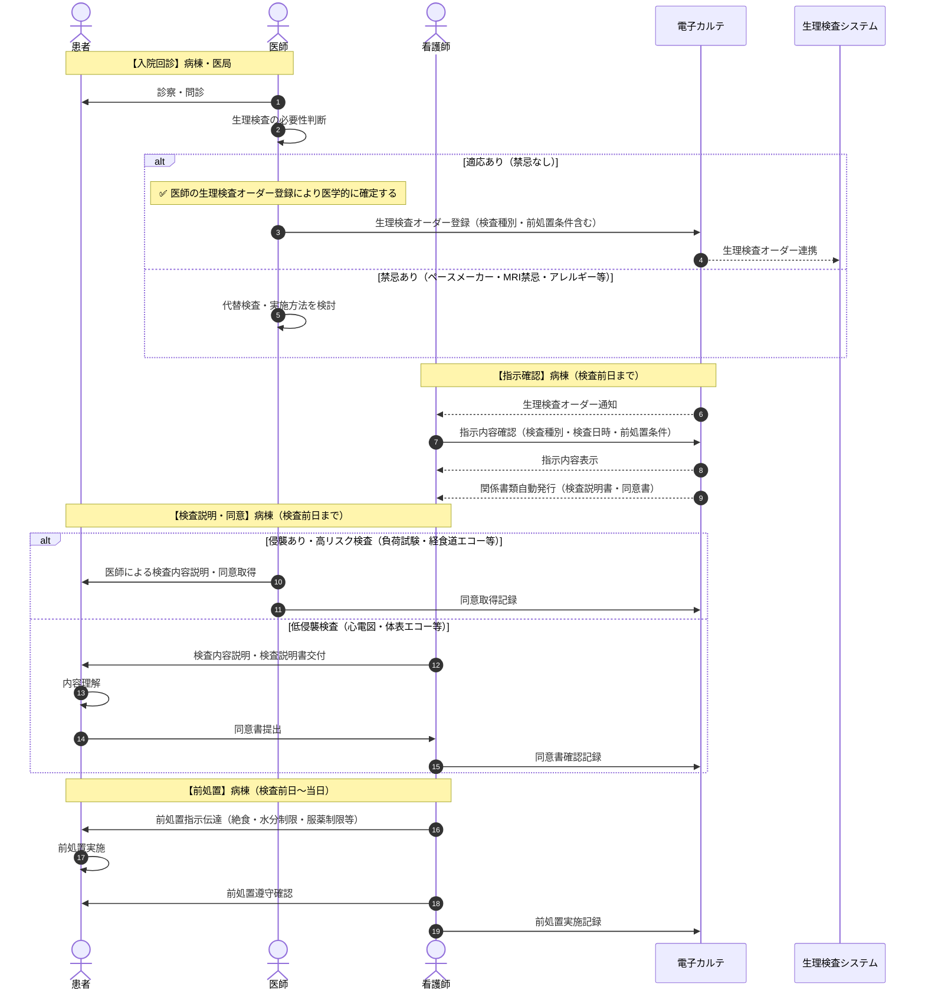
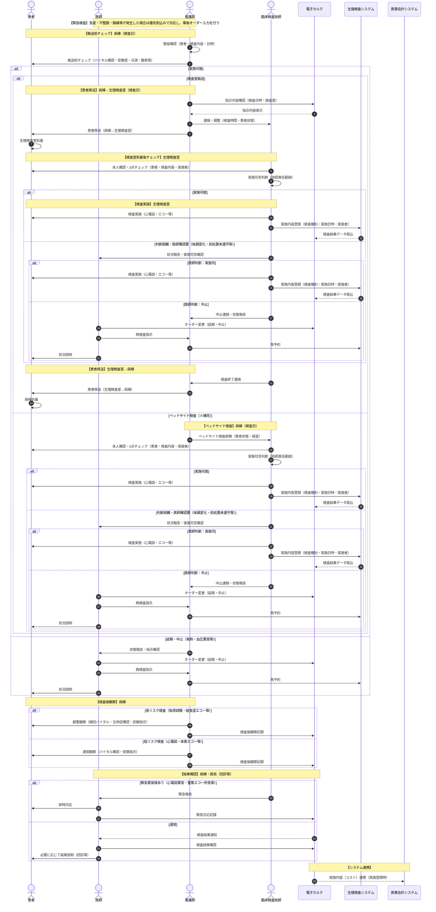

## 1. 生理検査オーダー登録〜検査説明・同意・前処置

```mermaid
sequenceDiagram
    autonumber
    actor 患者
    actor 医師
    actor 看護師
    participant 電子カルテ
    participant 生理検査システム

    Note over 医師,患者: 【入院回診】病棟・医局
    医師 ->> 患者: 診察・問診
    医師 ->> 医師: 生理検査の必要性判断
    alt 適応あり（禁忌なし）
        Note over 医師: ✅ 医師の生理検査オーダー登録により医学的に確定する
        医師 ->> 電子カルテ: 生理検査オーダー登録（検査種別・前処置条件含む）
        電子カルテ -->> 生理検査システム: 生理検査オーダー連携
    else 禁忌あり（ペースメーカー・MRI禁忌・アレルギー等）
        医師 ->> 医師: 代替検査・実施方法を検討
    end

    Note over 看護師,電子カルテ: 【指示確認】病棟（検査前日まで）
    電子カルテ -->> 看護師: 生理検査オーダー通知
    看護師 ->> 電子カルテ: 指示内容確認（検査種別・検査日時・前処置条件）
    電子カルテ -->> 看護師: 指示内容表示
    電子カルテ -->> 看護師: 関係書類自動発行（検査説明書・同意書）

    Note over 看護師,患者: 【検査説明・同意】病棟（検査前日まで）
    alt 侵襲あり・高リスク検査（負荷試験・経食道エコー等）
        医師 ->> 患者: 医師による検査内容説明・同意取得
        医師 ->> 電子カルテ: 同意取得記録
    else 低侵襲検査（心電図・体表エコー等）
        看護師 ->> 患者: 検査内容説明・検査説明書交付
        患者 ->> 患者: 内容理解
        患者 ->> 看護師: 同意書提出
        看護師 ->> 電子カルテ: 同意書確認記録
    end

    Note over 看護師,患者: 【前処置】病棟（検査前日〜当日）
    看護師 ->> 患者: 前処置指示伝達（絶食・水分制限・服薬制限等）
    患者 ->> 患者: 前処置実施
    看護師 ->> 患者: 前処置遵守確認
    看護師 ->> 電子カルテ: 前処置実施記録
```

## 2. 患者移送〜検査実施・結果確認・システム連携

```mermaid
sequenceDiagram
    autonumber
    actor 患者
    actor 医師
    actor 看護師
    actor 臨床検査技師
    participant 電子カルテ
    participant 生理検査システム
    participant 医事会計システム

    Note over 医師,看護師: 【緊急検査】急変・不整脈・胸痛等が発生した場合は優先割込みで対応し、事後オーダー入力を行う

    Note over 看護師,患者: 【搬送前チェック】病棟（検査日）
    看護師 ->> 看護師: 簡易確認（患者・検査内容・日時）
    看護師 ->> 患者: 搬送前チェック（バイタル確認・安静度・点滴・酸素等）
    alt 実施可能
        alt 検査室搬送
            Note over 看護師,患者: 【患者移送】病棟→生理検査室（検査日）
            看護師 ->> 電子カルテ: 指示内容確認（検査日時・検査室）
            電子カルテ -->> 看護師: 指示内容表示
            看護師 ->> 臨床検査技師: 連絡・調整（検査時間・患者状態）
            看護師 ->> 患者: 患者移送（病棟→生理検査室）
            患者 ->> 患者: 生理検査室到着

            Note over 臨床検査技師,患者: 【検査室到着後チェック】生理検査室
            臨床検査技師 ->> 患者: 本人確認・3点チェック（患者・検査内容・実施者）
            臨床検査技師 ->> 臨床検査技師: 実施可否判断（技師責任範囲）
            alt 実施可能
                Note over 臨床検査技師,患者: 【検査実施】生理検査室
                臨床検査技師 ->> 患者: 検査実施（心電図・エコー等）
                臨床検査技師 ->> 生理検査システム: 実施内容登録（検査種別・実施日時・実施者）
                生理検査システム -->> 電子カルテ: 検査結果データ取込
            else 判断困難・医師確認要（体調変化・前処置未遵守等）
                臨床検査技師 ->> 医師: 状況報告・実施可否確認
                alt 医師判断：実施可
                    臨床検査技師 ->> 患者: 検査実施（心電図・エコー等）
                    臨床検査技師 ->> 生理検査システム: 実施内容登録（検査種別・実施日時・実施者）
                    生理検査システム -->> 電子カルテ: 検査結果データ取込
                else 医師判断：中止
                    臨床検査技師 ->> 看護師: 中止連絡・状態報告
                    医師 ->> 電子カルテ: オーダー変更（延期・中止）
                    医師 ->> 看護師: 再検査指示
                    看護師 ->> 生理検査システム: 再予約
                    医師 ->> 患者: 状況説明
                end
            end

            Note over 看護師,患者: 【患者移送】生理検査室→病棟
            臨床検査技師 ->> 看護師: 検査終了連絡
            看護師 ->> 患者: 患者移送（生理検査室→病棟）
            患者 ->> 患者: 病棟到着
        else ベッドサイド検査（※補完）
            Note over 看護師,臨床検査技師: 【ベッドサイド検査】病棟（検査日）
            看護師 ->> 臨床検査技師: ベッドサイド検査依頼（患者状態・病室）
            臨床検査技師 ->> 患者: 本人確認・3点チェック（患者・検査内容・実施者）
            臨床検査技師 ->> 臨床検査技師: 実施可否判断（技師責任範囲）
            alt 実施可能
                臨床検査技師 ->> 患者: 検査実施（心電図・エコー等）
                臨床検査技師 ->> 生理検査システム: 実施内容登録（検査種別・実施日時・実施者）
                生理検査システム -->> 電子カルテ: 検査結果データ取込
            else 判断困難・医師確認要（体調変化・前処置未遵守等）
                臨床検査技師 ->> 医師: 状況報告・実施可否確認
                alt 医師判断：実施可
                    臨床検査技師 ->> 患者: 検査実施（心電図・エコー等）
                    臨床検査技師 ->> 生理検査システム: 実施内容登録（検査種別・実施日時・実施者）
                    生理検査システム -->> 電子カルテ: 検査結果データ取込
                else 医師判断：中止
                    臨床検査技師 ->> 看護師: 中止連絡・状態報告
                    医師 ->> 電子カルテ: オーダー変更（延期・中止）
                    医師 ->> 看護師: 再検査指示
                    看護師 ->> 生理検査システム: 再予約
                    医師 ->> 患者: 状況説明
                end
            end
        end
    else 延期・中止（発熱・血圧異常等）
        看護師 ->> 医師: 状態報告・指示確認
        医師 ->> 電子カルテ: オーダー変更（延期・中止）
        医師 ->> 看護師: 再検査指示
        看護師 ->> 生理検査システム: 再予約
        医師 ->> 患者: 状況説明
    end

    Note over 看護師,患者: 【検査後観察】病棟
    alt 高リスク検査（負荷試験・経食道エコー等）
        看護師 ->> 患者: 厳重観察（頻回バイタル・合併症確認・安静指示）
        看護師 ->> 電子カルテ: 検査後観察記録
    else 低リスク検査（心電図・体表エコー等）
        看護師 ->> 患者: 通常観察（バイタル確認・安静指示）
        看護師 ->> 電子カルテ: 検査後観察記録
    end

    Note over 医師,電子カルテ: 【結果確認】病棟・医局（回診等）
    alt 緊急異常値あり（心電図異常・重篤エコー所見等）
        臨床検査技師 ->> 医師: 緊急報告
        医師 ->> 患者: 即時対応
        医師 ->> 電子カルテ: 緊急対応記録
    else 通常
        電子カルテ -->> 医師: 検査結果通知
        医師 ->> 電子カルテ: 検査結果確認
        医師 ->> 患者: 必要に応じて結果説明（回診等）
    end

    Note over 電子カルテ,医事会計システム: 【システム連携】
    電子カルテ -->> 医事会計システム: 実施内容（コスト）連携（実施登録時）
```
