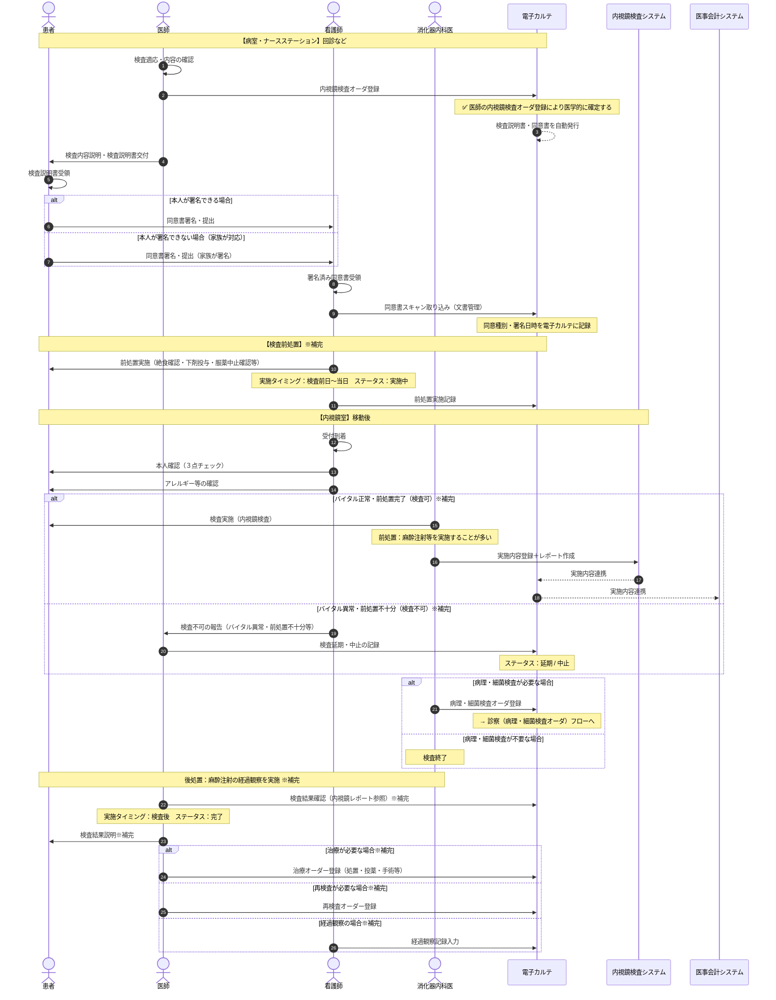

```mermaid
sequenceDiagram
    autonumber
    actor 患者
    actor 医師
    actor 看護師
    actor 消化器内科医
    participant 電子カルテ
    participant 内視鏡検査システム
    participant 医事会計システム

    Note over 患者,電子カルテ: 【病室・ナースステーション】回診など

    医師->>医師: 検査適応・内容の確認
    医師->>電子カルテ: 内視鏡検査オーダ登録
    Note over 電子カルテ: ✅ 医師の内視鏡検査オーダ登録により医学的に確定する
    電子カルテ-->>電子カルテ: 検査説明書・同意書を自動発行
    医師->>患者: 検査内容説明・検査説明書交付
    患者->>患者: 検査説明書受領

    alt 本人が署名できる場合
        患者->>看護師: 同意書署名・提出
    else 本人が署名できない場合（家族が対応）
        患者->>看護師: 同意書署名・提出（家族が署名）
    end

    看護師->>看護師: 署名済み同意書受領
    看護師->>電子カルテ: 同意書スキャン取り込み（文書管理）
    Note over 電子カルテ: 同意種別・署名日時を電子カルテに記録

    Note over 患者,電子カルテ: 【検査前処置】※補完

    看護師->>患者: 前処置実施（絶食確認・下剤投与・服薬中止確認等）
    Note over 看護師: 実施タイミング：検査前日〜当日　ステータス：実施中
    看護師->>電子カルテ: 前処置実施記録

    Note over 患者,内視鏡検査システム: 【内視鏡室】移動後

    看護師->>看護師: 受付到着
    看護師->>患者: 本人確認（３点チェック）
    看護師->>患者: アレルギー等の確認

    alt バイタル正常・前処置完了（検査可）※補完
        消化器内科医->>患者: 検査実施（内視鏡検査）
        Note over 消化器内科医: 前処置：麻酔注射等を実施することが多い
        消化器内科医->>内視鏡検査システム: 実施内容登録＋レポート作成
        内視鏡検査システム-->>電子カルテ: 実施内容連携
        電子カルテ-->>医事会計システム: 実施内容連携
    else バイタル異常・前処置不十分（検査不可）※補完
        看護師->>医師: 検査不可の報告（バイタル異常・前処置不十分等）
        医師->>電子カルテ: 検査延期・中止の記録
        Note over 電子カルテ: ステータス：延期 / 中止
    end

    alt 病理・細菌検査が必要な場合
        消化器内科医->>電子カルテ: 病理・細菌検査オーダ登録
        Note over 電子カルテ: → 診察（病理・細菌検査オーダ）フローへ
    else 病理・細菌検査が不要な場合
        Note over 消化器内科医: 検査終了
    end

    Note over 消化器内科医,患者: 後処置：麻酔注射の経過観察を実施 ※補完

    医師->>電子カルテ: 検査結果確認（内視鏡レポート参照）※補完
    Note over 医師: 実施タイミング：検査後　ステータス：完了
    医師->>患者: 検査結果説明※補完

    alt 治療が必要な場合※補完
        医師->>電子カルテ: 治療オーダー登録（処置・投薬・手術等）
    else 再検査が必要な場合※補完
        医師->>電子カルテ: 再検査オーダー登録
    else 経過観察の場合※補完
        看護師->>電子カルテ: 経過観察記録入力
    end
```
