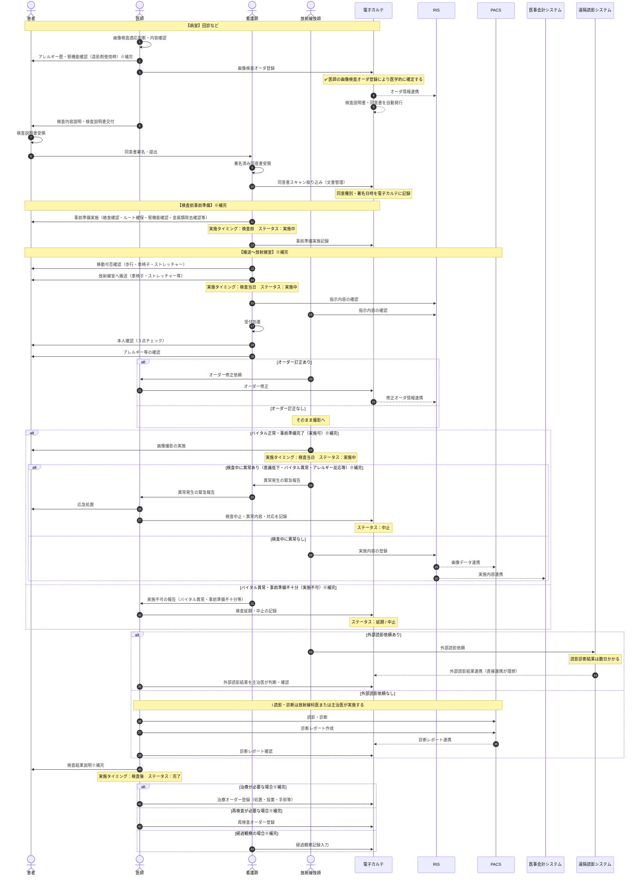

```mermaid
sequenceDiagram
    autonumber
    actor 患者
    actor 医師
    actor 看護師
    actor 放射線技師
    participant 電子カルテ
    participant RIS
    participant PACS
    participant 医事会計システム
    participant 遠隔読影システム

    Note over 患者,電子カルテ: 【病室】回診など

    医師->>医師: 画像検査適応判断・内容確認
    医師->>患者: アレルギー歴・腎機能確認（造影剤使用時）※補完
    医師->>電子カルテ: 画像検査オーダ登録
    Note over 電子カルテ: ✅ 医師の画像検査オーダ登録により医学的に確定する
    電子カルテ-->>RIS: オーダ情報連携
    電子カルテ-->>電子カルテ: 検査説明書・同意書を自動発行
    医師->>患者: 検査内容説明・検査説明書交付
    患者->>患者: 検査説明書受領
    患者->>看護師: 同意書署名・提出
    看護師->>看護師: 署名済み同意書受領
    看護師->>電子カルテ: 同意書スキャン取り込み（文書管理）
    Note over 電子カルテ: 同意種別・署名日時を電子カルテに記録

    Note over 患者,電子カルテ: 【検査前事前準備】※補完

    看護師->>患者: 事前準備実施（絶食確認・ルート確保・腎機能確認・金属類除去確認等）
    Note over 看護師: 実施タイミング：検査前　ステータス：実施中
    看護師->>電子カルテ: 事前準備実施記録

    Note over 患者,PACS: 【搬送〜放射線室】※補完

    看護師->>患者: 移動可否確認（歩行・車椅子・ストレッチャー）
    看護師->>患者: 放射線室へ搬送（車椅子・ストレッチャー等）
    Note over 看護師: 実施タイミング：検査当日　ステータス：実施中

    看護師->>RIS: 指示内容の確認
    放射線技師->>RIS: 指示内容の確認
    看護師->>看護師: 受付到着
    看護師->>患者: 本人確認（３点チェック）
    看護師->>患者: アレルギー等の確認

    alt オーダー訂正あり
        放射線技師->>医師: オーダー修正依頼
        医師->>電子カルテ: オーダー修正
        電子カルテ-->>RIS: 修正オーダ情報連携
    else オーダー訂正なし
        Note over 放射線技師: そのまま撮影へ
    end

    alt バイタル正常・事前準備完了（実施可）※補完
        放射線技師->>患者: 画像撮影の実施
        Note over 放射線技師: 実施タイミング：検査当日　ステータス：実施中

        alt 検査中に異常あり（意識低下・バイタル異常・アレルギー反応等）※補完
            放射線技師->>看護師: 異常発生の緊急報告
            看護師->>医師: 異常発生の緊急報告
            医師->>患者: 応急処置
            医師->>電子カルテ: 検査中止・異常内容・対応を記録
            Note over 電子カルテ: ステータス：中止
        else 検査中に異常なし
            放射線技師->>RIS: 実施内容の登録
            RIS-->>PACS: 画像データ連携
            RIS-->>医事会計システム: 実施内容連携
        end

    else バイタル異常・事前準備不十分（実施不可）※補完
        看護師->>医師: 実施不可の報告（バイタル異常・事前準備不十分等）
        医師->>電子カルテ: 検査延期・中止の記録
        Note over 電子カルテ: ステータス：延期 / 中止
    end

    alt 外部読影依頼あり
        放射線技師->>遠隔読影システム: 外部読影依頼
        Note over 遠隔読影システム: 読影診断結果は数日かかる
        遠隔読影システム-->>電子カルテ: 外部読影結果連携（直接連携が理想）
        医師->>電子カルテ: 外部読影結果を主治医が判断・確認
    else 外部読影依頼なし
        Note over 医師,PACS: ℹ️ 読影・診断は放射線科医または主治医が実施する
        医師->>PACS: 読影・診断
        医師->>PACS: 診断レポート作成
        PACS-->>電子カルテ: 診断レポート連携
        医師->>電子カルテ: 診断レポート確認
    end

    医師->>患者: 検査結果説明※補完
    Note over 医師: 実施タイミング：検査後　ステータス：完了

    alt 治療が必要な場合※補完
        医師->>電子カルテ: 治療オーダー登録（処置・投薬・手術等）
    else 再検査が必要な場合※補完
        医師->>電子カルテ: 再検査オーダー登録
    else 経過観察の場合※補完
        看護師->>電子カルテ: 経過観察記録入力
    end
```
