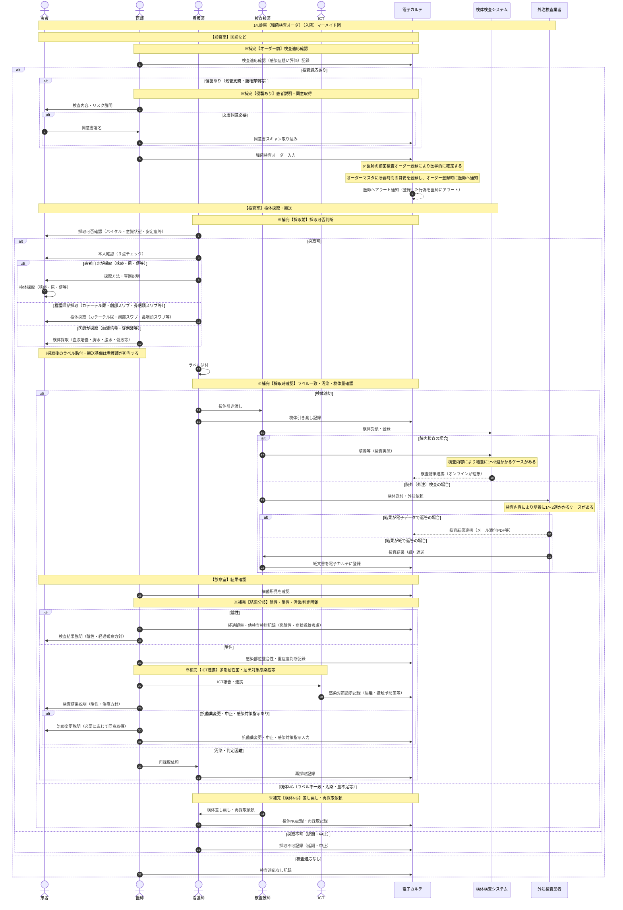

```mermaid
sequenceDiagram
    autonumber
    actor 患者
    actor 医師
    actor 看護師
    actor 検査技師
    actor ICT
    participant 電子カルテ
    participant 検体検査システム
    participant 外注検査業者

    Note over 患者,外注検査業者: 14.診察（細菌検査オーダ）（入院）マーメイド図

    Note over 患者,電子カルテ: 【診察室】回診など

    Note over 医師,電子カルテ: ※補完【オーダー前】検査適応確認
    医師->>電子カルテ: 検査適応確認（感染症疑い評価）記録
    alt 検査適応あり
        alt 侵襲あり（気管支鏡・腰椎穿刺等）
            Note over 医師,電子カルテ: ※補完【侵襲あり】患者説明・同意取得
            医師->>患者: 検査内容・リスク説明
            alt 文書同意必要
                患者->>医師: 同意書署名
                医師->>電子カルテ: 同意書スキャン取り込み
            end
        end
        医師->>電子カルテ: 細菌検査オーダー入力
        Note over 電子カルテ: ✅ 医師の細菌検査オーダー登録により医学的に確定する
        Note over 電子カルテ: オーダーマスタに所要時間の目安を登録し、オーダー登録時に医師へ通知
        電子カルテ-->>電子カルテ: 医師へアラート通知（登録した行為を医師にアラート）

        Note over 患者,検体検査システム: 【検査室】検体採取・搬送

        Note over 看護師,電子カルテ: ※補完【採取前】採取可否判断
        看護師->>患者: 採取可否確認（バイタル・意識状態・安定度等）
        alt 採取可
            看護師->>患者: 本人確認（３点チェック）
            alt 患者自身が採取（喀痰・尿・便等）
                看護師->>患者: 採取方法・容器説明
                患者->>患者: 検体採取（喀痰・尿・便等）
            else 看護師が採取（カテーテル尿・創部スワブ・鼻咽頭スワブ等）
                看護師->>患者: 検体採取（カテーテル尿・創部スワブ・鼻咽頭スワブ等）
            else 医師が採取（血液培養・穿刺液等）
                医師->>患者: 検体採取（血液培養・胸水・腹水・髄液等）
            end
            Note over 患者,医師: ℹ️ 採取後のラベル貼付・搬送準備は看護師が担当する
            看護師->>看護師: ラベル貼付
            Note over 看護師,電子カルテ: ※補完【採取時確認】ラベル一致・汚染・検体量確認
            alt 検体適切
                看護師->>検査技師: 検体引き渡し
                看護師->>電子カルテ: 検体引き渡し記録
                検査技師->>検体検査システム: 検体受領・登録

                alt 院内検査の場合
                    検査技師->>検体検査システム: 培養等（検査実施）
                    Note over 検体検査システム: 検査内容により培養に1〜2週かかるケースがある
                    検体検査システム-->>電子カルテ: 検査結果連携（オンラインが理想）
                else 院外（外注）検査の場合
                    検査技師->>外注検査業者: 検体送付・外注依頼
                    Note over 外注検査業者: 検査内容により培養に1〜2週かかるケースがある
                    alt 結果が電子データで返答の場合
                        外注検査業者-->>電子カルテ: 検査結果連携（メール添付PDF等）
                    else 結果が紙で返答の場合
                        外注検査業者->>検査技師: 検査結果（紙）返送
                        検査技師->>電子カルテ: 紙文書を電子カルテに登録
                    end
                end

                Note over 患者,電子カルテ: 【診察室】結果確認

                医師->>電子カルテ: 細菌所見を確認
                Note over 医師,電子カルテ: ※補完【結果分岐】陰性・陽性・汚染/判定困難
                alt 陰性
                    医師->>電子カルテ: 経過観察・他検査検討記録（偽陰性・症状乖離考慮）
                    医師->>患者: 検査結果説明（陰性・経過観察方針）
                else 陽性
                    医師->>電子カルテ: 感染部位整合性・重症度判断記録
                    Note over 医師,ICT: ※補完【ICT連携】多剤耐性菌・届出対象感染症等
                    医師->>ICT: ICT報告・連携
                    ICT->>電子カルテ: 感染対策指示記録（隔離・接触予防策等）
                    医師->>患者: 検査結果説明（陽性・治療方針）
                    alt 抗菌薬変更・中止・感染対策指示あり
                        医師->>患者: 治療変更説明（必要に応じて同意取得）
                        医師->>電子カルテ: 抗菌薬変更・中止・感染対策指示入力
                    end
                else 汚染・判定困難
                    医師->>看護師: 再採取依頼
                    看護師->>電子カルテ: 再採取記録
                end
            else 検体NG（ラベル不一致・汚染・量不足等）
                Note over 看護師,電子カルテ: ※補完【検体NG】差し戻し・再採取依頼
                検査技師->>看護師: 検体差し戻し・再採取依頼
                看護師->>電子カルテ: 検体NG記録・再採取記録
            end
        else 採取不可（延期・中止）
            看護師->>電子カルテ: 採取不可記録（延期・中止）
        end
    else 検査適応なし
        医師->>電子カルテ: 検査適応なし記録
    end
```
