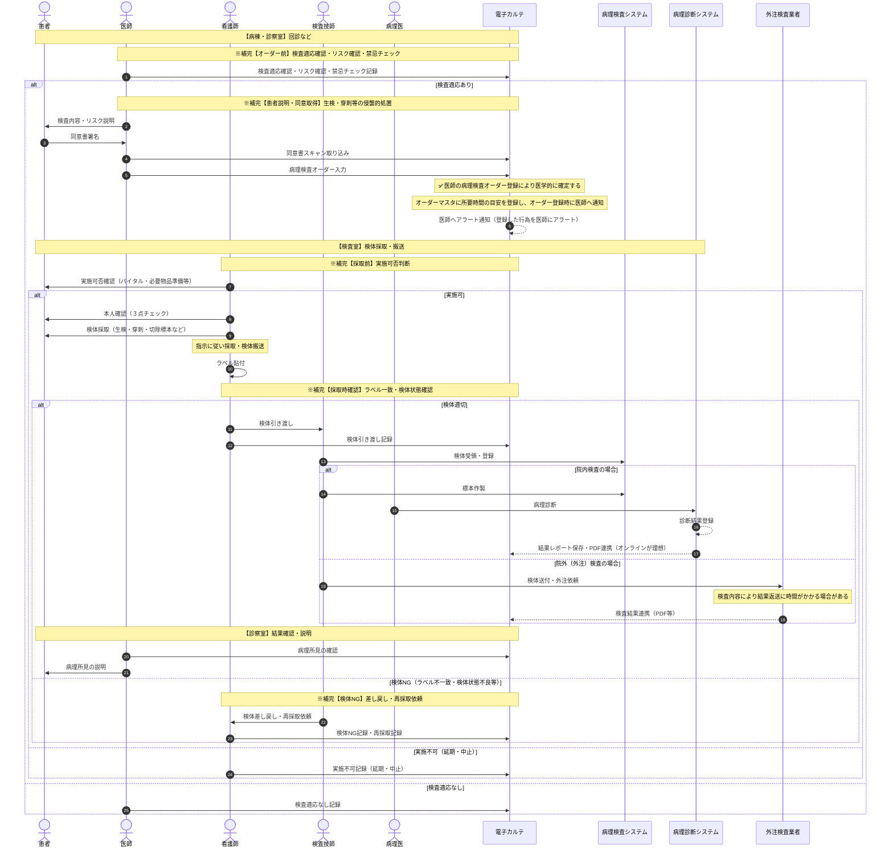

```mermaid
sequenceDiagram
    autonumber
    actor 患者
    actor 医師
    actor 看護師
    actor 検査技師
    actor 病理医
    participant 電子カルテ
    participant 病理検査システム
    participant 病理診断システム
    participant 外注検査業者

    Note over 患者,電子カルテ: 【病棟・診察室】回診など

    Note over 医師,電子カルテ: ※補完【オーダー前】検査適応確認・リスク確認・禁忌チェック
    医師->>電子カルテ: 検査適応確認・リスク確認・禁忌チェック記録
    alt 検査適応あり
        Note over 医師,電子カルテ: ※補完【患者説明・同意取得】生検・穿刺等の侵襲的処置
        医師->>患者: 検査内容・リスク説明
        患者->>医師: 同意書署名
        医師->>電子カルテ: 同意書スキャン取り込み
        医師->>電子カルテ: 病理検査オーダー入力
        Note over 電子カルテ: ✅ 医師の病理検査オーダー登録により医学的に確定する
        Note over 電子カルテ: オーダーマスタに所要時間の目安を登録し、オーダー登録時に医師へ通知
        電子カルテ-->>電子カルテ: 医師へアラート通知（登録した行為を医師にアラート）

        Note over 患者,病理診断システム: 【検査室】検体採取・搬送

        Note over 看護師,電子カルテ: ※補完【採取前】実施可否判断
        看護師->>患者: 実施可否確認（バイタル・必要物品準備等）
        alt 実施可
            看護師->>患者: 本人確認（３点チェック）
            看護師->>患者: 検体採取（生検・穿刺・切除標本など）
            Note over 看護師: 指示に従い採取・検体搬送
            看護師->>看護師: ラベル貼付
            Note over 看護師,電子カルテ: ※補完【採取時確認】ラベル一致・検体状態確認
            alt 検体適切
                看護師->>検査技師: 検体引き渡し
                看護師->>電子カルテ: 検体引き渡し記録
                検査技師->>病理検査システム: 検体受領・登録

                alt 院内検査の場合
                    検査技師->>病理検査システム: 標本作製
                    病理医->>病理診断システム: 病理診断
                    病理診断システム-->>病理診断システム: 診断結果登録
                    病理診断システム-->>電子カルテ: 結果レポート保存・PDF連携（オンラインが理想）
                else 院外（外注）検査の場合
                    検査技師->>外注検査業者: 検体送付・外注依頼
                    Note over 外注検査業者: 検査内容により結果返送に時間がかかる場合がある
                    外注検査業者-->>電子カルテ: 検査結果連携（PDF等）
                end

                Note over 患者,電子カルテ: 【診察室】結果確認・説明

                医師->>電子カルテ: 病理所見の確認
                医師->>患者: 病理所見の説明
            else 検体NG（ラベル不一致・検体状態不良等）
                Note over 看護師,電子カルテ: ※補完【検体NG】差し戻し・再採取依頼
                検査技師->>看護師: 検体差し戻し・再採取依頼
                看護師->>電子カルテ: 検体NG記録・再採取記録
            end
        else 実施不可（延期・中止）
            看護師->>電子カルテ: 実施不可記録（延期・中止）
        end
    else 検査適応なし
        医師->>電子カルテ: 検査適応なし記録
    end
```
