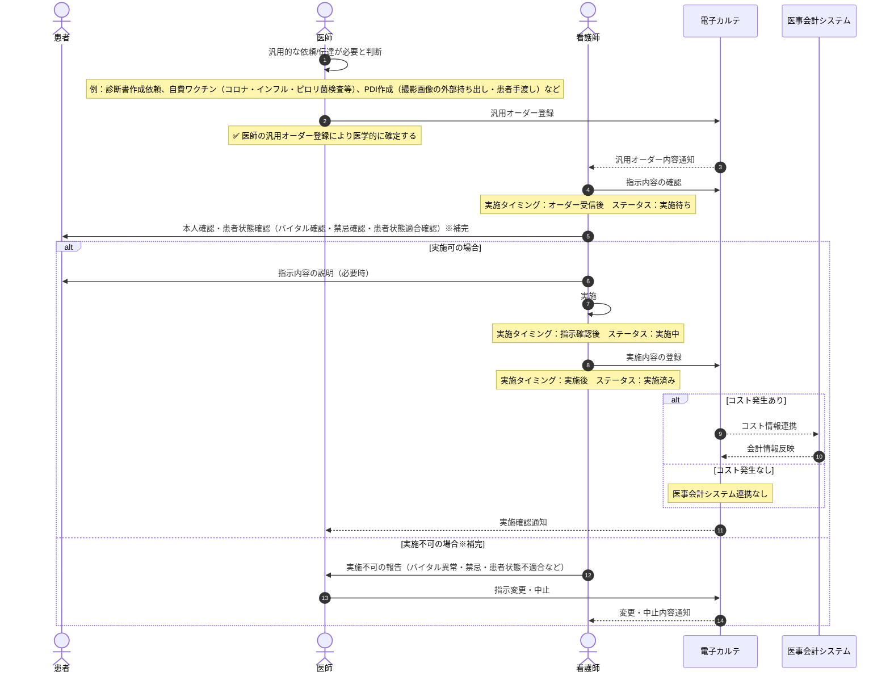

```mermaid
sequenceDiagram
    autonumber
    actor 患者
    actor 医師
    actor 看護師
    participant 電子カルテ
    participant 医事会計システム

    %% ─────────────────────────────────────
    %% 汎用オーダーの起点
    %% ─────────────────────────────────────
    医師->>医師: 汎用的な依頼/伝達が必要と判断
    Note over 医師: 例：診断書作成依頼、自費ワクチン（コロナ・インフル・ピロリ菌検査等）、PDI作成（撮影画像の外部持ち出し・患者手渡し）など

    %% ─────────────────────────────────────
    %% 汎用オーダー登録
    %% ─────────────────────────────────────
    医師->>電子カルテ: 汎用オーダー登録
    Note over 医師: ✅ 医師の汎用オーダー登録により医学的に確定する
    電子カルテ-->>看護師: 汎用オーダー内容通知

    %% ─────────────────────────────────────
    %% 指示確認・実施可否判断
    %% ─────────────────────────────────────
    看護師->>電子カルテ: 指示内容の確認
    Note over 看護師: 実施タイミング：オーダー受信後　ステータス：実施待ち
    看護師->>患者: 本人確認・患者状態確認（バイタル確認・禁忌確認・患者状態適合確認）※補完

    alt 実施可の場合
        看護師->>患者: 指示内容の説明（必要時）
        看護師->>看護師: 実施
        Note over 看護師: 実施タイミング：指示確認後　ステータス：実施中

        %% ─────────────────────────────────────
        %% 実施登録・コスト連携
        %% ─────────────────────────────────────
        看護師->>電子カルテ: 実施内容の登録
        Note over 看護師: 実施タイミング：実施後　ステータス：実施済み

        alt コスト発生あり
            電子カルテ-->>医事会計システム: コスト情報連携
            医事会計システム-->>電子カルテ: 会計情報反映
        else コスト発生なし
            Note over 電子カルテ: 医事会計システム連携なし
        end

        電子カルテ-->>医師: 実施確認通知
    else 実施不可の場合※補完
        看護師->>医師: 実施不可の報告（バイタル異常・禁忌・患者状態不適合など）
        医師->>電子カルテ: 指示変更・中止
        電子カルテ-->>看護師: 変更・中止内容通知
    end
```
