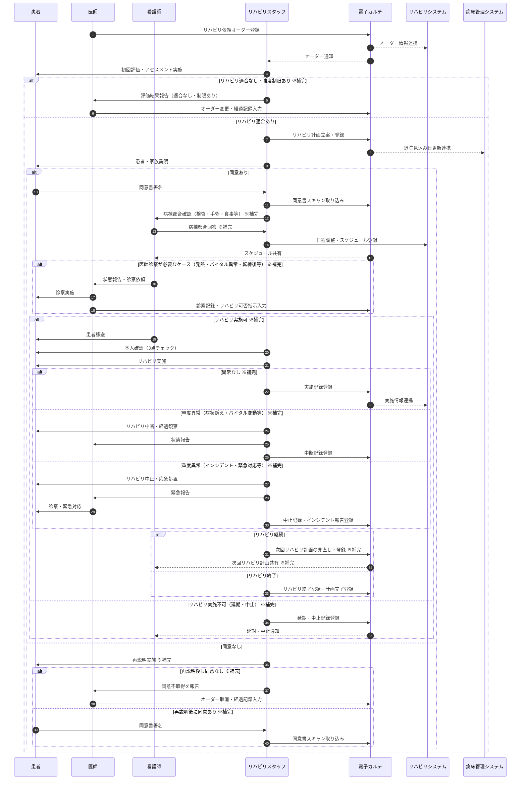

```mermaid
sequenceDiagram
autonumber
participant 患者
participant 医師
participant 看護師
participant リハビリスタッフ
participant 電子カルテ
participant リハビリシステム
participant 病床管理システム

医師 ->> 電子カルテ : リハビリ依頼オーダー登録
電子カルテ -->> リハビリシステム : オーダー情報連携
電子カルテ -->> リハビリスタッフ : オーダー通知
リハビリスタッフ ->> 患者 : 初回評価・アセスメント実施
alt リハビリ適合なし・強度制限あり ※補完
    リハビリスタッフ ->> 医師 : 評価結果報告（適合なし・制限あり）
    医師 ->> 電子カルテ : オーダー変更・経過記録入力
else リハビリ適合あり
    リハビリスタッフ ->> 電子カルテ : リハビリ計画立案・登録
    電子カルテ -->> 病床管理システム : 退院見込み日更新連携
    リハビリスタッフ ->> 患者 : 患者・家族説明
    alt 同意あり
        患者 ->> リハビリスタッフ : 同意書署名
        リハビリスタッフ ->> 電子カルテ : 同意書スキャン取り込み
        リハビリスタッフ ->> 看護師 : 病棟都合確認（検査・手術・食事等） ※補完
        看護師 ->> リハビリスタッフ : 病棟都合回答 ※補完
        リハビリスタッフ ->> リハビリシステム : 日程調整・スケジュール登録
        電子カルテ -->> 看護師 : スケジュール共有
        alt 医師診察が必要なケース（発熱・バイタル異常・転棟後等） ※補完
            看護師 ->> 医師 : 状態報告・診察依頼
            医師 ->> 患者 : 診察実施
            医師 ->> 電子カルテ : 診察記録・リハビリ可否指示入力
        end
        alt リハビリ実施可 ※補完
            看護師 ->> 患者 : 患者移送
            リハビリスタッフ ->> 患者 : 本人確認（3点チェック）
            リハビリスタッフ ->> 患者 : リハビリ実施
            alt 異常なし ※補完
                リハビリスタッフ ->> 電子カルテ : 実施記録登録
                電子カルテ -->> リハビリシステム : 実施情報連携
            else 軽度異常（症状訴え・バイタル変動等） ※補完
                リハビリスタッフ ->> 患者 : リハビリ中断・経過観察
                リハビリスタッフ ->> 医師 : 状態報告
                リハビリスタッフ ->> 電子カルテ : 中断記録登録
            else 重度異常（インシデント・緊急対応等） ※補完
                リハビリスタッフ ->> 患者 : リハビリ中止・応急処置
                リハビリスタッフ ->> 医師 : 緊急報告
                医師 ->> 患者 : 診察・緊急対応
                リハビリスタッフ ->> 電子カルテ : 中止記録・インシデント報告登録
            end
            alt リハビリ継続
                リハビリスタッフ ->> 電子カルテ : 次回リハビリ計画の見直し・登録 ※補完
                電子カルテ -->> 看護師 : 次回リハビリ計画共有 ※補完
            else リハビリ終了
                リハビリスタッフ ->> 電子カルテ : リハビリ終了記録・計画完了登録
            end
        else リハビリ実施不可（延期・中止） ※補完
            リハビリスタッフ ->> 電子カルテ : 延期・中止記録登録
            電子カルテ -->> 看護師 : 延期・中止通知
        end
    else 同意なし
        リハビリスタッフ ->> 患者 : 再説明実施 ※補完
        alt 再説明後も同意なし ※補完
            リハビリスタッフ ->> 医師 : 同意不取得を報告
            医師 ->> 電子カルテ : オーダー取消・経過記録入力
        else 再説明後に同意あり ※補完
            患者 ->> リハビリスタッフ : 同意書署名
            リハビリスタッフ ->> 電子カルテ : 同意書スキャン取り込み
        end
    end
end
```
