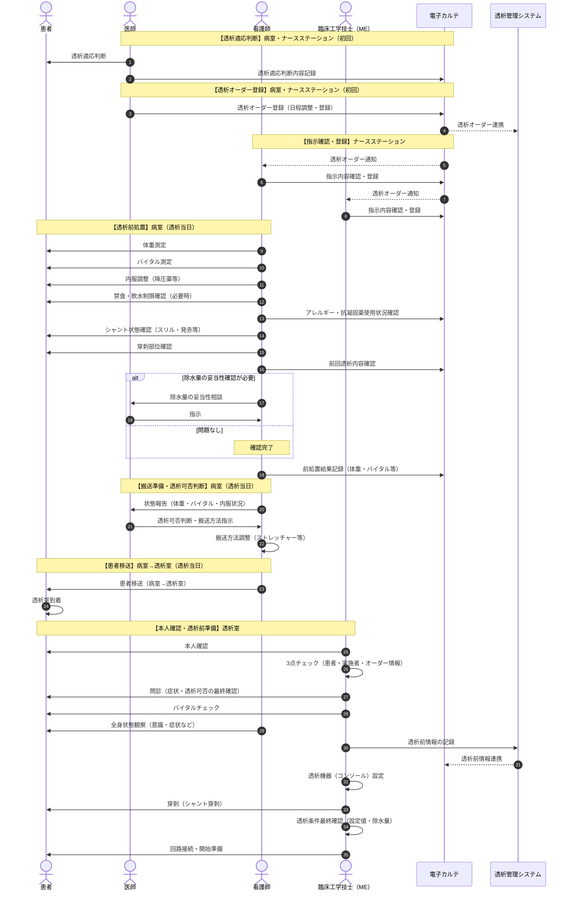
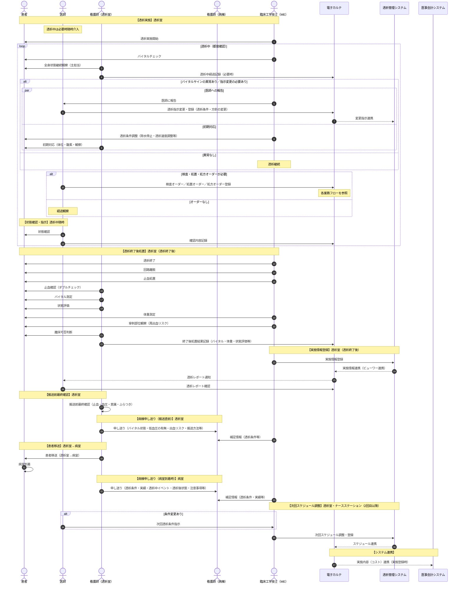

## 1. 透析オーダー登録〜透析前準備

```mermaid
sequenceDiagram
    autonumber
    actor 患者
    actor 医師
    actor 看護師
    actor ME as 臨床工学技士（ME）
    participant 電子カルテ
    participant 透析管理システム

    Note over 医師,電子カルテ: 【透析適応判断】病室・ナースステーション（初回）
    医師 ->> 患者: 透析適応判断
    医師 ->> 電子カルテ: 透析適応判断内容記録

    Note over 医師,電子カルテ: 【透析オーダー登録】病室・ナースステーション（初回）
    医師 ->> 電子カルテ: 透析オーダー登録（日程調整・登録）
    電子カルテ -->> 透析管理システム: 透析オーダー連携

    Note over 看護師,電子カルテ: 【指示確認・登録】ナースステーション
    電子カルテ -->> 看護師: 透析オーダー通知
    看護師 ->> 電子カルテ: 指示内容確認・登録
    電子カルテ -->> ME: 透析オーダー通知
    ME ->> 電子カルテ: 指示内容確認・登録

    Note over 看護師,患者: 【透析前処置】病室（透析当日）
    看護師 ->> 患者: 体重測定
    看護師 ->> 患者: バイタル測定
    看護師 ->> 患者: 内服調整（降圧薬等）
    看護師 ->> 患者: 禁食・飲水制限確認（必要時）
    看護師 ->> 電子カルテ: アレルギー・抗凝固薬使用状況確認
    看護師 ->> 患者: シャント状態確認（スリル・発赤等）
    看護師 ->> 患者: 穿刺部位確認
    看護師 ->> 電子カルテ: 前回透析内容確認
    alt 除水量の妥当性確認が必要
        看護師 ->> 医師: 除水量の妥当性相談
        医師 ->> 看護師: 指示
    else 問題なし
        Note over 看護師: 確認完了
    end
    看護師 ->> 電子カルテ: 前処置結果記録（体重・バイタル等）

    Note over 看護師,医師: 【搬送準備・透析可否判断】病室（透析当日）
    看護師 ->> 医師: 状態報告（体重・バイタル・内服状況）
    医師 ->> 看護師: 透析可否判断・搬送方法指示
    看護師 ->> 看護師: 搬送方法調整（ストレッチャー等）

    Note over 看護師,患者: 【患者移送】病室→透析室（透析当日）
    看護師 ->> 患者: 患者移送（病室→透析室）
    患者 ->> 患者: 透析室到着

    Note over ME,患者: 【本人確認・透析前準備】透析室
    ME ->> 患者: 本人確認
    ME ->> ME: 3点チェック（患者・実施者・オーダー情報）
    ME ->> 患者: 問診（症状・透析可否の最終確認）
    ME ->> 患者: バイタルチェック
    看護師 ->> 患者: 全身状態観察（意識・症状など）
    ME ->> 透析管理システム: 透析前情報の記録
    透析管理システム -->> 電子カルテ: 透析前情報連携
    ME ->> ME: 透析機器（コンソール）設定
    ME ->> 患者: 穿刺（シャント穿刺）
    ME ->> ME: 透析条件最終確認（設定値・除水量）
    ME ->> 患者: 回路接続・開始準備
```

## 2. 透析実施〜終了・次回スケジュール調整

```mermaid
sequenceDiagram
    autonumber
    actor 患者
    actor 医師
    actor 看護師T as 看護師（透析室）
    actor 看護師W as 看護師（病棟）
    actor ME as 臨床工学技士（ME）
    participant 電子カルテ
    participant 透析管理システム
    participant 医事会計システム

    Note over ME,患者: 【透析実施】透析室
    Note over 医師: 透析中は必要時随時介入
    ME ->> 患者: 透析実施開始
    loop 透析中（都度確認）
        ME ->> 患者: バイタルチェック
        看護師T ->> 患者: 全身状態継続観察（主担当）
        看護師T ->> 電子カルテ: 透析中経過記録（必要時）
        alt バイタルサインの異常あり／指示変更の必要あり
            par 医師への報告
                ME ->> 医師: 医師に報告
                医師 ->> 電子カルテ: 透析指示変更・登録（透析条件・方針の変更）
                電子カルテ -->> 透析管理システム: 変更指示連携
            and 初期対応
                ME ->> 患者: 透析条件調整（除水停止・透析速度調整等）
                看護師T ->> 患者: 初期対応（体位・酸素・観察）
            end
        else 異常なし
            Note over ME: 透析継続
        end
        alt 検査・処置・処方オーダーが必要
            医師 ->> 電子カルテ: 検査オーダー／処置オーダー／処方オーダー登録
            Note over 電子カルテ: 各業務フローを参照
        else オーダーなし
            Note over 医師: 経過観察
        end
        Note over 医師,患者: 【状態確認・指示】透析中随時
        医師 ->> 患者: 状態確認
        医師 ->> 電子カルテ: 確認内容記録
    end

    Note over ME,患者: 【透析終了後処置】透析室（透析終了後）
    ME ->> 患者: 透析終了
    ME ->> 患者: 回路離脱
    ME ->> 患者: 止血処置
    看護師T ->> 患者: 止血確認（ダブルチェック）
    看護師T ->> 患者: バイタル測定
    看護師T ->> 患者: 状態評価
    ME ->> 患者: 体重測定
    ME ->> 患者: 穿刺部位観察（再出血リスク）
    看護師T ->> 患者: 離床可否判断
    看護師T ->> 電子カルテ: 終了後処置結果記録（バイタル・体重・状態評価等）

    Note over ME,透析管理システム: 【実施情報登録】透析室（透析終了後）
    ME ->> 透析管理システム: 実施情報登録
    透析管理システム -->> 電子カルテ: 実施情報連携（ビューワー連携）
    電子カルテ -->> 医師: 透析レポート通知
    医師 ->> 電子カルテ: 透析レポート確認

    Note over 看護師T,患者: 【搬送前最終確認】透析室
    看護師T ->> 看護師T: 搬送前最終確認（止血・血圧・意識・ふらつき）

    Note over 看護師T,看護師W: 【病棟申し送り（搬送直前）】透析室
    看護師T ->> 看護師W: 申し送り（バイタル状態・低血圧の有無・出血リスク・搬送方法等）
    ME ->> 看護師W: 補足情報（透析条件等）

    Note over 看護師T,患者: 【患者移送】透析室→病室
    看護師T ->> 患者: 患者移送（透析室→病室）
    患者 ->> 患者: 病室到着

    Note over 看護師T,看護師W: 【病棟申し送り（病室到着時）】病室
    看護師T ->> 看護師W: 申し送り（透析条件・実績・透析中イベント・透析後状態・注意事項等）
    ME ->> 看護師W: 補足情報（透析条件・実績等）

    Note over ME,透析管理システム: 【次回スケジュール調整】透析室・ナースステーション（2回目以降）
    alt 条件変更あり
        医師 ->> ME: 次回透析条件指示
    end
    ME ->> 透析管理システム: 次回スケジュール調整・登録
    透析管理システム -->> 電子カルテ: スケジュール連携

    Note over 電子カルテ,医事会計システム: 【システム連携】
    電子カルテ -->> 医事会計システム: 実施内容（コスト）連携（実施登録時）
```
