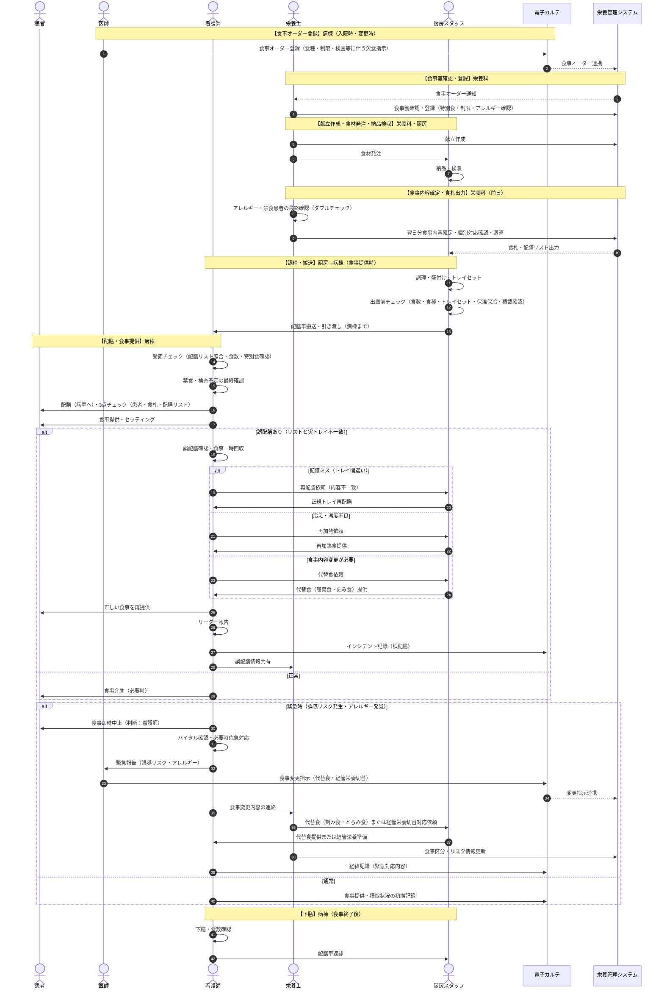
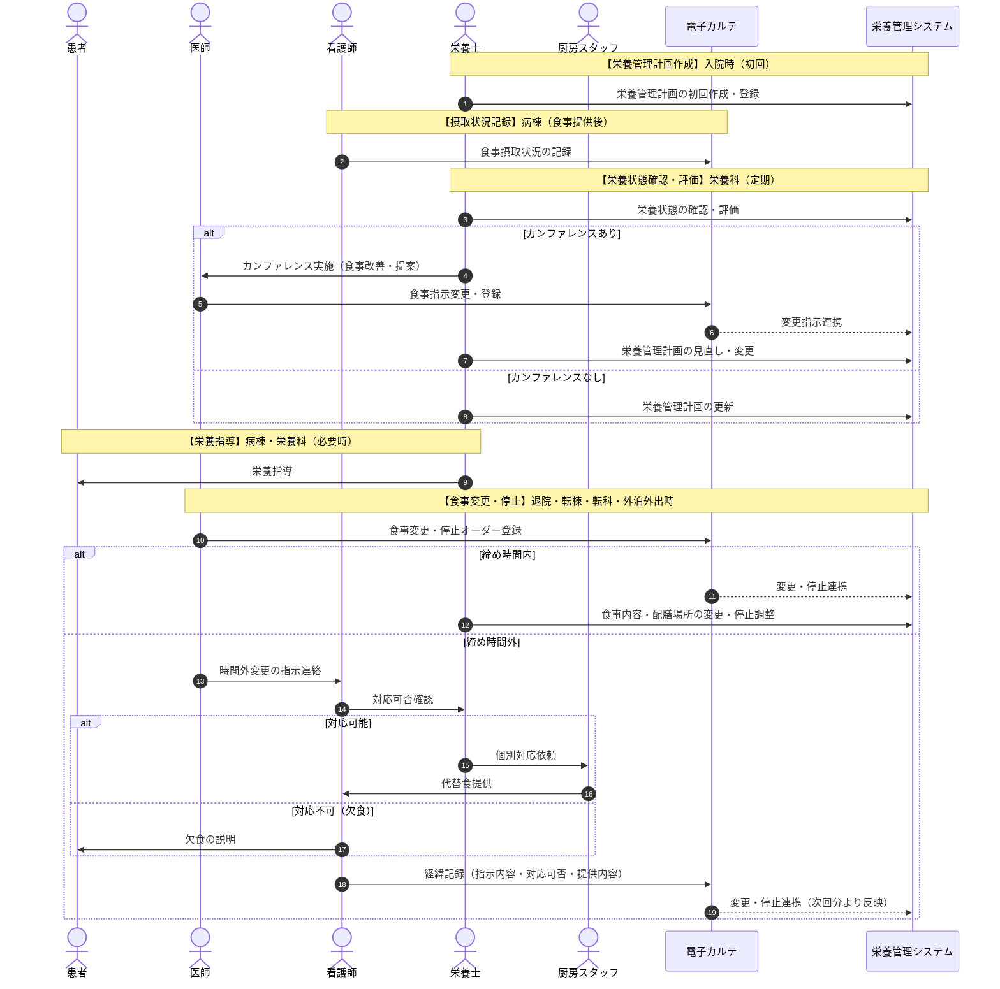

## 1. 食事オーダー登録〜食事提供

```mermaid
sequenceDiagram
    autonumber
    actor 患者
    actor 医師
    actor 看護師
    actor 栄養士
    actor 厨房スタッフ
    participant 電子カルテ
    participant 栄養管理システム

    Note over 医師,電子カルテ: 【食事オーダー登録】病棟（入院時・変更時）
    医師 ->> 電子カルテ: 食事オーダー登録（食種・制限・検査等に伴う欠食指示）
    電子カルテ -->> 栄養管理システム: 食事オーダー連携

    Note over 栄養士,栄養管理システム: 【食事箋確認・登録】栄養科
    栄養管理システム -->> 栄養士: 食事オーダー通知
    栄養士 ->> 栄養管理システム: 食事箋確認・登録（特別食・制限・アレルギー確認）

    Note over 栄養士,厨房スタッフ: 【献立作成・食材発注・納品検収】栄養科・厨房
    栄養士 ->> 栄養管理システム: 献立作成
    栄養士 ->> 厨房スタッフ: 食材発注
    厨房スタッフ ->> 厨房スタッフ: 納品・検収

    Note over 栄養士,栄養管理システム: 【食事内容確定・食札出力】栄養科（前日）
    栄養士 ->> 栄養士: アレルギー・禁食患者の最終確認（ダブルチェック）
    栄養士 ->> 栄養管理システム: 翌日分食事内容確定・個別対応確認・調整
    栄養管理システム -->> 厨房スタッフ: 食札・配膳リスト出力

    Note over 厨房スタッフ,看護師: 【調理・搬送】厨房→病棟（食事提供時）
    厨房スタッフ ->> 厨房スタッフ: 調理・盛付け・トレイセット
    厨房スタッフ ->> 厨房スタッフ: 出庫前チェック（食数・食種・トレイセット・保温保冷・積載確認）
    厨房スタッフ ->> 看護師: 配膳車搬送・引き渡し（病棟まで）

    Note over 看護師,患者: 【配膳・食事提供】病棟
    看護師 ->> 看護師: 受領チェック（配膳リスト照合・食数・特別食確認）
    看護師 ->> 看護師: 禁食・検査予定の最終確認
    看護師 ->> 患者: 配膳（病室へ）・3点チェック（患者・食札・配膳リスト）
    看護師 ->> 患者: 食事提供・セッティング

    alt 誤配膳あり（リストと実トレイ不一致）
        看護師 ->> 看護師: 誤配膳確認・食事一時回収
        alt 配膳ミス（トレイ間違い）
            看護師 ->> 厨房スタッフ: 再配膳依頼（内容不一致）
            厨房スタッフ ->> 看護師: 正規トレイ再配膳
        else 冷え・温度不良
            看護師 ->> 厨房スタッフ: 再加熱依頼
            厨房スタッフ ->> 看護師: 再加熱食提供
        else 食事内容変更が必要
            看護師 ->> 厨房スタッフ: 代替食依頼
            厨房スタッフ ->> 看護師: 代替食（簡易食・刻み食）提供
        end
        看護師 ->> 患者: 正しい食事を再提供
        看護師 ->> 看護師: リーダー報告
        看護師 ->> 電子カルテ: インシデント記録（誤配膳）
        看護師 ->> 栄養士: 誤配膳情報共有
    else 正常
        看護師 ->> 患者: 食事介助（必要時）
    end

    alt 緊急時（誤嚥リスク発生・アレルギー発覚）
        看護師 ->> 患者: 食事即時中止（判断：看護師）
        看護師 ->> 看護師: バイタル確認・必要時応急対応
        看護師 ->> 医師: 緊急報告（誤嚥リスク・アレルギー）
        医師 ->> 電子カルテ: 食事変更指示（代替食・経管栄養切替）
        電子カルテ -->> 栄養管理システム: 変更指示連携
        看護師 ->> 栄養士: 食事変更内容の連絡
        栄養士 ->> 厨房スタッフ: 代替食（刻み食・とろみ食）または経管栄養切替対応依頼
        厨房スタッフ ->> 看護師: 代替食提供または経管栄養準備
        栄養士 ->> 栄養管理システム: 食事区分・リスク情報更新
        看護師 ->> 電子カルテ: 経緯記録（緊急対応内容）
    else 通常
        看護師 ->> 電子カルテ: 食事提供・摂取状況の初期記録
    end

    Note over 看護師,厨房スタッフ: 【下膳】病棟（食事終了後）
    看護師 ->> 看護師: 下膳・食数確認
    看護師 ->> 厨房スタッフ: 配膳車返却
```

## 2. 食事摂取状況記録〜栄養管理・指導

```mermaid
sequenceDiagram
    autonumber
    actor 患者
    actor 医師
    actor 看護師
    actor 栄養士
    actor 厨房スタッフ
    participant 電子カルテ
    participant 栄養管理システム

    Note over 栄養士,栄養管理システム: 【栄養管理計画作成】入院時（初回）
    栄養士 ->> 栄養管理システム: 栄養管理計画の初回作成・登録

    Note over 看護師,電子カルテ: 【摂取状況記録】病棟（食事提供後）
    看護師 ->> 電子カルテ: 食事摂取状況の記録

    Note over 栄養士,栄養管理システム: 【栄養状態確認・評価】栄養科（定期）
    栄養士 ->> 栄養管理システム: 栄養状態の確認・評価

    alt カンファレンスあり
        栄養士 ->> 医師: カンファレンス実施（食事改善・提案）
        医師 ->> 電子カルテ: 食事指示変更・登録
        電子カルテ -->> 栄養管理システム: 変更指示連携
        栄養士 ->> 栄養管理システム: 栄養管理計画の見直し・変更
    else カンファレンスなし
        栄養士 ->> 栄養管理システム: 栄養管理計画の更新
    end

    Note over 栄養士,患者: 【栄養指導】病棟・栄養科（必要時）
    栄養士 ->> 患者: 栄養指導

    Note over 医師,栄養管理システム: 【食事変更・停止】退院・転棟・転科・外泊外出時
    医師 ->> 電子カルテ: 食事変更・停止オーダー登録

    alt 締め時間内
        電子カルテ -->> 栄養管理システム: 変更・停止連携
        栄養士 ->> 栄養管理システム: 食事内容・配膳場所の変更・停止調整
    else 締め時間外
        医師 ->> 看護師: 時間外変更の指示連絡
        看護師 ->> 栄養士: 対応可否確認
        alt 対応可能
            栄養士 ->> 厨房スタッフ: 個別対応依頼
            厨房スタッフ ->> 看護師: 代替食提供
        else 対応不可（欠食）
            看護師 ->> 患者: 欠食の説明
        end
        看護師 ->> 電子カルテ: 経緯記録（指示内容・対応可否・提供内容）
        電子カルテ -->> 栄養管理システム: 変更・停止連携（次回分より反映）
    end
```
