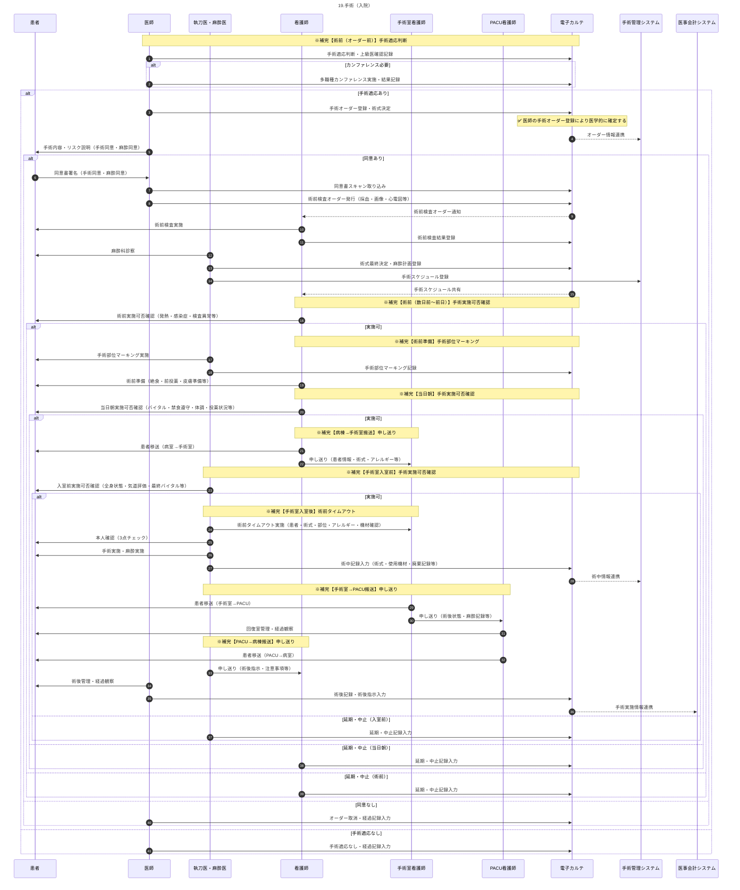

```mermaid
sequenceDiagram
title 19.手術（入院）
autonumber
participant 患者
participant 医師
participant 執刀医・麻酔医
participant 看護師
participant 手術室看護師
participant PACU看護師
participant 電子カルテ
participant 手術管理システム
participant 医事会計システム

Note over 医師,電子カルテ : ※補完【術前（オーダー前）】手術適応判断
医師 ->> 電子カルテ : 手術適応判断・上級医確認記録
alt カンファレンス必要
    医師 ->> 電子カルテ : 多職種カンファレンス実施・結果記録
end
alt 手術適応あり
    医師 ->> 電子カルテ : 手術オーダー登録・術式決定
    Note over 電子カルテ : ✅ 医師の手術オーダー登録により医学的に確定する
    電子カルテ -->> 手術管理システム : オーダー情報連携
    医師 ->> 患者 : 手術内容・リスク説明（手術同意・麻酔同意）
    alt 同意あり
        患者 ->> 医師 : 同意書署名（手術同意・麻酔同意）
        医師 ->> 電子カルテ : 同意書スキャン取り込み
        医師 ->> 電子カルテ : 術前検査オーダー発行（採血・画像・心電図等）
        電子カルテ -->> 看護師 : 術前検査オーダー通知
        看護師 ->> 患者 : 術前検査実施
        看護師 ->> 電子カルテ : 術前検査結果登録
        執刀医・麻酔医 ->> 患者 : 麻酔科診察
        執刀医・麻酔医 ->> 電子カルテ : 術式最終決定・麻酔計画登録
        執刀医・麻酔医 ->> 手術管理システム : 手術スケジュール登録
        電子カルテ -->> 看護師 : 手術スケジュール共有
        Note over 看護師,電子カルテ : ※補完【術前（数日前〜前日）】手術実施可否確認
        看護師 ->> 患者 : 術前実施可否確認（発熱・感染症・検査異常等）
        alt 実施可
            Note over 看護師,電子カルテ : ※補完【術前準備】手術部位マーキング
            執刀医・麻酔医 ->> 患者 : 手術部位マーキング実施
            執刀医・麻酔医 ->> 電子カルテ : 手術部位マーキング記録
            看護師 ->> 患者 : 術前準備（絶食・前投薬・皮膚準備等）
            Note over 看護師,電子カルテ : ※補完【当日朝】手術実施可否確認
            看護師 ->> 患者 : 当日朝実施可否確認（バイタル・禁食遵守・体調・投薬状況等）
            alt 実施可
                Note over 看護師,手術室看護師 : ※補完【病棟→手術室搬送】申し送り
                看護師 ->> 患者 : 患者移送（病室→手術室）
                看護師 ->> 手術室看護師 : 申し送り（患者情報・術式・アレルギー等）
                Note over 執刀医・麻酔医,電子カルテ : ※補完【手術室入室前】手術実施可否確認
                執刀医・麻酔医 ->> 患者 : 入室前実施可否確認（全身状態・気道評価・最終バイタル等）
                alt 実施可
                    Note over 執刀医・麻酔医,手術室看護師 : ※補完【手術室入室後】術前タイムアウト
                    執刀医・麻酔医 ->> 手術室看護師 : 術前タイムアウト実施（患者・術式・部位・アレルギー・機材確認）
                    執刀医・麻酔医 ->> 患者 : 本人確認（3点チェック）
                    執刀医・麻酔医 ->> 患者 : 手術実施・麻酔実施
                    執刀医・麻酔医 ->> 電子カルテ : 術中記録入力（術式・使用機材・廃棄記録等）
                    電子カルテ -->> 手術管理システム : 術中情報連携
                    Note over 執刀医・麻酔医,PACU看護師 : ※補完【手術室→PACU搬送】申し送り
                    手術室看護師 ->> 患者 : 患者移送（手術室→PACU）
                    手術室看護師 ->> PACU看護師 : 申し送り（術後状態・麻酔記録等）
                    PACU看護師 ->> 患者 : 回復室管理・経過観察
                    Note over 執刀医・麻酔医,看護師 : ※補完【PACU→病棟搬送】申し送り
                    PACU看護師 ->> 患者 : 患者移送（PACU→病室）
                    執刀医・麻酔医 ->> 看護師 : 申し送り（術後指示・注意事項等）
                    医師 ->> 患者 : 術後管理・経過観察
                    医師 ->> 電子カルテ : 術後記録・術後指示入力
                    電子カルテ -->> 医事会計システム : 手術実施情報連携
                else 延期・中止（入室前）
                    執刀医・麻酔医 ->> 電子カルテ : 延期・中止記録入力
                end
            else 延期・中止（当日朝）
                看護師 ->> 電子カルテ : 延期・中止記録入力
            end
        else 延期・中止（術前）
            看護師 ->> 電子カルテ : 延期・中止記録入力
        end
    else 同意なし
        医師 ->> 電子カルテ : オーダー取消・経過記録入力
    end
else 手術適応なし
    医師 ->> 電子カルテ : 手術適応なし・経過記録入力
end
```
