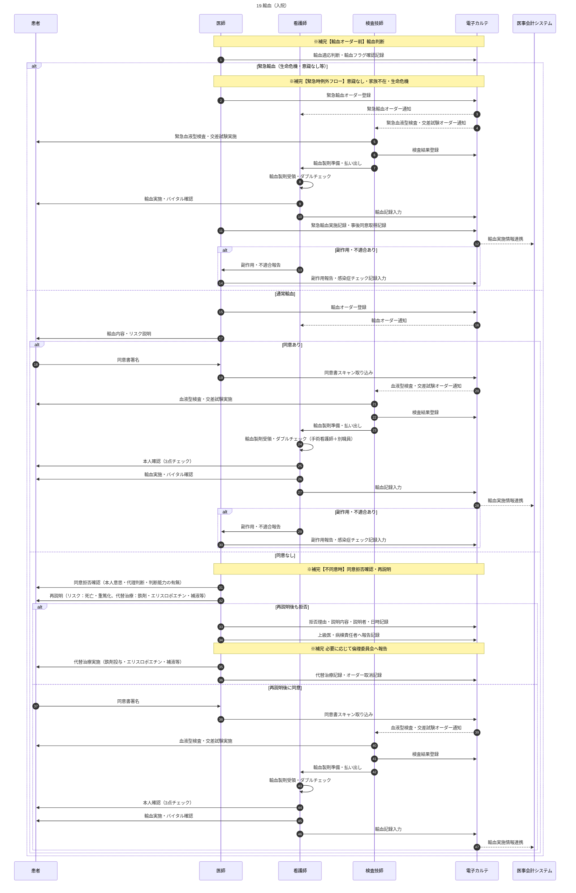

```mermaid
sequenceDiagram
title 19.輸血（入院）
autonumber
participant 患者
participant 医師
participant 看護師
participant 検査技師
participant 電子カルテ
participant 医事会計システム

Note over 医師,電子カルテ : ※補完【輸血オーダー前】輸血判断
医師 ->> 電子カルテ : 輸血適応判断・輸血フラグ確認記録
alt 緊急輸血（生命危機・意識なし等）
    Note over 医師,電子カルテ : ※補完【緊急時例外フロー】意識なし・家族不在・生命危機
    医師 ->> 電子カルテ : 緊急輸血オーダー登録
    電子カルテ -->> 看護師 : 緊急輸血オーダー通知
    電子カルテ -->> 検査技師 : 緊急血液型検査・交差試験オーダー通知
    検査技師 ->> 患者 : 緊急血液型検査・交差試験実施
    検査技師 ->> 電子カルテ : 検査結果登録
    検査技師 ->> 看護師 : 輸血製剤準備・払い出し
    看護師 ->> 看護師 : 輸血製剤受領・ダブルチェック
    看護師 ->> 患者 : 輸血実施・バイタル確認
    看護師 ->> 電子カルテ : 輸血記録入力
    医師 ->> 電子カルテ : 緊急輸血実施記録・事後同意取得記録
    電子カルテ -->> 医事会計システム : 輸血実施情報連携
    alt 副作用・不適合あり
        看護師 ->> 医師 : 副作用・不適合報告
        医師 ->> 電子カルテ : 副作用報告・感染症チェック記録入力
    end
else 通常輸血
    医師 ->> 電子カルテ : 輸血オーダー登録
    電子カルテ -->> 看護師 : 輸血オーダー通知
    医師 ->> 患者 : 輸血内容・リスク説明
    alt 同意あり
        患者 ->> 医師 : 同意書署名
        医師 ->> 電子カルテ : 同意書スキャン取り込み
        電子カルテ -->> 検査技師 : 血液型検査・交差試験オーダー通知
        検査技師 ->> 患者 : 血液型検査・交差試験実施
        検査技師 ->> 電子カルテ : 検査結果登録
        検査技師 ->> 看護師 : 輸血製剤準備・払い出し
        看護師 ->> 看護師 : 輸血製剤受領・ダブルチェック（手術看護師＋別職員）
        看護師 ->> 患者 : 本人確認（3点チェック）
        看護師 ->> 患者 : 輸血実施・バイタル確認
        看護師 ->> 電子カルテ : 輸血記録入力
        電子カルテ -->> 医事会計システム : 輸血実施情報連携
        alt 副作用・不適合あり
            看護師 ->> 医師 : 副作用・不適合報告
            医師 ->> 電子カルテ : 副作用報告・感染症チェック記録入力
        end
    else 同意なし
        Note over 医師,電子カルテ : ※補完【不同意時】同意拒否確認・再説明
        医師 ->> 患者 : 同意拒否確認（本人意思・代理判断・判断能力の有無）
        医師 ->> 患者 : 再説明（リスク：死亡・重篤化、代替治療：鉄剤・エリスロポエチン・補液等）
        alt 再説明後も拒否
            医師 ->> 電子カルテ : 拒否理由・説明内容・説明者・日時記録
            医師 ->> 電子カルテ : 上級医・病棟責任者へ報告記録
            Note over 医師,電子カルテ : ※補完 必要に応じて倫理委員会へ報告
            医師 ->> 患者 : 代替治療実施（鉄剤投与・エリスロポエチン・補液等）
            医師 ->> 電子カルテ : 代替治療記録・オーダー取消記録
        else 再説明後に同意
            患者 ->> 医師 : 同意書署名
            医師 ->> 電子カルテ : 同意書スキャン取り込み
            電子カルテ -->> 検査技師 : 血液型検査・交差試験オーダー通知
            検査技師 ->> 患者 : 血液型検査・交差試験実施
            検査技師 ->> 電子カルテ : 検査結果登録
            検査技師 ->> 看護師 : 輸血製剤準備・払い出し
            看護師 ->> 看護師 : 輸血製剤受領・ダブルチェック
            看護師 ->> 患者 : 本人確認（3点チェック）
            看護師 ->> 患者 : 輸血実施・バイタル確認
            看護師 ->> 電子カルテ : 輸血記録入力
            電子カルテ -->> 医事会計システム : 輸血実施情報連携
        end
    end
end
```
