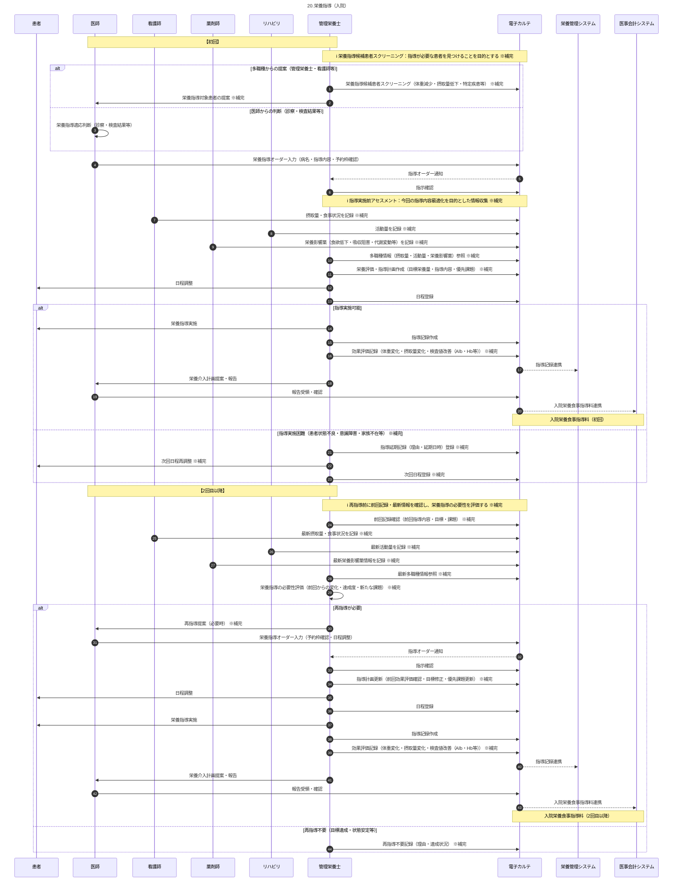

```mermaid
sequenceDiagram
title 20.栄養指導（入院）
autonumber
participant 患者
participant 医師
participant 看護師
participant 薬剤師
participant リハビリ
participant 管理栄養士
participant 電子カルテ
participant 栄養管理システム
participant 医事会計システム

Note over 医師,管理栄養士: 【初回】

%% ① スクリーニング（指導が必要な患者を見つけることを目的とする）
Note over 管理栄養士,電子カルテ: ℹ️ 栄養指導候補患者スクリーニング：指導が必要な患者を見つけることを目的とする ※補完
alt 多職種からの提案（管理栄養士・看護師等）
    管理栄養士 ->> 電子カルテ : 栄養指導候補患者スクリーニング（体重減少・摂取量低下・特定疾患等） ※補完
    管理栄養士 ->> 医師 : 栄養指導対象患者の提案 ※補完
else 医師からの判断（診察・検査結果等）
    医師 ->> 医師 : 栄養指導適応判断（診察・検査結果等）
end

医師 ->> 電子カルテ : 栄養指導オーダー入力（病名・指導内容・予約枠確認）
電子カルテ -->> 管理栄養士 : 指導オーダー通知
管理栄養士 ->> 電子カルテ : 指示確認

%% ② 指導実施前アセスメント（今回の指導内容最適化を目的とする）
Note over 管理栄養士,電子カルテ: ℹ️ 指導実施前アセスメント：今回の指導内容最適化を目的とした情報収集 ※補完
看護師 ->> 電子カルテ : 摂取量・食事状況を記録 ※補完
リハビリ ->> 電子カルテ : 活動量を記録 ※補完
薬剤師 ->> 電子カルテ : 栄養影響薬（食欲低下・吸収阻害・代謝変動等）を記録 ※補完
管理栄養士 ->> 電子カルテ : 多職種情報（摂取量・活動量・栄養影響薬）参照 ※補完
管理栄養士 ->> 電子カルテ : 栄養評価・指導計画作成（目標栄養量・指導内容・優先課題） ※補完
管理栄養士 ->> 患者 : 日程調整
管理栄養士 ->> 電子カルテ : 日程登録

alt 指導実施可能
    管理栄養士 ->> 患者 : 栄養指導実施
    管理栄養士 ->> 電子カルテ : 指導記録作成
    管理栄養士 ->> 電子カルテ : 効果評価記録（体重変化・摂取量変化・検査値改善（Alb・Hb等）） ※補完
    電子カルテ -->> 栄養管理システム : 指導記録連携
    管理栄養士 ->> 医師 : 栄養介入計画提案・報告
    医師 ->> 電子カルテ : 報告受領・確認
    電子カルテ -->> 医事会計システム : 入院栄養食事指導料連携
    Note over 電子カルテ,医事会計システム: 入院栄養食事指導料（初回）
else 指導実施困難（患者状態不良・意識障害・家族不在等） ※補完
    管理栄養士 ->> 電子カルテ : 指導延期記録（理由・延期日時）登録 ※補完
    管理栄養士 ->> 患者 : 次回日程再調整 ※補完
    管理栄養士 ->> 電子カルテ : 次回日程登録 ※補完
end

Note over 医師,管理栄養士: 【2回目以降】

%% ① 前回記録確認・最新多職種情報確認・再指導必要性評価
Note over 管理栄養士,電子カルテ: ℹ️ 再指導前に前回記録・最新情報を確認し、栄養指導の必要性を評価する ※補完
管理栄養士 ->> 電子カルテ : 前回記録確認（前回指導内容・目標・課題） ※補完
看護師 ->> 電子カルテ : 最新摂取量・食事状況を記録 ※補完
リハビリ ->> 電子カルテ : 最新活動量を記録 ※補完
薬剤師 ->> 電子カルテ : 最新栄養影響薬情報を記録 ※補完
管理栄養士 ->> 電子カルテ : 最新多職種情報参照 ※補完
管理栄養士 ->> 管理栄養士 : 栄養指導の必要性評価（前回からの変化・達成度・新たな課題） ※補完

alt 再指導が必要
    管理栄養士 ->> 医師 : 再指導提案（必要時） ※補完
    医師 ->> 電子カルテ : 栄養指導オーダー入力（予約枠確認・日程調整）
    電子カルテ -->> 管理栄養士 : 指導オーダー通知
    管理栄養士 ->> 電子カルテ : 指示確認
    管理栄養士 ->> 電子カルテ : 指導計画更新（前回効果評価確認・目標修正・優先課題更新） ※補完
    管理栄養士 ->> 患者 : 日程調整
    管理栄養士 ->> 電子カルテ : 日程登録
    管理栄養士 ->> 患者 : 栄養指導実施
    管理栄養士 ->> 電子カルテ : 指導記録作成
    管理栄養士 ->> 電子カルテ : 効果評価記録（体重変化・摂取量変化・検査値改善（Alb・Hb等）） ※補完
    電子カルテ -->> 栄養管理システム : 指導記録連携
    管理栄養士 ->> 医師 : 栄養介入計画提案・報告
    医師 ->> 電子カルテ : 報告受領・確認
    電子カルテ -->> 医事会計システム : 入院栄養食事指導料連携
    Note over 電子カルテ,医事会計システム: 入院栄養食事指導料（2回目以降）
else 再指導不要（目標達成・状態安定等）
    管理栄養士 ->> 電子カルテ : 再指導不要記録（理由・達成状況） ※補完
end
```
