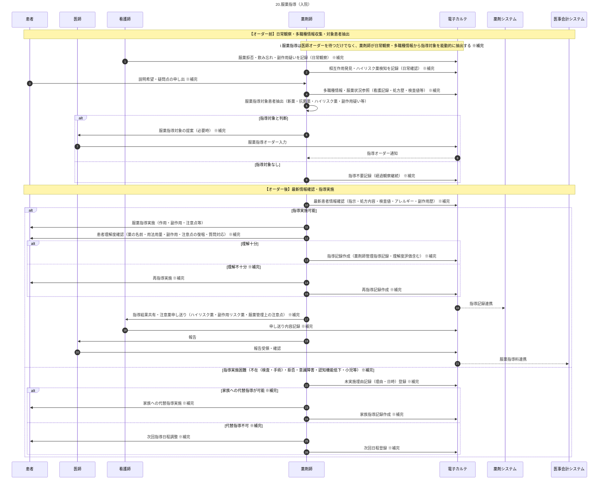

```mermaid
sequenceDiagram
title 20.服薬指導（入院）
autonumber
participant 患者
participant 医師
participant 看護師
participant 薬剤師
participant 電子カルテ
participant 薬剤システム
participant 医事会計システム

Note over 患者,医事会計システム: 【オーダー前】日常観察・多職種情報収集・対象患者抽出
Note over 薬剤師,電子カルテ: ℹ️ 服薬指導は医師オーダーを待つだけでなく、薬剤師が日常観察・多職種情報から指導対象を能動的に抽出する ※補完

看護師 ->> 電子カルテ : 服薬拒否・飲み忘れ・副作用疑いを記録（日常観察） ※補完
薬剤師 ->> 電子カルテ : 相互作用発見・ハイリスク薬検知を記録（日常確認） ※補完
患者 ->> 薬剤師 : 説明希望・疑問点の申し出 ※補完

薬剤師 ->> 電子カルテ : 多職種情報・服薬状況参照（看護記録・処方歴・検査値等） ※補完
薬剤師 ->> 薬剤師 : 服薬指導対象患者抽出（新薬・抗菌薬・ハイリスク薬・副作用疑い等）

alt 指導対象と判断
    薬剤師 ->> 医師 : 服薬指導対象の提案（必要時） ※補完
    医師 ->> 電子カルテ : 服薬指導オーダー入力
    電子カルテ -->> 薬剤師 : 指導オーダー通知
else 指導対象なし
    薬剤師 ->> 電子カルテ : 指導不要記録（経過観察継続） ※補完
end

Note over 患者,医事会計システム: 【オーダー後】最新情報確認・指導実施
薬剤師 ->> 電子カルテ : 最新患者情報確認（指示・処方内容・検査値・アレルギー・副作用歴） ※補完

alt 指導実施可能
    薬剤師 ->> 患者 : 服薬指導実施（作用・副作用・注意点等）
    薬剤師 ->> 患者 : 患者理解度確認（薬の名前・用法用量・副作用・注意点の復唱・質問対応） ※補完
    alt 理解十分
        薬剤師 ->> 電子カルテ : 指導記録作成（薬剤師管理指導記録・理解度評価含む） ※補完
    else 理解不十分 ※補完
        薬剤師 ->> 患者 : 再指導実施 ※補完
        薬剤師 ->> 電子カルテ : 再指導記録作成 ※補完
    end
    電子カルテ -->> 薬剤システム : 指導記録連携
    薬剤師 ->> 看護師 : 指導結果共有・注意薬申し送り（ハイリスク薬・副作用リスク薬・服薬管理上の注意点） ※補完
    看護師 ->> 電子カルテ : 申し送り内容記録 ※補完
    薬剤師 ->> 医師 : 報告
    医師 ->> 電子カルテ : 報告受領・確認
    電子カルテ -->> 医事会計システム : 服薬指導料連携
else 指導実施困難（不在（検査・手術）・拒否・意識障害・認知機能低下・小児等） ※補完
    薬剤師 ->> 電子カルテ : 未実施理由記録（理由・日時）登録 ※補完
    alt 家族への代替指導が可能 ※補完
        薬剤師 ->> 患者 : 家族への代替指導実施 ※補完
        薬剤師 ->> 電子カルテ : 家族指導記録作成 ※補完
    else 代替指導不可 ※補完
        薬剤師 ->> 患者 : 次回指導日程調整 ※補完
        薬剤師 ->> 電子カルテ : 次回日程登録 ※補完
    end
end
```
