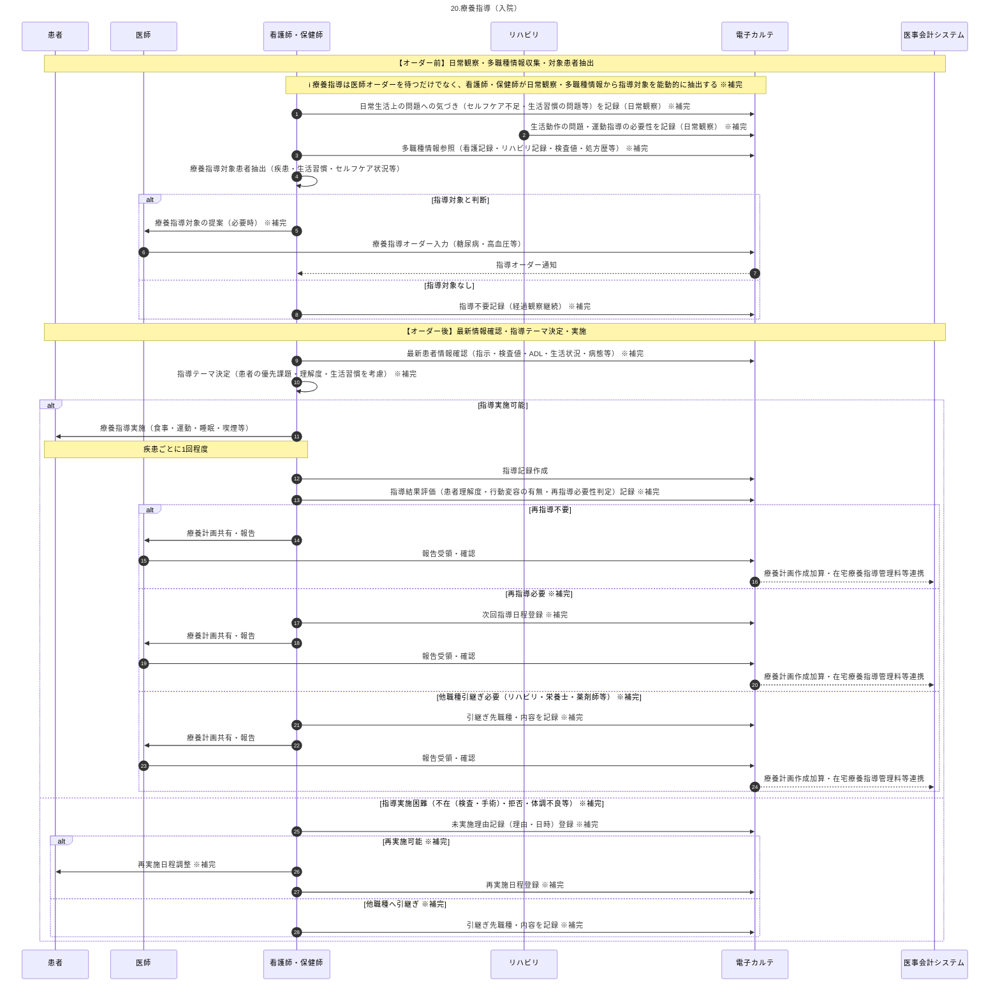

```mermaid
sequenceDiagram
title 20.療養指導（入院）
autonumber
participant 患者
participant 医師
participant 看護師・保健師
participant リハビリ
participant 電子カルテ
participant 医事会計システム

Note over 患者,医事会計システム: 【オーダー前】日常観察・多職種情報収集・対象患者抽出
Note over 看護師・保健師,電子カルテ: ℹ️ 療養指導は医師オーダーを待つだけでなく、看護師・保健師が日常観察・多職種情報から指導対象を能動的に抽出する ※補完

看護師・保健師 ->> 電子カルテ : 日常生活上の問題への気づき（セルフケア不足・生活習慣の問題等）を記録（日常観察） ※補完
リハビリ ->> 電子カルテ : 生活動作の問題・運動指導の必要性を記録（日常観察） ※補完

看護師・保健師 ->> 電子カルテ : 多職種情報参照（看護記録・リハビリ記録・検査値・処方歴等） ※補完
看護師・保健師 ->> 看護師・保健師 : 療養指導対象患者抽出（疾患・生活習慣・セルフケア状況等）

alt 指導対象と判断
    看護師・保健師 ->> 医師 : 療養指導対象の提案（必要時） ※補完
    医師 ->> 電子カルテ : 療養指導オーダー入力（糖尿病・高血圧等）
    電子カルテ -->> 看護師・保健師 : 指導オーダー通知
else 指導対象なし
    看護師・保健師 ->> 電子カルテ : 指導不要記録（経過観察継続） ※補完
end

Note over 患者,医事会計システム: 【オーダー後】最新情報確認・指導テーマ決定・実施
看護師・保健師 ->> 電子カルテ : 最新患者情報確認（指示・検査値・ADL・生活状況・病態等） ※補完
看護師・保健師 ->> 看護師・保健師 : 指導テーマ決定（患者の優先課題・理解度・生活習慣を考慮） ※補完

alt 指導実施可能
    看護師・保健師 ->> 患者 : 療養指導実施（食事・運動・睡眠・喫煙等）
    Note over 看護師・保健師,患者: 疾患ごとに1回程度
    看護師・保健師 ->> 電子カルテ : 指導記録作成
    看護師・保健師 ->> 電子カルテ : 指導結果評価（患者理解度・行動変容の有無・再指導必要性判定）記録 ※補完
    alt 再指導不要
        看護師・保健師 ->> 医師 : 療養計画共有・報告
        医師 ->> 電子カルテ : 報告受領・確認
        電子カルテ -->> 医事会計システム : 療養計画作成加算・在宅療養指導管理料等連携
    else 再指導必要 ※補完
        看護師・保健師 ->> 電子カルテ : 次回指導日程登録 ※補完
        看護師・保健師 ->> 医師 : 療養計画共有・報告
        医師 ->> 電子カルテ : 報告受領・確認
        電子カルテ -->> 医事会計システム : 療養計画作成加算・在宅療養指導管理料等連携
    else 他職種引継ぎ必要（リハビリ・栄養士・薬剤師等） ※補完
        看護師・保健師 ->> 電子カルテ : 引継ぎ先職種・内容を記録 ※補完
        看護師・保健師 ->> 医師 : 療養計画共有・報告
        医師 ->> 電子カルテ : 報告受領・確認
        電子カルテ -->> 医事会計システム : 療養計画作成加算・在宅療養指導管理料等連携
    end
else 指導実施困難（不在（検査・手術）・拒否・体調不良等） ※補完
    看護師・保健師 ->> 電子カルテ : 未実施理由記録（理由・日時）登録 ※補完
    alt 再実施可能 ※補完
        看護師・保健師 ->> 患者 : 再実施日程調整 ※補完
        看護師・保健師 ->> 電子カルテ : 再実施日程登録 ※補完
    else 他職種へ引継ぎ ※補完
        看護師・保健師 ->> 電子カルテ : 引継ぎ先職種・内容を記録 ※補完
    end
end
```
