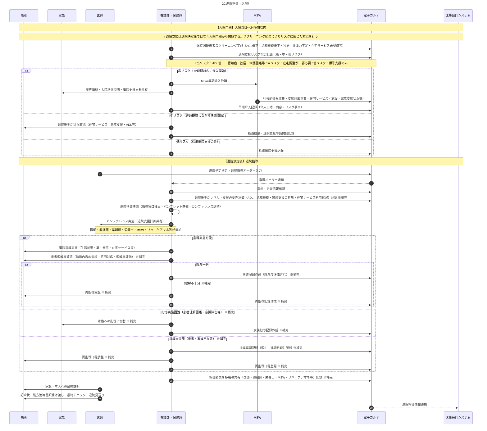

```mermaid
sequenceDiagram
title 20.退院指導（入院）
autonumber
participant 患者
participant 家族
participant 医師
participant 看護師・保健師
participant MSW
participant 電子カルテ
participant 医事会計システム

Note over 患者,医事会計システム: 【入院早期】入院当日〜24時間以内
Note over 患者,医事会計システム: ℹ️ 退院支援は退院決定後ではなく入院早期から開始する。スクリーニング結果によりリスクに応じた対応を行う

看護師・保健師 ->> 電子カルテ : 退院困難患者スクリーニング実施（ADL低下・認知機能低下・独居・介護力不足・在宅サービス未整備等）
看護師・保健師 ->> 電子カルテ : 退院支援リスク判定記録（高・中・低リスク）
Note over 看護師・保健師,電子カルテ: ℹ️ 高リスク：ADL低下・認知症・独居・介護困難等 / 中リスク：在宅調整が一部必要 / 低リスク：標準支援のみ

alt 高リスク（72時間以内に介入開始）
    看護師・保健師 ->> MSW : MSW早期介入依頼
    看護師・保健師 ->> 家族 : 家族連絡・入院状況説明・退院支援方針共有
    MSW ->> 電子カルテ : 社会的情報収集・支援計画立案（在宅サービス・施設・家族支援状況等）
    看護師・保健師 ->> 電子カルテ : 早期介入記録（介入日時・内容・リスク事由）
else 中リスク（経過観察しながら準備開始）
    看護師・保健師 ->> 患者 : 退院後生活状況確認（在宅サービス・家族支援・ADL等）
    看護師・保健師 ->> 電子カルテ : 経過観察・退院支援準備開始記録
else 低リスク（標準退院支援のみ）
    看護師・保健師 ->> 電子カルテ : 標準退院支援記録
end

Note over 患者,医事会計システム: 【退院決定後】退院指導

医師 ->> 電子カルテ : 退院予定決定・退院指導オーダー入力
電子カルテ -->> 看護師・保健師 : 指導オーダー通知
看護師・保健師 ->> 電子カルテ : 指示・患者情報確認
看護師・保健師 ->> 電子カルテ : 退院後生活レベル・支援必要性評価（ADL・認知機能・家族支援の有無・在宅サービス利用状況）記録 ※補完
看護師・保健師 ->> 看護師・保健師 : 退院指導準備（指導項目抽出・パンフレット準備・カンファレンス調整）
看護師・保健師 ->> 医師 : カンファレンス実施（退院支援計画共有）
Note over 医師,看護師・保健師: 医師・看護師・薬剤師・栄養士・MSW・リハ・ケアマネ等が参加

alt 指導実施可能
    看護師・保健師 ->> 患者 : 退院指導実施（生活状況・薬・食事・在宅サービス等）
    看護師・保健師 ->> 患者 : 患者理解度確認（指導内容の復唱・質問対応・理解度評価） ※補完
    alt 理解十分
        看護師・保健師 ->> 電子カルテ : 指導記録作成（理解度評価含む） ※補完
    else 理解不十分 ※補完
        看護師・保健師 ->> 患者 : 再指導実施 ※補完
        看護師・保健師 ->> 電子カルテ : 再指導記録作成 ※補完
    end
else 指導実施困難（患者理解困難・意識障害等） ※補完
    看護師・保健師 ->> 家族 : 家族への指導に切替 ※補完
    看護師・保健師 ->> 電子カルテ : 家族指導記録作成 ※補完
else 指導未実施（患者・家族不在等） ※補完
    看護師・保健師 ->> 電子カルテ : 指導延期記録（理由・延期日時）登録 ※補完
    看護師・保健師 ->> 患者 : 再指導日程調整 ※補完
    看護師・保健師 ->> 電子カルテ : 再指導日程登録 ※補完
end

看護師・保健師 ->> 電子カルテ : 指導結果を多職種共有（医師・薬剤師・栄養士・MSW・リハ・ケアマネ等）記録 ※補完
医師 ->> 患者 : 家族・本人への最終説明
医師 ->> 患者 : 紹介状・処方箋等書類受け渡し・最終チェック・退院見送り
電子カルテ -->> 医事会計システム : 退院指導情報連携
```
