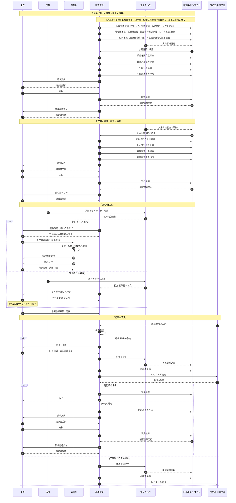

```mermaid
sequenceDiagram
autonumber
participant 患者
participant 医師
participant 薬剤師
participant 事務職員
participant 電子カルテ
participant 医事会計システム
participant 支払基金国保連

Note over 患者,医事会計システム: 「入院中（月末）計算・請求・清算」
Note over 事務職員,医事会計システム: ℹ️ 月末締め処理前に保険資格・限度額・公費の最新状況を確認し、請求に反映させる
事務職員 ->>医事会計システム : 保険資格確認（オンライン資格確認・有効期限・保険変更等）
事務職員 ->>医事会計システム : 限度額確認（高額療養費・限度額適用認定証・自己負担上限額）
事務職員 ->>医事会計システム : 公費確認（医療費助成・難病・生活保護等の適用状況）
電子カルテ -->>医事会計システム : 実施情報連携
医事会計システム ->>事務職員 : 診療情報の収集
事務職員 ->>医事会計システム : 診療報酬点数算出
事務職員 ->>医事会計システム : 自己負担額の計算
事務職員 ->>医事会計システム : 中間締め処理
事務職員 ->>医事会計システム : 中間請求書の作成
事務職員 ->>患者 : 請求案内
患者 -->>事務職員 : 請求書受領
患者 ->>事務職員 : 支払
事務職員 ->>医事会計システム : 精算処理
医事会計システム -->>事務職員 : 領収書等発行
事務職員 ->>患者 : 領収書等交付
患者 -->>事務職員 : 領収書受領
Note over 患者,医事会計システム: 「退院時」計算・請求・清算
電子カルテ -->>医事会計システム : 実施情報連携（最終）
医事会計システム ->>事務職員 : 最終診療情報の収集
事務職員 ->>医事会計システム : 診療点数の最終集計
事務職員 ->>医事会計システム : 自己負担額の計算
事務職員 ->>医事会計システム : 中間請求との照合
事務職員 ->>医事会計システム : 最終請求書の作成
事務職員 ->>患者 : 請求案内
患者 -->>事務職員 : 請求書受領
患者 ->>事務職員 : 支払
事務職員 ->>医事会計システム : 精算処理
医事会計システム -->>事務職員 : 領収書等発行
事務職員 ->>患者 : 領収書等交付
患者 -->>事務職員 : 領収書受領
Note over 患者,医事会計システム: 「退院時処方」
医師 ->>電子カルテ : 退院時処方オーダー登録
電子カルテ -->>薬剤師 : 処方情報通知

alt 院内処方 ※補完
    事務職員 ->>患者 : 退院時処方用引換券発行
    患者 -->>事務職員 : 退院時処方用引換券受領
    患者 ->>薬剤師 : 退院時処方用引換券提出
    薬剤師 ->>薬剤師 : 退院時処方用引換券の確認
    薬剤師 ->>患者 : 薬剤情報提供
    薬剤師 ->>患者 : 薬剤交付
    患者 -->>薬剤師 : 内容理解・薬剤受領
else 院外処方 ※補完
    医師 ->>電子カルテ : 処方箋発行 ※補完
    電子カルテ -->>事務職員 : 処方箋印刷 ※補完
    事務職員 ->>患者 : 処方箋手渡し ※補完
    患者 -->>事務職員 : 処方箋受領 ※補完
    Note over 患者: 院外薬局にて受け取り ※補完
end

患者 ->>事務職員 : 必要書類受領・退院
Note over 患者,支払基金国保連: 「返戻金清算」
支払基金国保連 -->>事務職員 : 返戻通知の受領
事務職員 ->>事務職員 : 原因確認
alt 患者関係の場合
    事務職員 ->>患者 : 患者へ連絡
    患者 -->>事務職員 : 内容確認・必要書類提出
    事務職員 ->>電子カルテ : 診療情報訂正
    電子カルテ -->>医事会計システム : 実施情報更新
    事務職員 ->>医事会計システム : 再請求準備
    事務職員 ->>支払基金国保連 : レセプト再提出
    支払基金国保連 -->>事務職員 : 通知の確認
    alt 過徴収の場合
        事務職員 ->>医事会計システム : 返金処理
        事務職員 ->>患者 : 返金
    else 不足の場合
        事務職員 ->>医事会計システム : 再請求書の作成
        事務職員 ->>患者 : 請求案内
        患者 -->>事務職員 : 請求書受領
        患者 ->>事務職員 : 支払
        事務職員 ->>医事会計システム : 精算処理
        医事会計システム -->>事務職員 : 領収書等発行
        事務職員 ->>患者 : 領収書等交付
        患者 -->>事務職員 : 領収書受領
    end
else 医療側で訂正の場合
    事務職員 ->>電子カルテ : 診療情報訂正
    電子カルテ -->>医事会計システム : 実施情報更新
    事務職員 ->>医事会計システム : 再請求準備
    事務職員 ->>支払基金国保連 : レセプト再提出
end
```
