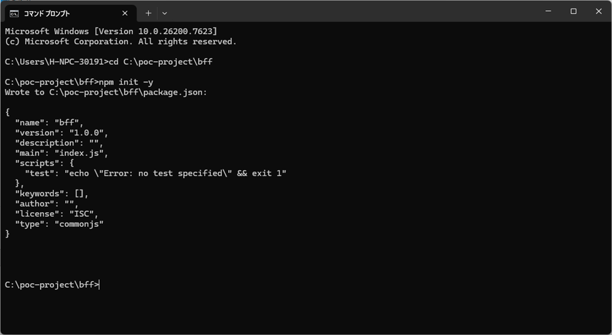
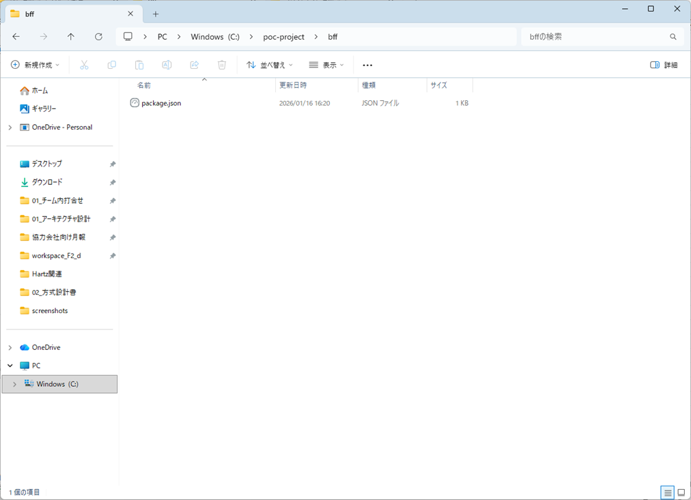
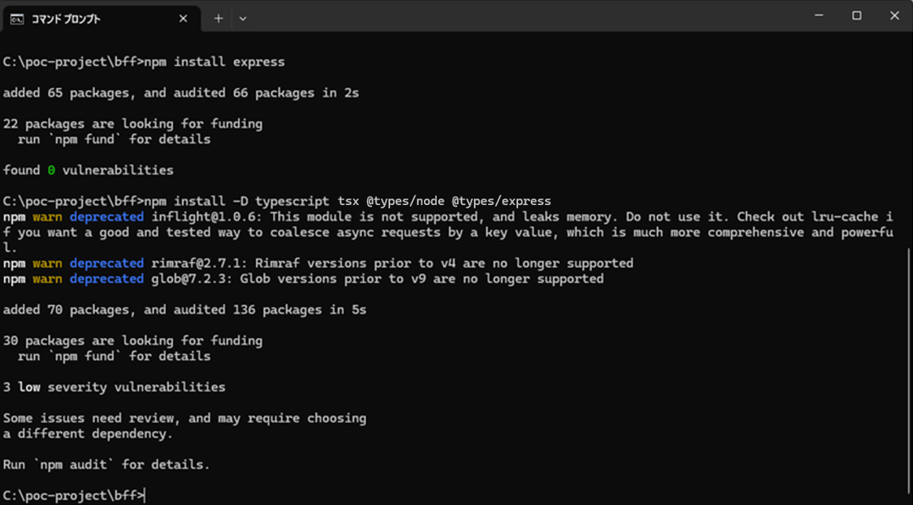
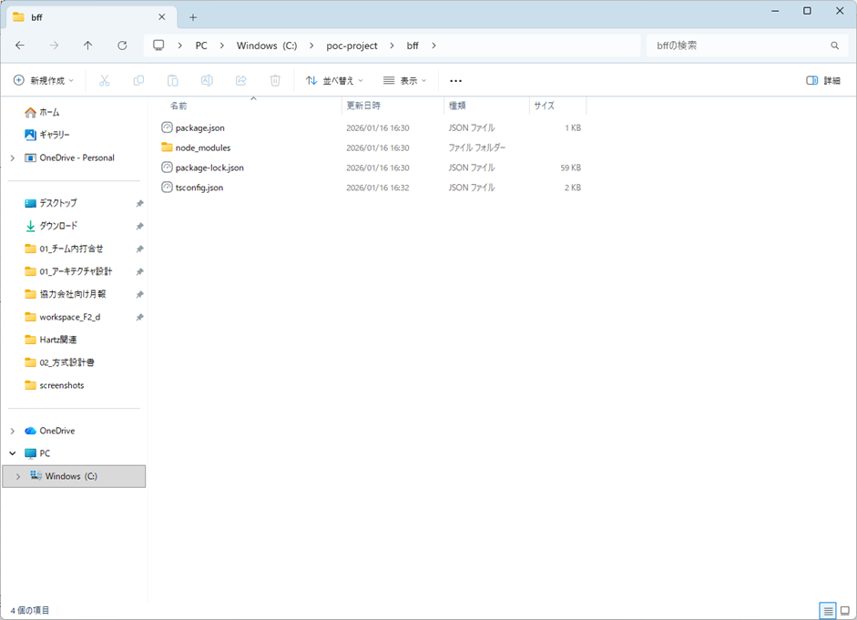
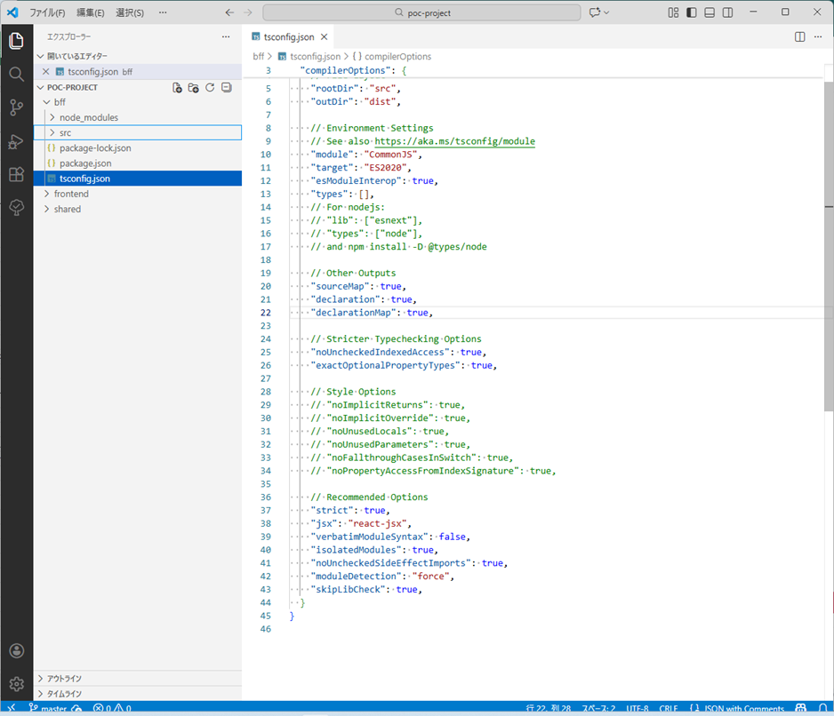
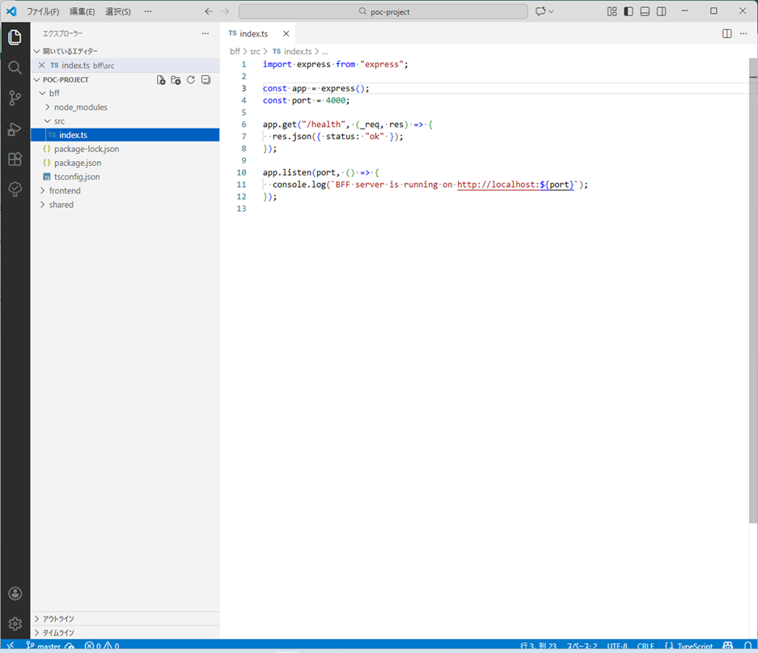
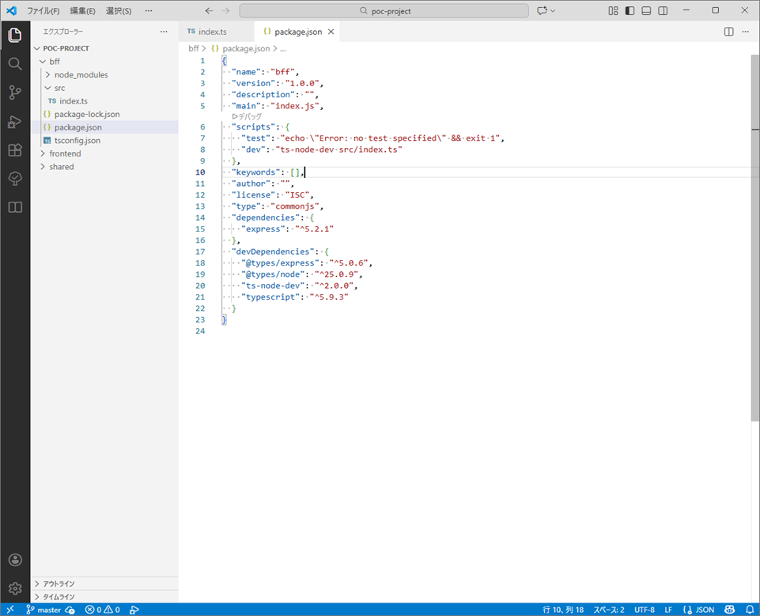
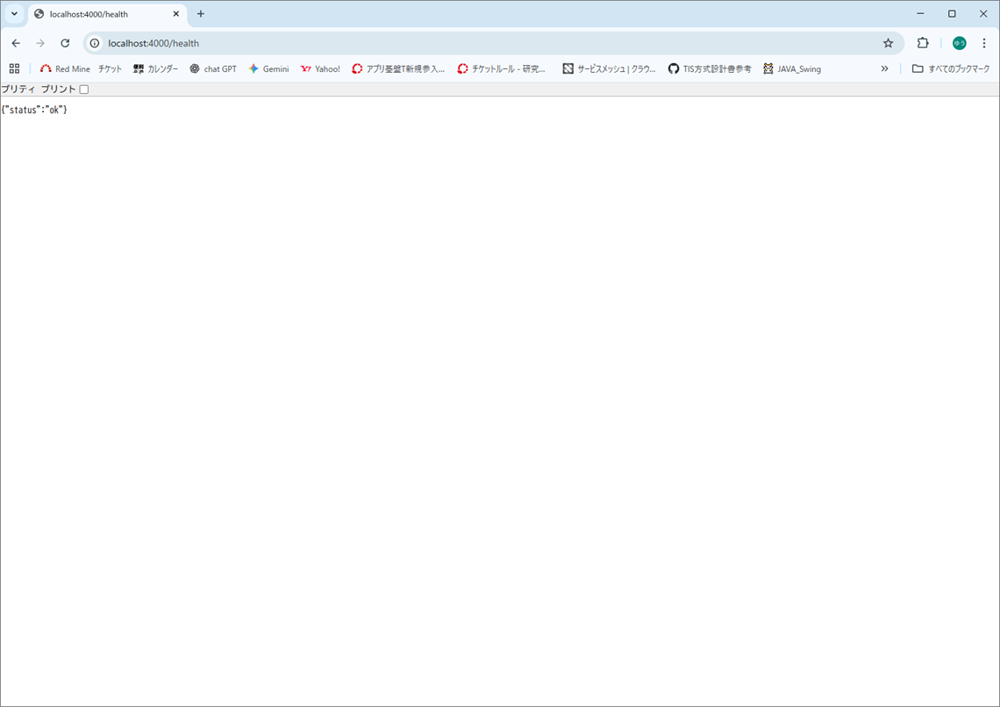

# BFFサーバー環境構築手順書

## 環境構築 概要

本手順では、フロントエンド（Next.js）とは独立したBFF（Backend For Frontend）サーバーを構築します。

* BFF プロジェクトの作成
* Express / TypeScript の導入
* BFF サーバーの起動と動作確認

---

## Step 1｜BFF 用ディレクトリ作成

Next.js（frontend）とは別に、BFF 用のディレクトリを作成します。

**構成イメージ：**

```text
poc/
├─ frontend/   ← 既存（Next.js）
├─ bff/        ← 今回作成
└─ shared/     ← 後で作成（型共有用）

```

---

## Step 2｜npm 初期化

BFF を Node.js プロジェクトとして初期化します。
※必ず作成した `bff` ディレクトリに移動してから実行してください。

```bash
cd bff
npm init -y

```
  

* **ゴール：** `package.json` が作成されていること。
  

---

## Step 3｜Express + TypeScript 導入

### 3.1 必要なパッケージをインストール

```bash
npm install express
npm install -D typescript tsx @types/node @types/express

```
  

| パッケージ名 | 役割 |
| --- | --- |
| **express** | BFF サーバー本体 |
| **typescript** | 型安全な開発環境の構築 |
| **tsx** | TypeScript を“ビルドなしで高速起動”＆“ファイル監視で自動再起動”できる開発ツール |
| **@types/** | 各ライブラリの型定義ファイル |

### 3.2 TypeScript 設定ファイル作成

以下のコマンドで設定ファイルを生成し、内容を書き換えます。

```bash
npx tsc --init

```

  

`bff` フォルダ内に生成された **`tsconfig.json`** を開き、以下の項目を設定（または修正）します。

  

```json
{
  "compilerOptions": {
    "target": "ES2020",         /* 生成されるJSのバージョン */
    "module": "CommonJS",       /* Node.jsで一般的な形式 */
    "rootDir": "src",           /* ソースコードの場所 */
    "outDir": "dist",           /* コンパイル後の出力先 */
    "strict": true,             /* 型チェックを厳しくする */
    "moduleResolution": "node", /* モジュール解決をNodeに合わせる */
    "verbatimModuleSyntax": false /* import文とCommonJSの競合を防ぐ */
  }
}

```

> **なぜこの設定が必要か？**
> TypeScriptに対して「ソースコードは `src` フォルダに入れる」「実行用のJSは `dist` フォルダに出力する」というルールを定義しています。これを設定しないと、次ステップのファイル作成時に「どこにファイルを作ればいいか分からない」といったエラーの原因になります。

---

## Step 4｜BFF サーバー実装（最小構成）

### 4.1 ディレクトリ作成

ソースコードを格納するディレクトリを作成します。

```bash
mkdir src

```

### 4.2 サーバーファイル作成

`src/index.ts` を作成し、動作確認用の最小コードを記述します。
  

---

## Step 5｜起動スクリプト設定

`package.json` の `"scripts"` セクションに、開発用コマンドを追記します。

```json
"scripts": {
  "dev": "ts-node-dev src/index.ts"
}

```

  

* **通常コマンド：** `npx ts-node-dev src/index.ts`（長い）
* **省略コマンド：** `npm run dev`（これで起動できるようになります）

---

## Step 6｜BFF 起動確認（重要）

### 1. サーバー起動

```bash
npm run dev

```

  

### 2. 動作確認

ブラウザまたはAPIクライアント（Postman等）で以下にアクセスしてください。

> **URL:** `http://localhost:4000/health`

  

### ゴール

* ブラウザに `{ "status": "ok" }` と表示されること。
* コンソール（ターミナル）に起動ログが表示されていること。

---
